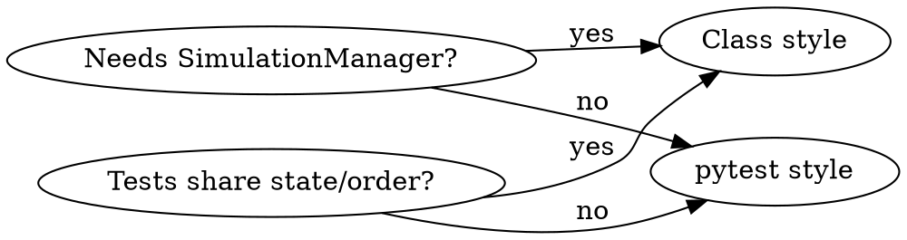

# Add Test

Write tests following EmbodiChain's conventions and patterns.

## When to Use

- User asks to "add a test", "write tests for X", "test this module"
- A new public module or function needs test coverage
- PR checklist requires tests

## Test File Location

Tests mirror the source tree under `tests/`:

```
embodichain/lab/sim/solvers/pytorch_solver.py  →  tests/sim/solvers/test_pytorch_solver.py
embodichain/lab/gym/envs/managers/rewards.py    →  tests/gym/envs/managers/test_reward_functors.py
embodichain/toolkits/graspkit/pg_grasp/foo.py   →  tests/toolkits/test_pg_grasp.py
embodichain/lab/gym/envs/tasks/rl/push_cube.py  →  tests/gym/envs/tasks/test_push_cube.py
```

Rules:
- File name: `test_<module>.py`
- Directory path mirrors `embodichain/` structure under `tests/`
- Create `__init__.py` files in new `tests/` subdirectories if needed

## Two Test Styles

### pytest Style — For Pure-Python Logic (No Sim)

Use when: testing functors, utility functions, pure math, config validation — anything that doesn't need a `SimulationManager`.

```python
# ----------------------------------------------------------------------------
# Copyright (c) 2021-2026 DexForce Technology Co., Ltd.
#
# Licensed under the Apache License, Version 2.0 (the "License");
# ...
# ----------------------------------------------------------------------------

from __future__ import annotations

import pytest
import torch

from embodichain.my_module import my_function


def test_expected_output():
    result = my_function(input_value)
    assert result == expected_value


def test_edge_case():
    result = my_function(edge_input)
    assert result is not None
```

### Class Style — For Sim-Dependent or Ordered Tests

Use when: tests need `SimulationManager`, GPU setup, or must run in a specific order. Share state via `setup_method`/`teardown_method`.

```python
# ----------------------------------------------------------------------------
# Copyright (c) 2021-2026 DexForce Technology Co., Ltd.
#
# Licensed under the Apache License, Version 2.0 (the "License");
# ...
# ----------------------------------------------------------------------------

from __future__ import annotations

import pytest
import torch

from embodichain.lab.sim import SimulationManager, SimulationManagerCfg


class TestMySimComponent:
    def setup_method(self):
        config = SimulationManagerCfg(headless=True, device="cpu")
        self.sim = SimulationManager(config)
        # ... setup ...

    def teardown_method(self):
        self.sim.destroy()
        SimulationManager.flush_cleanup_queue()

    def test_basic_behavior(self):
        result = self.sim.do_something()
        assert result == expected_result

    def test_raises_on_bad_input(self):
        with pytest.raises(ValueError):
            self.sim.do_something(bad_input)
```

## Resource-Aware Test Classification

Use the narrowest test type that proves the behavior:

- Prefer mocks or CPU-only inputs for pure logic and shape validation.
- `tests/conftest.py` automatically classifies conventional CUDA, renderer, and
  real-simulation tests. Add `@pytest.mark.gpu`, `@pytest.mark.slow`, or
  `@pytest.mark.requires_sim` explicitly only when the test's node id/source
  cannot reveal that requirement (for example, a hidden CUDA helper or an
  end-to-end toolkit test).

GPU tests are skipped by default to keep normal test runs within the shared VRAM budget. Run them explicitly and serially:

```bash
# Default suite: GPU-marked tests are skipped.
pytest tests/

# Dedicated GPU suite. Do not add -n unless pytest-xdist is installed.
pytest tests/ --run-gpu -m gpu
```

For backend/device matrices, run the complete contract on one representative
configuration and use small (one environment, low-resolution) smoke tests for
the remaining configurations. Always destroy a real `SimulationManager` and
flush its cleanup queue in teardown.

## Mocking Patterns for Functor Tests

Most functor tests don't need a live simulation. Use mock objects following the pattern in `tests/gym/envs/managers/test_reward_functors.py`:

```python
from unittest.mock import MagicMock, Mock


class MockSim:
    """Mock simulation for functor tests."""

    def __init__(self, num_envs: int = 4):
        self.num_envs = num_envs
        self.device = torch.device("cpu")
        self._rigid_objects: dict = {}

    def get_rigid_object(self, uid: str):
        return self._rigid_objects.get(uid)

    def add_rigid_object(self, obj):
        self._rigid_objects[obj.uid] = obj


class MockEnv:
    """Mock environment for functor tests."""

    def __init__(self, num_envs: int = 4):
        self.num_envs = num_envs
        self.device = torch.device("cpu")
        self.sim = MockSim(num_envs)
```

Key points for mock objects:
- Set `num_envs` and `device` attributes (functors use these)
- Mock only the sim methods the functor actually calls
- Use `MagicMock(uid="...")` for `SceneEntityCfg` parameters

## Steps

### 1. Identify What to Test

Ask the user:
1. **Which module/function?** — determines file path
2. **Does it need a live simulation?** — determines test style
3. **Key behaviors to verify** — happy path, edge cases, error cases

### 2. Determine Test File Path

Map the source path to test path:

```
embodichain/<subpath>/<module>.py  →  tests/<subpath>/test_<module>.py
```

Check if the test file already exists — append new test classes/functions if so.

### 3. Choose Test Style



### 4. Write the Test

Use the appropriate template (pytest or class style above).

Rules:
- **Apache 2.0 header** — required on every test file
- **`from __future__ import annotations`** — after header, before imports
- **No magic numbers** — define expected values as named constants or comment their origin
- **Test function names** — `test_<scenario>` (descriptive, not just `test_foo`)
- **One assertion concept per test** — don't bundle unrelated checks

### 5. Add `if __name__ == "__main__"` Block

Include this for tests that support optional visual/interactive debugging:

```python
if __name__ == "__main__":
    # For visual debugging: set is_visual=True when calling env methods
    test_obj = TestMyComponent()
    test_obj.setup_method()
    # ... manually run test logic ...
```

### 6. Run the Test

```bash
# Single file
pytest tests/<subpath>/test_<module>.py -v

# Single test function
pytest tests/<subpath>/test_<module>.py::test_expected_output -v

# GPU-specific test
pytest tests/<subpath>/test_<module>.py --run-gpu -m gpu -v

# Single test class method
pytest tests/<subpath>/test_<module>.py::TestMyClass::test_basic_behavior -v
```

### 7. Run `black`

```bash
black tests/<subpath>/test_<module>.py
```

## Conventions Summary

| Convention | Rule |
|-----------|------|
| File header | Apache 2.0 copyright block (same 15 lines as source) |
| File naming | `test_<module>.py` |
| Function naming | `test_<scenario>` |
| `from __future__` | Required after header |
| Magic numbers | Define as named constants with explanatory comments |
| Simulation tests | Initialize/teardown in `setup_method`/`teardown_method` |
| CUDA coverage | Use `@pytest.mark.gpu`; run with `--run-gpu -m gpu` |
| Long integration | Use `@pytest.mark.slow`; keep it out of normal PR runs |
| Pure-logic tests | Use mock objects, no real sim |
| `SceneEntityCfg` | Use `MagicMock(uid="...")` in tests |
| Assertions | `assert`, `pytest.approx`, `torch.allclose`, `pytest.raises` |
| Entry block | `if __name__ == "__main__"` for visual debugging support |

## Common Mistakes

| Mistake | Fix |
|---------|-----|
| Missing Apache header on test file | Copy the 15-line copyright block |
| Using real `SimulationManager` for functor tests | Use `MockEnv`/`MockSim` — much faster, no GPU needed |
| Hardcoded numbers without explanation | Define as `EXPECTED_DISTANCE = 0.5  # cube at origin, target at (0.5, 0, 0)` |
| Testing multiple concepts in one function | Split into separate `test_<scenario>` functions |
| Forgetting cleanup | Call `self.sim.destroy()` and `SimulationManager.flush_cleanup_queue()` in teardown |
| Using full matrices | Use one full representative case and low-resource smoke coverage elsewhere |
| Not running `black` on test file | CI checks all files including tests |

## Quick Reference

| Action | Command |
|--------|---------|
| Run default tests | `pytest tests/` |
| Run GPU tests | `pytest tests/ --run-gpu -m gpu` |
| Run single file | `pytest tests/<path>/test_<name>.py -v` |
| Run single test | `pytest tests/<path>::test_<name> -v` |
| Run with print output | `pytest -s tests/<path>/test_<name>.py` |
| Format | `black tests/<path>/test_<name>.py` |
