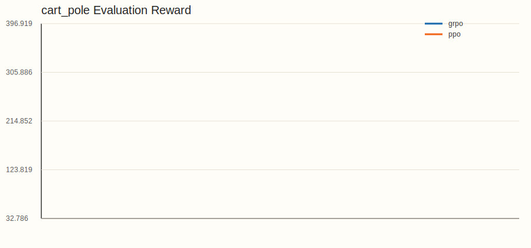
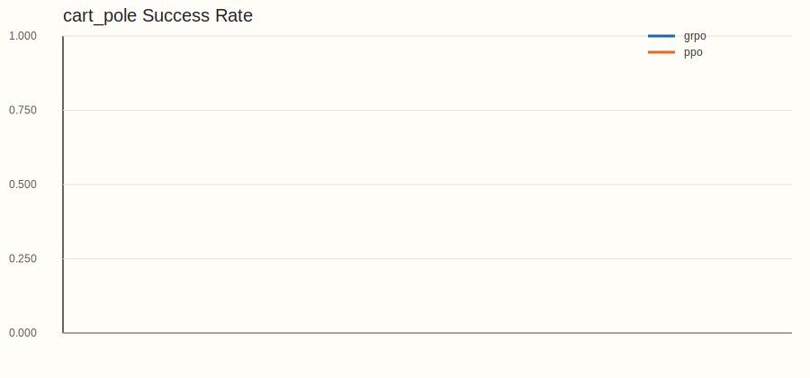
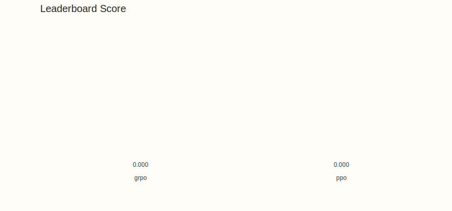

# RL Benchmark Report

## Benchmark Overview

- device: `cuda:0`
- headless: `True`
- iterations: `40`
- buffer_size: `1024`
- num_envs: `64`
- num_eval_envs: `16`
- evaluation_interval: `200`
- evaluation_episodes: `20`
- threshold_sustain_count: `3`
- final_eval_window: `3`

## Leaderboard

| Rank | Algorithm | Score | Steps To Threshold (Sustained) | Success Rate Std | Avg Success Rate | Avg Stable Success Rate | Avg Final Reward | Tasks |
| ---: | --- | ---: | ---: | ---: | ---: | ---: | ---: | ---: |
| 1 | grpo | 0.000 | nan | 0.000 | 0.000 | 0.000 | -19.531 | 2 |
| 2 | ppo | 0.000 | nan | 0.433 | 0.250 | 0.000 | 4.240 | 2 |

## Aggregate Results

| Task | Algorithm | Runs | Final Reward | Final Success Rate | Final Stable Success Rate | Training FPS | Env FPS |
| --- | --- | ---: | ---: | ---: | ---: | ---: | ---: |
| cart_pole | grpo | 2 | 82.023 | 0.000 | 0.000 | 5330.124 | 2712.898 |
| cart_pole | ppo | 2 | 467.198 | 0.500 | 0.000 | 5112.033 | 2733.061 |
| push_cube | grpo | 2 | -121.086 | 0.000 | nan | 2074.253 | 717.205 |
| push_cube | ppo | 2 | -458.718 | 0.000 | nan | 2028.863 | 758.471 |

## Per-Task Comparison

Each table compares different algorithms on the same task.

### cart_pole

| Algorithm | Runs | Final Stable Success Rate | Final Success Rate | Steps To Threshold (Sustained) | Success Rate Std | Final Reward | Training FPS | Env FPS |
| --- | ---: | ---: | ---: | ---: | ---: | ---: | ---: | ---: |
| ppo | 2 | 0.000 | 0.500 | nan | 0.500 | 467.198 | 5112.033 | 2733.061 |
| grpo | 2 | 0.000 | 0.000 | nan | 0.000 | 82.023 | 5330.124 | 2712.898 |

### push_cube

| Algorithm | Runs | Final Stable Success Rate | Final Success Rate | Steps To Threshold (Sustained) | Success Rate Std | Final Reward | Training FPS | Env FPS |
| --- | ---: | ---: | ---: | ---: | ---: | ---: | ---: | ---: |
| grpo | 2 | nan | 0.000 | nan | 0.000 | -121.086 | 2074.253 | 717.205 |
| ppo | 2 | nan | 0.000 | nan | 0.000 | -458.718 | 2028.863 | 758.471 |

## Plots

### cart_pole_reward

### cart_pole_success_rate

### leaderboard_score

## Stability Analysis

| Task | Algorithm | Success Rate Mean | Stable Success Rate Mean | Success Rate Std | Steps To Threshold Mean | First Hit Mean |
| --- | --- | ---: | ---: | ---: | ---: | ---: |
| cart_pole | grpo | 0.000 | 0.000 | 0.000 | nan | nan |
| cart_pole | ppo | 0.500 | 0.000 | 0.500 | nan | nan |
| push_cube | grpo | 0.000 | nan | 0.000 | nan | nan |
| push_cube | ppo | 0.000 | nan | 0.000 | nan | nan |

## System Performance

| Task | Algorithm | Training FPS | Env FPS | Peak GPU Memory (MB) |
| --- | --- | ---: | ---: | ---: |
| cart_pole | grpo | 5330.124 | 2712.898 | 75.839 |
| cart_pole | ppo | 5112.033 | 2733.061 | 88.590 |
| push_cube | grpo | 2074.253 | 717.205 | 168.958 |
| push_cube | ppo | 2028.863 | 758.471 | 149.886 |

## Per-Run Results

| Task | Algorithm | Seed | Final Reward | Final Success Rate | Final Stable Success Rate | Steps To Threshold | First Hit | Checkpoint |
| --- | --- | ---: | ---: | ---: | ---: | ---: | ---: | --- |
| cart_pole | grpo | 0 | 98.287 | 0.000 | 0.000 | None | None | `benchmark/reports/runs/cart_pole/grpo/seed_0/checkpoints/cart_pole_grpo_seed0_step_2621440.pt` |
| cart_pole | grpo | 1 | 65.759 | 0.000 | 0.000 | None | None | `benchmark/reports/runs/cart_pole/grpo/seed_1/checkpoints/cart_pole_grpo_seed1_step_2621440.pt` |
| cart_pole | ppo | 0 | 463.106 | 0.000 | 0.000 | None | None | `benchmark/reports/runs/cart_pole/ppo/seed_0/checkpoints/cart_pole_ppo_seed0_step_2621440.pt` |
| cart_pole | ppo | 1 | 471.291 | 1.000 | 0.000 | None | None | `benchmark/reports/runs/cart_pole/ppo/seed_1/checkpoints/cart_pole_ppo_seed1_step_2621440.pt` |
| push_cube | grpo | 0 | -118.888 | 0.000 | None | None | None | `benchmark/reports/runs/push_cube/grpo/seed_0/checkpoints/push_cube_grpo_seed0_step_2621440.pt` |
| push_cube | grpo | 1 | -123.283 | 0.000 | None | None | None | `benchmark/reports/runs/push_cube/grpo/seed_1/checkpoints/push_cube_grpo_seed1_step_2621440.pt` |
| push_cube | ppo | 0 | -438.498 | 0.000 | None | None | None | `benchmark/reports/runs/push_cube/ppo/seed_0/checkpoints/push_cube_ppo_seed0_step_2621440.pt` |
| push_cube | ppo | 1 | -478.939 | 0.000 | None | None | None | `benchmark/reports/runs/push_cube/ppo/seed_1/checkpoints/push_cube_ppo_seed1_step_2621440.pt` |
