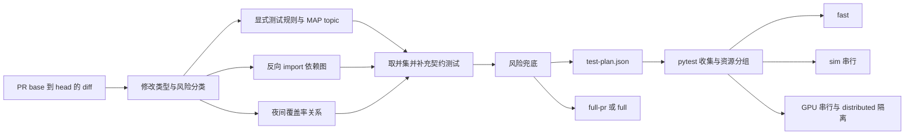

# CI Partial Test Selection Design

> 状态：设计与实现记录。本分支已落地 selector、runner、影响规则和 workflow
> 接入；设计依据为 `main` 的 `2992d73356aa5e245dfaaf5bb0de1421f8a7892d`。

目标是在每次 PR 中，根据累计修改内容生成可解释的测试计划，减少无关测试的执行。
选择结果由版本化规则和依赖关系决定；每个被选中的测试都记录原因，无法可靠判断的
修改自动扩大测试范围。夜间和发布验证保留全量运行。

## 现有基础

当前 `.github/workflows/main.yml` 保留文档、fast、sim、distributed GPU 和 GPU
资源边界，并由 test plan 决定每组 selector。测试计划 job 在 PR、定时和手动事件
上运行；main push 继续只执行已有的 lint/build 路径。

`tests/conftest.py` 在收集阶段通过测试、类和 fixture 的源码识别真实仿真需求，
并动态添加 `requires_sim`、`gpu`、`renderer` 和 `xdist_group`。
因此，选择器负责确定候选测试，pytest 收集结果负责确定实际资源分组。
`subprocess_sim` 和 `requires_tasks` 的既有行为也必须保留。

`agent_context/MAP.yaml` 已有 topic、`source_of_truth`、`watch_paths` 和
`related_topics`。这些字段适合识别受影响领域；它们是影响提示，不能直接证明
某个测试可以省略。MAP 继续作为唯一 topic 清单，CI 规则只引用现有 topic id。

## 基线与收益边界

在基线 commit `2992d73356aa5e245dfaaf5bb0de1421f8a7892d` 的收集结果中，当前
非文档 lane 约有 5,011 个测试实例（fast 4,477、sim 358、distributed 1、GPU
175），文档测试另有 24 个实例。历史 CI run 的可见耗时约为安装 54.6 分钟、测试
87 分钟，其中 sim 和 GPU 是主要执行成本。因此第一版优先减少候选文件和 CUDA
容器内的 pytest 工作；容器启动、依赖解析和仿真初始化仍会占用固定时间，不能把
测试数量比例直接当作墙钟收益。

NMS 的回归矩阵原来是 3 个随机种子 × 4 个 chunk size × 2 个保序模式（24 个
`n=400` 组合），另有两个 `n=6000` 重抑制用例。现在保留一个 `n=64` 的 smoke
测试覆盖 `chunk_size` 1、7、2048 和两种模式；完整矩阵统一标为 `slow`，由 nightly
或手动 `full` 运行。一次本地 py311 验证中，NMS slow 组合约 194 秒，partial 的
fast/GPU 代表用例约 28 秒；这只是方向性数据，实际 CI 收益还要按历史 JUnit 和
容器安装时间统计。

## 推荐架构



第一版使用文件级选择：显式规则、有限深度的反向 import 图、topic 契约测试取并集。
覆盖率关系在后续阶段加入，用于补充运行时依赖和细化到 node id。
自动选择过程应可重复，不需要每次 PR 调用语言模型。语言模型可以辅助提出缺失
映射的建议；测试门禁由确定性的规则和数据控制。

### 1. 收集累计修改

- 使用 PR 事件中的 base SHA 和 head SHA，获取 merge base 到 PR head 的 diff。
  每次更新都重新计算整个 PR 的修改，避免仅比较最后一个 commit。
- 读取文件状态及旧、新路径，处理新增、删除、重命名和 force push。
- 读取 diff hunk，用于判断修改了函数实现、公共签名、配置字段或注册入口。
- base 无法获取、diff 解析失败时生成 `full-pr` 计划或使计划 job 失败。

### 2. 分类修改内容

| 修改类型 | 初始策略 |
| --- | --- |
| 文档、注释、格式调整 | lint、API docs 检查及相关文档测试 |
| 叶子函数实现 | 直接测试、反向依赖测试、所属 topic 的小型契约测试 |
| 公共签名、继承、导出、配置 schema | 扩大到消费者及跨模块契约测试 |
| YAML/JSON、任务配置、机器人资源 | 显式资源规则及相关配置/任务集成测试 |
| 测试文件 | 始终运行新增或修改的测试文件；共享 fixture 修改升级风险 |
| 依赖、构建、CI、全局注册、仿真生命周期 | `full-pr`，必要时增加相关 slow 端到端测试 |
| 未识别或没有可靠映射的源文件 | `full-pr` |

Python 内容分类可比较修改前后的 AST，识别函数、类、参数、decorator、
`__all__` 和 config 字段的变化。仅在确认所有修改均为注释、docstring 或格式时
使用文档策略；混合修改按最高风险处理。第一版不使用符号级分析删减文件级测试。

### 3. 合并三类依赖证据

**显式规则和 topic 测试。** 新增 `.ci/test-impact.toml`，保存测试路径、契约
测试和风险例外。它引用 MAP 的 topic id，不复制另一套 topic 清单。
topic 的关联关系只按明确规则补充小型契约测试，避免递归展开所有关联 topic。
topic 的 `tests` 是领域 fallback，`contracts` 是领域修改的必跑边界。
有明确叶子规则时选择叶子测试、反向消费者和契约测试；缺少叶子规则时先使用领域
fallback。只有测试文件修改时，选择修改文件及小型契约测试，通过 `tests/**`
watch path 命中 topic 不会自动展开整个领域。
覆盖检查逐个源文件进行：混合 diff 中某个叶子命中规则，不会免除其他源文件的
topic fallback 或 full 兜底。

**反向 import 图。** 使用 Python AST 扫描 `embodichain`、
`embodichain_tasks`、`scripts`、`examples` 和 `tests`，解析绝对/相对 import、
package re-export 及能静态解析的 `importlib.import_module` 字符串。
从修改模块向反向消费者做有限深度遍历，避免公共基类和高 fanout package 入口把
所有测试带入 partial 计划。显式规则默认是权威边界；叶子规则可以用
`include_reverse = true` 开启这项补充。无法解析的动态依赖由显式规则或 full 兜底。

**运行时覆盖率关系。** 夜间 full 运行记录测试上下文，建立
`source file / line -> pytest node id` 的反向关系。
`pytest-cov --cov-context=test` 能按测试记录覆盖率，参数化测试的每组参数也有
独立上下文。[pytest-cov 官方说明](https://pytest-cov.readthedocs.io/en/latest/contexts.html)
Coverage.py 的 `contexts_by_lineno()` 可读取每行对应的上下文。
[Coverage.py 官方 API](https://coverage.readthedocs.io/en/latest/api_coveragedata.html)

覆盖率数据按源码 revision、Python、依赖和镜像指纹标记，合并 fast、sim、GPU
各组的证据。选择时读取 PR base 或最近可信祖先的 full 数据，并用 diff 映射行号；
新文件和无法可靠映射的修改使用文件/领域 fallback。
代码移动后无法映射的行扩大到文件级。未执行分支、配置资源、native
代码和外部状态不能依赖 Python 覆盖率判断；覆盖率关系补充显式规则，不能覆盖或
删除显式规则要求的测试。

直接将 `--testmon` 加到现有命令需要额外验证：Testmon 官方文档说明，使用
`-m` 等 pytest selector 时可能自动切换到不选择模式，且它不跟踪静态文件和
外部服务的变化。当前 CI 大量使用 `-m`，任务也依赖 YAML/JSON 和资源。
可以在 shadow 阶段评估 Testmon 的收益，资源规则和风险兜底仍需独立保留。
[Testmon 官方说明](https://www.testmon.org/)

### 4. 补充安全边界

至少以下路径初始设为高风险：

- `tests/conftest.py`、根 `conftest.py`、共享测试 helper。
- `pyproject.toml`、`setup.py`、`MANIFEST.in`、版本及依赖文件。
- `.github/workflows/`、选择器代码及 `.ci/test-impact.toml`。
- 仿真生命周期、physics backend、共享 configclass/device 工具。
- package 入口、全局注册、任务发现和第三方 entry point 接入。

高风险规则区分两种 full：

- `full-pr`：全部非 slow 测试；slow 用例由定时或手动 `full` 运行覆盖。
- `full`：包含 slow 的全量测试，供定时、发布或人工强制执行。

修改本身带有 `slow` 标记的测试文件会直接请求 `full`，确保变更的慢测试不会因
partial lane 的 `not slow` 过滤而静默跳过。源码影响到的慢测试仍由 nightly/full
覆盖；后续引入 node id 级覆盖率关系后，再将这类用例拆成资源隔离的 impacted-slow
lane。

每个源码修改必须命中测试规则、依赖证据或 full 兜底，并在计划中解释。
选择器、规则或 workflow 自身的修改强制扩大验证范围，防止修改选择策略后静默
缩减测试。可以增加维护者的 `ci/full` label 和手动 workflow input 强制 full。

每次 PR 保留小型 smoke 基线，例如 CLI/package import、compute import 和
发行元数据；仿真或 GPU 修改补充相应资源的 smoke。具体 node id 在实现时从
当前测试中选择并计时。测试顺序依赖应通过测试隔离修复，不能成为隐式选择规则。

### 5. 保留资源执行规则

| 执行组 | marker 表达式及执行方式 |
| --- | --- |
| docs | 独立执行，保留 `--confcutdir=tests/docs` |
| fast | `not slow and not requires_sim and not gpu`，`-n 4 --dist loadgroup` |
| sim | `not slow and requires_sim and not gpu`，一个进程 |
| distributed GPU | 独立进程树，`--run-gpu`，仅计划选中的 distributed 测试 |
| GPU | `not slow and gpu`，`--run-gpu`，一个进程，排除 distributed 组 |
| impacted slow / full | 当前由 changed-slow 的 `full` 回退或完整计划运行；后续再拆分资源 lane |

marker 表达式显式包含 `not slow`；当前 workflow 显式传入 `-m`，不能仅依赖
`pyproject.toml` 的默认 addopts 来控制 slow。
同一测试同时有 `requires_sim` 和 `gpu` 时进入 GPU 组，各组 node 集合保持互斥。

runner 把选中的路径或 node id 作为 subprocess 参数列表传给 pytest，避免 shell
拼接。只收集候选测试，随后由当前 conftest 完成动态分类。第一版可以让各组对
同一候选文件使用互斥 marker；后续再一次收集并生成各组 node id 清单。

源码修改得到空测试集合时扩大到 `full-pr`。pytest 收集错误是验证失败，不能被
解释成“没有需要运行的测试”。
AST 无法解析或反向依赖触达共享 `conftest.py` 时同样扩大到 `full-pr`，避免把不完整
的依赖图当成省略测试的依据。

## 规则与输出示例

下面是 schema 草稿；规则维护和测试会校验 topic id 与测试路径。
TOML 可以由 CI 的 Python 3.11 使用标准库读取，计划 job 无需安装完整项目。

```toml
version = 1
always = ["tests/test_main.py", "tests/test_release_metadata.py"]
full_pr_if = [
  "tests/conftest.py",
  "conftest.py",
  "pyproject.toml",
  "setup.py",
  "MANIFEST.in",
  "VERSION",
  "embodichain/VERSION",
  ".github/workflows/**",
  "scripts/ci/**",
  ".ci/test-impact.toml",
]

[topics.motion-planning]
tests = [
  "tests/sim/motion/planners/**",
  "tests/sim/motion/expansion/**",
  "tests/sim/motion/test_execution.py",
  "tests/compute/test_trajectory*.py",
]
contracts = [
  "tests/sim/motion/test_motion_generator.py",
  "tests/sim/motion/test_motion_generator_batched.py",
]

[[rules]]
id = "pose-nms"
paths = ["embodichain/utils/nms.py"]
tests = [
  "tests/utils/test_nms.py",
  "tests/toolkits/test_parallel_jaw_grasp_pose_generator.py",
  "tests/toolkits/test_pg_grasp.py",
]
resource_hints = ["gpu"]
risk = "medium"
include_reverse = true

[[rules]]
id = "sim-lifecycle"
paths = ["embodichain/lab/sim/sim_manager.py", "embodichain/lab/sim/physics/**"]
mode = "full-pr"
```

生成的 `test-plan.json` 至少包含 diff 范围、模式、测试 selector、原因和兜底原因；
规则中的 glob 会在计划阶段展开成 pytest 可直接接收的路径。
第一版不把测试耗时作为选择条件；后续可从 JUnit 数据加入仅用于报告和排程的估计，
不能用它删除必跑测试。

```json
{
  "version": 1,
  "base_sha": "<base>",
  "head_sha": "<head>",
  "mode": "partial",
  "risk": "medium",
  "selectors": [
    "tests/utils/test_nms.py",
    "tests/toolkits/test_parallel_jaw_grasp_pose_generator.py",
    "tests/toolkits/test_pg_grasp.py"
  ],
  "resource_hints": ["gpu"],
  "reasons": {
    "tests/utils/test_nms.py": ["rule:pose-nms", "direct-import"],
    "tests/toolkits/test_pg_grasp.py": ["rule:pose-nms", "reverse-import"]
  },
  "fallback_reason": null
}
```

例如修改 NMS 实现会运行 NMS 和 grasp 消费者的测试，包括相关 GPU 用例；
单独的仿真组可以省略。修改 `sim_manager.py` 则扩大为 `full-pr`。
修改某个 Task Program YAML 会运行配置加载、包资源、对应任务和 bridge 集成测试；
找不到任务到测试的可靠关系时扩大范围。

## 接入现有 workflow

新增轻量 `test-plan` job：checkout/fetch diff 所需历史，读取规则和源码，生成计划。
它只安装选择器所需的小型依赖，不安装 `.[gensim]` 或 cuRobo。
如果读取 MAP 需要 PyYAML，仅安装 PyYAML。

输出小型 job booleans（是否需要 docs/fast/hardware、计划模式），完整测试清单通过
artifact 传递。GitHub step summary 展示模式、风险、selector 数量、各组数量和兜底
原因；详细修改文件、命中规则和原因保存在计划 artifact 中。

当前实现按计划缩减每组 selector，并将文档测试移到轻量 job；docs-only 修改不再
启动 CUDA 测试容器。测试安装根据计划按需安装 gensim/cuRobo，pip 使用共享缓存。
partial 计划仍保留 fast、sim、distributed 和 GPU 的资源隔离，无法判断的修改回退
到 `full-pr`。

保留一个始终运行的 `test-gate` 检查，汇总计划和被要求执行的测试结果。
分组 job 被合法省略时仍产生稳定的门禁结果；被要求的组失败或没有完成时 gate
失败。branch protection 依赖稳定的 gate 名称。

`main.yml` 已增加定时 full workflow 和手动 `full`/`partial` 入口。当前 main push
仍不启动测试 job；发布前应执行手动或定时 full，并确认发布 commit 有成功记录。

## 分阶段启用与验收

1. **当前保守 partial。** 已启用 docs-only、显式叶子规则和有限反向依赖；
   workflow/依赖/fixture/生命周期等高风险路径继续 `full-pr`。
2. **Shadow 回放。** 对代表性历史 PR 重放选择，比较 full 中失败的 node 是否都在
   候选范围，记录按耗时加权的缩减比例。
3. **领域 partial。** 完善跨模块契约和资源规则，保留夜间 full 及人工 override。
4. **用例级优化。** 引入覆盖率上下文和耗时数据，细化 expensive 文件的 node。
   大参数矩阵通过明确的 PR representative / nightly exhaustive 标记表达，不让
   选择器任意猜测哪些参数可以省略。

启用 partial 的最低验收条件：

- 所有源码修改都有选择原因或 full 兜底，没有静默忽略的路径。
- 新增/修改测试始终被选择，删除/重命名路径不会造成漏选。
- sim/GPU/distributed 的资源边界和各组互斥关系保持有效。
- 映射/图错误扩大范围，pytest 收集错误使验证失败。
- shadow 和历史失败样本中，失败测试的观测召回率为 100%。这个指标是上线证据，
  不代表对未来修改的绝对保证。
- full 定时验证正常运行，发现漏选后扩大规则并暂时恢复对应领域的 full-pr。

持续记录：各组选择数量、按历史耗时加权的选择比例、实际 pytest 耗时、安装和
容器启动耗时、full 兜底率、full 发现的漏选失败、覆盖率关系的 revision/环境指纹。

## 最小实现范围

建议第一批实现文件：

- `.ci/test-impact.toml`：topic 测试和全局风险规则。
- `scripts/ci/select_tests.py`：diff、内容分类、AST 反向依赖、计划输出。
- `scripts/ci/run_test_plan.py`：校验并执行计划，保留资源分组。
- `tests/ci/test_select_tests.py`：使用小型合成仓库验证规则、图、删除/重命名和兜底。
- `.github/workflows/main.yml`：计划 job、按需测试 job、稳定 gate 和定时/手动 full。

这套机制主要减少 PR 的测试执行；main 的 docs build 仍需分别优化。先用实际
shadow 回放数据校准每类修改的收益，避免用测试数量代替总耗时。
