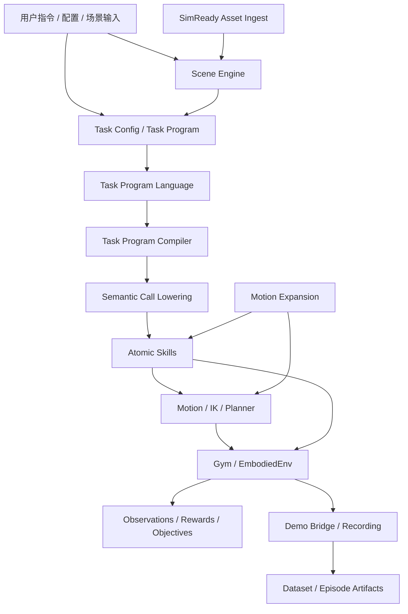
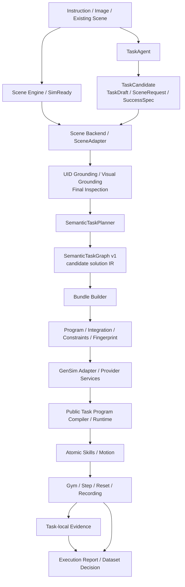
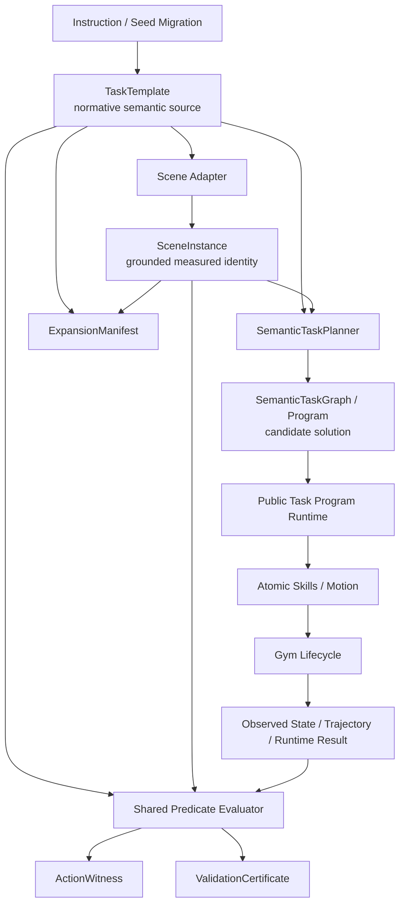

# GenSim 与 TaskSpec 架构设计

状态日期：2026-10-02（北京时间）

代码架构基线：`c38d9f3a`（本文档为架构说明提交）

参考 PR：[DexForce/EmbodiChain #729](https://github.com/DexForce/EmbodiChain/pull/729)

PR #729 当前核对的 base：`7e56e321`；head：`5af904c1`
PR 状态：OPEN / UNSTABLE；CI 测试失败来自 `Drawer.zip` 外部镜像 MD5 不匹配，不能据此宣称主线已合入。

## 结论

当前架构应分成三层理解：

1. `main` 已有的通用仿真、Task Program、Atomic Skill、Gym 和 Motion Expansion 基础设施。
2. PR #729 正在补充的 GenSim Task Engine：任务解释、场景绑定、E1–E6/E9 方案生成、bundle 装配和物理运行检查。
3. 本分支新增的纯 TaskSpec 语义和证据层：TaskTemplate、SceneInstance、ActionWitness、ExpansionManifest 和 ValidationCertificate；运行时接入仍按阶段推进。

PR #729 的方向是正确的执行基础设施演进，但它本身不拥有 TaskSpec。TaskSpec 作为规范语义和证据身份层，接在现有 Task Engine 与公共执行路径之上，而不是创建第二套 compiler、runtime、Session 或 Gym 生命周期。

## 当前主线架构



### 当前所有权

| 层 | 所有者 | 职责 |
|---|---|---|
| 资产 | `gen_sim/simready_pipeline` | Asset Engine：资产 ingest、几何、articulation、物理和语义元数据 |
| 场景 | `gen_sim/scene_engine` | 图片理解、资产生成、布局编辑、settling、场景导出和 USD 交付 |
| 任务语言 | `lab/task_program/language` | Task Program schema、decoder、loader 和输入边界 |
| 任务语义 | `lab/task_program/semantics` | Semantic Call、scene/profile/effect/evidence contract |
| 编译 | `lab/task_program/compiler` | AST 展开、Semantic Call 分析和 Atomic Skill lowering |
| 执行 | `lab/task_program/runtime` | 顺序/并行执行、状态、重试、effect verification 和运行结果 |
| 物理动作 | `lab/sim/atomic_actions` | Pick、Place、HandOver 等 Atomic Skills |
| 运动 | `lab/sim/motion`、`compute/trajectory` | IK、轨迹生成、插值、重定时、碰撞规划和轨迹变体 |
| 环境 | `lab/gym` | reset、step、观测、奖励、终止、demo、记录和数据生命周期 |
| 扩增 | `lab/sim/motion/expansion` | candidates、operators、coverage、budget、session 和 receipt |
| 数据 | `data_pipeline` 和 Dataset Manager | episode、fragment、trajectory 和 dataset persistence |

Articulation asset generation follows the Asset Engine boundary: the
articulation service client, generated-USDC structural validation, and authored
asset normalization live under `gen_sim/simready_pipeline`. Scene Engine keeps
scene placement, settling, scene-level USD assembly, and export. The former
`scene_engine` client and utility paths remain compatibility imports while
callers migrate.

必须保持的边界：

- Task Program 不拥有 Gym 的 reset、step 和 dataset 生命周期。
- Gym 不拥有 Task Program 的 schema、compiler、catalog 或 lowerer。
- `compute` 不依赖 `lab`、仿真对象或环境 manager。
- Motion Expansion 不负责环境恢复、step/reset 或数据写盘。
- 公共 Task Program / Atomic Skill 执行路径只有一套。

## PR #729 增加的 Task Engine

PR #729 将 GenSim 推进为一条可审查的任务生成和执行链：



### PR #729 已有能力

- TaskAgent 并发生成和校验结构化候选。
- Scene Backend/SceneAdapter 负责场景分析、资产材质化、UID grounding 和角色绑定。
- SemanticTaskPlanner 生成 provider-free `semantic_task_graph/v1`。
- Bundle Builder 生成 `program.yaml`、`integration.yaml`、`constraints.json` 和 integration fingerprint。
- GenSim adapter 只声明 provider/service/policy，实际编译和执行仍由公共 Task Program/Gym 路径完成。
- Workflow 具备任务候选、场景准备、绑定、scene edit、final inspection、bundle preparation 和有界 action attempt。
- 场景侧增加 blueprint、visual grounding、reference image consistency 和 USD preview/export 能力。
- E6 增加单 prismatic articulation 的绑定、关节目标保持、withdrawal 和 Park 检查。
- E9 增加单按钮 press route、contact-backed press evidence、撤离检查和 press 记录。
- E5 增加 cargo envelope 的终态和轨迹检查。

### PR #729 的能力边界

| 任务族 | 当前状态 |
|---|---|
| E1 | 有 planner/bundle route，物理资格依赖具体场景和执行证据 |
| E2 | 有 upright/stability route，仍不是 TaskSpec 全局目标认证 |
| E3 | 有 Pick → Pour → return Place 路线，但没有液体量、洒出和容器状态认证 |
| E4 | 有 HandOver route 和姿态/持物检查，仍受公共 phase protection 缺口影响 |
| E5 | 有 coordinated route 和 cargo envelope；cargo 是必要条件，不是完整内腔/受力证书 |
| E6 | 仅支持受限的单环境、fixed-base、single-prismatic、米制自包含 USD |
| E7 | ontology 有定义，但在 planner/bundle 前拒绝执行 |
| E8 | ontology 有定义，但在 planner/bundle 前拒绝执行 |
| E9 | 有独立单按钮 press route；成功语义是接触支持的按压事件，不是设备 activation |

## TaskSpec 的目标位置

本分支已提供 `embodichain/task_spec/` 的纯标准库协议实现。它不导入仿真、Gym 或 Task Program，因此生成的 TaskTemplate 可以独立缓存并被多个下游复用；SceneInstance、ActionWitness、ExpansionManifest 和 ValidationCertificate 是相同协议中的后续证据对象。

目标数据流如下：



### 五类对象的目标职责

| 对象 | 规范职责 | 当前最接近的实现 |
|---|---|---|
| `TaskTemplate` | roles、init、goal、invariants、temporal、requirements 和任务语义 hash | `embodichain.task_spec.TaskTemplate`；由 Task Engine adapter 从 `TaskCandidate` 生成 |
| `SceneInstance` | 资产、角色绑定、scene/embodiment、真实初始状态和内容身份 | `embodichain.task_spec.SceneInstance`；由 SceneAdapter/Scene Engine 补齐 |
| `ActionWitness` | 某个具体 program、integration、轨迹、运行结果和证据 | `embodichain.task_spec.ActionWitness`；由公共 runtime/Gym 运行路径补齐 |
| `ExpansionManifest` | parent/child lineage、scope、operator、seed、失效检查 | `embodichain.task_spec.ExpansionManifest`；由 expansion host 补齐 |
| `ValidationCertificate` | checker、predicate、版本、指标、结果和 evidence refs | `embodichain.task_spec.ValidationCertificate`；由共享 evaluator 和运行证据生成 |

### TaskSpec v0.1 协议和缓存

协议实现位于：

```text
embodichain/task_spec/
  contracts.py          # 五类版本化对象和 JSON contracts
  expressions.py        # 有限 predicate、bounded temporal AST 和状态
  canonicalization.py   # JSON canonicalization 与 SHA-256 semantic hash
  validation.py         # 严格校验、求值和 certificate 组装
  registry.py           # <semantic_hash>.json 内容寻址缓存
```

Task Engine 的入口是 `generate_task_spec()`、`task_template_from_candidate()`
和 `TaskSpecGenerator`。它从现有 `TaskCandidate.scene_request` 与
`SuccessSpec` 提取角色、初态、目标和跨引擎 requirements；具体 Semantic
Call、抓取姿态、轨迹、等待时间和 recovery 不进入 TaskTemplate。旧的
`TaskCandidate.semantic_hash` 保存在 metadata 中，仍表示 legacy plan/step
identity，不改变其含义。

一个最小生成结果的结构如下：

```json
{
  "schema_version": "task_template/v0.1",
  "canonicalization_version": "task_spec_c14n/v1",
  "task_id": "upright_can",
  "roles": [{"name": "object:can", "kind": "object", "affordances": ["graspable", "orientable"]}],
  "init": [{"predicate": "state", "arguments": {"subject": "object:can", "key": "orientation"}}],
  "goal": [{"predicate": "object_upright", "arguments": {"subject": "object:can"}}],
  "invariants": [],
  "temporal": [],
  "requirements": [{"kind": "asset", "name": "object:can"}],
  "semantic_hash": "<sha256>"
}
```

`TaskSpecCache`/`TaskSpecRegistry` 以 semantic hash 为文件名，采用临时文件
加 `os.replace` 写入，并在读取时重新校验 schema 和 hash。未知 predicate、
callable、任意字符串求值都在协议边界拒绝；没有 observation 的 predicate
在 provider-free 求值中产生 `unavailable`，不能被当作成功。

### 下游消费边界

| 消费者 | 读取的 TaskSpec 内容 | 产生/补充的内容 |
|---|---|---|
| Asset Engine / SimReady ingest | `roles[*].source_structure`、`affordances`、`attributes`、`requirements[kind=asset]` | asset content identity、几何/物理/语义元数据 |
| Scene Engine / SceneAdapter | roles、quantifier、`initial_state`、`requirements[kind=scene]` | UID grounding、角色绑定、settled measured initial state，形成 `SceneInstance` |
| Task Program / SemanticTaskPlanner | goal predicates、requirements、template `semantic_hash` | provider-free graph、program/integration/constraints；不改变 template identity |
| Runtime / Gym | init/goal/invariants/temporal observation declarations | reset/step/cleanup measurements、`ActionWitness` 和 `ValidationCertificate` |
| Motion Expansion / data augmentation | template hash、scene instance hash、witness parent | restore/rollout/evaluate lineage，形成 `ExpansionManifest`；不拥有环境生命周期 |

任何消费者都可以只用 `TaskTemplate.semantic_hash` 查缓存并复用规范语义，
但必须把自己的运行装配身份、场景内容 hash 和 evidence refs 留在后续对象中；
不能把 program fingerprint 或某条 trajectory 当作 TaskTemplate 身份。

## TaskTemplate 的语义原则

TaskTemplate 应成为唯一规范任务语义来源：

```text
TaskTemplate
  ├── SceneRequest
  ├── SuccessSpec
  ├── Execution Constraints
  ├── Evaluation Plan
  └── semantic_hash
```

具体动作选择属于 `ActionWitness`：

- 使用左臂还是右臂；
- 具体抓取位置和姿态；
- 轨迹和重定时策略；
- 某次运行的等待时间和 recovery 选择。

只有用户明确要求的规范性过程才进入 TaskTemplate，例如“双臂协作”“必须保持直立”“先完成 A 再完成 B”。

旧字段应保持兼容：

```text
TaskTemplate.semantic_hash  = 规范任务语义身份
TaskCandidate.semantic_hash = legacy plan / step identity
```

不能静默改变旧 `semantic_hash` 的含义。

## 当前未完成的关键项

### 1. FeasibilityBroker 尚未进入生产路径

PR #729 定义了 `FeasibilityBroker`，但 Coordinator 尚未真正调用它；Workflow 仍可能无条件把：

```text
FINAL_BINDING → STATIC_FEASIBILITY → GROUNDED_ACTION
```

标记为完成，而不产生 feasibility report。

目标行为：

- `contradicted` 阻断 preparation；
- `unknown` 和 `runtime_probe` 保持明确未决状态；
- provider-free preflight 不冒充物理可行性；
- 静态、规划、物理执行和鲁棒性分开报告。

### 2. 注册型 Semantic Call 仍缺 phase protection

公共 compiler 对内置 Pick/Place/HandOver 有 gate/guard，但 registered call 尚未拥有统一的 typed phase-protection contract。

在 TaskSpec witness 被认证之前，必须先补齐：

- acquisition gate；
- in-flight held-object guard；
- release-before-retract gate；
- missing/unavailable evidence 的 fail-closed 行为。

### 3. empty → valid recovery 仍需修复

第一次计划如果没有建立 tracking ownership，下一次有效计划首次建立 tracking route 应允许执行。只有在此前确实建立 ownership 后，才应拒绝 ownership 变化。

### 4. legacy candidate 任务身份仍是步骤身份

当前 `TaskCandidate.semantic_hash` 仍主要由 `draft.steps` 决定；这是兼容字段，不能用于任务级去重。TaskTemplate 已提供独立的规范 semantic hash，但候选集合、场景绑定和历史数据尚未全部迁移到该 hash。

### 5. 全局 TaskSpec 求值尚未接入运行闭环

当前有多种局部检查：

- Task Program post-policy；
- E2 stability；
- E6 joint retention；
- E9 press contact；
- E5 cargo envelope；
- Gym physical objectives。

TaskSpec v0.1 已提供有限 predicate、bounded temporal evaluator 和 `ValidationCertificate` 组装；现有 stability、articulation、press、cargo、physical objective 检查尚未统一适配到这套 predicate，也尚未在 Gym cleanup 前冻结完整 certificate。

### 6. Expansion 尚未完成 host 闭环

已有 `ExpansionSession` 和 Task Program expansion contract，但 GenSim bundle runner 还没有统一完成：

```text
candidate trajectory
→ restore scene
→ rollout
→ TaskSpec evaluation
→ evidence
→ commit receipt
```

### 7. 物理认证仍有限

当前不应宣称：

- E3 液体转移成功；
- E6 接触安全或设备功能成功；
- E9 设备 activation/self-latching 成功；
- E1–E5 全场景、多机器人、多 seed qualification；
- Task 1K 任务级规模认证。

## 分阶段设计目标

### 阶段 A：让 PR #729 执行基础可信

1. 接入 FeasibilityBroker，并修正静态可行阶段状态。
2. 补齐 registered phase protection。
3. 修复 empty → valid recovery。
4. 处理 Drawer 外部资产镜像导致的 CI 失败。
5. 继续保持唯一公共 Task Program/Gym 执行路径。

### 阶段 B：建立纯 TaskSpec v0.1

新增标准库依赖的纯协议包：

```text
embodichain/task_spec/
  contracts.py
  expressions.py
  canonicalization.py
  validation.py
  registry.py
```

**已完成本分支的协议骨架。** 第一版覆盖有限 roles、init、goal、invariants、bounded temporal conditions、版本化 semantic hash、严格 validation、provider-free evaluator 和内容寻址缓存。未知 predicate、任意 callable、任意字符串求值和无观测条件按协议拒绝或报告 `unavailable`。

### 阶段 C：接入现有 Task Engine

保持现有所有者，不新增 TaskCompiler 或第二 Planner：

```text
TaskTemplate
→ TaskAgent / legacy adapter
→ SceneRequest
→ SceneAdapter / SceneInstance
→ SemanticTaskPlanner
→ existing SemanticTaskGraph / Task Program
```

`SemanticTaskGraph` 继续作为候选方案 IR；program、constraints 和 integration 都由 template 派生并保存 source reference。

**已完成 Task Engine 生成适配。** `TaskAgent.generate_task_spec()` 和
`generate_task_spec(candidate_or_set, cache=...)` 复用现有候选生成、校验和投票；
不新增 compiler、planner 或 runtime。Workflow 在最终候选绑定后把规范对象写入
run artifact 的 `task_spec.json`，并在 `run_manifest.json.task_spec` 中记录路径和
semantic hash。下一步是在同一 workflow 的 scene binding 结果中持久化
SceneInstance reference，并将 template hash 传播到 bundle 与运行报告。

### 阶段 D：形成运行证据

reset/settling 后记录真实初态；每个 Gym step 采样已声明的不变量；cleanup 后对完整 goal 求值；最终评估冻结在保存成功数据和 reset 之前。

由现有 artifact 组合：

```text
SceneInstance
ActionWitness
ValidationCertificate
```

失败尝试也必须保留，并与成功尝试区分。

### 阶段 E：统一 evaluator 和扩增

将 stability、articulation、press、cargo、physical objective 和最终目标求值逐步统一为共享 predicate measurement/evaluator；再将 `ExpansionSession` 接入 host 的 restore、rollout、evaluate、commit receipt 流程。

### 阶段 F：扩大认证范围

推荐顺序：

1. E1/E2/E4/E5 的常见 rigid-object 路线；
2. 已有 E6/E9 的专用观测和资格条件；
3. E3 液体量、洒出和容器状态观测；
4. E7/E8 的完整 semantic route 和 joint checker；
5. 多 seed、多环境、多机器人和 Task 1K 统计。

## 交付判断标准

一个 TaskSpec 任务只有在以下条件同时满足时，才能称为已认证 witness：

- TaskTemplate 有稳定、独立于动作序列的 semantic hash；
- SceneInstance 包含真实角色绑定、资产内容身份和实测初态；
- program 完成和 TaskSpec goal success 分开记录；
- invariants、segment checks 和最终 goal 均有版本化 evidence；
- required checks 没有 `not_run`、`unknown`、`unavailable` 或 `failed`；
- failed attempts 和成功分母均被保留；
- 数据保存发生在最终 TaskSpec evaluation 之后；
- certificate、witness、instance 和 expansion lineage 可追溯；
- 物理运行、GPU、renderer 和多 seed 证据与 CPU contract tests 分开报告。

## 当前架构判断

| 问题 | 当前结论 |
|---|---|
| TaskSpec 是否已经在 `main` | `main` 尚未有协议；本分支已实现 TaskSpec v0.1 和 Task Engine 生成适配 |
| PR #729 是否引入 TaskSpec | 没有；它引入的是 Task Engine 执行基础设施 |
| 是否需要第二套执行器 | 不需要，也不应增加 |
| TaskTemplate 是否仍是目标 | 是，作为唯一规范语义所有者 |
| 当前 graph 是否等于 TaskTemplate | 不等于；它仍是候选方案 IR，template hash 独立于动作步骤 |
| 当前 constraints.json 是否等于 TaskSpec | 不等于；它是 bundle 运行策略产物 |
| 当前 fingerprint 是否等于任务身份 | 不等于；它是精确运行装配身份 |
| 当前是否可宣称完整物理认证 | 不可以 |

## 相关入口

- [Architecture Explorer](README.md)
- [Task Program 架构上下文](../../agent_context/topics/task-programs/task-programs.md)
- [GenSim 架构上下文](../../agent_context/topics/gen-sim/gen-sim.md)
- [Motion Planning 架构上下文](../../agent_context/topics/motion-planning/motion-planning.md)
- [Environment 生命周期上下文](../../agent_context/topics/env-framework/env-framework.md)
- [PR #729](https://github.com/DexForce/EmbodiChain/pull/729)
- [学术风格架构图](../../GenSim-TaskSpec-architecture-academic.png)
