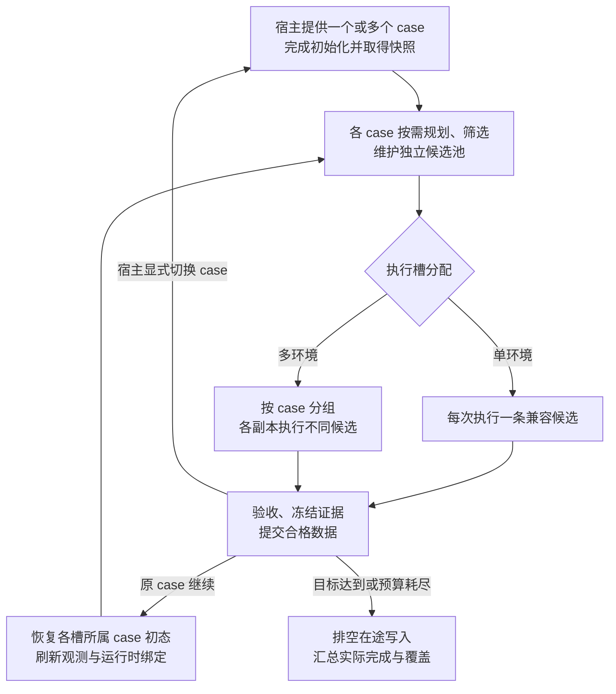

# EmbodiChain：固定场景下的专家轨迹域扩增设计

状态：设计与实施边界，更新于 2026-09-05。手写 qpos/free-motion 同步闭环已落地；完整配置、接触/持物与调度方案仍含待实现内容，当前边界见第 11 节及[实施计划](fixed_scene_expert_expansion_implementation_plan.md)。本文没有吞吐对比实测，不宣称某种模式在所有任务上最优。

适用范围：原子技能、手写关节轨迹、EEF waypoint 和可信参数化工厂共享扩增能力，由 sim 或 Gym 调用。场景布局与物体初始位姿由宿主提供，不属于扩增变量。

推荐架构：**按场景隔离的候选池 + 可选同场景副本池 + 分层按需扩增 + 成本感知调度**。首版保留全批执行边界，通过时长分桶、计算缓存和有界队列提高效率；逐行异步恢复、检查点分叉作为能力成熟后的选项。

## 1. 目标、边界与效率指标

### 1.1 固定的是每个场景条件，不是所有环境

一次扩增的输入为 `(S, G, Q₀)`：

| 输入 | 固定内容与允许变化 |
|---|---|
| 场景 S | 实体及物体初始位姿、几何、物理参数、机器人安装位姿；不由扩增器采样 |
| 任务 G | 操作对象、目标效果、阶段依赖、接触约束与成功条件；不改变任务语义 |
| 起点集合 Q₀ | 默认使用调用者给定的完整机器人初态；只有部署允许时才扩增关节起点 |

多环境可以具有不同的 S；同一环境在外层 reset 后也可以接收新的 S。扩增器只计算各条件下的轨迹分布，不决定如何生成布局。任务执行导致物体运动属于正常任务动力学，不是场景随机化。

目标覆盖“从允许起点能到达，并能继续完成任务”的状态—动作路径。状态包含关节构型、阶段与接触关系；只证明某个 EEF 点运动学可达不够。[Robot 的工作空间采样](../../embodichain/lab/sim/objects/robot.py) 可作先验，但仍需验证前缀、后缀与整条路径。

### 1.2 优化目标

先满足任务、碰撞、控制和专家质量门槛，再在预算内增加有效覆盖：

- 已验收且已持久化的去重轨迹数／墙钟时间。
- 实际轨迹新增的几何、构型与时间覆盖／墙钟时间。
- 达到指定覆盖目标的总成本，包含准备、规划、物理、渲染、验收和写盘。

规划成功数、种子数和时间变体数不能代替上述指标。无意义绕路、长停顿、近重复不因增加点数获得奖励。比较方案时固定硬件、传感器、任务质量门槛和数据目标，并分别报告冷启动与稳定运行成本。

## 2. 分层架构与来源接入

### 2.1 所有权与依赖方向

| 层 | 职责 | 边界 |
|---|---|---|
| 公共扩增核心 | 模板、候选值对象、因子算子、去重、覆盖描述符与规划端口协议 | 算法直接依赖 tensor/math/configclass，不直接导入 Gym 或仿真 backend；公共导入遵循 lab/sim 初始化 |
| GenerationSession | 各 case 的候选池、预算、随机流、覆盖预留及提交计数 | 只接收快照和结果，不读取活环境，不执行 step/reset |
| 来源与规划适配 | 将原子或手写输入转为模板，调用 IK、MotionGenerator 与路径检查 | 注入服务；原子 binding/effect 不泄漏到公共核心 |
| Runner 与宿主适配 | 执行槽管理、初态准备、命令、步进、观测、效果验证和数据提交 | 每个宿主只有一个物理步进所有者 |

公共核心位于 `embodichain/lab/sim/motion/expansion/`，包含 `contracts.py`、`cfg.py`、`operators.py`、`coverage.py`、`session.py`，与 `motion/{solvers,planners,workspace}` 共属机器人运动能力域。已实现的 `initial_state.py`、`runner.py`、`execution.py`、`sinks.py` 和 `integrations/{sim,planning}.py` 位于 `embodichain/lab/trajectory_generation/`；Gym 生命周期接入现有 env，原子来源适配仍待实施。端口协议集中在 contracts，避免过早拆分。

2026-09-05 根据模块归属 review，将原工具包方案调整为 `lab/sim/motion`：`motion` 父包按需加载四个子包，不在初始化时主动汇总全部求解器、规划器或分析器。当前 [lab 包初始化](../../embodichain/lab/__init__.py) 仍会加载仿真相关子包，因此不再承诺无需仿真依赖即可公共导入；纯算法不直接依赖 Gym，也不拥有 step/reset。sim/Gym 必须复用同一生成会话，不各自实现采样、预算和覆盖逻辑。求解器不反向依赖扩增会话；Gym 生命周期适配不进入 sim 运动核心。

### 2.2 原子技能与手写轨迹同等接入

| 来源 | 必需输入 | 适配方式 |
|---|---|---|
| 原子技能／Task Program | invocation、阶段约束、affordance、binding 与效果条件 | 导出模板，保留候选到规划完成；只对执行分支构造 ActionPlan |
| 手写 `qpos + dt` | joint names/单位、工具通道、阶段、锁定端点和可变范围 | 扩增声明的自由段，保留未受控关节；未知接触段不改动 |
| 手写 EEF waypoint | 坐标系、工具标定、阶段与路径约束 | 经注入的 IK/规划端口生成关节分支 |
| 可信参数化工厂 | 显式快照、因子值、局部 RNG，以及模板／下一阶段输出 | 概念接口 `build(snapshot, factors, rng) -> TrajectoryTemplate` |

未标注的 `qpos + dt` 默认仅支持原样执行、记录和审计。单纯 action 数组也不能自动解释为 qpos；velocity、EEF delta 等需声明控制语义及可靠转换，否则不启用几何扩增。

现有 `create_demo_action_list()`／`create_demo_segments()` 可适配，但会 step 或依赖未来反馈的旧生成器，应先做受控基准采集，或按实际阶段边界生成下一段；不能在纯规划核心提前耗尽 lazy iterator。配置只引用可信注册的 source ID，不执行任意 YAML 表达式或 dotted import。

### 2.3 sim/Gym 执行接入

| 来源 × 宿主 | 执行路径 |
|---|---|
| 原子 × sim | 普通 ActionPlan → 现有原子 ExecutionSession/Runner 与仿真端口 |
| 原子 × Gym | Task Program/Gym 命令桥 → 正常 `env.step()` |
| 手写 × sim | 计时控制命令与工具事件 → sim 适配器；无需伪造 AtomicAction 或 Gym |
| 手写 × Gym | 显式候选 DemoSegment → demo 执行器 → 正常 `env.step()` |

Gym 尚需补充显式 segments 输入或明确消费候选的工厂入口，不能假定旧方法的 kwargs 会生效，也不临时替换环境方法。已是控制器目标的命令走 [ControllerAction](../../embodichain/lab/gym/envs/types.py)，只跳过重复 raw-action pre 处理，不绕过 step 或 post 处理。

Gym 的权威周期为 `env.step_dt`；直接 sim 显式提供 `control_dt`，并验证对应整数个 physics step。Gym Runner 不额外调用 sim.update；直接 sim 由适配器完成控制、物理、传感器与记录。规划使用不可变快照；后台状态改变后，受影响计划必须重新检查。

## 3. 统一数据契约与身份

### 3.1 核心值对象

| 契约 | 关键字段与约束 |
|---|---|
| `SceneCase` | 场景内容签名、任务/机器人/标定契约、允许起点；不持有活环境引用 |
| `MotionSnapshot` | case ID、完整机器人状态、根坐标系、实体状态、目标及依赖 revision；输入行到宿主实例的映射由适配器维护 |
| `TrajectoryTemplate` | source ID/revision、template ID、控制表示、参考关节或 EEF 路径、显式时间或待参数化声明、阶段/锚点、允许算子、工具事件和 validator ID |
| `CandidateTrajectoryBatch` | `positions: (C,N,D_full)`、`dt: (C,N)`、`valid_length: (C,)`；每行 case/初态/候选身份、实际 IK 分支、因子值、阶段事件、验证状态及诊断 |
| `ExpertEpisode` | 实际观测、下发动作与表示、时间、机器人/接触测量、阶段、验收证据、候选谱系及提交身份 |

C 为逻辑候选数，不等于物理环境数；N 可 padding，只有 valid_length 内的样本有效。适配器转换现有 PlanResult、TimedTrajectory 和 ActionPlan；这些 lab 类型不进入核心协议。失败候选可删除大张量，但必须保留轻量 audit。

`GraspCandidateBatch` 仍由独立 graspkit 所有：`poses: (B,K,4,4)`、`costs: (B,K)`、`candidate_mask: (B,K)`。兼容辅助方法可包装原 ragged 接口；镜像、upright、标定及语义过滤由来源适配器派生。验证有限值及 SE(3) 合法性；空行填安全 pose 并置 mask=False，不访问不存在的第一个 grasp。

### 3.2 三种身份不能混用

| 身份 | 含义与生命周期 |
|---|---|
| `scene_case_id / initial_state_id` | 哪个固定场景与允许起点；相同 case 可服务多个副本及多次 episode |
| `candidate_id / geometry_family_id / parent_id` | 哪条扩增方案、几何家族和父分支；重试增加 attempt ID，时间变体保留同一几何家族 |
| `slot_id / runtime_epoch` | 本次在哪个物理实例执行，以及该槽当前的运行时版本；由宿主绑定 |

`source_row_index` 仅表示输入快照行，不能当作永久 env 身份；来源 env ID 可作为宿主审计信息另存。同一候选转移到副本前要检查场景、起点、控制和坐标映射兼容性；reset 后重建运行时 binding、效果请求和碰撞依赖。

离线可返回全部规划合格候选；在线兼容路径仍逐环境按可行性、质量分数及原始候选顺序稳定选择一个 winner。无解行保持起点并标记失败，不挤占其他行。不得将重复 env IDs 或 `(B,K,N,D)` 塞入现有 [TimedTrajectory](../../embodichain/lab/sim/atomic_actions/plans.py)。手写来源没有 grasp 时相应字段为空，不伪造索引。

## 4. 扩增维度与分层生成

### 4.1 统一因子表

| 因子 | 采样变量与粒度 | 必要条件／不变量 |
|---|---|---|
| `contact` | 每个接触分支的 grasp 区域、合法对称变体、夹持宽度 | affordance 与可重新生成接触段的模板；保持任务和物体初态 |
| `ik` | 每个目标/路径的肘部、腕部、冗余构型 | EEF 约束，或明确许可从 qpos 经 FK 重建；关节限位与连续可达 |
| `approach` | 每条几何候选的接近距离、许可方向、撤离方式 | 固定接触锚点、进入方向及合法走廊 |
| `spatial` | 自由段的少量路点、平滑残差、姿态过渡、绕障走向 | 已声明自由段、锁定端点及质量边界；不逐控制帧重采样 |
| `timing` | 每条几何路径的分阶段速度和加减速、时长 | 统一 control_dt，动态限制与阶段连接 |
| `contact_timing` | 每个闭合/释放/稳定事件的许可时长 | 工具通道、事件顺序、接触模式和效果 gate |
| `start_state`，可选 | episode 准备前选择机器人起始构型 | 起点属于部署分布，场景与机器人安装位姿不变 |
| `recovery`，后续 | 从实际偏离状态生成成功后缀 | 真实可达的前缀、后缀生成器与恢复验收 |

采样域为“任务允许域 ∩ 模板允许域 ∩ job 配置 ∩ 机器人/backend 能力”。缺少启用因子的标注或交集为空时明确报错；关闭因子保持模板值。先固定起点，条件采样接触/接近方式，再联合求解路径与 IK，最后按需求产生时间变体；不展开无界 Cartesian product。

接触候选先过质量门槛，再按接触区域、方向等分层选代表，不只按全局 grasp cost top-K。未标定 cost 不是成功概率。一个自由段首版选一种几何算子；多算子组合需明确顺序并重验最终路径。

### 4.2 IK、几何与时间的关键约束

1. **多解 IK**：解析枚举或多 seed 求解后按关节构型去重；每分支独立传播 pre-grasp → grasp → lift → downstream 的成功 seed。NaN/Inf、FK residual 越界均失败，失败 qpos 不污染后续阶段。
2. **保持实际分支**：请求携带 `solved_joint_targets`、分支及连续性约束。现有 [EEF 插值路径](../../embodichain/lab/sim/motion/motion_generator.py) 会再次做 IK；只传 pose 可能使多分支重新合并。无法强制保持时按最终结果重新识别、去重。
3. **低维几何变化**：自由段用少量 via points 或 `q(s)=q_ref(s)+Σ θ_j B_j(s)`，基函数保持端点及所需导数；避免逐帧独立噪声。接触段必须遵守 Cartesian/接触约束，不能只做关节直线插值。
4. **显式时间参数化**：同一路径改变推进速度，再按 control_dt 生成变长命令；不能同时固定点数、周期又改变总时长。重新计算事件索引，检查速度、加速度及任务所需 jerk/力矩。未许可的工具与等待时长不自动缩放。

同 seed、不同 seed、不同 chunk、不同点数都不自动代表不同运动模式。时间变体可增加速度覆盖，不增加同一路径的空间覆盖。

### 4.3 多阶段与技能推广

分支节点至少保留完整机器人状态、夹爪/接触状态、持物关系、语义任务状态、阶段、父前缀及后缀约束。不能仅因 qpos 接近就合并两个节点。

若 T 表示后一个坐标系在前一个坐标系中的位姿，候选 i 的下游 EEF 目标为：

$$
T^{(i)}_{\mathrm{object}\to\mathrm{eef}}
= T_{\mathrm{world}\to\mathrm{object}}^{-1}T^{(i)}_{\mathrm{world}\to\mathrm{eef}},
\qquad
T^{(i)}_{\mathrm{world}\to\mathrm{eef,target}}
= T_{\mathrm{world}\to\mathrm{object,target}}T^{(i)}_{\mathrm{object}\to\mathrm{eef}}.
$$

只对未来可继续、质量合格的节点投入后续预算；物理执行后的续段使用实测状态，不把计划终点当作已实现状态。

- PickUp：优先复用候选 IK，延后 winner；闭合、lift 和后续放置继承同一分支。
- AxisAlign：把对齐偏好变为候选评分，两阶段及持物旋转均保留候选依赖。
- HandOver：两侧先筛选有限兼容 pair，按 control part/assignment 分组；双臂各自可达不等于联合路径、交接时序可行。
- Slide、OpenDoor 及手写多段轨迹复用阶段协议；接触候选来自哪个接口不应限制通用扩增。lift_height 等参数只有被定义为可变中间量时才能采样。

### 4.4 避障驱动的空间扩增

固定场景几何是规划条件，不是扩增变量。空间扩增分为两种模式，避免把“检查后剔除碰撞路径”等同于“主动生成不同绕障路线”：

| 模式 | 生成方式 | 用途 |
|---|---|---|
| 局部扩增与过滤 | 在参考自由段附近采样受限残差或路点，再检查整段路径 | 低成本增加参考路线附近的覆盖 |
| 避障重规划 | 固定任务锚点、阶段边界及声明的 IK 分支约束，采样许可路点或规划初值，调用具备避障能力的规划端口 | 探索不同的有效绕行路线，不保证不同 seed 得到不同路线 |

避障重规划是候选生成方式，不仅是碰撞失败后的补救；`ik_interp` 或单纯时间参数化不能替代它。原子与手写来源复用同一规划端口，只改模板授权的自由段，不放松接触锚点、后缀可行性或专家质量门槛。

- **有限修复**：碰撞候选可在预算内重规划或换路点；显式限制每候选重规划次数和每 case 规划预算，耗尽后记录失败。启用模式但缺少所需后端能力时明确拒绝，不静默退回插值。
- **最终验收**：检查平滑、拼接、时间重采样后的实际输出路径，并更新其阶段事件与谱系。碰撞世界绑定和接触/持物规则复用第 5.2、8.1 节；能力不可用不计为通过，不能只检查修复前路径或关键帧。
- **有效覆盖**：按最终几何路线去重；多个提议修复到同一路径时不重复计空间覆盖。安全间隙与合理路径长度作为质量门槛，不奖励无意义绕路。

上述模式选择与重规划预算属于待补配置。当前 `EnvRowMotionPlanner` 主要执行给定 EEF 路径的 IK/FK 转换及 free/no-held 关节路径加密检查，尚不主动搜索替代绕障路线；接触、持物和连续碰撞的实现边界仍见第 11 节。

## 5. 高效批量规划与缓存

### 5.1 逻辑候选与 GPU 批次分离

存储使用紧凑候选表；执行使用少量预热的固定容量桶，例如 16/32/64 行。按机器人/控制部位、阶段结构、碰撞配置和长度分组，桶内 padding 使用安全输入与显式 mask；无效行即使 backend 返回成功也不得进入候选池。

每阶段压到最小 C 不一定最快：改变 batch/horizon 可能增加分配、warmup 和 CUDA Graph 成本。优先在阶段边界整理候选，控制桶数量及缓存显存，而不是为每个 C 创建 backend。cuRobo 支持容量预分配和内部 padding，项目已有 [按 batch 等条件缓存 backend](../../embodichain/lab/sim/motion/planners/curobo/curobo_planner.py) 的基础，不应重复建设。[cuRobo 批量规划说明](https://nvlabs.github.io/curobo/latest/api/curobo.batch_motion_planner.html)

建议由 `generate_candidates()` facade 负责能力检查、分桶与以下映射：

- 候选 → 来源 snapshot/case → 机器人根坐标与完整起始状态。
- 候选 → 当前阶段碰撞世界、允许接触对及持物几何。
- 规划行 → 原 candidate ID、阶段 mask、实际分支和失败原因。

[BasePlanner 校验](../../embodichain/lab/sim/motion/planners/base_planner.py) 当前仍将 batch 绑定到 robot.num_instances，且 [机器人 IK](../../embodichain/lab/sim/objects/robot.py) 存在按环境读取根坐标的路径。不能仅展平 C 就假定全部 backend 可用。未完成通用适配时，必须显式选择真实环境行宽的分轮模式，一轮每个真实行至多处理一个对应候选，其余安全占位；不能悄悄放松校验或伪造实例数。

### 5.2 碰撞世界与共享边界

同一 robot-relative 布局可共享不变的环境几何；arena offset 由适配器变换。不同 case、不同阶段动态物体、不同持物关系不能共用错误的 obstacle pose 或可变附件状态。

共享 world 只有在该规划批次所需碰撞状态一致时才成立；否则按正确来源映射 per-candidate world，或拆成兼容分组。复用 backend 时也要重新绑定当前世界，不能让另一个 case 的更新污染正在求解的批次。primitive 不直接构造 cuRobo/TOPPRA 专用 options。

关闭动态碰撞只可用于声明清楚的受限规划实验，不能代替正式数据必须通过的路径验证。把多个 grasp 放进“只返回一个 winner”的 goalset 也不等于获得多条候选轨迹。

### 5.3 按依赖复用，不重复完整流水线

| 改变内容 | 可尝试复用 | 必须重算或重验 |
|---|---|---|
| 只改运动时间 | 几何路径、兼容 IK、静态几何检查结果 | 时间网格、事件映射、动态限制与物理效果 |
| 改某个自由段路点 | 未受影响的目标/阶段与几何资源 | 该段 IK/路径、连接边界、依赖它的后缀 |
| 改 grasp/接触模式 | 场景几何与无关模板 | 接触段、持物关系及受影响下游规划 |
| 同 case 恢复初态或换兼容副本 | 满足同一初态契约的模板/几何候选 | 初态验证、坐标映射、runtime epoch、效果请求与碰撞绑定 |
| 外层切换 case | 真正场景无关的模板与机器人模型 | 场景相关路径、可行性与覆盖归属 |

缓存键包含来源修订、场景内容、任务、机器人/标定、起点、阶段依赖和算子参数；计时计划再包含周期和执行限制。缓存设大小上限与淘汰策略，失效不清空其他 case 的有效数据。不能把旧 ActionPlan/session 当作可跨 reset 复用的值对象。

## 6. 覆盖驱动的候选池与执行调度

### 6.1 分场景集合选择与按需展开

对每个 case 分别统计阶段、接触家族、实际 IK 构型、EEF 位置/姿态、归一化关节状态、方向、速度和阶段转换状态。采用少量联合分桶及轨迹近邻距离，不构造完整高维网格。

质量门槛通过后，集合目标可写为 `Σ w_c · min(n_c, target_c)`；一个轨迹反复经过同一区域不重复刷分。几何按阶段进度对齐去重，速度/时长另算。同一路径的时间变体归入同一 geometry family。

调度使用估计的剩余价值，而非固定穷举：

$$
\mathrm{priority}(x)
=\frac{\widehat{P}(\mathrm{accept}\mid x)\,
       \widehat{\Delta\mathrm{coverage}}(x)}
      {\widehat{\mathrm{remaining\ cost}}(x)+\epsilon}.
$$

这是启发式优先级，不是最优性保证。保留探索预算和各目标 case/模式的最低配额，避免只采容易成功的区域。尚未校准的成功率使用保守先验，不把 grasp cost 直接当概率。

候选池不足时才继续展开接触、IK、几何及时间分支。可先对几何家族的一种时间方案回放，再根据价值与反馈决定是否增加其他时序；若失败可能由时序造成，也应保留有限替代尝试。不要为每条路径预先生成全部时间组合。

规划描述符只决定优先级。正式覆盖由通过验收且确认写入的实际轨迹更新；在途候选暂时预留覆盖额度，失败或写入失败释放。预算、独立探测和覆盖增益共同决定停止；只能报告在当前预算和采样器下趋于饱和，不能宣称穷尽连续可达空间。

### 6.2 场景与副本池解耦

`SceneCase` 是数据任务，`ExecutionSlot` 是物理资源。一个 case 可绑定多个副本；不同 case 的候选只在兼容槽中运行。副本共享准备信息和不变计算资源，不共享运行中的物理状态。

设 B 个物理槽，G 个活跃 case，每 case 分配 R_g 个副本，满足 `Σ R_g <= B`。例如 16 槽可用于 `1×16` 集中扩增一个场景，或 `4×4` 同时处理四个外部给定场景。副本数提升单场景并行度，但不意味着相同硬件的总吞吐量按倍数增长；最佳分配需实测规划、物理与渲染瓶颈。

两种池模式：

- `per_env_case`：接收各行现有布局，各自维护 case；不要求它们相同，也不跨行直接使用轨迹。
- `grouped_replicas`：宿主把外部给定 case 的初态准备到多个兼容槽；只在旧 episode 收尾后重绑定，拓扑/机器人不兼容时拒绝或分到独立宿主。

缺少同场景恢复/复制能力时，不得声称已批量验证同一场景的所有候选。可以只返回规划候选，或由宿主显式提供新 case 后重新规划；这些不是原 case 的剩余候选执行。

### 6.3 时长分桶、屏障与逐行补位

首版采用 `full_batch` 屏障，要求 Runner 独占被重置的整个宿主 batch，并优先将预计时长接近的候选安排在同一轮。完成行保持安全状态、停止增加训练帧；若效果需持续成立，提交前仍检查保持条件。真实任务等待与完成后的占位 hold 区分记录。

忽略其他开销时，全批有效步利用率约为 `Σ L_i / (B × max L_i)`。例如 200/220/240/800 步的一批仅约 46%；时长分桶可以减少此类浪费，但不改变任务必需时长。

逐行补位是后续能力：完成行验收后恢复并领取下一个兼容候选，其余行继续；所有动作仍由唯一宿主合并后 batched step。启用前需同时验证：

- reset、速度清理、控制器、任务桥、观测历史和记录均行隔离。
- 不因某行 settling 额外推进其他活动行；所有必要推进进入统一步进与记录。
- 局部 reset 不清空其他行的任务状态，不使其碰撞绑定失效。
- 每槽维持 candidate/attempt/epoch，终态证据在复用前冻结。

当前 [SimulationManager.update()](../../embodichain/lab/sim/sim_manager.py) 推进整个 world；部分 [随机化事件](../../embodichain/lab/gym/envs/managers/randomization/spatial.py) 会额外 sim.update，当前 [EmbodiedEnv.reset()](../../embodichain/lab/gym/envs/embodied_env.py) 还会清除活动任务桥。因此 `reset_ids` 存在并不证明全系统已支持安全的逐行补位。独立 world/process 分片可作为替代，但需计入显存与进程成本。

### 6.4 有界流水线

组织为 `提议/规划 → 待执行候选池 → 执行/验收 → 待写入队列`，各队列有条数与字节上限。达到高水位停止生产，低水位补充；writer 阻塞也须向上游反馈，不能无限持有图像和轨迹张量。

规划只读稳定快照，宿主独占物理步进；有状态 planner 的 world 更新与求解串行保护，或使用真正独立的 backend 实例。图捕获/warmup 在受控窗口完成，不与其他 CUDA 使用者无协调竞争。先重叠 CPU 整理/写盘与物理执行；同 GPU 的规划、物理和渲染是否并行由实测决定。

[Isaac Lab Mimic](https://isaac-sim.github.io/IsaacLab/v2.3.0/source/api/lab_mimic/isaaclab_mimic.datagen.html) 的按环境 action/reset 队列可作为职责分离参考，不意味着 EmbodiChain 可直接复用其调度器。

## 7. reset、初态恢复与单／多环境流程

### 7.1 明确区分三种状态操作

以下定义宿主协议的语义，不是普通 reset options；当前全批 `acquire_case / restore_initial` 已实现，checkpoint 仍为后续能力：

| 操作 | 作用 | 候选与覆盖 |
|---|---|---|
| `acquire_case` | 宿主外层 reset 或读取外部指定场景，完成准备后注册 case | 按实际各行内容归属；新场景新建分区，不决定布局如何采样 |
| `restore_initial` | 为同 case 的下一条独立轨迹恢复指定初态，不重新采样布局 | 验证兼容后可消费剩余候选；重新绑定 runtime epoch |
| `resume_checkpoint`，后续 | 恢复任务中途的完整可续跑状态 | 只允许验证过的前缀/后缀衔接，不等同于 episode 初态重建 |

固定 seed 不代表不同子环境布局相同，也不能替代初态一致性检查。复用初态需显式准备策略，保留必要的机器人/控制器初始化；不能偷偷跳过全部 events。startup/reset/interval 中会改变本 case 固定条件的随机项必须与宿主约定处理。

首版 `restore_initial` 可采用“完整 episode 重置 + 按 case 重建指定初态 + 校验”，无需先实现任意接触状态 checkpoint。恢复内容至少包含任务所需的机器人/物体状态与速度、夹爪/约束、控制器和 task/manager 初始状态，并完成 settling。已有 [轨迹状态读写](../../embodichain/lab/gym/utils/trajectory_state.py) 只是其中一部分。

当前已落地 [FixedSceneHost / InitialStateProfile](../../embodichain/lab/trajectory_generation/initial_state.py) 与 [SimInitialStateAdapter](../../embodichain/lab/trajectory_generation/integrations/sim.py) 的全批初态基础：一个配置所有的固定基座 robot 和全部普通刚体，保存独立物理状态并在恢复前预检，使用可信 profile 准备任务/控制器、标识固定条件和验证初态。Gym 的 generation lease/prepare 入口不调用普通 reset，且与纯 sim host 共用 simulator batch 所有权；调用者先冻结旧 episode，再丢弃旧录制、准备、恢复、settle、standard episode manager reset、verify，验证后刷新首观测并播种记录。每次准备或释放使旧 epoch binding 失效，失败不允许继续执行。已通过物理关闭/开启两种模式的真实 headless CPU backend 状态恢复 smoke，并接入手写 qpos Runner 与真实 UR5 free-motion profile。固定条件与控制历史不由物理快照自动覆盖；PickUp profile、接触与长时间 settling 验收仍需后续完成。

这种“随机 reset 与指定状态 reset 分开”的接口可参考 [Isaac Lab reset_to](https://isaac-sim.github.io/IsaacLab/develop/source/api/lab/isaaclab.envs.html#isaaclab.envs.ManagerBasedEnv.reset_to)，不能据此推断现有项目已支持。

### 7.2 统一采集流程



回到候选池时优先取兼容缓存，不重新生成整个池。多环境首版按第 6.3 节的全批屏障收尾，图中的逐行验收不表示已经允许逐行 reset。

| 事件 | 下一步 |
|---|---|
| 纯采样/IK/规划失败且宿主未变化 | 不 reset，只更新 audit、消耗规划预算并继续采样 |
| 候选完成、失败、超时或受控基准采集结束 | 冻结验收与数据，再恢复初态；失败不进入专家数据 |
| 中间阶段完成 | 不 reset，从实际边界状态规划/执行下一阶段 |
| 初态恢复后不匹配 | 拒绝执行并重试准备；仍不匹配报告错误，不静默当作新 case |
| 宿主显式提供新布局/任务/标定 | 重新注册或匹配 case，失效不兼容计划；旧覆盖保留在原分区 |
| 预算耗尽/取消 | 停止接收新工作，安全收尾在途执行和写入，不降低验收标准 |

Job 的预算、ID 序列和各 case 历史跨 reset 保留；episode 的控制游标、观测历史和记录在结束后重置。队列能否复用取决于 case/初态兼容性，不是“跨 reset 保留”就永远可执行。

### 7.3 起点、观测与准备顺序

全部初始化、复制和 settling 必须完成在新 episode 首帧播种之前。若准备发生在 env.reset 返回后，适配器需显式暂停准备段记录，刷新观测、重新播种首帧，再允许执行；不能 set_qpos 后继续使用旧观测。

启用 start_state 时，只选择部署允许的起点。若部署始终从固定 qpos 开始，需真实执行合法连接前缀；不能把人为设置的中途状态当作策略自然起点。准备动作不作为专家标签，除非它本身是要学习且完整记录的任务前缀。

采集期间抑制隐式 auto-reset，沿用 [demo 执行器](../../embodichain/lab/gym/envs/demo.py) 由外部 Collector 掌管收尾的约定。任务终态验收必须发生在状态被重置前。

## 8. 验证、真实数据与提交

### 8.1 统一验证链

| 层 | 必检内容 |
|---|---|
| 输入与语义 | 有限 SE(3)、工具标定、合法因子、阶段顺序和锚点 |
| 运动学 | IK/FK residual、关节限位、实际分支及连续性 |
| 路径 | 自碰撞、环境/双臂碰撞、携带物体扫掠、阶段接触许可及段间运动 |
| 时间与控制 | 周期、速度/加速度及任务要求的其他动态限制、事件顺序 |
| 物理与任务 | 跟踪误差、接触建立、滑移/掉落、阶段效果和完整任务成功 |
| 数据质量 | 合理路径/时长、去重、观测动作因果对齐和谱系完整性 |

使用连续碰撞检测或与运动尺度适配的路径采样，不能只检查关键帧。允许手指在接触阶段接触目标，不意味着整段忽略目标；持物阶段检查对象随候选运动的几何。

每项记录 `not_run / passed / failed / unavailable`、失败阶段及连续度量。缺少必需检查的候选只能留在规划库；规划成功、效果投影和命令完成均不等于物理成功。原始“专家”参考也需验收；质量 ratio 与同起点、兼容任务/模式的基准比较。

### 8.2 记录实际因果序列

记录 `observation_t → action_t → observation_{t+1}`，包含时间、实际机器人/接触状态及阶段。明确源动作、训练标签和下发命令的表示与转换 profile；不能将计划 qpos 或状态差自动当作动作。

每个执行分支重新采集图像；不混用其他分支或另一次执行的观测。真实等待计入实际时长，padding 和完成后的占位不成为训练帧；计划时长与实际时长分别记录。[LeRobotRecorder](../../embodichain/lab/gym/envs/managers/datasets.py) 已有因果配对通路可复用。

### 8.3 Gym reset 的保存顺序

当前同步持久化基础位于 [LeRobotEpisodeSink](../../embodichain/lab/trajectory_generation/sinks.py)：每个已验收 `ExpertEpisode` 写入独立 LeRobot shard，T 个训练帧与末观测/T+1 实测时间 sidecar 一同封存并读回，谱系/验证 metadata 和 manifest 也必须读回成功才给 confirmed receipt。相同 commit ID 的相同 payload 可在当前进程内幂等重试；已确认提交只读核验、不重写。输入或时钟/容量不支持时拒绝，写入失败返回失败回执。该 sink 无活环境引用；`QposRolloutExecutor` 已负责冻结实际命令与观测，`GenerationRunner` 接入实测验收、Session 和保存回执。manifest 未列出的片不能作为正式专家数据消费。

当前 [BaseEnv.reset](../../embodichain/lab/gym/envs/base_env.py) 与 [EmbodiedEnv](../../embodichain/lab/gym/envs/embodied_env.py) 的顺序为：

```text
Collector 先完成旧 episode 验收并冻结终态证据
→ BaseEnv 缓存旧任务成功状态
→ sim.reset_objects_state(reset_ids)
→ DatasetManager 消费旧 buffer
→ 清空旧记录和 metadata
→ reset events 与 managers
→ 获取新观测，EmbodiedEnv 播种首帧
```

物理状态先于 DatasetManager 保存被重置，因此保存阶段不得重新读取现场来判定旧 episode。异步写入需在 buffer 清空前取得独立 payload。

现有全量 reset 的选择性 dataset 提交可写为：

```python
# accepted_ids 来自 reset 前完成的任务、质量与去重验收。
env.reset(options={"save_data": False, "commit_env_ids": accepted_ids})
```

这仅展示已有提交语义，**不等于实现 restore_initial**。该调用仍可能运行布局随机化；新适配器必须把同 case 准备与首帧播种按第 7 节接好，不能直接执行旧候选。

commit_env_ids 是被 reset 行的无重复子集，只指定 dataset 保存行，不指定物理 reset 范围；显式提交会绕过默认成功过滤，调用者必须先验收。save_data=False 下其他 camera/trajectory 自动产物需要单独明确提交策略。[现有收集入口](../../embodichain/lab/scripts/run_env.py)

### 8.4 提交确认与训练使用

分别维护 `proposed / planned_valid / rollout_attempted / validated_accepted / pending_write / committed`。只有实际动作才计 rollout；只有收到持久化确认才增加 committed 和正式覆盖。回执按 episode/commit ID 去重并归属原候选，重试写入不重复计数，不能按当前 slot 绑定解释旧回执。最后一批先预留剩余配额，按稳定候选顺序提交，避免超额；失败不靠放宽门槛凑数。

Gym 可复用 DatasetManager 及 [异步 recorder](../../embodichain/lab/gym/envs/managers/async_datasets.py)，但需向会话补齐结果确认。直接 sim 使用宿主无关 EpisodeSink，或抽取通用写入器，不伪造现有 Gym recorder 所需 env。Runner 负责 finalize/drain 与错误回传，不依赖 env.close 隐式提交当前 episode。

训练按轨迹家族和父分支分组，时间变体不跨 train/validation；限制近重复、公共前缀和慢速版本的采样权重。完整任务与成功片段分别标识。多模态动作宜使用可表达模式且具时间一致性的策略，或部署时可得的条件；candidate ID、规划 seed 和未来成功标志不能作策略输入。[Diffusion Policy](https://diffusion-policy.cs.columbia.edu/)

## 9. 超参配置与可复现性

### 9.1 配置所有权

公共 `TrajectoryAugmentationCfg` 管理因子、去重和覆盖；`TrajectoryGenerationJobCfg` 包含前者，并管理来源、规划预算、池调度、reset、验证和 sink。均使用项目 `@configclass`。

采用独立 `generation.yaml`，由启动器显式加载；不向现有 env.yaml、Task Program 或 EventManager 暗加语义。模板与执行 profile 拥有硬约束，job 只能收窄范围。长度用米、角度用弧度、时间用秒；关节偏移按各关节有效范围归一化。control_dt 从宿主取得，不由 job 静默覆盖。

### 9.2 配置示例

以下为**待实现 schema**，不能直接交给当前 config_to_cfg。示例输入是阶段标注齐全的手写 EEF 模板；数值是启动实验值，不是验证过的最优默认值。

```yaml
source:
  kind: handwritten
  source_id: fixed_pick_place_waypoints
  template_id: reference_0

augmentation:
  seed: 20260905
  start_state: {mode: provided}
  factors:
    contact: {enabled: false}
    ik:
      enabled: true
      max_seeds: 8
      max_solutions_per_target: 4
      allow_branch_switch: false
    approach: {enabled: false}
    spatial:
      enabled: true
      method: via_points
      variants_per_branch: 2
      max_via_points: 2
      position_offset_norm_m: [0.0, 0.03]
      rotation_offset_norm_rad: [0.0, 0.15]
      preserve_phase_endpoints: true
    timing: {enabled: true, duration_scales: [0.8, 1.0, 1.2]}
    contact_timing: {enabled: false}
    recovery: {enabled: false}
  phase_overrides:
    transit: {operators: [via_points, retime]}
    approach: {operators: [retime]}
    grasp: {operators: []}
    transfer: {operators: [via_points, retime]}
    release: {operators: []}
  coverage:
    descriptor: phase_joint_eef
    selection: value_per_cost
    position_bin_m: 0.03
    rotation_bin_rad: 0.17
    joint_dedup_normalized_tol: 0.01
    geometry_samples_per_phase: 32
    target_per_cell: 4
    exploration_fraction: 0.2
    saturation_min_proposals: 512
    saturation_patience_rounds: 8
    min_new_cells_per_round: 1

planning:
  batch_mode: candidate_buckets
  batch_buckets: [16, 32]
  cache_budget_mb: 1024

execution:
  pool_mode: grouped_replicas
  rollout_slots: 4
  active_case_limit: 1
  replicas_per_case: 4
  scheduler: full_batch
  duration_bucket_edges_s: [2.0, 4.0, 8.0]
  ready_low_watermark: 8
  ready_high_watermark: 32
  ready_max_bytes: 268435456
  overlap_planning_and_physics: false

reset:
  outer_mode: provided
  inner_mode: restore_initial
  prepare_profile_id: fixed_scene_initial_state
  initial_state_tolerances_profile_id: fixed_scene_tolerances
  on_initial_state_mismatch: error

validation:
  validator_id: fixed_pick_place_success
  profile_id: fixed_pick_place_verified
  motion_limits_profile_id: robot_execution_limits
  require_path_collision: true
  require_task_success: true
  path_length_ratio_max: 1.5
  duration_ratio_max: 1.5

collection:
  target_committed_episodes: 256
  max_proposals: 8192
  max_rollout_attempts: 2048
  max_attempts_per_candidate: 1
  max_wall_time_s: 3600

persistence:
  sink: lerobot
  accepted_only: true
  async_write: false
  pending_episode_limit: 8
  pending_max_bytes: 536870912
  save_audit: true
  split_unit: trajectory_family
```

配置语义：

- phase_overrides 只控制许可的局部几何/时间算子；不能启用全局关闭的因子或放宽模板。grasp 的空 operators 不妨碍对固定接触目标求 IK。
- 偏移在模板声明坐标系内采样；duration_scale > 1 表示延长允许 retime 的阶段，不自动缩放接触等待。
- 原子来源可开启有声明的 contact；纯 qpos 来源默认不开 IK，除非显式支持 FK 后重新求解。两类来源共享后续配置。
- `candidate_buckets` 必须有第 5.1 节的候选适配；受限 backend 需显式选 `env_rows`，不能忽略配置。grouped_replicas 必须通过初态复制/恢复能力检查。
- `outer_mode: provided` 接收调用者给定 case，不自行触发布局采样。若选择 `host_reset`，环境 RNG/布局仍由宿主拥有，每次结果重新归属 case；内层 restore 不推进该布局随机流。
- 时长桶最后含超出最大阈值的溢出桶；水位、缓存与字节限制同时约束内存。单个请求/episode 超限时明确拒绝或使用预先声明的流式 sink，不突破上限。
- 多 case 时增加 active_case_limit 并约束总副本数不超过可用槽；各 case 的覆盖、去重独立，job 目标可全局累计，但不能用其他 case 完成声明的局部配额。

### 9.3 校验、随机流与调度重现

加载时拒绝未知字段、非法范围/单位、未注册 source/validator/profile、无效 phase、非正预算、不递增桶边界、不合法水位及超过宿主槽数的副本配置。初态 profile 明确实体位置/旋转、机器人关节/速度和控制器检查；运动 profile 明确每关节限制。仅有名称没有定义时不能启动。

使用显式局部 Generator 和固定 hash 算法派生种子：

```text
H(job_seed, source_id, source_revision, scene_case_id,
  candidate_ordinal, operator_id, attempt_id)
```

不使用 Python 进程随机 hash、物理 env ID 或全局环境 RNG 作为候选身份。纯因子提议应不受 slot 分配与 chunk 改变影响；backend 批大小可能影响数值求解，因此记录实际桶、版本、参数及输出，不承诺逐位一致。

默认按逻辑轮次和 candidate ID 合并反馈，便于对照实验。将来吞吐优先异步模式可按完成顺序更新，但必须记录调度事件用于审计，不能同时承诺与同步模式完全相同的候选序列。预算/历史不因 restore 清零。

## 10. 可选的高级优化

| 模式 | 适用条件 | 必须守住的边界 |
|---|---|---|
| 公共规划前缀缓存 | 多候选的前段约束与起始状态相同 | 复用计算不等于复用物理成功证据 |
| 检查点分叉执行 | 前缀长、分支发生晚，且完整状态可恢复 | 物理、控制器、任务、接触/约束及观测历史一致；验证真实前缀/后缀连接，不只恢复 qpos |
| 低成本物理预筛，再完整采集 | 失败率高且渲染占主要成本 | 计入二次执行成本；正式采集重新验收，图像与动作必须来自同一次正式执行 |
| 实际偏离状态的专家恢复 | 需要闭环纠偏且有可靠后缀专家 | 通过真实前缀到达偏离状态；致偏离动作不标为专家动作，恢复边界不混入连续训练窗口 |

[DemoExecutionCfg](../../embodichain/lab/gym/envs/demo.py) 当前明确未提供 checkpoint/resume 协议；片段保存或轨迹状态回放不代表该能力。首版不依赖上述高级模式，尤其不把刚性初态重建和任意接触中途恢复混为一谈。

若公共前缀被多个后缀引用，数据存储和采样要记录共享谱系，避免把重复前缀算作新增独立覆盖。恢复数据可针对学习策略真实访问的状态追加专家监督，借鉴 [DAgger](https://proceedings.mlr.press/v15/ross11a.html) 的分布适配思路；任意随机扰动不具有相同保证。

## 11. 实现缺口、交付顺序与验证

### 11.1 现有基础与待补模块

以下记录当前实现与剩余设计范围。真实验证已包括初态恢复、Panda 动态障碍采样检查，以及普通重力下 UR5 自由运动的执行、实测验收、LeRobot 写入/读回。Panda 手指漂移负例被锁定关节模型检查拒绝。真实 Runner 验证为 B=1、direct-sim、20 个命令，不代表 PickUp、真实 Gym 采集或四组合 M1 已完成；详细命令和验证记录见[实施计划](fixed_scene_expert_expansion_implementation_plan.md)。

| 模块 | 已有基础 | 仍需补齐 |
|---|---|---|
| 公共核心与来源 | qpos 模板/候选/配置、严格能力校验、demo 候选输入、原子初始计划供应入口 | EEF via-point 因子、完整原子来源导出与候选消费 |
| IK 与规划 | MotionGenerator、cuRobo、真实 env_rows 分轮、EEF 显式样本 IK 与已解分支/FK 保留 | 多解枚举/去重、主动绕障路线生成与有界修复、独立候选容量桶与更广 backend 能力 |
| 路径验证 | free/no-held qpos 加密采样、实测路径重验、运动限值与质量独立 gate | 接触/持物/夹爪变化语义、连续碰撞与任务级 PickUp 验收 |
| SceneCase 与副本池 | 全批物理初态捕获/恢复/校验、可信 profile、独占 host/epoch、Gym 观测重播种 | 同 case 副本重绑定、接触任务 profile 与长期 settling 验收 |
| 会话与调度 | 按 case 分区、局部 RNG、几何去重/覆盖、提议/执行/写入配额及条数/字节上限 | 依赖缓存、时长调度、有界异步 pipeline 与成本调度 |
| sim/Gym 数据闭环 | 手写 qpos Runner、实际命令/观测冻结、同步 LeRobot 封存/读回/确认，真实 UR5 direct-sim 正例 | 真实 Gym/PickUp、原子来源、统一注册/CLI 及四组合 M1 验收 |
| 逐行异步／分叉 | 部分行级接口、自然片段保存 | 全链路行隔离、独立任务上下文、完整 checkpoint 及连续性协议 |

### 11.2 交付顺序

1. **正确闭环**：公共契约、case/slot 身份、合法初态准备与校验、手写 EEF 模板和 PickUp、sim/Gym 执行记录；全批屏障、明确失败与提交确认。
2. **优先效率项**：同 case 副本池、候选适配、稳定容量桶、依赖缓存、时长分桶、有界流水线与覆盖预算；与第一步做同预算对照。
3. **扩大运动覆盖**：多 grasp/多 IK 分支、手写多段和 PickUp → Place，再推广 AxisAlign、Slide、OpenDoor、HandOver 的特定约束。
4. **按瓶颈选高级项**：行隔离成熟后逐行补位；长公共前缀再考虑分叉；需要闭环泛化时加入真实恢复数据。

首版必须验证四个组合：原子 × sim、原子 × Gym、手写 × sim、手写 × Gym。复用核心不要求四条路径使用相同执行封装。

### 11.3 聚焦回归

| 测试面 | 关键用例 |
|---|---|
| 核心边界 | 算法不直接导入 Gym/backend，motion 父包按需加载；缺标注、非法控制表示、无能力配置明确失败 |
| 候选正确性 | 空 grasp、混合 IK 失败、失败 seed 隔离、实际分支保持/去重、索引 round-trip |
| 避障扩增 | 固定场景与锚点、不同有效绕行路线、修复后路线去重、最终输出重验、预算耗尽及能力缺失拒绝 |
| 批量规划 | C ≠ B、固定桶 padding、受限 backend、重复来源行、根坐标与碰撞世界不串用 |
| 场景与恢复 | 多行不同布局、同 case 多副本、arena offset、恢复失配拒绝、旧 epoch 不执行 |
| 时间与接触 | 变长 timing/事件一致、时间变体不刷空间覆盖、携物碰撞与阶段接触许可 |
| 宿主与记录 | 唯一步进、ControllerAction 不重复处理、准备后首帧刷新、占位不写训练帧 |
| 提交与队列 | reset 前证据冻结、仅提交合格行、writer 失败不计 committed、队列满反压、尾批不超额 |
| 并发隔离 | planner world 绑定互不污染；一行 reset/清速度/清桥不影响其他行；失败时禁用异步模式 |
| 学习兼容 | 规划成功物理失败不入专家集，家族 split 无近重复泄漏，恢复/片段边界清楚 |
| 旧行为 | 默认在线逐环境单 winner、唯一 env IDs、ActionPlan 效果与恢复协议不变 |

聚焦验证可从 [Atomic Actions](../../tests/sim/atomic_actions/)、[MotionGenerator](../../tests/sim/motion/planners/test_motion_generator_batched.py)、[BasePlanner](../../tests/sim/motion/planners/test_base_planner.py)、[Demo 执行](../../tests/gym/envs/test_demo.py)、[Dataset recorder](../../tests/gym/envs/managers/test_dataset_functors.py) 扩展。纯张量单测之后，再做无 GUI 的真实执行验证。

### 11.4 效率与学习效果验收

在同一组外部给定 case、相同副本总数、相同传感器/控制周期、质量门槛和每 case 数据目标下，逐项比较：基础全批 → 缓存/容量桶 → 同场景分组/时长分桶 → 流水线 → 可选逐行补位。不要用改变 case 数量或降低验收标准制造吞吐提升。

记录规划有效率、物理接受率、几何/时间去重率、committed/min、覆盖增益/min、首次达到覆盖目标的时间；同时拆分 reset/settling、IK/规划、物理、渲染、拷贝/写盘、屏障等待、warmup 和显存峰值。固定形状与最小压紧、单 GPU 串行与重叠都需做消融，先优化实测瓶颈。

最终在相同数据预算下比较模仿学习成功率，并保留未见过的起点/运动参数组合进行评估。固定场景实验只能证明相应运动分布上的收益，不据此宣称布局泛化或连续可达空间已完全覆盖。
