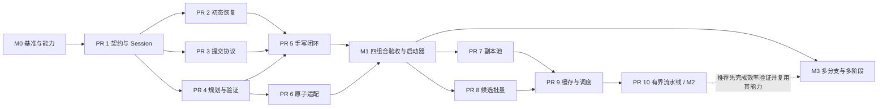

# 固定场景专家轨迹扩增：实施计划

- 状态：实施中；手写自由运动与离线原子 PickUp 的 direct-sim 采集闭环已落地，完整 Atomic Runtime/Gym/M1 仍待实现与验收。
- 依据：[设计文档](fixed_scene_expert_expansion_design.md)，2026-09-05。
- 代码核对基线：`fb7228e2`。首批实现基于该版本，已运行 CPU 行为测试；尚未完成四组合真实仿真和性能验收。
- 交付原则：先完成可验收、可持久化的四条执行路径，再优化吞吐，最后扩大运动覆盖。

## 当前实施进度（2026-09-05）

| 计划项 | 已实现 | 尚待实现与验收 |
|---|---|---|
| PR 1 | `lab.sim.motion.expansion`：qpos 值对象、nested 配置严格校验、GenerationSession、局部 RNG、候选与提交身份、条数/字节预算、实际关节几何去重与写入配额 | EEF 原始模板和宿主能力注册装配随实际适配器接入 |
| PR 2 的初态基础 | 全批初态复制、恢复、验证与独占 host；Gym 准备/重播种；UR5 自由运动 profile；新增四行 PickUp profile 和抓取结束后的整批循环恢复 | 任意接触 checkpoint、逐行恢复和复杂 settling 仍不支持；Gym PickUp 待验收 |
| PR 4 的基础算子与自由段适配 | 显式自由段 `joint_residual`、retime 与阶段索引重映射、采样速度/加速度检查；`EEFPath / EnvRowMotionPlanner` 的真实 env_rows 分轮、显式 EEF 样本 IK、已解分支保留/FK 验证、自由 qpos 分段加密碰撞检查 | EEF via-point 因子生成、接触/持物/夹爪变化的完整碰撞语义与真实 backend 任务验收；离散路径检查不代表连续碰撞证明或物理成功 |
| PR 5 的手写 qpos/free-motion 闭环 | `GenerationRunner / MotionLimitsProfile / QposRolloutExecutor` 连接 profile 身份、全批初态、sim/Gym 实际命令/观测冻结、规划与实测验收、Session 配额和 sink 确认；真实 UR5 direct-sim 正例 committed 1，Panda 锁定关节漂移负例 committed 0 | 手写 EEF/PickUp、真实 Gym 任务采集及多行/多 episode 任务验收；当前结果不代表 PR 5 全部原定验收或 M1 完成 |
| PR 6 的候选输入与离线模板 | 既有 `initial_plan_provider` 入口；新增 `export_pickup_templates`，从 MoveEndEffector → PickUp 离线编译导出受保护阶段、mimic 几何和实测保持段；接入 Runner 的离线 qpos 采集 | 候选到新的运行时 ActionPlan 的适配、Atomic Runtime tracking/recovery 和 Task Program/Gym 四组合接线；离线导出不代表这些完成 |
| 新增 PickUp 接触闭环 | `PickUpMotionValidator`：完整 URDF 碰撞凸包、mimic 与持物几何、分阶段接触规则、CPU 物理子步接触证据、抬升到保持的相对漂移和双指接触验收；`cube_pickup_collection.py` 四行多轮采集，保存视频和确认后的 LeRobot 数据 | 仅固定基座未缩放 URDF + 盒状刚体 + CPU 物理；通用 mesh 场景、连续碰撞、Gym 子步接口另行扩展 |
| PR 3 的同步保存基础 | `ExpertEpisode` 与 `CommitReceipt`；Session 预留/确认/失败重试；LeRobot 分片封存/真实回读；新增数值矩阵展开及原始 shape/终态保留；确认提交只读幂等核验 | 重启恢复、异步 pipeline 等后续范围；完整四组合真实采集仍需 PR 6 验收 |

当前 `restore_initial` 使用显式全批物理状态适配与可信 profile，不调用普通 reset；同步 sink 只有封存并读回真实文件才确认提交。手写 qpos 的宿主证据冻结、实际控制标签、Runner/Session/sink 已接通，并通过普通重力下 UR5 自由运动真实采集。新增 direct-sim PickUp 的受限接触/持物检查和任务 profile；统一配置注册/CLI、完整原子运行时来源和 M1 四组合发布门槛仍未完成。当前示例显式构造可信服务；配置 ID 本身不代表服务已经注册。

新增 API、测试和现有行为变更已同步对应文档及 agent context。下一步接入 Atomic Runtime 的候选消费与等价物理子步证据，再推进 Gym PickUp、via-point 因子和统一配置启动器；当前离线回放不扩大为完整原子运行时或 M1 四组合能力声明。

模块归属 review 后，`solvers`、`planners`、`workspace` 与 `expansion` 统一归入 `embodichain.lab.sim.motion`。公共 API、测试、示例和文档使用新路径，不提供旧路径兼容包。`motion` 父包仅按需加载子包；扩增算法保持无直接 Gym/仿真 backend 依赖，但其公共导入不再承诺绕过 `lab/sim` 初始化。该调整不改变下述 M0/M1 验收要求或未完成状态。

首批验证记录：核心、原子动作与 Gym/Task Program 组合回归 `1006 passed, 1 skipped, 3 deselected`；补完前置写入容量预留和数值边界后，最终核心测试 `138 passed`。全仓 Black 检查通过，API 文档覆盖 `1718/1718`。Sphinx dummy 构建成功，本次新增模块无相关告警；其他模块仍有文档告警。这些是代码契约验证，不替代 M0/M1 的真实采集验收。

motion 重组回归：`1246 passed, 113 deselected`（排除 requires_sim/gpu/slow），独立进程的新导入和配置解析测试 `3 passed`。PR 2 物理适配 CPU 契约测试 `35 passed`；真实 headless CPU backend 的物理关闭/开启两种模式 smoke `2 passed`，以单关节 robot 与 cube 检查当前状态/drive target/速度/effort 的捕获和恢复，不覆盖接触抓取或长时间 settling。Gym 与宿主集成测试 `119 passed`；相邻 `root_articulation` getter 的 `root_link_name` 修复及回归中，no_sim 集合 `7 passed`。这些集合分别记录，不相加为去重总数；参考 UR5 PickUp 的四组合真实采集验收仍未完成。

PR 3 同步 sink 测试 `17 passed`：真实 LeRobot 数值/RGB/scalar 与 float64 精度读回、终态/T+1 时间 sidecar、writer/evidence/manifest/verify 失败重试、partial 重建、confirmed duplicate 只读以及时钟/容量拒绝。PR 4 首轮 env_rows/IK/碰撞适配 CPU 契约测试 `14 passed`；扩展后的 planning + cuRobo planner CPU 回归为 `82 passed, 1 skipped, 3 deselected`，覆盖分轮 scratch、float64 保留、锁定关节 cache 失效及实测路径重验。真实单 Panda、CPU physics + CUDA cuRobo 0.8.0 smoke `1 passed`：相同 backend 对远处动态方块的短 free 路径返回 passed，将方块移至 TCP 后返回 failed。这不包含接触抓取、持物扫掠或 M1 四组合验收。

PR 5 组合回归 `1379 passed, 1 skipped, 118 deselected`；补充有界 `last_failures` 审计后，Runner/executor 联合测试 `70 passed, 1 skipped, 1 deselected`。真实物理开启的 CPU 单关节 robot + static cube 执行器 smoke `1 passed`；真实 Runner 测试 `2 passed`，分别验证 UR5 接受并确认 1 条、Panda 漂移拒绝且提交 0 条。示例命令独立运行 exit 0，UR5 在 1 秒内记录 21 个实测观测/20 个命令，全部 gate 通过并读回 LeRobot。全仓 Black 检查通过（867 个文件）。以上集合有重叠，不相加；真实验证范围仍为单行 direct-sim free motion。

上一轮文档校验：公共导出覆盖 `1751/1751`，checker 测试 `8 passed`，Sphinx dummy 构建成功。本次新增 API/指南没有相关告警；构建仍报告其他既有文档的 46 条告警。`git diff --check -- docs` 通过。

### 本轮 PickUp 实施范围

- 来源通过 `AtomicActionEngine.compile` 复用现有 MoveEndEffector/PickUp 规划；`export_pickup_templates` 保留接近/闭合/抬升边界，展开 mimic 坐标，并加入 30 个真实保持命令。只增强 transit，不改变接触时序。
- 碰撞适配使用 URDF **碰撞**形状的保守凸包和完整关节 FK，包含指尖、mimic、随 TCP 移动的目标盒体和隐式地面；实测重验使用真实目标位姿。两条关节边以内的结构自碰撞排除沿用 cuRobo 规则。验证有界采样，不声明连续碰撞保证。
- CPU 每个 5 ms 子步读取原生接触，限定指尖/目标/支撑/固定安装部位的合法组合与接近段进入距离，拒绝未知/跨行/非法/过深接触和数据容量溢出。保持阶段双指真实接触比例至少 95%，抬升至少 12 cm；从抬升到保持检查 TCP 相对位置/转角漂移，避免把掉落或滑移数据提交。
- 例子固定机械臂刚度 200000、手指打开目标距下限 1 mm，保留 0.05/0.08 rad 的末端/路径跟踪门槛。普通重力下并行执行 0°/90° cube 抓取，整批恢复后继续；达到 confirmed committed 目标才成功退出。
- LeRobot 新增数值矩阵支持，训练帧按 C order 展开为向量，`observation_shapes` 保存原始形状，终态仍是矩阵；`commanded_joint_indices` 标记实际下发的 active 列。每轮视频包含真实初态与终态，拒绝的尝试也保留在视频和审计中。
- 本轮没有消费 `initial_plan_provider`、提交预测符号效果或替代 Atomic Runtime 的 tracking/recovery。后续需将这些运行时契约与新增物理验收接通，才能完成 PR 6 的完整目标及 M1 四组合。

本轮同步 main 的显式物理步进 API 后，motion、原子动作、采集、Gym 初态与 demo、仿真管理器及 gizmo 组合回归为 `1542 passed, 1 skipped, 168 deselected`；真实并行采集、异常退出清理和原有视频示例为 `3 passed, 1 deselected`。四行两轮共 proposed/attempted/committed `8/8/8`，每条保持 1.5 秒、双指接触覆盖 100%，最小抬升 17.90–17.92 cm，相对位置最大漂移 0.35–0.73 mm；LeRobot 和 544 帧 H.264 视频均已真实回读。全仓 Black、`git diff --check` 通过；API 覆盖 `1761/1761`、checker 测试 `8 passed`，Sphinx dummy 构建完成，仍有文档告警。这些测试集与前述记录有重叠，不相加。

当前已实现部分合并为一个 draft PR 提交 review。下文的 PR 编号保留为实施计划的工作划分，不表示这些 PR 已独立创建或全部验收。

## 1. 实施范围与里程碑

| 项目 | 首阶段 M1 | 后续阶段 |
|---|---|---|
| 参考任务 | 单臂、刚体 cube 的 PickUp：接近、闭合、抬升及保持；手写 EEF 和原子来源使用同一任务条件 | PickUp → Place、手写多段及其他技能 |
| 参考 embodiment | 建议复用 UR5 + DH PGI 配置，先实测基准与碰撞能力 | Franka 用于第二 embodiment 回归；双臂独立扩展 |
| 来源 × 宿主 | 手写 × sim、手写 × Gym、原子 × sim、原子 × Gym，四个组合全部通过 | 参数化工厂和更复杂的 Task Program |
| 扩增 | 已标注自由段的少量 via points、合法 retime；固定接触目标，先保留一条有效 IK 分支 | 多 grasp、多 IK、approach、contact timing |
| 起点与 reset | `provided` 起点；无中途接触约束的 episode 初态重建、校验；布局由宿主提供 | 部署允许的多起点；checkpoint 与 recovery 另立项 |
| 执行与规划 | 先 `B=1`，再多行不同 case；`full_batch` + 显式 `env_rows` 分轮 | 同 case 副本、`candidate_buckets`、时长调度 |
| 保存 | 同步 sink、逐提交确认、仅接受合格 episode；从第一版限制队列条数和字节 | 有界异步写入及 CPU 整理与执行重叠 |

M1 的 PickUp 成功表示完成所声明的抓取任务，不表示已经实现完整 pick-and-place。现有 repeated_pick_place 部署可提供场景与 embodiment 参考，但需要单独准备验收 fixture，不能把现有 open-loop 执行结果直接视为专家质量基准。

设计第 9.2 节的完整 YAML 包含 M2/M3 能力。实施时分别提供各里程碑可运行的 `generation.yaml`；未实现的模式和启用因子必须在启动前报错，不能静默降级。

## 2. 实施前代码基线与实施影响

| 已核对事实 | 实施影响与主要落点 |
|---|---|
| `lab/__init__.py` 会导入 sim/Gym 等子包 | 公共核心归属 `lab/sim/motion/expansion/`；验证算法无直接 Gym/backend 依赖，以及 motion 父包按需加载的边界 |
| `configclass.validate()` 主要检查 `MISSING` | 配置加载还需显式校验未知字段、范围、单位、交叉约束和宿主能力；不修改全局 configclass 语义 |
| [PickUp](../../embodichain/lab/sim/atomic_actions/primitives/pick_up.py) 提前筛掉 grasp 分支，预筛 IK 结果未直接用于后续轨迹 | 候选保留与已解关节目标传递需要新增接口；空 grasp 行也要覆盖 |
| [BasePlanner](../../embodichain/lab/sim/motion/planners/base_planner.py) 批量校验绑定 `robot.num_instances` | 首版使用 `env_rows`；C 与 B 解耦由独立适配层完成，不能仅展平张量 |
| [ExecutionSession](../../embodichain/lab/sim/atomic_actions/execution.py) 启动时重新规划 | 需要正式的候选消费入口，并保留既有 tracking、效果验证和 recovery 协议 |
| [execute_demo_episode](../../embodichain/lab/gym/envs/demo.py) 没有显式候选 segments 参数 | 新增明确输入，保留旧 hook 调用；不临时替换环境方法 |
| [BaseEnv.reset](../../embodichain/lab/gym/envs/base_env.py) 先恢复物理对象再调用 dataset 保存；[EmbodiedEnv.reset](../../embodichain/lab/gym/envs/embodied_env.py) 清空活动任务桥并播种首帧 | 旧 episode 验收证据必须先冻结；初态准备与观测重播种需要独立生命周期入口 |
| [AsyncLeRobotRecorder](../../embodichain/lab/gym/envs/managers/async_datasets.py) 队列无界，没有逐 commit 回执 | 同步提交协议先行；之后补队列反压、完成回执和错误传播 |
| 本机 LeRobot 0.4.4 的 `save_episode()` 写数据后仍保持 Parquet writer 打开，`finalize()` 才完成 footer 等收尾；项目 recorder finalize 后不能继续复用 | 提交确认需要明确封存屏障与读回检查；不能将 episode 写入函数返回作为已持久化 |
| CLI 实际注册位于 [cli/main.py](../../embodichain/cli/main.py)，`__main__.py` 仅转发 | 新启动器在现有 dispatcher 注册，保持根命令的懒加载 |

## 3. 模块与契约归属

按模块归属 review 采用以下布局；未标为已实现的生成宿主部分仍为后续实施计划，只有职责变复杂时再拆文件：

```text
embodichain/lab/sim/motion/
  __init__.py        # 按需暴露四个子包，不汇总其类和函数
  solvers/           # FK、IK、微分运动学
  planners/          # 路径、碰撞约束、时间参数化
  workspace/         # 离线可达性分析、缓存与运行时采样

embodichain/lab/sim/motion/expansion/
  contracts.py       # case/snapshot/template/candidate/episode/receipt 与端口协议
  cfg.py             # 两类 @configclass；只持配置值及注册 ID
  operators.py       # 因子提议、自由段几何和时间变体
  coverage.py        # 几何家族、去重、覆盖计算
  session.py         # case 分区、预算、候选池、配额预留、结果归账

embodichain/lab/trajectory_generation/
  initial_state.py   # 已实现：可信 profile、全批 host、PreparedBatch epoch
  runner.py          # 已实现：手写 qpos/free-motion 同步编排与 generation_report
  execution.py       # 已实现：sim/Gym qpos 执行、实际标签与因果证据冻结
  config.py          # generation.yaml 严格加载、可信注册与能力检查
  integrations/
    planning.py     # 已实现 free/no-held EEF/qpos 的 env_rows 适配与采样检查
    handwritten.py  # 显式模板与 DemoSegment 适配
    atomic.py         # 已实现：离线 PickUp 阶段模板；运行时 ActionPlan 适配另行落地
    contact.py        # 已实现：PickUp 完整几何和 CPU 物理子步接触验收
    sim.py           # 已实现物理初态适配；rollout 控制/计时/观测归 execution.py
    gym.py           # Gym 初态、正常 env.step、demo/Task Program 桥
  validation.py     # 注入路径检查与实测任务/质量验证
  sinks.py          # 已实现同步 LeRobotEpisodeSink，已接入真实自由运动采集

embodichain/lab/scripts/generate_trajectories.py  # 拟新增启动器
```

接口 review 重点：

1. `SceneCase / initial_state_id`、`candidate / family / attempt`、`slot / runtime_epoch` 三组身份独立；arena 平移通过坐标映射处理，不能进入候选随机种子。
2. 快照及候选不持有活环境或可变 backend；明确张量所有权，避免表面只读而底层数据仍被宿主更新。
3. `CandidateTrajectoryBatch` 使用 `(C,N,D_full)`、逐行有效长度和显式时间。固定首点时间、到达间隔、padding 与阶段事件区间语义；工具事件、阶段、失败状态与候选索引一同映射。
4. Session 只接收快照与结果；Runner 管生命周期；sim/Gym 各有一个步进所有者。Gym 的控制周期取 `env.step_dt`。
5. 原子候选执行建议采用受限的“初始计划供应端口”：绑定新的 request/context 后消费指定候选的完整初始计划；后续 recovery 保留既有机制。具体签名在 PR 1 固定，不能通过写私有 session 字段实现。
6. `EpisodeSink` 的提交输入有稳定 episode/commit ID；回执携带原候选身份。定义何时主数据、必需媒体及谱系均完成持久化，enqueue 或单个 writer 函数返回均不自动算 committed。
7. source、validator、prepare、tolerance、motion-limit profile 使用可信注册 ID；YAML 不执行任意 dotted import。模板和 profile 的约束只能被 job 收窄。

能力声明分别描述多 seed、all-solutions、关节分支保持、精确路径验证、独立候选 batch、初态复制和持久化屏障，不能用一个通用 `supports_batch` 布尔值替代。M1 先支持明确的 qpos 控制/标签 profile 和工具事件；其他表示需先实现并验证转换。

## 4. 实施顺序与 PR 划分

以下编号用于 review 和依赖规划，不表示本次创建 PR。每个 PR 随实现补对应测试与公共 API 文档。

### M0：建立可执行基准与能力清单

**交付内容**

- 固定一个外部给定的 cube case、机器人初态、工具标定、控制周期和传感器设置。
- 定义真实成功判据：物体按任务要求抬升并保持、抓持关系有效、无掉落；容差、持续时间、跟踪误差和质量上限均有数值及单位。
- 验收未扩增的手写 EEF 基准与原子 PickUp。记录路径长度和实际时长，建立同起点、同任务/模式的 ratio 比较基准。
- 检查路径碰撞、阶段接触许可、持物几何、初态恢复和 writer 持久化的实际能力。缺项列为 M1 必须补齐的工作。
- 加入基础计时，保存规划、reset/settling、物理、渲染、写盘时间，后续优化沿用同一对照条件。

**退出条件**：基准能重复运行；未支持的必需验证有明确实现方案。不能用关闭检查的方式进入专家数据采集。

### PR 1：公共契约、配置和最小 Session

**依赖**：M0 的任务与 profile 定义。

- 新增公共值对象、端口、两类配置及严格解码；固定状态/时间/动作表示、候选消费和提交确认协议。
- 实现 case 分区、稳定 ID、本地 RNG、规划/rollout/时间预算及基本有界候选池。状态区分 `proposed / planned_valid / rollout_attempted / validated_accepted / pending_write / committed`。
- 实现最小的家族归属、去重与配额预留；同一路径的 timing 变体共用 geometry family，不增加空间覆盖。复杂价值调度留到 PR 9。恢复初态不清空 job 历史。

**验收**：纯 CPU/张量测试；算法无直接 Gym/backend 依赖，motion 父包按需加载子包；slot/chunk 改变不改变纯因子提议；时间变体不刷空间覆盖；重复回执、失败及尾批不会重复计数或超额；未知/无能力配置拒绝启动。

### PR 2：sim/Gym 初态准备与恢复生命周期

**依赖**：PR 1。

**当前落地**：`SimInitialStateAdapter` 严格支持一个配置所有的固定基座 robot 及完整批次普通刚体，保存关节/根/物体状态、速度、drive target 与关节 effort，并在任何写入前检查完整 schema、结构签名、SE(3) 和关节限位。`FixedSceneHost` 以调用者提供的各行 case 建立初态，恢复前使旧 binding 失效，经过可信 profile 准备、物理恢复、settling 和验证才发布新 epoch。profile 还必须覆盖物理快照之外的控制历史、任务状态与固定物理/视觉/传感器条件。

Gym 接口增加全批 generation lease，租约内拒绝普通 reset 并抑制自动 reset；Gym 和纯 sim host 登记同一 simulator batch 所有权，不允许两个不同 owner 并存。`prepare_generation_episode()` 先丢弃旧录制，再依次准备、恢复、settle、清空 standard episode manager 历史、verify，确保 validator 看到新 episode 的 manager 状态；验证通过后才获取首观测并播种记录。失败时禁止继续 step。调用者必须在进入该生命周期前取得旧 episode 的独立证据。该接口不自动保存数据，不调用 reset event 或重播种环境 RNG，也不声明任意 controller 已被默认覆盖。

物理根位姿 setter 可能推进整个 world，因此恢复先写根，再恢复所有其余状态；异常不会伪装成成功。已通过物理关闭/开启两种模式的真实 CPU backend 状态恢复 smoke；该测试与 mock 生命周期验证均不替代参考任务在接触和长时间 settling 下重复恢复的验收。

- 实现 `acquire_case / restore_initial / verify_initial` 与 slot epoch。先完成单槽，再覆盖全批中每行不同 case。
- 启动检查要求 Runner 独占整个被 reset 的宿主 batch，并在采集期间关闭隐式 auto-reset；不能让外部活动行被本 job 的恢复连带重置。
- 明确恢复 robot/rigid-object 状态和速度、夹爪与控制目标、任务/manager 初态；经过 settling 后验证。首版不支持的实体或初始约束明确报错。
- Gym 增加受控准备入口：旧证据冻结与提交载荷取得 → episode 清理 → 所需确定性初始化/状态恢复 → settling → standard episode manager reset → 验证 → 刷新观测 → 播种首帧 → 新 binding。
- 显式区分改变布局的随机事件与必需初始化。inner restore 不消耗外层布局 RNG；运行中改变 case 固定条件的事件须受宿主策略约束。

**验收**：多次恢复后物体/关节/速度/控制状态符合 profile；观测首帧对应恢复后的现场；准备段不写训练帧；失配和旧 epoch 拒绝执行；全批 reset 不影响其他独立宿主。

### PR 3：episode 冻结、同步 sink 与提交确认

**依赖**：PR 1；与 PR 2 可并行开发。

**当前落地**：`LeRobotEpisodeSink` 接收已冻结且验收通过的 `ExpertEpisode`，每条独立封存一个本地 LeRobot dataset shard。主数据保留 T 个因果训练帧，`terminal.npz` 保留末次观测和全部 T+1 个实测时间，`episode.json` 保存谱系、动作表示、验证、阶段和 metadata；collection manifest 才是已提交片的目录。同步写入完成后重新打开并读取每帧/图像、全部必需 sidecar 与 manifest，成功后返回 confirmed receipt。

首版只接受固定整数 fps、支持的数值观测向量与 uint8 RGB、float32/float64 动作；实测时间必须在绝对容差内符合宿主固定时钟。单条 payload 有 raw tensor + metadata 字节上限。输入错误在 episode 写入前抛出；持久化失败返回原身份的失败回执。相同 commit ID 必须携带相同 payload：已 confirmed 时只读核验，不重写产物；尚未确认时可复用已封存可读片，未提交且不完整的片在原路径重建，不新增逻辑 episode。数值读回检查 Parquet 原始精度，RGB 通过 LeRobot 解码。`drain()` 没有延迟回执，`close()` 不隐式追加保存。仅支持新/空输出目录和当前进程的单写入者，不声明重启恢复、跨文件事务或断电持久性。

`QposRolloutExecutor` 已冻结真实 rollout 的 T+1 观测、T 个实际 qpos 命令和实测时间；`GenerationRunner` 完成后续实测验收、Session 归账和 sink 提交。sink 只消费调用者提供的验证，不重新计算碰撞或任务成功。真实 UR5 正例已完成整个写入/封存/读回链路。

- 定义统一 `ExpertEpisode`、候选谱系和实际动作转换 profile；复用已有因果配对与有效帧标记。
- Gym 使用 DatasetManager/LeRobotRecorder 适配；sim 使用宿主无关 sink。优先抽取可复用的序列化/写入部分，避免模拟 Gym env 对象。
- 补逐 episode 的提交结果。主记录、媒体和 metadata/sidecar 部分成功时能识别已写结果，重复提交同 commit ID 不生成第二条逻辑 episode。
- 回执按提交身份归账；只有持久化确认后更新正式覆盖。Runner 明确调用 drain/finalize 并传播错误。
- 建议 LeRobot 从同步版本就采用有界分片：达到 pending 条数/字节上限或本轮剩余配额后停止接收，封存当前 recorder，读回主数据/媒体/sidecar，再发回执；需要继续时创建下一分片。job manifest 保存 commit 到分片/episode 的映射，封存期间 pending reservation 不释放。收尾失败时保留未完成状态并回传错误，不重复写主记录。
- 首版持久化语义固定为所有必需产物已关闭、可重读并完成错误检查；进程崩溃恢复、断电持久性和跨文件事务另行定义，不暗含在普通回执中。

**验收**：reset 后仍能保存旧 episode 的冻结证据及末次 observation；拒绝行不写专家集；覆盖只取已提交的实际轨迹；注入 writer/sidecar 失败后不误计数；重复提交与迟到回执可正确处理；真实 LeRobot 完成一次写入→封存→重新打开并读取的验证。大于单片容量的 job 能持续推进，pending 满额不死锁。

### PR 4：候选规划、时间与验证的最小公共路径

**依赖**：PR 1；与 PR 2/3 可并行开发。

**当前落地**：`EEFPath` 保存 local arena-frame TCP 的显式样本、初始锚点、arrival intervals、来源行及阶段；可提供 control-part 顺序的 solved qpos，保持分支并经 FK 验收，不重复 IK。`EnvRowMotionPlanner` 把 C 个候选按真实 B 行分轮，每轮同一来源行至多处理一个候选；返回原序且来源身份对齐的 full-joint 候选与逐候选验证。自由 qpos 路径按 joint step 上限在相邻样本和阶段边界间加密，交给支持精确关节样本验证的 backend 检查。

当前只支持完整 `free` 标注、显式无持物，且全部未受控关节保持 snapshot 与 `robot.cfg.init_qpos` 的初值。contact/hold/未标注路径、持物、夹爪等锁定关节变化、无 backend 能力或采样超过容量返回 `unavailable`；碰撞和非法路径返回 `failed`。结果仅提供 `path_collision` 证据；实际速度/加速度、任务成功、接触与物理质量仍是独立 gate，不把离散加密解释为连续碰撞证明。

- 实现显式 `env_rows`：任意 C 按真实 B 分轮，一轮每个物理来源行至多处理一个候选，其余安全占位；维护候选到 snapshot/root/world 的映射。
- 手写 EEF 走注入的 IK/规划端口；支持固定已解关节目标及分支连续性约束。未标注 qpos 默认仅原样执行；未受控关节保持原值。
- 首版每个自由段只用一种 via-point 算子；retime 后按宿主周期重新采样，重算事件索引、速度/加速度与阶段连接。
- 实现所选任务必需的路径检查：自碰撞、环境、段间路径、阶段接触许可、持物扫掠；复用 `MotionGenerator.validate_joint_trajectory()`，补足其不覆盖的部分。
- 记录 `not_run / passed / failed / unavailable` 和连续指标；必需项 unavailable 的候选只能进入规划库。

**验收**：C≠B 映射往返、空输入、失败 seed、NaN/Inf、padding 隔离、固定端点、实际 IK 分支、变长时间和事件顺序均正确；故意碰撞或携物扫掠碰撞被拒绝。

### PR 5：共享 Runner 与手写来源端到端闭环

**依赖**：PR 2、3、4。

**当前状态：handwritten qpos/free-motion 同步闭环已落地。** `GenerationRunner` 与 `MotionLimitsProfile` 要求显式传入现有 host、planner、executor、sink 和可信限速配置，对齐 source/template/profile/validator/tolerance ID 与 control_dt/fps。运行入口接收每个物理行的固定 case 和 qpos reference，提议允许的残差/retime，规划检查后先预留配额与容量，再执行。`QposRolloutExecutor` 采集实际命令与实测观测/时间，冻结证据后由 Runner 重验实际碰撞、速度/加速度、路径/时长质量和任务成功，再提交。`generation_report.json` 记录配置、包版本、计数、audit 与目标达成状态；`last_failures` 将无完整 transition 等失败原因有界保留到 audit。Runner 为 single-use，并在退出时关闭传入的 host/sink。

自由运动路径使用原 `EnvRowMotionPlanner` 的锁定关节约束。新增 PickUp 路径必须将同一个 `PickUpMotionValidator` 传入 Runner 和 executor，才能允许目标物体与 mimic 运动并采集物理子步证据。它接收离线原子模板；完整 Atomic Runtime、Gym PickUp、M1 和统一 CLI 仍未完成。

真实正例使用纯 arm UR5、普通重力、CPU physics + CUDA cuRobo、B=1：1 秒内 21 个观测/20 个命令，实际位移约 `0.078021 rad`、终点误差 `0.003212 rad`、最大跟踪误差 `0.010872 rad`，全部 gate 通过且 LeRobot 读回 confirmed，`committed=1`。Panda 默认重力负例中 task/quality/dynamics 通过，但最大手指漂移约 `3.7853e-5` 超过 locked model 的 `1e-6` 比较阈值，实测路径验收 unavailable，`committed=0`。候选不发出夹爪变化命令不能代替实测锁定关节一致性。两项真实测试均通过；未据此验收真实 Gym 采集、多行或连续多 episode。

在仓库根目录、已安装仿真/CUDA/cuRobo/LeRobot 依赖时运行：

```bash
python examples/sim/motion/trajectory_generation/free_motion.py --output /tmp/ur5-free-motion
pytest tests/lab/trajectory_generation/test_runner_real.py --run-gpu -m gpu -q
```

输出目录必须新建或为空；示例显式构造与隐式地面匹配的 `ground_proxy`，全部普通刚体均动态更新碰撞 pose。成功输出 `generation_report.json`、已提交 `manifest.json` 和每条 episode 的 LeRobot dataset/`terminal.npz`/`episode.json`。`--robot panda` 可在另一个空目录运行上述拒绝案例；未达目标返回 exit 1。这是具体示例脚本，统一 generation CLI 仍待 PR 6。

Runner 要求全部普通刚体的物理 UID 同时存在于 backend 的 collision-world 与 dynamic-pose ID 集合，每轮以捕获的各行初态更新；这里 dynamic 表示 backend 可更新 pose，不要求物理刚体为动态。仅烘焙静态 world 无法保证准备后姿态或多行不同 case 一致；B>1 且相对布局不同时需 per-environment backend world。语义 aliases 当前不接入该 Runner，隐式平面等未进入刚体注册表的几何由可信 profile 认证碰撞覆盖。executor 的逐 episode 字节上限必须不超过 sink 与 pending 上限。

- 在 demo executor 增加显式候选 `segments` 输入，与旧 demo hook 路径做明确互斥/选择；支持 iterator 按需消费，不提前耗尽含反馈的旧生成器。
- Runner 编排规划、准备、执行、验收、提交；实现 `full_batch`，完成行安全 hold，停止生成训练帧。纯规划失败不 reset。
- 手写 × Gym 使用正常 `env.step()`；控制器目标走 `ControllerAction`，不重复 action pre 处理。手写 × sim 独立完成控制、整数 physics substeps、传感器和记录。
- 候选结束前采集任务/质量证据；需要持续成立的效果在批次收尾时再检查。终态证据冻结之前不得触发自动或外部 reset。超时和取消关闭新工作并收尾在途数据。

**验收**：两条手写路径执行的是指定候选；记录满足 `observation_t → action_t → observation_{t+1}`；无重复步进、旧首帧、padding/hold 污染；即使 done/truncated 也先冻结再 reset；无法取得全批生命周期所有权时拒绝启动；连续采集多条已确认 episode。

### PR 6：原子 PickUp 接入、启动器与 M1 发布验收

**依赖**：PR 4；端到端合并验收依赖 PR 5。

- 原子适配器导出 PickUp 阶段模板，首版固定合法 contact、保留一条有效分支；候选绑定到当前 case/slot 后才构造新的请求和 ActionPlan。
- 从 PickUp 抽出候选生成与计划物化的共享逻辑；空 grasp、padding 与失败 seed 隔离在首批实现中修复，不复制另一套 PickUp 算法到扩增器。
- 为现有原子执行增加正式的候选消费端口；sim 复用 ExecutionSession/Runner，Gym 经 Task Program 命令桥下发，保持效果验证和命令语义。
- Gym 保留桥的正常耗尽、post-policy、validator 和 abort handshake；命令数组执行完不能独立替代任务验收。
- M1 不采集恢复专家数据：若既有 engine recovery 被触发，沿原协议安全收尾，只保留 audit 并拒绝该 episode 进入专家集。专用恢复数据留待具备边界隔离和标签协议后扩展；在线默认逐环境选一个 winner 的调用保持原行为。
- 新增独立启动器，建议命令名 `generate-trajectories`，显式加载宿主配置与 `generation.yaml`；注册到 `cli/main.py`，产出已解析配置、版本、audit 与最终计数。
- 提供 M1 四组合 fixture 与可运行示例；同步公共 API 文档和受影响项目上下文。

**M1 验收门槛**：四组合都用无 GUI 真实物理运行；建议每组合提交 8 条合格 episode，另覆盖规划失败、物理失败、恢复失配、写入失败和尾批场景。8 条仅为工程烟测规模，不作为数据效果结论。不得以预算耗尽或命令完成替代成功标准。

### PR 7：同 case 副本池

**依赖**：M1。

- 实现 `grouped_replicas`、副本容量检查、case 分配及跨 arena 坐标变换；只在整批 episode 收尾后重绑定。
- 同 case 副本共享不变输入，物理状态和运行时 binding 独立；每轮复制/恢复后重新校验初态。

**验收**：至少覆盖 `1 case × 4 slots` 与 `2 cases × 2 slots`；同候选换兼容副本后映射正确；不同 case 的 world、覆盖和数据不串用。

### PR 8：逻辑候选批量适配与稳定容量桶

**依赖**：PR 4、M1；可与 PR 7 并行开发。

- 新增 `generate_candidates()` facade，以能力声明区分 `candidate_buckets` 与 `env_rows`。
- 支持候选来源重复行、显式 robot-root/初态映射、shared/per-candidate collision world 和安全 padding。复用现有 cuRobo backend 缓存，不伪造 `num_instances`。
- 首先适配一个明确支持的 backend；其他 backend 保留显式 `env_rows` 路径。限制桶数量、warmup 与显存占用。

**验收**：例如 C=11、B=4、桶容量 16 的索引与失败 mask 正确；改变桶不能串世界或丢候选；与 M1 同预算比较规划成本及端到端收益。

### PR 9：依赖缓存、覆盖驱动选择与时长分桶

**依赖**：M1；整体验收包含 PR 7/8。

- 缓存键纳入 source revision、case、任务/标定/起点、阶段依赖和执行限制；只缓存可复用值，不缓存旧 session/ActionPlan。
- 分离几何与时间家族，按阶段进度做近重复判断；正式覆盖由实际且 committed 的轨迹更新，在途预留失败后释放。
- 实现低/高水位补池、按需分层展开、时长桶含溢出桶、价值/剩余成本排序、探索比例与每 case 最低配额。
- 加入独立探测、预算和饱和停止条件；所有反馈按稳定逻辑顺序合并。

**验收**：纯 timing 变化不刷空间覆盖；case/起点/标定变化正确失效；旧回执不归入新 slot；缓存和池满足条数/字节上限；尾批不超额。

### PR 10：有界异步写入与流水线

**依赖**：PR 3、9。

- Async recorder 接入相同 commit 协议；enqueue 前取得独立 payload，按条数和字节限流。
- writer 阻塞向候选生产传播反压；单请求超限明确拒绝或走事先声明的流式 sink。
- 先重叠 CPU 整理/写盘；planner 可变 world 与求解受串行保护。GPU 规划和物理/渲染默认不重叠，只有实测收益及正确性通过后才启用。

**M2 验收门槛**：同任务、相同 case/槽数/质量门槛/每 case 数据目标下，逐项消融 PR 7–10；报告 committed/min、覆盖增益/min、到达目标时间和内存峰值。没有实测收益的优化不设为默认。

### M3：扩大运动覆盖，按来源/技能拆 PR

**依赖**：M1 的验证和候选协议；批量路径复用 M2。

1. **多 grasp / 多 IK**：graspkit 增加 masked batch 辅助协议并保留旧 ragged 接口；解析多解/多 seed 构型去重，逐分支传播成功 seed；PickUp 推迟 winner，保持实际关节分支到 lift。验证空 grasp、失败 seed 隔离和最终分支去重。
2. **手写多段与 PickUp → Place**：接入父前缀/持物变换及后缀可行性；从实际执行边界状态生成续段；中间阶段不 reset。完整任务与成功片段独立标识。
3. **逐技能推广**：AxisAlign、Slide、OpenDoor、HandOver 分别补特定约束与真实验收；HandOver 单独覆盖双臂联合碰撞和交接时序，不合并为一个大 PR。
4. **数据使用与学习验收**：基于 job manifest 汇集已封存分片，按 trajectory family/parent 分组 train/validation，限制时间近重复和公共前缀权重；同数据预算比较模仿学习成功率，保留未见起点/运动参数组合。候选 ID、seed、未来成功标记只作 audit。

**M3 验收门槛**：增加的是通过物理/质量验收的运动覆盖；学习收益以实测报告为准。固定场景结果不宣称布局泛化。

### M4：按实测瓶颈选择后续工作

逐行补位必须先证明 reset、速度清理、控制器、任务桥、观测历史、记录和碰撞绑定全链路行隔离；所有 settling 仍由唯一 batched step 推进。checkpoint 分叉必须另行建立完整状态恢复与前后缀连续性协议。真实 recovery 数据需要可达前缀和可靠后缀专家。这些能力均不作为 M1–M3 的交付依赖。

## 5. 依赖关系与并行组织



PR 1 合入后可并行推进宿主生命周期、sink 和规划验证三条线。PR 6 的来源适配可与 PR 5 并行，最终由同一四组合矩阵验收。排期应以 M0 暴露的碰撞/持物验证和持久化缺口为依据，暂不对未实测工作承诺固定工期。

## 6. 验证与交付物

| 验证层 | 建议落点及重点 |
|---|---|
| 纯张量核心 | 新增 `tests/sim/motion/expansion/`：schema、身份、RNG、去重、覆盖预留、预算和队列；独立检查 motion 懒加载与算法直接依赖边界 |
| 初态准备 | [物理状态适配](../../tests/lab/trajectory_generation/test_sim_initial_state.py) 与 [宿主生命周期](../../tests/lab/trajectory_generation/test_initial_state_host.py)：独立快照、全批预检、固定条件漂移、恢复误差、失败和旧 epoch 拒绝 |
| 规划/原子回归 | 扩展 [atomic_actions 测试](../../tests/sim/atomic_actions/)、[MotionGenerator](../../tests/sim/motion/planners/test_motion_generator_batched.py)、[BasePlanner](../../tests/sim/motion/planners/test_base_planner.py)、[graspkit](../../tests/toolkits/test_grasp_pose_generator.py) |
| 宿主/记录回归 | 扩展 [Demo](../../tests/gym/envs/test_demo.py)、[trajectory_state](../../tests/gym/utils/test_trajectory_state.py)、[DatasetManager](../../tests/gym/envs/managers/test_dataset_manager.py)、[同步 recorder](../../tests/gym/envs/managers/test_dataset_functors.py)、[异步 recorder](../../tests/gym/envs/managers/test_async_dataset_functors.py) |
| 集成与失败注入 | 扩展 `tests/lab/trajectory_generation/`：fake-host 契约测试、四组合真实仿真、唯一 step、恢复失配、终态冻结、延迟/重复/失败回执 |
| CLI 与兼容 | 扩展 [tests/test_main.py](../../tests/test_main.py)；旧 run-env/demo 调用、逐环境单 winner、唯一 env IDs 和 ActionPlan 效果协议保持有效 |
| 性能与数据效果 | 按项目 benchmark 规范新增 generation benchmark；M0 保留基线，每个效率 PR 附同条件对照，M3 再增加学习评估 |

每个里程碑提交：已解析配置与能力清单、代码/backend 版本、固定 case 与 profile、候选/episode/commit 谱系、失败统计、计时与内存报告、可读的数据样本和复现实验命令。公共导出变动同时补 API 文档；按改动范围更新 env-framework、manager-functor、atomic-actions、motion-planning 上下文。

实施时按项目技能完成测试与 PR 检查：`add-test`、`pre-commit-check`；涉及公共 API 用 `update-api-docs`，新增 benchmark 用 `benchmark`。每个 PR 做比例适当的验证；四条真实路径和效率对照属于里程碑发布门槛，不能仅由 mock 测试替代。

## 7. 实施约束与后续验收重点

1. M1 以 **UR5 单物体 PickUp + 手写 EEF** 作为共同 fixture，要求四组合全部跑通；当前纯 arm 自由运动示例只验收其支持的子集。
2. 按 **先 env_rows/full_batch/同步写入，再副本池与候选容量桶** 的顺序交付。
3. **初态恢复、指定候选消费、阶段碰撞/持物验证、逐提交确认** 都是 M1 前置条件，不按吞吐优化项后移。
4. 候选通过原子执行的受限计划供应端口接入，保持原有执行、效果验证和 recovery 所有权。
5. M0 实测后再固定成功容差、碰撞 backend 和工期；吞吐和学习增益按同预算实验验收。
