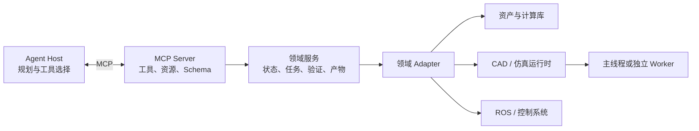

# 引擎与 MCP 开源方案调研及 EmbodiChain 架构建议

调研日期：2026 年 10 月 8 日（Asia/Shanghai）。

关联变更：[EmbodiChain PR #719](https://github.com/DexForce/EmbodiChain/pull/719)，代码比较基准为提交 [`f53d2719`](https://github.com/DexForce/EmbodiChain/tree/f53d2719e40ee062e58e573169ffb90f34dc3f7e/embodichain/mcp)。本文讨论该 PR 快照，不表示这些功能已经合入 `main`。

本文整理机器人、仿真和 CAD 领域的 MCP/Agent 开源参考，以及适合 EmbodiChain 项目级 MCP 的软件架构。核心建议是：让协议注册、状态与执行契约保持通用，领域 adapter 调用已有资产、计算和引擎 API；以 URDF 组合展示独立资产能力，以可选仿真验证展示跨领域组合。

项目事实来自公开 README、源码、测试和 CI 配置。Stars 为调研当日的近似快照；有测试或 CI 不等于已验证所有真实引擎场景。本次没有运行参考项目的 GUI、GPU 或真机 demo。下文的架构归纳和 EmbodiChain 改进项属于设计建议，不是 MCP 标准的强制分层，也不是所有开源项目共同采用的结构。

## 1 参考项目与适用范围

### 1.1 优先参考项目

| 项目 | 定位与质量依据 | 最值得借鉴的能力 | 对 EmbodiChain 的适用范围 |
| --- | --- | --- | --- |
| [robotmcp/ros-mcp-server](https://github.com/robotmcp/ros-mcp-server) | 直接 MCP；约 1.5k Stars；Apache-2.0；有安装、ROS 集成测试和 CI，近期维护 | 运行时接口与类型发现、机器人规格资源、action goal/status/feedback/cancel | 能力发现、机器人 metadata、长任务接口；未来 ROS adapter |
| [RobotecAI/rai](https://github.com/RobotecAI/rai) | 具身 Agent 框架；约 599 Stars；Apache-2.0；有测试、CI、仿真案例和 benchmark | `rai_whoami` 机器人身份描述、工具评测、按场景状态评分 | 机器人上下文资源、使用流程与验收标准 |
| [wise-vision/ros2_mcp](https://github.com/wise-vision/ros2_mcp) | 直接 MCP；约 89 Stars；MPL-2.0；有工具分类测试和 CI | 只读模式实际隐藏修改工具；未分类工具不能进入只读集合 | 工具状态影响分类、运行模式、注册一致性测试 |
| [whats2000/isaacsim-mcp-server](https://github.com/whats2000/isaacsim-mcp-server) | 社区维护 fork；约 66 Stars；MIT；有版本、单位与生命周期测试，非 NVIDIA 官方项目 | 引擎版本 adapter、执行后观察、区分测量状态与命令回显 | 仿真 adapter、运行时兼容性和验证报告 |
| [nasa-jpl/rosa](https://github.com/nasa-jpl/rosa) | ROS Agent，非 MCP server；约 1.65k Stars；Apache-2.0；有测试、CI 与定制示例 | 机器人专属 prompts、工具包扩展、工具过滤、诊断工作流 | Agent 使用方式、机器人能力与限制表达 |
| [OpenMOSS/OpenETA](https://github.com/OpenMOSS/OpenETA) | 包含 MCP 的具身 Agent 系统；约 197 Stars；Apache-2.0；有 session、artifact 与边界测试 | 完整响应保存为 artifact、给 planner 提供有界摘要、session 与 worker 管理 | 上下文大小控制、产物接口；后续多引擎与 worker 隔离 |
| [InternRobotics/REAL](https://github.com/InternRobotics/REAL) | 研究型具身 Agent/MCP 项目；约 56 Stars；MIT；有实际 MCP 通信配合模拟 policy 的端到端测试 | 读取实时 tool schema、记录观察、以目标世界状态判断完成 | MCP 使用流程测试、任务完成语义与观察记录 |
| [neka-nat/freecad-mcp](https://github.com/neka-nat/freecad-mcp) | CAD MCP；约 2.7k Stars、335 forks；MIT；有并发、超时、调度、版本握手测试 | 外部 server 与内部 addon 分层、主线程调度、job/health、按需截图、headless 执行 | 通用执行接口、资产预览；后续 CAD provider |

优先阅读的实现入口：

- ROS-MCP：[action 工具](https://github.com/robotmcp/ros-mcp-server/blob/main/ros_mcp/tools/actions.py)、[机器人规格资源](https://github.com/robotmcp/ros-mcp-server/blob/main/ros_mcp/resources/robot_specs.py)。
- RAI：[机器人身份教程](https://github.com/RobotecAI/rai/blob/main/docs/tutorials/create_robots_whoami.md)、[RAI Bench](https://github.com/RobotecAI/rai/blob/main/docs/simulation_and_benchmarking/rai_bench.md)。
- ROS2-MCP：[工具分类](https://github.com/wise-vision/ros2_mcp/blob/main/server/tool_safety.py)、[按模式注册工具](https://github.com/wise-vision/ros2_mcp/blob/main/server/server.py)。
- Isaac Sim MCP：[版本 adapter](https://github.com/whats2000/isaacsim-mcp-server/tree/main/isaac.sim.mcp_extension/isaac_sim_mcp_extension/adapters)、[仿真 handler](https://github.com/whats2000/isaacsim-mcp-server/blob/main/isaac.sim.mcp_extension/isaac_sim_mcp_extension/handlers/simulation.py)。
- OpenETA：[工具目录摘要](https://github.com/OpenMOSS/OpenETA/blob/main/agent/runtime/mcp_catalog.py)、[session](https://github.com/OpenMOSS/OpenETA/blob/main/sim/mcp_server/session.py)、[worker 管理](https://github.com/OpenMOSS/OpenETA/blob/main/sim/mcp_server/worker_mgr.py)。
- REAL：[Agent 与 MCP 结果规范化](https://github.com/InternRobotics/REAL/blob/main/agents/common.py)、[通信与闭环测试](https://github.com/InternRobotics/REAL/blob/main/tests/test_agents_mcp_e2e.py)。

### 1.2 资产工作流与局部参考

| 项目 | 可以参考什么 | 使用边界 |
| --- | --- | --- |
| [Blender MCP](https://github.com/ahujasid/mcp-for-blender) | 查看场景、修改、截图确认、导出的交互流程 | 相邻的资产编辑项目；对 URDF 的主要价值是视觉反馈 |
| [boelnasr/CAD_TO_URDF](https://github.com/boelnasr/CAD_TO_URDF) | CAD/mesh 导入、关节编辑、校验、导出、截图；延迟启动 GUI 与失败回收 | 社区验证很少，适合作为局部实现参考；包元数据声明 MIT，代码复用时需核对具体文件许可 |
| [Rongxuan-Zhou/mujoco-mcp-server](https://github.com/Rongxuan-Zhou/mujoco-mcp-server) | 同进程引擎接入、按工具组组织、生命周期中创建与释放 manager | 小型项目；用于理解实现方式，不据此推断生产成熟度 |
| [ros-claw/rosclaw](https://github.com/ros-claw/rosclaw) | 机器人能力的 enabled/degraded 状态、body profile、执行前验证 | 功能范围较大，适合后续能力与执行治理研究 |

调研中的小型 Genesis、RoboDK 和其他仿真 MCP 项目可作为场景案例补充。优先采用有可核对执行契约、失败路径和测试的实现思路；功能列表或演示视频本身不足以证明兼容性和可靠性。

## 2 FreeCAD MCP 专项分析

本次源码核对固定在 [`4751f953`](https://github.com/neka-nat/freecad-mcp/tree/4751f953636f46b825424320c2f76e11159dd8c0)。它将外部 MCP server、内部 XML-RPC client、FreeCAD addon 和 GUI 调度拆开，适合参考协议与引擎边界。[server](https://github.com/neka-nat/freecad-mcp/blob/4751f953636f46b825424320c2f76e11159dd8c0/src/freecad_mcp/server.py)

```text
MCP Host
  → stdio MCP server
  → XML-RPC client
  → FreeCAD addon
  → GUI 主线程或独立计算任务
```

### 2.1 执行与状态契约

FreeCAD 的文档与 GUI 操作经队列在主线程执行。它区分排队和执行预算：尚未开始的任务可以在排队超时后取消；已开始的 GUI 操作可能在请求超时后继续运行。`get_rpc_status` 可以独立于 GUI 调度报告正在执行或卡住的任务。[调度源码](https://github.com/neka-nat/freecad-mcp/blob/4751f953636f46b825424320c2f76e11159dd8c0/addon/FreeCADMCP/rpc_server/gui_dispatch.py)、[执行文档](https://github.com/neka-nat/freecad-mcp/blob/main/docs/execution.md)

这些机制对 EmbodiChain 的启发是：明确操作所属线程；分别表达请求超时、操作未开始、执行仍在继续和取消已确认；健康查询应在执行路径繁忙时仍可响应。

### 2.2 资产交互与兼容性

工具支持按需截图、视角和聚焦对象，也支持全局纯文本反馈与独立 `get_view`。client 会检查 addon 版本与超时预算，有版本握手测试。重型几何运算还可通过独立 `freecadcmd` 进程执行。[工具文档](https://github.com/neka-nat/freecad-mcp/blob/main/docs/tools.md)、[握手测试](https://github.com/neka-nat/freecad-mcp/blob/main/tests/test_version_handshake.py)、[headless 实现](https://github.com/neka-nat/freecad-mcp/blob/main/src/freecad_mcp/headless.py)

对当前 PR，最适合吸收的是按需预览、provider health 和清晰的执行状态。独立 CAD 进程可以成为未来 provider 的执行方式。FreeCAD MCP 还提供具有宿主权限的 Python 执行工具；EmbodiChain 的组合与验证流程可以继续使用明确的领域工具。FreeCAD 的文本/图片返回方式也不要求替换 EmbodiChain 已有的结构化结果。

CI 配置覆盖 Python 3.12/3.13 和 MCP SDK 1.x/2.x；调度测试使用模拟 FreeCAD/Qt 环境验证队列与并发行为。这是工程质量依据，同时仍需真实引擎集成验证。[CI](https://github.com/neka-nat/freecad-mcp/blob/4751f953636f46b825424320c2f76e11159dd8c0/.github/workflows/test.yml)、[调度测试](https://github.com/neka-nat/freecad-mcp/blob/main/tests/test_gui_dispatch.py)

## 3 引擎与 MCP 的职责分层

MCP 提供工具、资源和 prompts 的发现与调用。Host 管理 AI 交互和连接，领域应用管理机器人、文档、场景、任务和产物。本文将项目实现归纳为下图；其中的服务、执行和 adapter 是应用设计层，不是 MCP 规范规定的模块。[MCP 架构](https://modelcontextprotocol.io/docs/2026-07-28/learn/architecture)



| 层 | 主要职责 |
| --- | --- |
| Agent Host | 用户交互、LLM 调用、工具选择、观察结果和后续决策 |
| MCP 接口层 | tool/resource/prompt 注册、schema、协议错误与结果内容 |
| 领域服务 | 业务校验、前置条件、显式句柄、状态版本与验证范围 |
| 执行与状态管理 | 队列、job、超时、取消、并发限制、健康状态与清理 |
| Adapter | 转换具体引擎 API、版本、单位和数据类型差异 |
| 引擎运行时 | 几何计算、物理更新、渲染、控制器与原生资源 |
| 产物存储 | 模型、轨迹、图像、视频、日志、报告及其来源信息 |

这些层可以在同一进程中实现，也可以按线程、依赖和故障隔离需求拆分。Agent 通常组织“发现—操作—观察—验证”的工作流；引擎继续承担物理步、控制周期和具体算法。Agent 框架与 MCP server 是可独立演进的两个组件。

## 4 四种部署方式

| 方式 | 调用链 | 开源代表 | 适用场景与代价 |
| --- | --- | --- | --- |
| 同进程直接调用 | MCP server → Python API → 引擎/计算库 | [MuJoCo MCP server](https://github.com/Rongxuan-Zhou/mujoco-mcp-server/blob/master/src/mujoco_mcp/server.py) | 接入简单，适合资产、计算和 headless 运行；共享依赖与故障域 |
| 外部 server 与引擎插件 | MCP server → 内部 RPC → addon → 引擎线程 | FreeCAD、Isaac Sim、Blender MCP | 适合已有 GUI/编辑器；需要版本握手、内部协议和线程调度 |
| 现有中间件桥接 | MCP server → rosbridge/rclpy → ROS nodes/services/actions | ROS-MCP、ROS2-MCP | 复用机器人栈；需要正确处理类型、QoS、反馈与状态 |
| 网关与多 Worker | MCP gateway → session/任务管理 → 独立引擎进程 | OpenETA | 适合多环境、依赖冲突和 GPU 调度；生命周期与资源路由更复杂 |

传输与运行时部署是两个维度。stdio/Streamable HTTP 决定 Host 如何访问 MCP server；Python 调用、XML-RPC、socket 或 ROS 决定 server 如何访问引擎。FreeCAD 可以同时采用外部 stdio 和内部 XML-RPC。[FreeCAD 接入说明](https://github.com/neka-nat/freecad-mcp#quick-start)

对于项目级 MCP，可以在一个本地 server 中注册多个领域 adapter。只有需要不同环境、主线程或原生故障隔离的 adapter 才使用额外进程。

## 5 通用执行契约

### 5.1 线程归属

MCP 工具的并发处理能力不代表引擎对象可以由任意线程访问。每个 adapter 应声明并实现自己的线程规则：纯计算可以使用 worker；场景、文档与渲染操作应进入引擎允许的线程；重型原生任务可放入独立进程。

FreeCAD 使用 GUI 队列，Isaac Sim MCP 使用 Kit 的调度机制；两者的线程实现不同，公共接口可以统一表达提交、状态和结果。[FreeCAD 调度](https://github.com/neka-nat/freecad-mcp/blob/main/addon/FreeCADMCP/rpc_server/gui_dispatch.py)、[Isaac 调度](https://github.com/whats2000/isaacsim-mcp-server/blob/main/isaac.sim.mcp_extension/isaac_sim_mcp_extension/socket_server.py)

### 5.2 显式句柄与生命周期

应用状态需要明确身份，避免只依赖引擎的 active document 或默认 world：

```text
session_id
  ├── world_id / document_id
  ├── assembly_id / model_id
  ├── trajectory_id
  └── job_id
```

每类句柄需要定义所属 provider/session/worker、有效期、重置后的行为、资源上限和释放方式。revision 或模型 hash 应标明结果对应哪个状态。OpenETA 使用 worker 地址与远端 handle 的组合键，避免不同 worker 的缓存身份混淆。[session 实现](https://github.com/OpenMOSS/OpenETA/blob/main/sim/mcp_server/session.py)

应用句柄的生命周期不应直接等同于一次 MCP 请求或传输连接的生命周期。

### 5.3 长任务与取消

长任务可以采用提交、查询和取结果的接口：

```text
submit → job_id
status → queued / running / succeeded / failed
result → 摘要与 artifact URI
cancel → 请求取消并等待后端确认
```

请求超时只说明没有及时收到结果；排队超时可以表示任务尚未开始；执行超时可能发生在操作仍在运行时。`cancel_requested` 与 `cancelled` 应分别表达意图和实际结果，后端也应说明是否支持中断、在哪个边界停止及如何清理。

MCP Tasks 是可选扩展，采用时需要确认 Host/SDK 支持；公共 JobRegistry 仍需负责领域状态与资源生命周期。它也可以先由普通工具暴露。[MCP Tasks](https://modelcontextprotocol.io/extensions/tasks/overview)

### 5.4 健康与能力描述

协议支持 tools/resources 与业务支持 IK、碰撞检测、渲染是不同的能力维度。工具已注册也不代表当前运行时已经 ready。建议 provider 描述包含版本、依赖、可用状态、操作的状态影响和验证范围。

健康探测应能区分 `ready`、`busy`、`stuck`、`unavailable`，并在运行时执行路径繁忙时仍可回答。只读模式应实际筛选注册和可调用集合；`readOnlyHint` 是描述信息，不是权限实现。ROS2-MCP 的分类与测试提供了直接参考。[工具分类](https://github.com/wise-vision/ros2_mcp/blob/main/server/tool_safety.py)

### 5.5 结构化结果与产物

建议结果分为简洁摘要、结构化数据和完整产物。模型、视频、完整日志和大型 manifest 可以保存为资源或 artifact；预览图片按需返回。FreeCAD 提供截图开关，OpenETA 提供完整响应落盘与有界目录摘要。[截图选项](https://github.com/neka-nat/freecad-mcp/blob/main/docs/tools.md)、[目录摘要](https://github.com/OpenMOSS/OpenETA/blob/main/agent/runtime/mcp_catalog.py)

工具成功需要声明具体范围：文件生成、结构检查、引擎加载、运行状态检查和物理任务完成应分别记录。任务完成最好基于场景状态或明确后置条件判断。[RAI Bench](https://github.com/RobotecAI/rai/blob/main/docs/simulation_and_benchmarking/rai_bench.md)

## 6 对 PR 719 的改进建议

### 6.1 已有基础

在比较基准中，PR 已提供 `MCPAdapterRegistry`、simulation 与 URDF adapter、stdio server、tools/resources/prompts，以及 world、trajectory、run 和 assembly 句柄。URDF adapter 调用现有组合 toolkit，纯组合独立于仿真创建；仿真验证是显式操作。[PR MCP 包](https://github.com/DexForce/EmbodiChain/tree/f53d2719e40ee062e58e573169ffb90f34dc3f7e/embodichain/mcp)

### 6.2 适合本次初始化 PR 的优先项

| 优先项 | 目标 | 建议改动与验收 |
| --- | --- | --- |
| 通用 server 边界 | 完整支持 URDF-only server | core introspection 和结果包装不要求 simulation service；只启用 URDF 时不创建仿真运行时；测试实际注册与能力列表一致 |
| Provider 描述 | 让 Agent 知道当前能做什么 | 描述版本、依赖、ready 状态、状态影响和验证范围；原有名称列表可保留兼容 |
| 只读与 provider 选择 | 提供明确运行模式 | 如 `--providers urdf` 和 `--read-only`；只读模式不注册修改工具，并测试直接调用被拒绝 |
| 验证报告 | 说明验证到哪一层 | `checks_performed`、`checks_skipped`、diagnostics、模型 hash；区分静态结构、资产、backend 加载与运行检查 |
| 按需资产预览 | 检查末端安装方向和位置 | 提供视角和 focus 参数；返回图片及模型资源；默认结果保持有界摘要 |
| 执行状态 | 便于等待、恢复和排错 | 明确排队、运行、超时、取消能力；health 可独立回答运行时状态 |

以上为建议接口，尚不是当前 PR 的已实现功能声明。尤其需要保留确定性的领域校验：机器人身份和挂载点资源可从已校验的 URDF/配置生成，而不是依赖模型自由推断。

### 6.3 URDF showcase 的建议流程

当前 UR5 与 DH PGC 140-50-M 夹爪示例，可以扩展为可检查的资产工作流：

```text
发现注册组件
  → 查看机械臂法兰与夹爪根链接
  → 指定安装变换及单位
  → 组合并生成预览
  → 读取结构与资产检查报告
  → 可选仿真加载及实际状态检查
  → 返回 URDF、manifest、预览与验证报告
```

验收可以包括连接关系、安装变换、预期关节数、mimic 引用和 mesh 完整性。仿真验证增加实际读取的状态及其来源；加载和一次 update 成功仅对应 backend smoke check，不能自动升级为完整物理正确性结论。

### 6.4 后续扩展

建议先采用同进程项目服务与可替换执行后端：

```text
embodichain.mcp
  ├── 协议与 adapter registry
  ├── 通用状态、job、health、artifact 契约
  ├── URDF adapter → 现有资产组合库
  └── Simulation adapter → 现有 SimulationManager
```

后续 CAD provider 可以使用 addon/RPC 桥接；重型验证可使用独立 worker。多用户网关、worker 池、多 GPU 调度、Agent memory 和 RL benchmark 应按需求增量加入，避免让初始化 PR 同时承担完整机器人 Agent 平台。

## 7 验证与维护

| 验证层 | 需要证明什么 |
| --- | --- |
| 协议与注册测试 | schema、模式筛选、能力列表、错误与资源返回一致 |
| 状态与生命周期测试 | stale revision、无效句柄、并发、超时、取消和清理正确 |
| 领域契约测试 | URDF 拓扑、安装变换、单位、mimic 和资产引用正确 |
| 引擎 smoke test | 代表性模型能够加载、读取状态、运行并释放资源 |
| Agent 使用流程测试 | 通过真实 MCP 通信完成发现、组合、观察和验证；模拟 policy 可减少 LLM 的不确定性 |

更新调研时应记录新的项目提交、协议/SDK 版本和 PR 比较基准。协议状态、应用 session 状态与引擎版本应分别核对。当前 MCP 文档采用 `2026-07-28` 版本；早期项目可能仍基于旧版协议，应用层的句柄与执行契约需要独立维护。[当前架构文档](https://modelcontextprotocol.io/docs/2026-07-28/learn/architecture)

优先深化阅读顺序：FreeCAD 的执行与反馈契约、ROS-MCP 的发现接口、ROS2-MCP 的只读注册、RAI 的机器人身份与评测、Isaac 的版本 adapter，最后按部署需求阅读 OpenETA 的 worker/session 实现。
