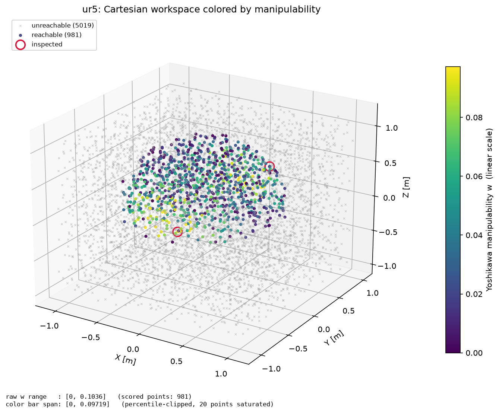
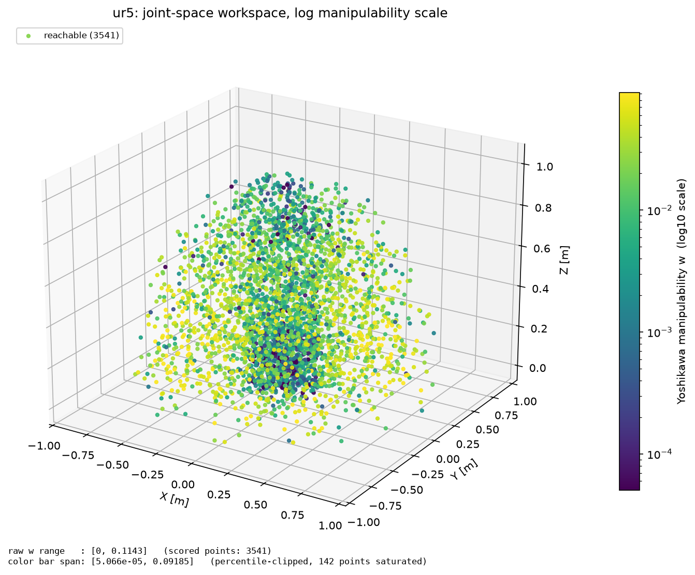
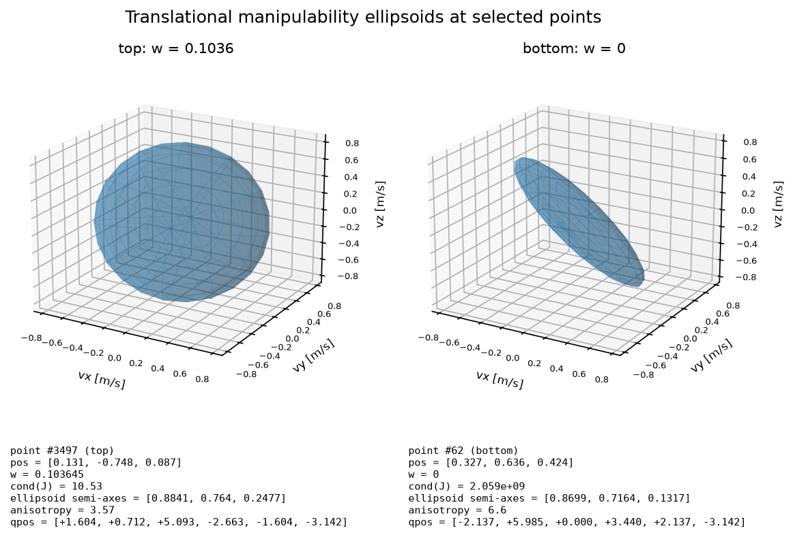

# Workspace Analyzer Visualizers

The visualizers module provides visualization tools for analyzing robotic workspace data in 3D space.

## Table of Contents

- [Overview](#overview)
- [Visualization Types](#visualization-types)
- [Usage Examples](#usage-examples)
- [Backend Support](#backend-support)
- [Quick Reference](#quick-reference)

## Overview

The visualizers module enables:

- **Workspace reachability visualization** with multiple rendering styles
- **Manipulability-colored workspaces** with robust/log normalization, a visible
  color bar and per-point inspection
- **3D point cloud, voxel, sphere, and coordinate axis representations**
- **Multiple backends**: Open3D, Matplotlib, and simulation environments
- **Factory pattern** for easy visualizer creation

## Visualization Types

### 1. Point Cloud Visualizer ✅

Fast rendering for large datasets.

```python
from embodichain.lab.sim.motion.workspace.visualizers import PointCloudVisualizer

visualizer = PointCloudVisualizer(backend='open3d', point_size=2.0)
```

**Best for**: Large point sets (>10k points), fast rendering

### 2. Voxel Visualizer ✅

Volumetric representation for occupancy maps.

```python
from embodichain.lab.sim.motion.workspace.visualizers import VoxelVisualizer

visualizer = VoxelVisualizer(backend='open3d', voxel_size=0.01)
```

**Best for**: Occupancy grids, collision detection

### 3. Sphere Visualizer ✅

Smooth visualization for reachability zones.

```python
from embodichain.lab.sim.motion.workspace.visualizers import SphereVisualizer

visualizer = SphereVisualizer(backend='open3d', sphere_radius=0.005)
```

**Best for**: Publication-quality figures, smooth appearance

### 4. Axis Visualizer ✅

Coordinate frame visualization for poses and transformations.

```python
from embodichain.lab.sim.motion.workspace.visualizers import AxisVisualizer

visualizer = AxisVisualizer(backend='sim_manager', sim_manager=sim, axis_length=0.15)
```

**Best for**: Robot poses, end-effector frames, coordinate system visualization

### 5. Manipulability Visualizer ✅

Colors reachable points by their Yoshikawa manipulability `w`, keeps unreachable
points visually distinct, and draws a color bar next to the raw score range.

```python
from embodichain.lab.sim.motion.workspace.visualizers import (
    ManipulabilityColorCfg,
    ManipulabilityVisualizer,
    align_manipulability_scores,
)

results = analyzer.analyze()          # MetricType.MANIPULABILITY enabled
point_set = align_manipulability_scores(results)

visualizer = ManipulabilityVisualizer(
    backend="matplotlib",
    color_cfg=ManipulabilityColorCfg(log_scale=True, percentile_clip=(2.0, 98.0)),
)
visualizer.visualize(point_set.points, point_set=point_set)
visualizer.save("workspace_manipulability.png")
```

**Best for**: Spotting well- and poorly-conditioned regions before choosing a
task placement or a grasp approach.

#### Score alignment

`align_manipulability_scores` resolves the per-mode contract of the analyzer so
a score is never drawn at the wrong point:

| Analysis mode | Scores align with | Unreachable points |
| --- | --- | --- |
| `JOINT_SPACE` | `workspace_points`, one-to-one | none — every sample is reachable |
| `CARTESIAN_SPACE` / `PLANE_SAMPLING` | `reachable_points`, one-to-one | scattered back onto `all_points` via `reachability_mask` when `retain_diagnostics=True` |

The returned `ManipulabilityPointSet` carries `points`, `scores` (`NaN` where a
point has no IK solution), `reachable_mask`, `score_indices` (the row of
`joint_configurations` each point maps to, `-1` when unreachable) and
`joint_configurations`. The helper refuses to scatter when
`all_points[reachability_mask]` does not reproduce `reachable_points`, so a
reordered result raises instead of rendering misleading colors.

#### Robust and log normalization

`normalize_manipulability` clips the color scale to a percentile window
(default `(2.0, 98.0)`) and optionally normalizes `log10(w)`. Both the raw score
range and the clipped color-bar span are reported, so clipping never hides the
true magnitudes:

```python
from embodichain.lab.sim.motion.workspace.visualizers import normalize_manipulability

norm = normalize_manipulability(scores, percentile_clip=(2.0, 98.0), log_scale=True)
norm.raw_range    # e.g. (0.0, 0.1143) - untouched min/max
norm.clip_range   # e.g. (5.07e-05, 0.0919) - color-bar ends, in raw w units
norm.num_clipped  # points saturated at either end
```

Degenerate inputs are explicit: empty or fully unreachable input yields `NaN`
ranges, and a single point or all-equal scores map to a flat `0.5` rather than
dividing by a zero span.



Reachable samples carry the colormap, the 5019 unreachable samples stay as small
grey crosses, and the footer separates the raw range `[0, 0.1036]` from the
percentile-clipped color-bar span. The two circled points are the ones inspected
below.



The joint-space path scores every FK sample. `w` spans four decades here, so a
linear scale would collapse the interior into one color; the log scale keeps the
near-singular shell (dark) separate from the dexterous mid-range.

#### Point inspection and ellipsoids

Ellipsoids are computed for a handful of points only — an explicit selection
plus the top-N and bottom-N scores — never for the whole cloud:

```python
from embodichain.lab.sim.motion.workspace.visualizers import (
    inspect_points,
    select_inspection_indices,
)

selection = select_inspection_indices(point_set.scores, top_k=1, bottom_k=1)
inspections = inspect_points(
    selection,
    points=point_set.points,
    scores=point_set.scores,
    jacobian_fn=lambda qpos: solver.get_jacobian(torch.as_tensor(qpos)),
    joint_configurations=point_set.joint_configurations,
    score_indices=point_set.score_indices,
)
visualizer.visualize_inspection(inspections)
```

`jacobian_fn` is called exactly once with the selected joint configurations, so
the Jacobian count equals `len(selection)`. Each `PointInspection` exposes `w`,
`condition_number`, `joint_configuration`, and the **translational** ellipsoid
semi-axes and principal directions, derived with
`select_jacobian_rows(J, "translational")`.



The best-conditioned point (left) has a nearly round ellipsoid — end-effector
velocity is available in every direction. The worst point (right) is a flat
pancake whose shortest semi-axis is 0.13 m/s against 0.87 m/s: motion along that
direction is almost unavailable. Note that `w = 0` with `cond(J) = 2.1e9` while
the *translational* ellipsoid remains three-dimensional — the rank deficiency of
that posture is in the rotational rows, which is exactly why the ellipsoid is
worth inspecting alongside the scalar score.

Reproduce all three figures with:

```bash
python scripts/tutorials/sim/workspace_manipulability_visualization.py \
    --robot ur5 --num_samples 6000 --output_dir docs/source/_static/tutorials
```

The tutorial is headless: it drives the robot through its kinematic chain and
solver only, so no renderer or physics backend is needed.

## Usage Examples

### Basic Usage

```python
import numpy as np
from embodichain.lab.sim.motion.workspace.visualizers import create_visualizer

# Generate workspace data
points = np.random.rand(1000, 3) * 2 - 1  # Random points in [-1, 1]³
colors = np.random.rand(1000, 3)  # Random colors

# Create and use visualizer
visualizer = create_visualizer('point_cloud', backend='open3d', point_size=3.0)
result = visualizer.visualize(points, colors)
visualizer.show()
```

When a `SimulationManager` is configured with the Viser backend, publish the
workspace as a persistent browser overlay:

```python
visualizer = PointCloudVisualizer(
    backend="viser",
    sim_manager=sim,
    control_part_name="arm",
    point_size=0.01,
)
visualizer.visualize(points, colors)
```

### Factory Pattern

```python
from embodichain.lab.sim.motion.workspace.visualizers import VisualizerFactory

factory = VisualizerFactory()
visualizer = factory.create_visualizer('voxel', backend='open3d', voxel_size=0.02)

# Create axis visualizer
axis_viz = factory.create_visualizer('axis', backend='sim_manager', sim_manager=sim)
```

## Backend Support

### Available Backends

- **`open3d`**: Interactive 3D visualization (requires `pip install open3d`)
- **`matplotlib`**: Static figures and plots (requires `pip install matplotlib`)
- **`sim_manager`**: Integration with simulation environment
- **`data`**: Returns processed data without visualization (headless mode)

## Quick Reference

**Available Visualizers**:

- **PointCloudVisualizer**: Fast rendering for large datasets
- **VoxelVisualizer**: Volumetric representation for occupancy maps
- **SphereVisualizer**: Smooth visualization for publication figures
- **AxisVisualizer**: Coordinate frame visualization for poses
- **ManipulabilityVisualizer**: Reachable points colored by manipulability, with a color bar and selected-point ellipsoids

**Common Parameters**:

- **PointCloud**: `backend`, `point_size`
- **Voxel**: `backend`, `voxel_size`
- **Sphere**: `backend`, `sphere_radius`, `sphere_resolution`
- **Axis**: `backend`, `axis_length`, `axis_size`, `sim_manager`
- **Manipulability**: `backend`, `color_cfg` (`colormap`, `percentile_clip`, `log_scale`, `unreachable_color`, `point_size`)

**Quick Creation**:

```python
from embodichain.lab.sim.motion.workspace.visualizers import create_visualizer
import numpy as np

# Create any visualizer
visualizer = create_visualizer('point_cloud', backend='open3d', point_size=2.0)
visualizer = create_visualizer('voxel', backend='open3d', voxel_size=0.01)
visualizer = create_visualizer('sphere', backend='open3d', sphere_radius=0.005)

# Create axis visualizer for coordinate frames
axis_viz = create_visualizer('axis', backend='sim_manager', sim_manager=sim, axis_length=0.05)

# Visualize coordinate frame at robot end-effector
pose = np.eye(4)
pose[:3, 3] = [1.0, 0.5, 1.2]  # Set position
axis_viz.visualize(pose, name_prefix="end_effector_frame")
axis_viz.show()
```
