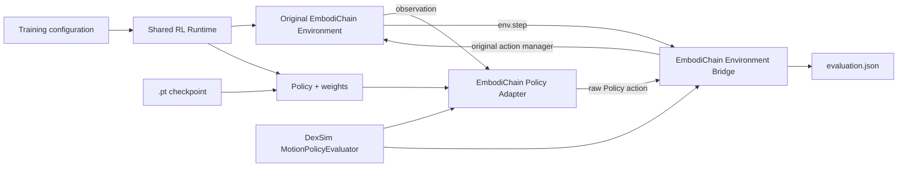
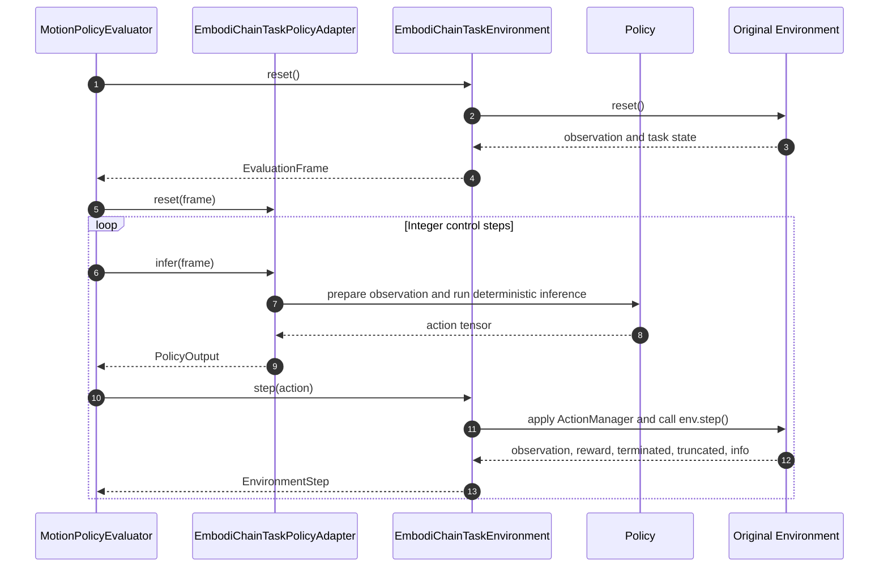
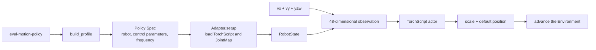

# Visual Motion Policy Evaluation

An EmbodiChain simulator RL task can open its trained `.pt` checkpoint in the
original task Environment and DexSim Viewer. Evaluation restores the Policy and
Environment from the training configuration, loads the checkpoint, and reuses
the task's observation, action processing, reset logic, objects, and termination
conditions. Lightweight learning tasks such as PointMass use the same command
for Headless evaluation.

## Training runs

`train-rl` writes a `[new] run-manifest.json` file to each output directory. The
manifest indexes the saved configurations and best/latest checkpoints:

```text
outputs/<experiment>_<timestamp>/
├── checkpoints/
│   └── policy_*.pt
├── configs/
│   ├── train.yaml
│   └── gym.yaml
└── run-manifest.json
```

A simulator RL task manifest has the following structure:

```json
{
  "schema_version": 1,
  "motion_profile": null,
  "configs": {
    "train": "configs/train.yaml",
    "gym": "configs/gym.yaml"
  },
  "checkpoints": {
    "best": "checkpoints/cart_pole_grpo_best.pt",
    "latest": "checkpoints/cart_pole_grpo_step_<steps>.pt"
  }
}
```

| Field | Description |
|---|---|
| `schema_version` | Manifest schema version; currently `1` |
| `motion_profile` | `null` for an EmbodiChain training run; an external Profile ID when configured |
| `configs.train` | Snapshot of the training configuration |
| `configs.gym` | Snapshot of the Gym configuration for a simulator task |
| `checkpoints.best` | Relative path to the best checkpoint; `null` when no best checkpoint was produced |
| `checkpoints.latest` | Relative path to the checkpoint saved at the end of training |

Every path is relative to the run directory. `--checkpoint best` selects the
best checkpoint and falls back to `latest` when the manifest value is `null`.
`--checkpoint latest` selects the latest checkpoint directly. A relative path
to another checkpoint in the run is also accepted. The resolved checkpoint is
recorded in `evaluation.json`.

Open the Viewer for a training run:

```bash
embodichain eval-motion-policy outputs/<experiment>_<timestamp> \
  --checkpoint best \
  --device cuda:0 \
  --sim-device gpu \
  --viewer
```

The Viewer runs until its window closes when neither `--control-steps` nor
`--duration` is set. A Headless run uses an exact integer number of control
steps:

```bash
embodichain eval-motion-policy outputs/<experiment>_<timestamp> \
  --checkpoint latest \
  --device cuda:0 \
  --sim-device gpu \
  --control-steps 500
```

## CartPole example

Train a Policy with the repository's CartPole GRPO configuration:

```bash
embodichain train-rl \
  --config embodichain_tasks/configs/agents/rl/basic/cart_pole/train_config_grpo.yaml
```

Pass the new run directory to the evaluation command:

```bash
embodichain eval-motion-policy \
  outputs/cart_pole_grpo_<timestamp> \
  --checkpoint best \
  --viewer
```

The CLI finds the `.pt`, training configuration, and Gym configuration through
`run-manifest.json`. It recreates the CartPole Environment with `num_envs=1`,
rebuilds the `actor_only` Policy, loads its weights, and opens the Viewer. The
report is written under `<run>/evaluations/`.

## Existing checkpoints

For a training output created before run manifests were introduced, pass the
checkpoint and its training configuration explicitly:

```bash
embodichain eval-motion-policy \
  --checkpoint /path/to/policy.pt \
  --config /path/to/train.yaml \
  --gym-config /path/to/gym.yaml \
  --device cuda:0 \
  --sim-device gpu \
  --viewer
```

When `trainer.gym_config` already points to the task configuration,
`--gym-config` can be omitted.

## Execution pipeline



Each control cycle follows this sequence:



| Component | Responsibility |
|---|---|
| `embodichain.learning.rl.runtime` `[new]` | Builds the Environment and Policy shared by training and evaluation |
| `embodichain.learning.rl.evaluation` `[updated]` | Provides shared observation flattening, deterministic inference, and action conversion |
| `EmbodiChainTaskPolicyAdapter` `[new]` | Reads the original observation from the frame, calls the shared inference path, and returns the raw action |
| `EmbodiChainTaskEnvironment` `[new]` | Calls the original Environment reset, action manager, and step methods, then exposes task results |
| `MotionPolicyEvaluator` | Schedules the Adapter and Environment, counts control steps, applies termination behavior, and updates the Viewer |

This path loads `.pt` checkpoints through their training-time PyTorch Policy
definition. A standalone DexSim Policy project can use ONNX through its own
Adapter.

## Viewer and Headless modes

A simulator RL training run uses `trainer.gym_config` to recreate its original
Environment with `num_envs=1`. An external Policy uses a Motion Profile to
provide the robot assets, Adapter, and Environment. The following Viewer paths
have been validated:

| Input | Viewer scene | Validated tasks |
|---|---|---|
| EmbodiChain training run | Robot, task objects, and scene restored from the Gym configuration | CartPole GRPO, PushCube PPO |
| External Policy | Robot and scene created by the Motion Profile | ANYmal-C velocity TorchScript `.pt` |

A lightweight learning task uses `trainer.learning_env` to recreate its tensor
environment for Headless evaluation. PointMass stores its positions,
velocities, targets, and obstacles in PyTorch tensors, so its results are
reported through terminal metrics and `evaluation.json`.

### Policy loading

Evaluation rebuilds the Policy from its `policy` configuration, loads the Policy
state dictionary from the checkpoint, and runs deterministic inference. PPO,
GRPO, and APG select the training update algorithm; evaluation follows the
configured Policy type and weights.

| Training algorithm | Policy type | Viewer validation | Headless validation |
|---|---|---|---|
| PPO | `actor_critic` | PushCube | PushCube, PointMass |
| GRPO | `actor_only` | CartPole | CartPole |
| APG | `actor_only` | — | PointMass |

A custom EmbodiChain Policy registers its model builder and keeps the matching
network configuration in the training run. An external checkpoint uses a Motion
Profile to describe its model, robot assets, observation, and action processing.
A robot-state Policy can use the Motion Policy Kit default Environment. A Policy
with task objects supplies a complete task Environment. For example,
`UR5CubeResetEnvironment` creates a UR5, table, cube, and target, while
`AllegroReorientCubeEnvironment` creates an Allegro Hand, an object cube, and a
target pose.

## Termination and duration

| Option | Behavior |
|---|---|
| `--episodes N` | Completes `N` task episodes |
| `--control-steps N` | Executes exactly `N` Policy actions |
| `--duration SECONDS` | Converts the duration to an integer number of Policy control steps before execution |
| `--termination-behavior auto_reset` | Restores the original Environment after termination; used by the Viewer by default |
| `--termination-behavior pause` | Keeps the terminal task state visible |

`--control-steps` and `--duration` are mutually exclusive. Simulation time is
calculated from integer step counters using `physics_dt` and
`sim_steps_per_control`.

## Rendering

The default renderer is `hybrid`:

```bash
embodichain eval-motion-policy <run> --viewer --renderer hybrid
```

For an EmbodiChain training task, the original Environment provides its robot,
task objects, and scene parameters. An external Motion Profile can use
`--scene-config standard`, `classic`, or a custom YAML file to configure the
ground, lighting, and post-processing.

## Output

Each run writes an `evaluation.json` report containing:

- run, checkpoint, and configuration paths;
- inference and simulation devices, renderer, versions, and commits;
- termination reason, integer simulation steps, and control steps;
- episode reward, episode length, success, and task metrics.

A training run writes reports under `<run>/evaluations/`. An explicit
checkpoint writes them under the `evaluations/` directory next to that
checkpoint. `--output` selects another output directory.

## External Policy example

`examples/learning/motion_policy_evaluation/` contains a runnable ANYmal-C
velocity example. Its public TorchScript `.pt` accepts `vx`, `vy`, and `yaw`,
uses a 48-dimensional observation, and outputs 12 joint actions. The example
includes resource preparation, a Motion Profile, a complete Adapter, tests, and
run commands.

```text
examples/learning/motion_policy_evaluation/
├── README.md
├── prepare_resources.py
├── eval_policy.py
└── anymal_c/
    ├── __init__.py
    └── profile.py
```

Prepare the upstream model and robot resources:

```bash
python examples/learning/motion_policy_evaluation/prepare_resources.py
```

The script fetches `mjw_anymal.pt`, its Policy configuration and license, and
the ANYmal-C URDF and meshes from newton-assets commit
`261cd1f429619d8ef4f546bd788ab9dea906b5e1`. It verifies the expected resource
digests and prints each download and Git operation. Re-running the command
continues an existing checkout. The resulting cache has this structure:

```text
~/.cache/embodichain/examples/anymal_c_velocity/
└── upstream/
    └── anybotics_anymal_c/
        ├── rl_policies/
        │   ├── mjw_anymal.pt
        │   └── anymal.yaml
        ├── urdf/anymal.urdf
        └── meshes/...
```

Open the Viewer:

```bash
python examples/learning/motion_policy_evaluation/eval_policy.py \
  --viewer \
  --renderer hybrid
```

`eval_policy.py` imports the adjacent `anymal_c/profile.py`, registers its
Profile in the current process, and fills the checkpoint and robot resource
paths from the default cache. Run it directly from the repository root. Options
such as `--device`, `--sim-device`, `--control-steps`, and `--scene-config` are
forwarded to EmbodiChain.

Use W/S to adjust `vx`, A/D to adjust `vy`, Q/E to adjust `yaw`, M to zero all
three commands, and R to reset the task.

The external Policy data path is:



The Adapter follows the upstream Policy definition when concatenating body
linear velocity, body angular velocity, projected gravity, the three-dimensional
command, joint position, joint velocity, and previous action. The model contains
its observation normalizer. The actor output is converted to joint position
targets with `default_position + 0.5 * action`. Simulation runs at 200 Hz, and
the Policy runs every four simulation steps at 50 Hz.

To integrate another external Policy, copy this example and replace:

1. the model and robot resource sources, fixed revisions, paths, and digests;
2. the initial pose, joint control parameters, and control frequency in `build_profile()`;
3. model loading and joint order in `Adapter.setup()`;
4. observation construction, normalization, network forward pass, and action processing in `Adapter.infer()`;
5. `PROFILE_ID` and the Profile name used by `eval_policy.py`.

Task data can be resolved to local paths through Policy Spec `resources`, or an
Adapter can call an existing project reader from `__init__()` or `setup()`.
Python code can provide changing runtime data through `EvaluationFrame.inputs`.

The DexSim Motion Policy Kit documentation describes the default Environment,
task Environment interface, Adapter API, task resources, and Python API.

## Command summary

| Scenario | Command |
|---|---|
| New training run | `embodichain eval-motion-policy <run> --checkpoint best --viewer` |
| Existing `.pt` | `embodichain eval-motion-policy --checkpoint <pt> --config <train> --viewer` |
| Headless smoke test | `embodichain eval-motion-policy <run> --control-steps 20` |
| External ANYmal-C `.pt` | `python examples/learning/motion_policy_evaluation/eval_policy.py --viewer` |
