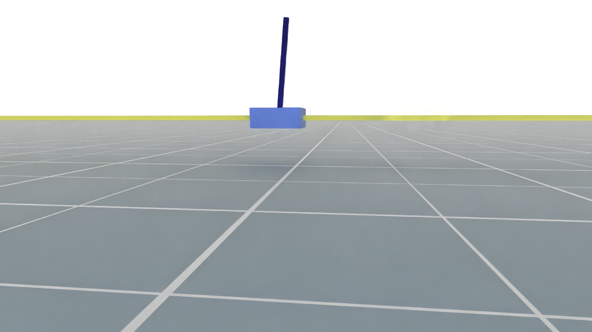
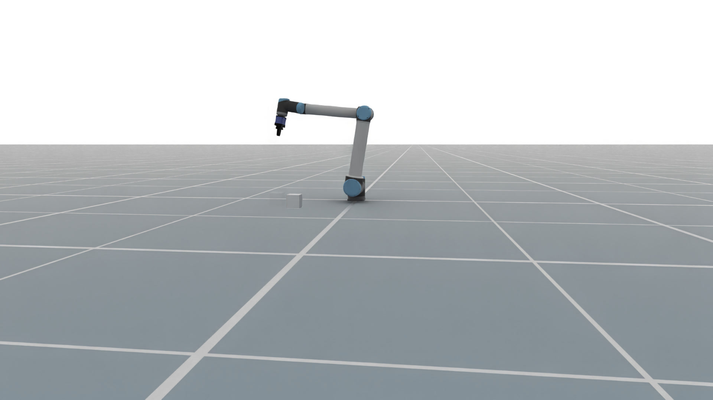
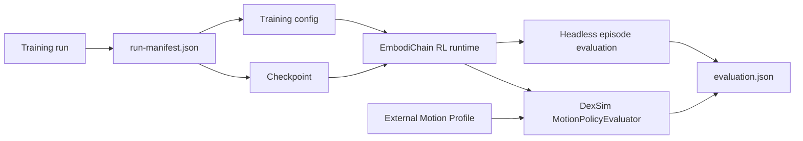
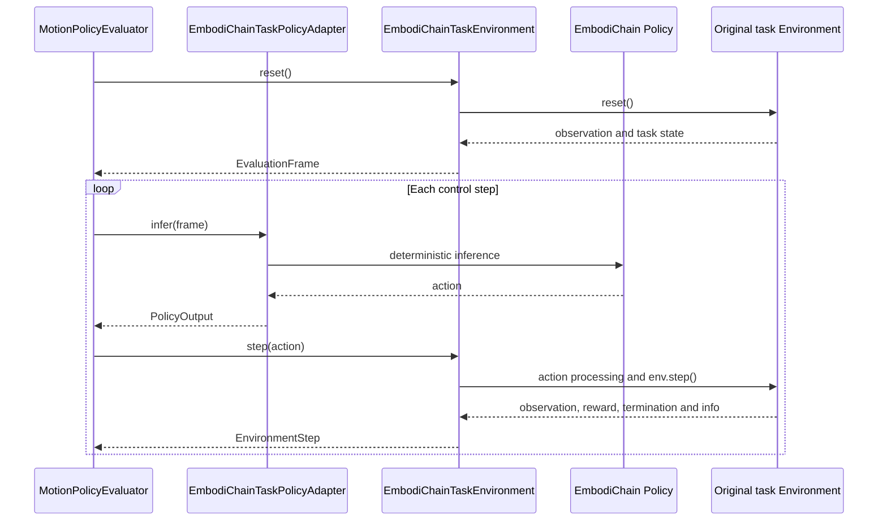

# Policy Evaluation

`embodichain eval-policy` evaluates a saved EmbodiChain policy after training.
It reconstructs the policy and environment from the training configuration,
loads the selected checkpoint, and writes a standalone evaluation report.

The command runs Headless by default. Add `--viewer` to open the original
simulator task in the DexSim Viewer.

## Evaluation and qualification

| Stage | Purpose | Evidence |
|---|---|---|
| Training-time evaluation | Measure learning progress when `trainer.enable_eval` is enabled | Periodic completed-episode metrics in training logs |
| Saved-checkpoint evaluation | Reload a particular policy and evaluate deterministic actions in the selected task | `evaluation.json` with checkpoint/config paths, seed, episode count and metrics |
| Qualification | Decide whether that checkpoint meets the requirements of a task and deployment | Recorded criteria, thresholds, measurements and a decision with supporting evidence |

All seven bundled locomotion tasks set `enable_eval: false` in their PPO
configurations. They need an explicit post-training evaluation. The current
`eval-policy` command reports measurements; it does not apply qualification
thresholds or write a pass/fail decision.

## Training output

`train-rl` records the files required by a later evaluation:

```text
outputs/<experiment>_<timestamp>/
├── checkpoints/
│   └── policy_*.pt
├── configs/
│   ├── train.yaml
│   └── gym.yaml
├── logs/
├── videos/
│   ├── train/
│   └── eval/
└── run-manifest.json
```

`configs/gym.yaml` is present for simulator tasks. The first evaluation adds:

```text
evaluations/
└── <timestamp>-policy/
    └── evaluation.json
```

`run-manifest.json` connects the run directory to its configuration snapshots
and checkpoints:

```json
{
  "schema_version": 1,
  "configs": {
    "train": "configs/train.yaml",
    "gym": "configs/gym.yaml"
  },
  "checkpoints": {
    "best": "checkpoints/cart_pole_grpo_best.pt",
    "latest": "checkpoints/cart_pole_grpo_step_4096.pt"
  }
}
```

All paths in the manifest are relative to the run directory. `best` is `null`
when training did not select a best checkpoint.

## Evaluate a training run

The shortest command selects `latest` and runs the configured number of
Headless evaluation episodes:

```bash
embodichain eval-policy outputs/<experiment>_<timestamp>
```

Select the best checkpoint and override the episode count:

```bash
embodichain eval-policy outputs/<experiment>_<timestamp> \
  --checkpoint best \
  --episodes 10
```

Open the original simulator task in the Viewer:

```bash
embodichain eval-policy outputs/<experiment>_<timestamp> \
  --checkpoint best \
  --viewer \
  --renderer hybrid \
  --device cuda:0 \
  --sim-device gpu
```

The Viewer uses one environment and keeps running until the window closes. Use
`--episodes`, `--control-steps`, or `--duration` to select another stopping
condition. `--renderer` accepts `hybrid`, `fast-rt`, and `rt`.
Tasks exposing `set_velocity_command()` and `velocity_command_bounds()` also
accept `--command vx vy yaw_rate`; use `--keymap wasd` or `--keymap arrows`
for interactive command changes.

The following frames were captured from Viewer evaluations that loaded trained
checkpoints with `--device cuda:0 --sim-device gpu --renderer hybrid`:

| CartPole policy evaluation | PushCube policy evaluation |
|---|---|
|  |  |

For a checkpoint created before `run-manifest.json` was introduced, provide
its training configuration directly:

```bash
embodichain eval-policy \
  --checkpoint /path/to/policy.pt \
  --config /path/to/train.yaml \
  --gym-config /path/to/gym.yaml \
  --viewer
```

`--gym-config` can be omitted when the training configuration already refers to
the task configuration.

## Locomotion Viewer camera and recording

The bundled ANYmal-C, G1, Go1, Go2, H1_2 and MicroDuck flat velocity tasks
start with a close rear-quarter view sized for each robot, on both Default
and Newton backends. For example, use the original run's snapshots and FastRT:

```bash
embodichain eval-policy /path/to/locomotion-run \
  --viewer --renderer fast-rt \
  --device cuda:0 --sim-device gpu \
  --command 0.3 0 0 --duration 20
```

On reset, framing follows the robot's initial heading. During walking, the
camera follows only world X-Y translation: its height and orientation stay
fixed as the body bobs or turns. Orbit and zoom adjustments are preserved.
Press `T` to enter free view with panning; press it again to recenter on the
robot using the task's preset. `Backspace` and automatic episode resets restore
the preset and enable tracking. Tasks without a camera preset retain their
existing view.

Click inside the Viewer before using its keys. Press `R` to start or stop
EmbodiChain's existing window recorder. By default, clips are written to
`outputs/videos/` under the working directory. Programmatic callers can use
`env.unwrapped.sim.start_window_record(save_path="walk.mp4", fps=20)` and
`stop_window_record()`. The default recorder reads the live window camera,
so it captures tracking and manual camera adjustments. A supplied `fixed_pose`,
`look_at` or `pose_provider` overrides that camera source. Keep clips within the
configured recording memory limit, or adjust `WindowRecordCfg` for longer clips.

Custom tasks can expose `policy_viewer_camera_cfg: PolicyViewerCameraCfg` and
`get_policy_viewer_target_pose() -> np.ndarray`, returning a copied world root
pose `(x, y, z, qx, qy, qz, qw)`. Import the config from
`embodichain.learning.rl.policy_evaluation`. Its `eye_offset` is relative to the
look-at point in the initial heading frame; `target_height` is a fixed world Z
for flat scenes. These hooks affect native Viewer evaluation only; training and
headless evaluation keep their original behavior.

## Headless locomotion checkpoint example

Use a checkpoint trained with the Go2 Default deployment's
`embodichain_tasks/configs/tasks/locomotion/velocity/go2_flat/agents/ppo.yaml`.
Set `go2_run` to that run's directory and `go2_checkpoint` to the specific saved
checkpoint to assess. Keep the training and environment snapshots from the same
run; a Newton checkpoint uses the snapshots produced by `agents/ppo.newton.yaml`.

```bash
go2_run=/absolute/path/to/go2-training-run
go2_checkpoint="$go2_run/checkpoints/selected-policy.pt"

embodichain eval-policy \
  --checkpoint "$go2_checkpoint" \
  --config "$go2_run/configs/train.yaml" \
  --gym-config "$go2_run/configs/gym.yaml" \
  --seed 42 \
  --episodes 32 \
  --num-envs 16 \
  --device cuda:0 \
  --sim-device gpu \
  --output outputs/go2-default-evaluation
```

This runs headless and writes
`outputs/go2-default-evaluation/<timestamp>-policy/evaluation.json`. The explicit
paths also work for runs without `run-manifest.json`. The task configuration
selects the backend, command distribution, disturbances and episode horizon;
preserve those settings when comparing checkpoints. Keep Default and Newton
results separate. The seed makes the evaluation inputs repeatable within the
chosen software and device setup.

Locomotion policy bundles created before the action contract migration may
still contain `DefaultJointPositionTerm` in their saved environment snapshot.
The evaluator maps that legacy implementation name to the stable
`joint_position.default_offset@1` contract. New task configurations persist
the contract ID directly, so action semantics do not depend on an
`ActionManager` Python class name.

Check `inputs.checkpoint`, `inputs.configs`, `inputs.seed`, `inputs.num_envs`
and `result.episodes` before interpreting `result.metrics`:

| Metric | Meaning in native headless evaluation |
|---|---|
| `eval/avg_reward` | Mean sum of rewards over the requested completed episodes; compare under the same reward configuration |
| `eval/avg_length` | Mean episode length in control steps; compare with the configured `max_episode_steps` |
| `eval/success_rate` | Mean terminal success signal; **not applicable** to the seven locomotion tasks, which return false by design |
| `eval/metrics/linear_velocity_error` | Mean terminal planar velocity error norm, in m/s, for velocity tasks |
| `eval/metrics/yaw_rate_error` | Mean terminal absolute yaw-rate error, in rad/s, for velocity tasks |
| `eval/metrics/root_height` | Mean terminal root height, in m |
| `eval/metrics/maximum_illegal_contact_force` | Where emitted, mean of the task's maximum contact force at each episode's final step, in N |
| `eval/metrics/progress` | Humanoid Run's mean terminal potential difference; this is a per-step progress reward input, not total distance traveled |

`eval/metrics/*` samples scalar task metrics **at episode completion**, then
averages across episodes. It does not average each metric over the trajectory.
The native headless report stores aggregate metrics, without individual episode
traces or termination reasons. Locomotion's `eval/success_rate: 0.0` should be
recorded as **not applicable** in a qualification assessment. When a task emits
no success field at all, the report contains `null` for this metric.

## Locomotion qualification

Choose acceptance bounds before evaluating a checkpoint. Record the task,
deployment, checkpoint, command distribution, disturbances, episode horizon,
seeds, episode count and software versions alongside those bounds. Backend and
robot differences require separate criteria and results.

| Task family | Criteria to assess | Evidence beyond the aggregate report |
|---|---|---|
| G1 and H1_2 velocity | Planar/yaw tracking within the chosen tolerances, upright posture and acceptable survival under commands and pushes | Trajectory tracking errors, tilt/fall counts, timeout fraction and posture/height traces |
| Go1 and Go2 velocity | Tracking tolerances, survival and stable stepping without sustained foot dragging | Tracking traces, tilt/fall counts, timeout fraction and foot-clearance/contact observations |
| ANYmal-C velocity | Tracking tolerances, survival, base-contact failures and undesired thigh contacts | Tracking traces, base/thigh contact traces and termination reasons |
| MicroDuck velocity | Tracking tolerances, survival, trunk clearance and avoidance of body contact | Tracking/height/tilt traces, body-contact events and termination reasons |
| Humanoid Run | Sustained forward progress toward the target, upright torso and acceptable survival | Forward displacement over time, torso-height traces and fall/timeout counts |

For tracking, specify the command frame, time window, error statistic and bound.
For survival, count timeouts and failures separately; mean episode length alone
does not give the fraction that reached the horizon. Derive stability evidence
from recorded trajectories or an instrumented rollout; Viewer playback can help
inspect posture and contact behavior. The existing task termination limits
describe reset conditions, while qualification bounds describe the required
policy quality.

Record each criterion's threshold, measured value and evidence location, then
state pass, fail or unavailable. Missing trajectory or failure-count evidence
leaves the associated criterion unavailable. Training completion, increasing
reward and a checkpoint loading successfully establish different facts from
meeting these criteria. Longer training is justified by learning curves and
repeat evaluations, rather than a fixed iteration count alone.

The catalog exposes Default/Newton configurations and their PPO training routes.
Its qualification field remains unavailable until suitable evidence is attached.
Raw `evaluation.json` uses an RL metrics schema; it should not be attached as an
ordered-placement physical validation report. An automated locomotion validator
would need explicit thresholds and criterion results in a compatible report
schema.

## Execution paths



Headless evaluation calls the existing `evaluate_episodes()` path. Viewer
evaluation keeps the task's original observation, action processing, reset,
reward, termination, objects, and sensors:



| Input | Headless | Viewer |
|---|---:|---:|
| EmbodiChain lightweight RL environment | Yes | — |
| EmbodiChain simulator RL environment | Yes | Yes |
| Registered external Motion Profile | Yes | Yes |

Policy reconstruction follows the model definition stored in the training
configuration.

## Viewer controls

| Key | Action |
|---|---|
| `Backspace` | Reset the task and camera framing |
| `W/A/S/D + Q/E` or arrow keys + `U/O` | Change a native velocity command when the task exposes one |
| `M` | Zero a supported velocity command |
| `H` | Print the active velocity key bindings |
| `T` | Switch between tracking and free camera modes when the Environment provides a tracking target |
| `R` | Start or stop recording |
| `Esc` | Close the Viewer |

While tracking is active, drag with the left mouse button to orbit and use the
mouse wheel to zoom.

## External policy example

For ONNX-backed Motion Profiles, install the shared
[`policy-deploy` extra](../quick_start/install.md#optional-policy-deployment-policy-deploy)
before evaluation.

For an already-authored DexSim Policy Spec, prefer the native
`dexsim policy validate` and `dexsim policy run` commands. EmbodiChain's
`--profile` path is intended for provider code that constructs a Policy Spec
from an EmbodiChain checkpoint/configuration and needs the same
`evaluation.json` reporting as native EmbodiChain policies.

The repository includes a concrete ANYmal-C velocity example under
`examples/learning/policy_evaluation/`. It prepares a public TorchScript
checkpoint and robot assets, registers an adjacent Motion Profile, and forwards
the remaining arguments to `eval-policy`.

```bash
python examples/learning/policy_evaluation/prepare_resources.py
python examples/learning/policy_evaluation/eval_policy.py \
  --viewer \
  --renderer hybrid \
  --sim-device gpu
```

Use W/S for `vx`, A/D for `vy`, Q/E for `yaw`, and M to zero the command. See
the [example README](https://github.com/DexForce/EmbodiChain/tree/main/examples/learning/policy_evaluation)
for the resource layout, observation construction, action conversion, and
Profile implementation.

This example tracks the robot root in the ground plane. Press `T` to switch
between tracking and free view.

## Evaluation report

`evaluation.json` records the selected checkpoint and configs, task and device
information, episode results, and aggregated metrics. Reports are written to
`<run>/evaluations/` for a training run and next to an explicit checkpoint by
default. Use `--output` to select another parent directory.
