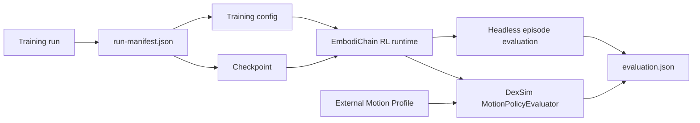
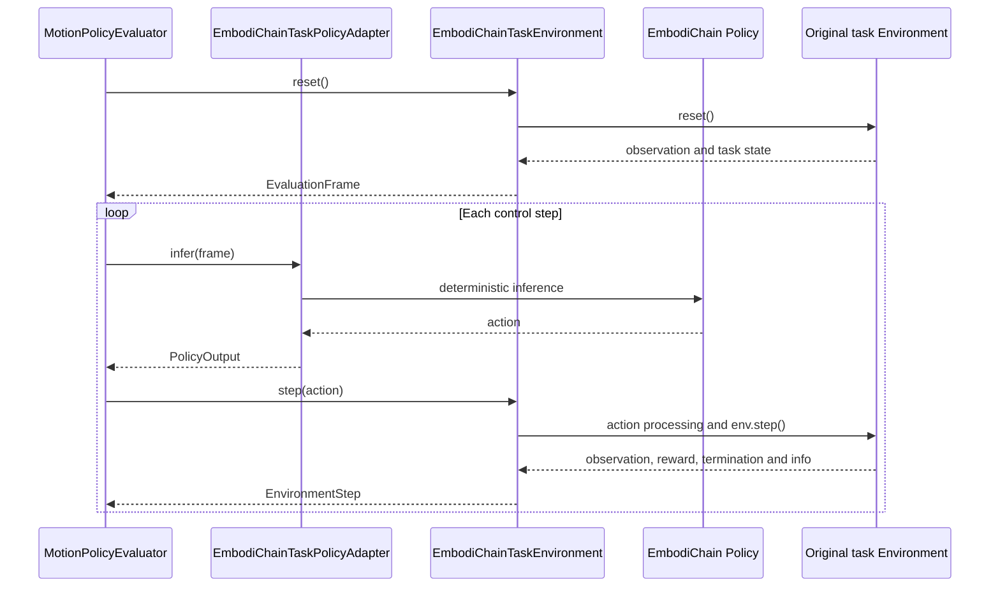

# Policy Evaluation

`embodichain eval-policy` evaluates a saved EmbodiChain policy after training.
It reconstructs the policy and environment from the training configuration,
loads the selected checkpoint, and writes a standalone evaluation report.

The command runs Headless by default. Add `--viewer` to open the original
simulator task in the DexSim Viewer.

## Training output

`train-rl` records the files required by a later evaluation:

```text
outputs/<experiment>_<timestamp>/
├── checkpoints/
│   └── policy_*.pt
├── configs/
│   ├── train.yaml
│   └── gym.yaml
├── logs/
├── videos/
│   ├── train/
│   └── eval/
└── run-manifest.json
```

`configs/gym.yaml` is present for simulator tasks. The first evaluation adds:

```text
evaluations/
└── <timestamp>-policy/
    └── evaluation.json
```

`run-manifest.json` connects the run directory to its configuration snapshots
and checkpoints:

```json
{
  "schema_version": 1,
  "configs": {
    "train": "configs/train.yaml",
    "gym": "configs/gym.yaml"
  },
  "checkpoints": {
    "best": "checkpoints/cart_pole_grpo_best.pt",
    "latest": "checkpoints/cart_pole_grpo_step_4096.pt"
  }
}
```

All paths in the manifest are relative to the run directory. `best` is `null`
when training did not select a best checkpoint.

## Evaluate a training run

The shortest command selects `latest` and runs the configured number of
Headless evaluation episodes:

```bash
embodichain eval-policy outputs/<experiment>_<timestamp>
```

Select the best checkpoint and override the episode count:

```bash
embodichain eval-policy outputs/<experiment>_<timestamp> \
  --checkpoint best \
  --episodes 10
```

Open the original simulator task in the Viewer:

```bash
embodichain eval-policy outputs/<experiment>_<timestamp> \
  --checkpoint best \
  --viewer \
  --renderer hybrid \
  --device cuda:0 \
  --sim-device gpu
```

The Viewer uses one environment and keeps running until the window closes. Use
`--episodes`, `--control-steps`, or `--duration` to select another stopping
condition. `--renderer` accepts `hybrid`, `fast-rt`, and `offline-rt`.

For a checkpoint created before `run-manifest.json` was introduced, provide
its training configuration directly:

```bash
embodichain eval-policy \
  --checkpoint /path/to/policy.pt \
  --config /path/to/train.yaml \
  --gym-config /path/to/gym.yaml \
  --viewer
```

`--gym-config` can be omitted when the training configuration already refers to
the task configuration.

## Execution paths



Headless evaluation calls the existing `evaluate_episodes()` path. Viewer
evaluation keeps the task's original observation, action processing, reset,
reward, termination, objects, and sensors:



| Input | Headless | Viewer |
|---|---:|---:|
| EmbodiChain lightweight RL environment | Yes | — |
| EmbodiChain simulator RL environment | Yes | Yes |
| Registered external Motion Profile | Yes | Yes |

Policy reconstruction follows the model definition stored in the training
configuration. The Viewer path has been validated with CartPole GRPO and
PushCube PPO checkpoints.

## Viewer controls

| Key | Action |
|---|---|
| `Backspace` | Reset the task and camera framing |
| `T` | Switch between tracking and free camera modes when the Environment provides a tracking target |
| `R` | Start or stop recording |
| `Esc` | Close the Viewer |

While tracking is active, drag with the left mouse button to orbit and use the
mouse wheel to zoom.

## External policy example

The repository includes a concrete ANYmal-C velocity example under
`examples/learning/policy_evaluation/`. It prepares a public TorchScript
checkpoint and robot assets, registers an adjacent Motion Profile, and forwards
the remaining arguments to `eval-policy`.

```bash
python examples/learning/policy_evaluation/prepare_resources.py
python examples/learning/policy_evaluation/eval_policy.py \
  --viewer \
  --renderer hybrid \
  --sim-device gpu
```

Use W/S for `vx`, A/D for `vy`, Q/E for `yaw`, and M to zero the command. See
the [example README](https://github.com/DexForce/EmbodiChain/tree/main/examples/learning/policy_evaluation)
for the resource layout, observation construction, action conversion, and
Profile implementation.

This example tracks the robot root in the ground plane. Press `T` to switch
between tracking and free view.

## Evaluation report

`evaluation.json` records the selected checkpoint and configs, task and device
information, episode results, and aggregated metrics. Reports are written to
`<run>/evaluations/` for a training run and next to an explicit checkpoint by
default. Use `--output` to select another parent directory.
