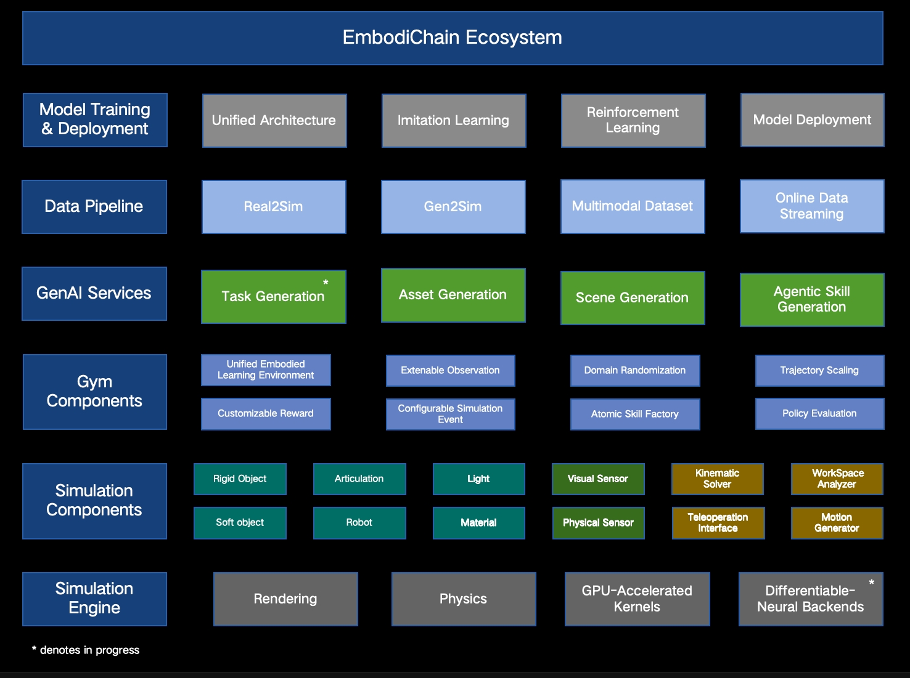

.. EmbodiChain documentation master file, created by
   sphinx-quickstart on Tue Nov 19 11:00:25 2024.
   You can adapt this file completely to your liking, but it should at least
   contain the root `toctree` directive.

EmbodiChain
======================================

.. image:: ../../assets/imgs/teaser.jpg
   :alt: teaser

---

EmbodiChain is an end-to-end, GPU-accelerated framework for Embodied AI. It streamlines research and development by unifying high-performance simulation, real-to-sim data pipelines, modular model architectures, and efficient training workflows. This integration enables rapid experimentation, seamless deployment of intelligent agents, and effective Sim2Real transfer for real-world robotic systems.

.. NOTE::
   EmbodiChain is in Alpha and under active development:

   * More features will be continually added in the coming months. You can find more details in the `roadmap <https://dexforce.github.io/EmbodiChain/resources/roadmap.html>`_.
   * Since this is an early release, we welcome feedback (bug reports, feature requests, etc.) via GitHub Issues.

Key Features
------------

* 🚀 **High-Fidelity GPU Simulation**: Realistic physics for rigid & deformable objects, advanced ray-traced sensors, all GPU-accelerated for high-throughput batch simulation.
* 🤖 **Unified Robot Learning Environment**: Standardized interfaces for Imitation Learning, Reinforcement Learning, and more.
* 📊 **Scalable Data Pipeline**: Automated data collection, efficient processing, and large-scale generation for model training.
* ⚡ **Efficient Training & Evaluation**: Online data streaming, parallel environment rollouts, and modern training paradigms.
* 🧩 **Modular & Extensible**: Easily integrate new robots, environments, and learning algorithms.

The figure below illustrates the overall architecture of EmbodiChain:

Getting Started
---------------

To get started with EmbodiChain, follow these steps:

* `Installation Guide <https://dexforce.github.io/EmbodiChain/quick_start/install.html>`_
* `Quick Start Tutorial <https://dexforce.github.io/EmbodiChain/tutorial/index.html>`_
* `API Reference <https://dexforce.github.io/EmbodiChain/api_reference/index.html>`_

Citation
--------

If you find EmbodiChain helpful for your research, please consider citing our work:

.. code-block:: bibtex

   @misc{EmbodiChain,
     author = {EmbodiChain Developers},
     title = {EmbodiChain: An end-to-end, GPU-accelerated, and modular platform for building generalized Embodied Intelligence.},
     month = {November},
     year = {2025},
     url = {https://github.com/DexForce/EmbodiChain}
   }

.. code-block:: bibtex

   @misc{GS-World,
      author = {Guiliang Liu and Yueci Deng and Zhen Liu and Kui Jia},
      title = {GS-World: An Efficient, Engine-driven Learning Paradigm for Pursuing Embodied Intelligence using World
         Models of Generative Simulation},
      month = {October},
      year = {2025},
      journal = {TechRxiv}
   }

.. code-block:: bibtex

   @inproceedings{Sim2RealVLA,
      title = {Sim2Real {VLA}: Zero-Shot Generalization of Synthesized Skills to Realistic Manipulation},
      author = {Runyi Zhao, Sheng Xu, Ruixing Jin, Yueci Deng, Yunxin Tai, Kui Jia, Guiliang Liu},
      booktitle = {The Fourteenth International Conference on Learning Representations, ICLR},
      year = {2026},
      url = {https://openreview.net/forum?id=H4SyKHjd4c}
   }

