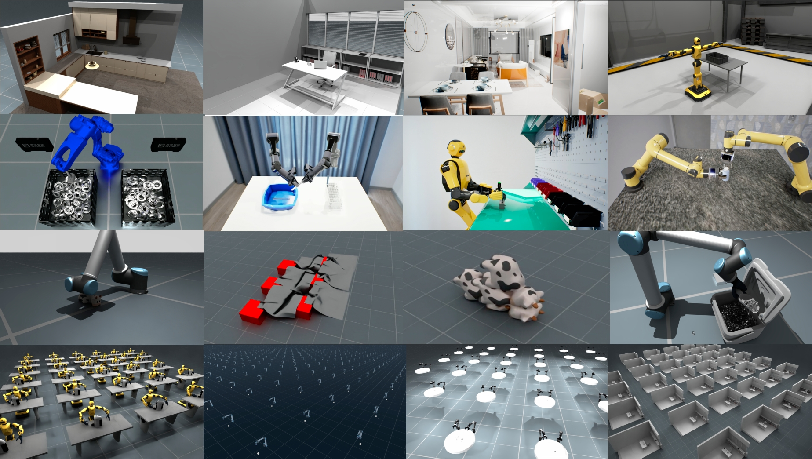
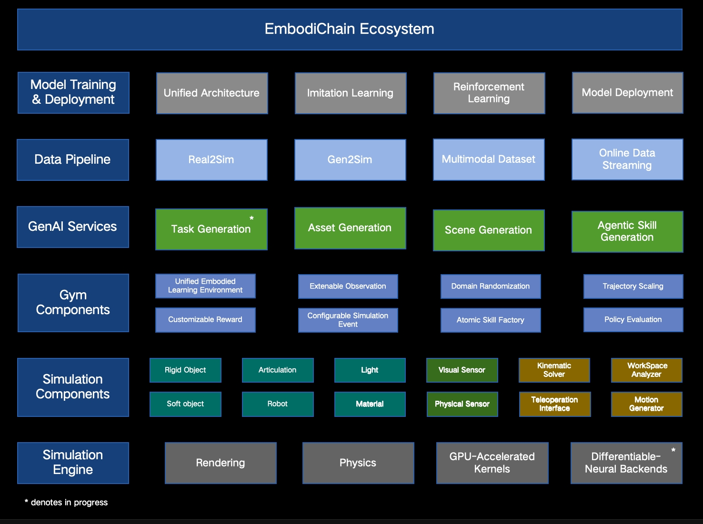

EmbodiChain
===========

EmbodiChain is an end-to-end, GPU-accelerated framework for Embodied AI.
It streamlines research and development by unifying high-performance
simulation, automated generative data pipelines, modular model
architectures, and efficient training workflows. This integration
enables rapid experimentation, seamless deployment of intelligent
agents, and effective Sim2Real transfer for real-world robotic systems.

.. NOTE::
   EmbodiChain is in Alpha and under active development: * More
   features will be continually added in the coming months. You can find
   more details in the
   `roadmap <https://dexforce.github.io/EmbodiChain/main/resources/roadmap.html>`__.
   * Since this is an early release, we welcome feedback (bug reports,
   feature requests, etc.) via GitHub Issues.

Key Features
------------

- 🚀 **High-Fidelity GPU Simulation**: Realistic physics for rigid &
  deformable objects, advanced ray-traced sensors, all GPU-accelerated
  for high-throughput batch simulation.
- 🤖 **Unified Robot Learning Environment**: Standardized interfaces for
  Imitation Learning, Reinforcement Learning, and more.
- 📊 **Scalable Data Pipeline**: Automated data collection, efficient
  processing, and large-scale generation for model training.
- ⚡ **Efficient Training & Evaluation**: Online data streaming,
  parallel environment rollouts, and modern training paradigms.
- 🧩 **Modular & Extensible**: Easily integrate new robots,
  environments, and learning algorithms.

The figure below illustrates the overall architecture of EmbodiChain:

Getting Started
---------------

To get started with EmbodiChain, follow these steps:

- `Installation
  Guide <https://dexforce.github.io/EmbodiChain/main/quick_start/install.html>`__
- `Quick Start
  Tutorial <https://dexforce.github.io/EmbodiChain/main/tutorial/index.html>`__
- `API
  Reference <https://dexforce.github.io/EmbodiChain/main/api_reference/index.html>`__

Task Environments
-----------------

EmbodiChain’s task environments are decoupled from the core framework at
the import-package level. The official classic-control, manipulation,
and special task families live in the `embodichain_tasks source
tree <https://github.com/DexForce/EmbodiChain/tree/main/embodichain_tasks>`__
and are included in the main ``embodichain`` wheel. Both
``pip install embodichain`` and editable ``pip install -e .`` therefore
install ``embodichain`` and ``embodichain_tasks``; no second
installation command or independent task version is required.
Third-party packages declaring an ``embodichain.tasks`` entry point are
also auto-discovered. Launch any registered task with the unified CLI:

.. code:: bash

   embodichain run-env --gym_config path/to/gym_config.json

To build your own task environments, start from the
`embodichain_task_template <https://github.com/DexForce/embodichain_task_template>`__
repository: fork it, implement an ``EmbodiedEnv`` subclass with
``@register_env``, add a gym config, ``pip install -e .``, then launch
with ``embodichain run-env``. See the `embodichain_tasks
README <https://github.com/DexForce/EmbodiChain/blob/main/embodichain_tasks/README.md>`__
for details.

Contribution Guide
------------------

We welcome contributions! Please see the
`CONTRIBUTING.md <https://github.com/DexForce/EmbodiChain/blob/main/CONTRIBUTING.md>`__
file in this repository for guidelines on how to get started.

Publications
------------

See `Academic
Publications <https://dexforce.github.io/EmbodiChain/main/resources/publications/README.html>`__
for a complete list of academic papers related to EmbodiChain.

Citation
--------

If you find EmbodiChain helpful for your research, please consider
citing our work:

.. code-block:: bibtex

   @misc{EmbodiChain,
     author = {EmbodiChain Developers},
     title = {EmbodiChain: An end-to-end, GPU-accelerated, and modular platform for building generalized Embodied Intelligence},
     month = {November},
     year = {2025},
     url = {https://github.com/DexForce/EmbodiChain}
   }

.. code-block:: bibtex

   @misc{GS-World,
      author = {Guiliang Liu and Yueci Deng and Zhen Liu and Kui Jia},
      title = {GS-World: An Efficient, Engine-driven Learning Paradigm for Pursuing Embodied Intelligence using World
         Models of Generative Simulation},
      month = {October},
      year = {2025},
      journal = {TechRxiv}
   }
