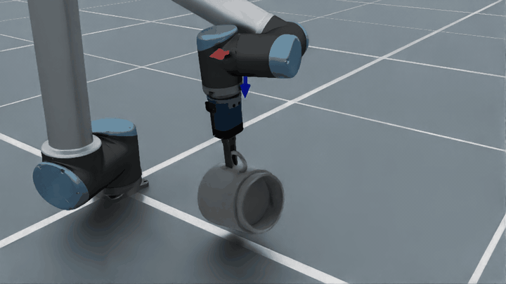

# Atomic Actions

```{currentmodule} embodichain.lab.sim.atomic_actions
```

Atomic actions are the building blocks for automated robot motion generation. Each action encapsulates a complete, self-contained motion primitive — such as picking up an object or moving to a pose — that can be chained together to form complex manipulation workflows.

## Design Overview

The module is organized into three layers:

```
AtomicActionEngine          ← orchestrates a sequence of (name, typed_target) steps
    │
    ├── AtomicAction(s)     ← each action plans one motion primitive
    │       │
    │       └── MotionGenerator   ← low-level trajectory planner (IK + trajectory optimization)
    │
    └── WorldState           ← threaded action-to-action (last_qpos + held_object)
```

Each action receives a typed target and a `WorldState`, runs its planning pipeline, and
returns an `ActionResult` whose trajectory covers the full robot DOF.  The engine threads
the `next_state` of each action as the input state of the next, then concatenates all
trajectories into one contiguous sequence:

```
GraspTarget(semantics) ──► AtomicAction.execute(target, state)
PoseTarget(xpos)                │
HeldObjectTarget(pose)          ├─ IK solve
                                ├─ Motion plan
                                └─ Gripper interpolation
                                       │
                               ActionResult
                               (success, full-DoF traj, next_state)
                                       │
AtomicActionEngine ◄───────────────────┘
(run(steps, state) → (is_success, traj, final_state))
```

### Core Concepts

**`ObjectSemantics`** describes an interaction target. It bundles:
- `affordance` — *how* to interact with the object (e.g. an `AntipodalAffordance` carrying mesh data and grasp-generation config)
- `geometry` — plain geometric metadata (e.g. a bounding box). Mesh tensors live on the affordance, not here
- `label` — object category string (also bound onto the affordance for convenience)
- `entity` — a live reference to the simulation object, so actions can read its current pose

**`HeldObjectState`** is runtime state produced after a successful `PickUpAction`. It stores
the held object's semantics and object-to-end-effector transform so later actions can move the
object without recomputing the grasp. It is intentionally separate from `ObjectSemantics`,
which remains a reusable object description rather than per-execution robot state.

**Typed targets** describe *where* an action should go. Each one is a small frozen dataclass,
and every action declares the single target type it accepts via its `TargetType` class variable:

| Target | Constructor | Used by |
|---|---|---|
| `PoseTarget` | `PoseTarget(xpos)` | `MoveAction`, `PlaceAction` |
| `GraspTarget` | `GraspTarget(semantics)` | `PickUpAction` |
| `HeldObjectTarget` | `HeldObjectTarget(object_target_pose)` | `MoveObjectAction` |

`Target` is the union of these three.

**`Affordance`** is a data class that encodes a specific interaction capability. The built-in affordance types are:

| Class | Use case |
|---|---|
| `AntipodalAffordance` | Parallel-jaw grasping via antipodal point pairs |
| `InteractionPoints` | Contact-based interactions (push, poke, touch) |

`AntipodalAffordance` takes its inputs as direct fields — `mesh_vertices`, `mesh_triangles`,
`gripper_collision_cfg`, `generator_cfg`, and `force_reannotate` — rather than a nested config dict.

**`AtomicAction`** is the abstract base class for all motion primitives. Subclasses declare a
`TargetType` class variable and implement a single method:
- `execute(target, state) -> ActionResult` — plan and return a full-DOF trajectory plus the
  successor `WorldState`

**`AtomicActionEngine`** holds a name-keyed registry of action instances and runs a sequence of
`(name, typed_target)` steps via `run(steps, state)`, threading `WorldState` from one action into
the next.

---

## Built-in Actions

(supported_atomic_actions)=

The following actions are available out of the box:

| Atomic action | Single arm / dual arm | Target type| Motion phases | GIF |
|---|---|---|---|---|
| `MoveAction` | Single arm | `Tensor (4,4)` — EEF pose | Approach → close gripper → lift |   |
| `PickUpAction` | Single arm | `ObjectSemantics` or `Tensor (4,4)` | Move arm to pose |   |
| `PlaceAction` | Single arm | `Tensor (4,4)` — EEF release pose | Lower → open gripper → retract |   |

### `MoveAction`

Moves the end-effector to a target pose in free space.

| Config field | Default | Description |
|---|---|---|
| `control_part` | `"arm"` | Robot control part to move |
| `sample_interval` | `50` | Number of waypoints in the trajectory |

**Target:** `PoseTarget(xpos=...)` where `xpos` is a `torch.Tensor` of shape `(4, 4)` or
`(n_envs, 4, 4)` — a homogeneous EEF pose.

---

### `PickUpAction`

Three-phase grasp motion: *approach → close gripper → lift*.

| Config field | Default | Description |
|---|---|---|
| `approach_direction` | `[0, 0, -1]` | Gripper approach direction in object frame |
| `pre_grasp_distance` | `0.15` | Hover distance before descending (m) |
| `lift_height` | `0.10` | Lift height after grasping (m) |
| `hand_open_qpos` | `None` | **Required.** Gripper open joint positions |
| `hand_close_qpos` | `None` | **Required.** Gripper closed joint positions |
| `hand_control_part` | `"hand"` | Robot control part for the gripper |
| `hand_interp_steps` | `5` | Waypoints for the gripper close phase |
| `sample_interval` | `80` | Total waypoints across all three phases |

**Target:** `GraspTarget(semantics=...)` — an `ObjectSemantics` whose `affordance` is an
`AntipodalAffordance`. The grasp pose is solved from the affordance and the entity's live
pose at execute time. On success, the returned `WorldState` carries a populated
`held_object` (`HeldObjectState`).

---

### `MoveObjectAction`

Moves a held object to an object-centric target pose while preserving the grasp. It requires
the `HeldObjectState` populated by a prior `PickUpAction` (read from `WorldState.held_object`)
and preserves it in its successor state.

`HeldObjectState` and `HeldObjectTarget` are intentionally kept separate from
`ObjectSemantics`: `ObjectSemantics` describes the object and affordances, while these
types describe runtime held-object state and an action-specific target pose.

| Config field | Default | Description |
|---|---|---|
| `hand_close_qpos` | `None` | **Required.** Gripper closed joint positions |
| `hand_control_part` | `"hand"` | Robot control part for the gripper |
| `sample_interval` | `50` | Number of waypoints in the trajectory |

**Target:** `HeldObjectTarget(object_target_pose=...)` where `object_target_pose` is a
`torch.Tensor` of shape `(4, 4)` or `(n_envs, 4, 4)` — the desired pose of the held object.
The action converts this to an EEF target via the stored object-to-EEF transform.

---

### `PlaceAction`

Three-phase release motion: *lower → open gripper → retract*. Mirrors `PickUpAction`.

`PlaceActionCfg` carries its own gripper fields directly (it inherits `ActionCfg`, not a
shared grasp-cfg base). The `approach_direction` field is not used — the arm moves straight
down to the target pose. On success, the returned `WorldState` clears `held_object` to `None`.

| Config field | Default | Description |
|---|---|---|
| `lift_height` | `0.10` | Retract height after opening the gripper (m) |
| `hand_open_qpos` | `None` | **Required.** Gripper open joint positions |
| `hand_close_qpos` | `None` | **Required.** Gripper closed joint positions |
| `hand_control_part` | `"hand"` | Robot control part for the gripper |
| `hand_interp_steps` | `5` | Waypoints for the gripper open phase |
| `sample_interval` | `80` | Total waypoints across all three phases |

**Target:** `PoseTarget(xpos=...)` — the EEF pose at release, a `torch.Tensor` of shape
`(4, 4)` or `(n_envs, 4, 4)`.

---

## Typical Workflow

```python
from embodichain.lab.sim.atomic_actions import (
    AtomicActionEngine,
    ObjectSemantics,
    AntipodalAffordance,
    GraspTarget,
    PoseTarget,
    HeldObjectTarget,
    PickUpAction,
    PickUpActionCfg,
    MoveObjectAction,
    MoveObjectActionCfg,
    PlaceAction,
    PlaceActionCfg,
    MoveAction,
    MoveActionCfg,
)

# 1. Configure each action
pickup_cfg = PickUpActionCfg(
    control_part="arm",
    hand_control_part="hand",
    hand_open_qpos=torch.tensor([0.0, 0.0]),
    hand_close_qpos=torch.tensor([0.025, 0.025]),
)
place_cfg = PlaceActionCfg(
    control_part="arm",
    hand_control_part="hand",
    hand_open_qpos=torch.tensor([0.0, 0.0]),
    hand_close_qpos=torch.tensor([0.025, 0.025]),
)
move_object_cfg = MoveObjectActionCfg(
    control_part="arm",
    hand_control_part="hand",
    hand_close_qpos=torch.tensor([0.025, 0.025]),
)
move_cfg = MoveActionCfg(control_part="arm")

# 2. Build the engine and register each action instance by name
engine = AtomicActionEngine(motion_generator=motion_gen)
engine.register(PickUpAction(motion_gen, cfg=pickup_cfg))
engine.register(MoveObjectAction(motion_gen, cfg=move_object_cfg))
engine.register(PlaceAction(motion_gen, cfg=place_cfg))
engine.register(MoveAction(motion_gen, cfg=move_cfg))

# 3. Describe the object to pick
semantics = ObjectSemantics(
    affordance=AntipodalAffordance(
        mesh_vertices=obj.get_vertices(env_ids=[0], scale=True)[0],
        mesh_triangles=obj.get_triangles(env_ids=[0])[0],
        gripper_collision_cfg=gripper_cfg,
        generator_cfg=generator_cfg,
    ),
    geometry={},
    label="mug",
    entity=obj,
)

# 4. Plan the full sequence — steps are (name, typed_target) pairs
is_success, traj, final_state = engine.run(
    steps=[
        ("pick_up", GraspTarget(semantics=semantics)),
        ("move_object", HeldObjectTarget(object_target_pose=carry_pose)),
        ("place", PoseTarget(xpos=place_pose)),
        ("move", PoseTarget(xpos=rest_pose)),
    ]
)
# traj: (n_envs, n_waypoints, robot.dof)
```

---

## How to Extend: Adding a Custom Action

You can add any motion primitive by subclassing `AtomicAction`, composing a
`TrajectoryBuilder` for the shared planning math, and registering an instance with the engine.

### Step 1 — Define the config

```python
from embodichain.utils import configclass
from embodichain.lab.sim.atomic_actions import ActionCfg

@configclass
class PushActionCfg(ActionCfg):
    name: str = "push"
    push_distance: float = 0.05  # metres to push forward
    push_speed: int = 30          # waypoints for the push phase
```

### Step 2 — Implement the action

```python
import torch
from typing import ClassVar
from embodichain.lab.sim.atomic_actions import (
    AtomicAction, ActionResult, PoseTarget, Target, WorldState, TrajectoryBuilder,
)

class PushAction(AtomicAction):
    TargetType: ClassVar[type] = PoseTarget

    def __init__(self, motion_generator, cfg: PushActionCfg | None = None):
        super().__init__(motion_generator, cfg or PushActionCfg())
        self.builder = TrajectoryBuilder(motion_generator)
        self.arm_joint_ids = self.robot.get_joint_ids(name=self.cfg.control_part)
        self.robot_dof = self.robot.dof
        self.n_envs = self.robot.get_qpos().shape[0]

    def execute(self, target: PoseTarget, state: WorldState) -> ActionResult:
        # ... your planning logic, using self.builder for IK / interpolation ...
        # full must be shaped (n_envs, n_waypoints, robot.dof)
        return ActionResult(
            success=is_success,
            trajectory=full,
            next_state=WorldState(
                last_qpos=full[:, -1, :].clone(),
                held_object=state.held_object,  # push does not change what is held
            ),
        )
```

### Step 3 — Register and use

Register an instance with the engine so it can be referenced by name in `run()`:

```python
from embodichain.lab.sim.atomic_actions import PoseTarget

engine.register(PushAction(motion_gen, cfg=PushActionCfg(push_distance=0.08)))
is_success, traj, final_state = engine.run(
    steps=[("push", PoseTarget(xpos=target_pose))]
)
```

To publish an action class for third-party discovery (independent of any engine instance),
use the global registry:

```python
from embodichain.lab.sim.atomic_actions import register_action, unregister_action, get_registered_actions

register_action("push", PushAction)          # registers the class under "push"
unregister_action("push")                    # removes it
all_actions = get_registered_actions()       # dict[str, type[AtomicAction]]
```

> **Tip:** `execute()` always returns an `ActionResult`. Its `trajectory` is full-robot-DOF
> shaped `(n_envs, n_waypoints, robot.dof)`, and `next_state` carries the `WorldState` the
> engine will feed into the following step. Use `TrajectoryBuilder` for pose broadcasting,
> three-phase splitting, IK/FK, and hand-qpos interpolation so your action matches the
> built-ins.

---

## Typed Targets & State Threading

The engine takes a sequence of `(name, typed_target)` steps. Each target is one of three
frozen dataclasses, and the engine checks that each step's target matches the registered
action's `TargetType` before calling `execute`:

| Target | Holds | Accepted by |
|---|---|---|
| `PoseTarget(xpos)` | EEF pose tensor `(4,4)` or `(n_envs,4,4)` | `MoveAction`, `PlaceAction` |
| `GraspTarget(semantics)` | `ObjectSemantics` (affordance + entity) | `PickUpAction` |
| `HeldObjectTarget(object_target_pose)` | Desired held-object pose tensor | `MoveObjectAction` |

`WorldState` is threaded between actions and carries the robot's `last_qpos` plus an optional
`held_object: HeldObjectState`. The built-in actions update it as follows:

| Action | Effect on `held_object` |
|---|---|
| `PickUpAction` | Populates it (computed object-to-EEF transform) |
| `MoveObjectAction` | Requires it; preserves it unchanged |
| `PlaceAction` | Clears it to `None` |
| `MoveAction` | Leaves it unchanged |

If a step fails, `run()` returns `success=False` with the partial trajectory concatenated up
to (but not including) the failed step, and the `WorldState` going into that step.

---

## Further Reading

- {doc}`planners/motion_generator` — the trajectory planner used by every action
- {doc}`sim_robot` — how control parts and IK solvers are configured
- Tutorial: `scripts/tutorials/sim/atomic_actions.py`
- Move object demo: `scripts/tutorials/atomic_action/move_object_atomic_actions.py`
