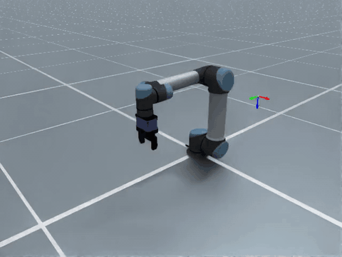
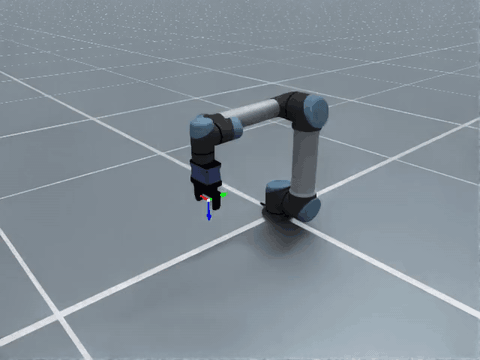
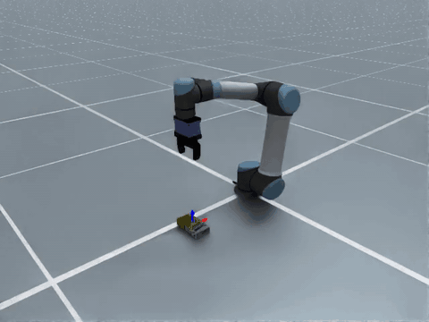
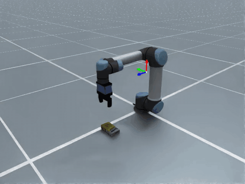
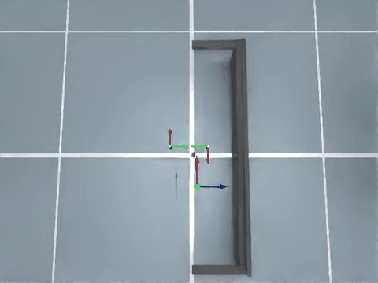
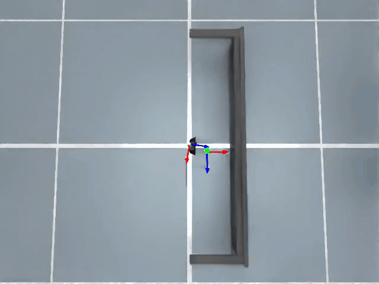

(builtin_actions)=

# Built-in Actions

```{currentmodule} embodichain.lab.sim.atomic_actions
```

The following actions are available out of the box:

```{note}
The built-in atomic actions currently support gripper-based manipulation only. Dexterous-hand manipulation is not supported yet.
```

| Action | Arm | Target type | Motion phases | Demo |
|---|---|---|---|---|
| `MoveEndEffector` | Single | `EndEffectorPoseTarget` — EEF pose | Move end-effector to pose |  |
| `MoveJoints` | Single | `JointPositionTarget` or `NamedJointPositionTarget` — qpos | Interpolate control-part joints |  |
| `PickUp` | Single | `GraspTarget` — object semantics | Approach → close gripper → lift |  |
| `MoveHeldObject` | Single | `HeldObjectPoseTarget` — held-object pose | Move held object while keeping gripper closed |  |
| `Place` | Single | `EndEffectorPoseTarget` — EEF release pose | Lower → open gripper → retract |  |
| `Press` | Single | `EndEffectorPoseTarget` — EEF press pose | Close gripper → press down → return |  |
| `CoordinatedPickment` | Dual | `CoordinatedPickmentTarget` — shared-object pose | Approach both ends → close both grippers → lift → move object |  |
| `CoordinatedPlacement` | Dual | `CoordinatedPlacementTarget` — two held-object poses | Move support object → align placing object → release placing hand → retreat |  |

---

## `MoveEndEffector`

Moves the end-effector to a target pose in free space.

| Config field | Default | Description |
|---|---|---|
| `control_part` | `"arm"` | Robot control part to move |
| `sample_interval` | `50` | Number of waypoints in the trajectory |

**Target:** `EndEffectorPoseTarget(xpos=...)` where `xpos` is a `torch.Tensor` of shape `(4, 4)`, `(n_envs, 4, 4)` or `(n_envs, n_waypoint, 4, 4)` — a homogeneous EEF pose.


---

## `MoveJoints`

Moves a configured control part directly in joint space. Use this for known safe poses,
home poses, recovery motions, or any motion where a qpos target is clearer than an EEF pose.

| Config field | Default | Description |
|---|---|---|
| `control_part` | `"arm"` | Robot control part to move |
| `sample_interval` | `50` | Number of waypoints in the interpolated trajectory |
| `named_joint_positions` | `None` | Optional `dict[str, torch.Tensor]` for named qpos targets |

**Targets:**
- `JointPositionTarget(qpos=...)` where `qpos` is a `torch.Tensor` of shape `(control_dof,)`, `(n_envs, control_dof)` or `(n_envs, n_waypoint, control_dof)`.
- `NamedJointPositionTarget(name=...)` where `name` is resolved from
  `MoveJointsCfg.named_joint_positions`.


---

## `PickUp`

Three-phase grasp motion: *approach → close gripper → lift*.

| Config field | Default | Description |
|---|---|---|
| `approach_direction` | `[0, 0, -1]` | Gripper approach direction in world frame |
| `approach_alignment_max_angle` | `5 deg` | Maximum TCP z-axis deviation for standard pickups; skipped for upright-adjusted grasps |
| `pre_grasp_distance` | `0.15` | Hover distance before descending (m) |
| `lift_height` | `0.10` | Lift height after grasping (m) |
| `hand_open_qpos` | `None` | **Required.** Gripper open joint positions |
| `hand_close_qpos` | `None` | **Required.** Gripper closed joint positions |
| `hand_control_part` | `"hand"` | Robot control part for the gripper |
| `hand_interp_steps` | `5` | Waypoints for the gripper close phase |
| `sample_interval` | `80` | Total waypoints across all three phases |

**Target:** `GraspTarget(semantics=...)` — an `ObjectSemantics` whose `affordance` is an
`AntipodalAffordance`. The grasp pose is solved from the affordance and the entity's live
pose at execute time. On success, the returned `WorldState` carries a populated
`held_object` (`HeldObjectState`).


---

## `MoveHeldObject`

Moves a held object to an object-centric target pose while preserving the grasp. It requires
the `HeldObjectState` populated by a prior `PickUp` (read from `WorldState.held_object`)
and preserves it in its successor state.

`HeldObjectState` and `HeldObjectPoseTarget` are intentionally kept separate from
`ObjectSemantics`: `ObjectSemantics` describes the object and affordances, while these
types describe runtime held-object state and an action-specific target pose.

| Config field | Default | Description |
|---|---|---|
| `hand_close_qpos` | `None` | **Required.** Gripper closed joint positions |
| `hand_control_part` | `"hand"` | Robot control part for the gripper |
| `sample_interval` | `50` | Number of waypoints in the trajectory |

**Target:** `HeldObjectPoseTarget(object_target_pose=...)` where `object_target_pose` is a
`torch.Tensor` of shape `(4, 4)` or `(n_envs, 4, 4)` — the desired pose of the held object.
The action converts this to an EEF target via the stored object-to-EEF transform.


---

## `Place`

Three-phase release motion: *lower → open gripper → retract*. Mirrors `PickUp`.

`PlaceCfg` carries its own gripper fields directly (it inherits `ActionCfg`, not a
shared grasp-cfg base). The `approach_direction` field is not used — the arm moves straight
down to the target pose. On success, the returned `WorldState` clears `held_object` to `None`.

| Config field | Default | Description |
|---|---|---|
| `lift_height` | `0.10` | Retract height after opening the gripper (m) |
| `hand_open_qpos` | `None` | **Required.** Gripper open joint positions |
| `hand_close_qpos` | `None` | **Required.** Gripper closed joint positions |
| `hand_control_part` | `"hand"` | Robot control part for the gripper |
| `hand_interp_steps` | `5` | Waypoints for the gripper open phase |
| `sample_interval` | `80` | Total waypoints across all three phases |

**Target:** `EndEffectorPoseTarget(xpos=..., tcp_symmetry="none")` — the EEF pose at
release, a `torch.Tensor` of shape `(4, 4)`, `(n_envs, 4, 4)` or
`(n_envs, n_waypoint, 4, 4)`. Keep the default
`tcp_symmetry="none"` when the TCP orientation is strict. Use
`tcp_symmetry="z_roll_180"` only when releasing with TCP x/y flipped is physically
equivalent; `Place` then chooses the closer TCP z-roll 180 variant from
`WorldState.last_qpos` and applies that same variant across all release waypoints.


---

## `Press`

Three-phase contact motion: *close gripper → press down → return*. This is useful
for button-like or contact-based interactions where the end-effector should reach a
target pose and then return to the pre-press arm pose.

`Press` does not create or clear `WorldState.held_object`; it preserves the state
threaded into it.

| Config field | Default | Description |
|---|---|---|
| `hand_close_qpos` | `None` | **Required.** Gripper closed joint positions |
| `hand_control_part` | `"hand"` | Robot control part for the gripper |
| `hand_interp_steps` | `5` | Waypoints for the gripper close phase |
| `sample_interval` | `80` | Total waypoints across all three phases |

**Target:** `EndEffectorPoseTarget(xpos=...)` — the EEF pose to press, a `torch.Tensor`
of shape `(4, 4)` or `(n_envs, 4, 4)`.


---

## `CoordinatedPickment`

Dual-arm grasp motion for one shared object. Both arms move to object-relative
grasp poses, close both grippers, lift the object, and move it to an object pose
while keeping both grippers closed. On success, the returned `WorldState` carries
`coordinated_held_object` (`CoordinatedHeldObjectState`) and leaves
`held_object` as `None`.

| Config field | Default | Description |
|---|---|---|
| `control_part` | `"dual_arm"` | Combined arm control part |
| `left_arm_control_part` / `right_arm_control_part` | `"left_arm"` / `"right_arm"` | Arm control parts for each grasp |
| `left_hand_control_part` / `right_hand_control_part` | `"left_hand"` / `"right_hand"` | Hand control parts for each gripper |
| `pre_grasp_distance` | `0.10` | Distance to back away from each grasp TCP |
| `lift_height` | `0.08` | World-Z lift distance before moving to the target pose |
| `object_motion_keyframes` | `6` | Sparse object-pose IK keyframes for synchronized motion |
| `sample_interval` | `120` | Total waypoints across all phases |

**Target:** `CoordinatedPickmentTarget(...)` with a target object pose, object
semantics, and left/right object-to-EEF transforms.

**Tutorial:** `scripts/tutorials/atomic_action/coordinated_pickment.py`


---

## `CoordinatedPlacement`

Dual-arm object-centric placement. The support arm moves its held object to a lower
target pose and keeps its gripper closed. The placing arm moves its held object to
the aligned upper target pose, optionally opens the placing hand, then lifts away.

`CoordinatedPlacement` is intentionally explicit about dual-arm state: the target
contains both `placing_held_object` and `support_held_object`. This avoids relying
on the engine's single `WorldState.held_object` slot to infer two simultaneously
held objects.

| Config field | Default | Description |
|---|---|---|
| `control_part` | `"dual_arm"` | Robot control part containing both arms |
| `placing_arm_control_part` | `"left_arm"` | Arm that releases the placed object |
| `support_arm_control_part` | `"right_arm"` | Arm that keeps holding the support object |
| `placing_hand_control_part` | `"left_hand"` | Placing gripper control part |
| `support_hand_control_part` | `"right_hand"` | Support gripper control part |
| `placing_hand_open_qpos` | `None` | **Required.** Placing gripper open joint positions |
| `placing_hand_close_qpos` | `None` | **Required.** Placing gripper closed joint positions |
| `support_hand_close_qpos` | `None` | **Required.** Support gripper closed joint positions |
| `release` | `True` | Whether to open the placing gripper |
| `placing_height_offset` | `0.0` | World-Z offset applied to the placing object target pose |
| `support_height_offset` | `0.0` | World-Z offset applied to the support object target pose |
| `lift_height` | `0.08` | Placing-arm lift distance after release (m) |
| `hand_interp_steps` | `10` | Waypoints for placing-hand release |
| `hold_steps` | `4` | Alignment hold waypoints before release |
| `retreat_steps` | `16` | Placing-arm retreat waypoints |
| `sample_interval` | `100` | Total waypoints across all phases |

**Target:** `CoordinatedPlacementTarget(...)` with placing/support object target
poses plus the corresponding `HeldObjectState` values. On success, the returned
`WorldState.held_object` is the support object's held state.

**Tutorial:** `scripts/tutorials/atomic_action/coordinated_placement.py`


