(builtin-actions)=

# Built-in atomic actions

```{currentmodule} embodichain.lab.sim.atomic_actions
```

EmbodiChain ships eleven built-in action implementations with stable skill IDs;
`AtomicActionEngine` creates and registers a fresh instance of every built-in by
default. Applications select them by stable skill ID rather than registering
routine instances themselves.
`Place` additionally accepts an `AssembleGoal`, so assembly reuses the same
release primitive instead of introducing another skill ID.

All built-ins implement
`plan(request, context) -> ActionPlan`, where `request` is the engine-resolved
snapshot of an invocation revision. Constructors accept only optional typed
default `*Options`; the owning `AtomicActionEngine` supplies the shared motion
generator, trajectory builder, and control-part command profiles when it binds
the built-in catalog. Generic motion and recovery choices belong to the
invocation, and per-call primitive behavior belongs to `skill_options`.

Registration only installs an implementation. Whether a built-in is executable
for a particular call still depends on its `SkillBindingContract`, the selected
resource endpoints, semantic command profiles, and task-state preconditions.
Action Agent adapters must also honor `agent_visible` and filter by embodiment
capability.

```{note}
The current manipulation primitives consume semantic `open` and `grasp`
commands through the control-part command abstraction. The shipped command
implementation is `JointPositionCommand`. A dexterous hand may register
calibrated joint-position commands immediately; non-position hand policies or
multi-stage in-hand manipulation require additional command types and segments.
```

## Visual catalog

The animations below are the focused simulator demos under
`scripts/tutorials/atomic_action/`.

::::{grid} 1 2 2 2
:gutter: 2

:::{grid-item-card} `MoveEndEffector`
:link: builtin-move-end-effector
:link-type: ref

`move_end_effector` · free-space EEF pose motion

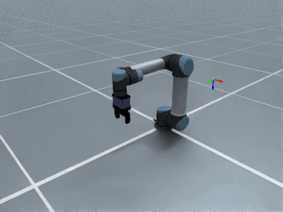
:::

:::{grid-item-card} `MoveJoints`
:link: builtin-move-joints
:link-type: ref

`move_joints` · explicit or named joint-space motion

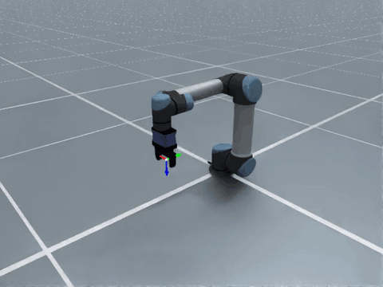
:::

:::{grid-item-card} `PickUp`
:link: builtin-pick-up
:link-type: ref

`pick_up` · approach, close, and lift

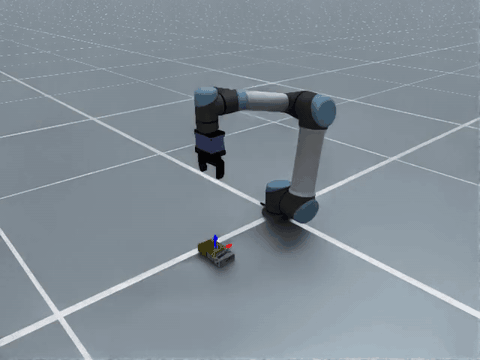
:::

:::{grid-item-card} `MoveHeldObject`
:link: builtin-move-held-object
:link-type: ref

`move_held_object` · object-centric transport

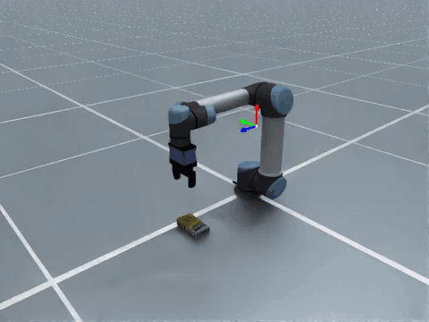
:::

:::{grid-item-card} `Place`
:link: builtin-place
:link-type: ref

`place` · approach, release, and retract


:::

:::{grid-item-card} Assembly through `Place`
:link: builtin-assemble
:link-type: ref

`place` + `AssembleGoal` · base-relative placement

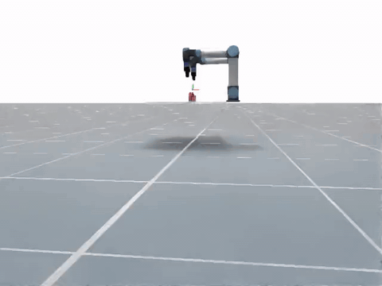
:::

:::{grid-item-card} `Press`
:link: builtin-press
:link-type: ref

`press` · close, approach, press, and retract

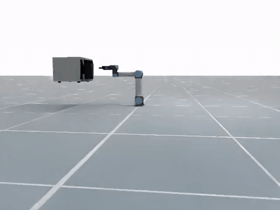
:::

:::{grid-item-card} `Slide`
:link: builtin-slide
:link-type: ref

`slide` · grasped translation along a constrained axis

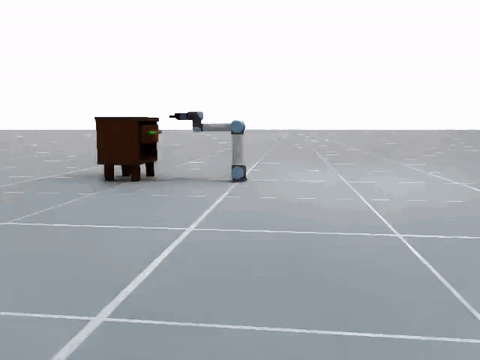
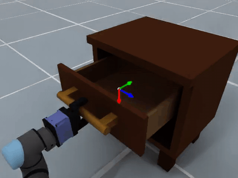
:::

:::{grid-item-card} `Twist`
:link: builtin-twist
:link-type: ref

`twist` · grasped rotation about a configured axis

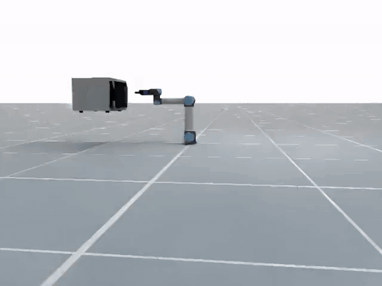
:::

:::{grid-item-card} `CoordinatedPickment`
:link: builtin-coordinated-pickment
:link-type: ref

`coordinated_pickment` · dual-arm shared-object pick

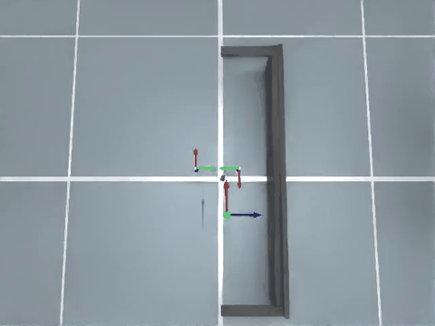
:::

:::{grid-item-card} `CoordinatedPlacement`
:link: builtin-coordinated-placement
:link-type: ref

`coordinated_placement` · align two held objects

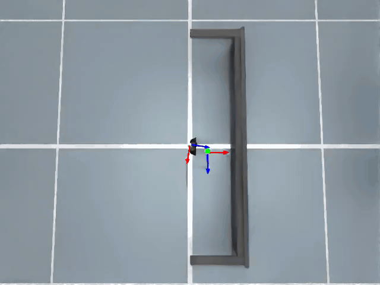
:::

:::{grid-item-card} `HandOver`
:link: builtin-hand-over
:link-type: ref

`hand_over` · transfer an attachment between arms

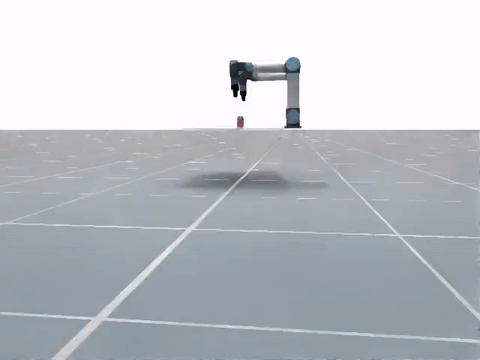
:::

::::

## Capability matrix

| Skill ID | Accepted goal | Required endpoints | Required profile commands | Required task state | Expected task effect |
|---|---|---|---|---|---|
| `move_end_effector` | `EndEffectorPoseGoal` | `primary.motion` | none | none | none |
| `move_joints` | `JointPositionGoal` | `primary.motion` | named target only: command matching `target` on `primary.motion` | none | none |
| `pick_up` | `GraspGoal` | `primary.motion`, `primary.grasp` | `primary.grasp`: `open`, `grasp` | semantic object/entity | attach object to the `primary.motion` target |
| `move_held_object` | `HeldObjectPoseGoal` | `primary.motion`, `primary.grasp` | `primary.grasp`: `grasp` | object held exclusively by the `primary.motion` target | preserve attachment |
| `place` | `PlaceGoal`, `AssembleGoal` | `primary.motion`, `primary.grasp` | `primary.grasp`: `open`, `grasp` | any active attachment must be exclusive to `primary.motion`; `AssembleGoal` requires one | detach object |
| `press` | `PressGoal` | `primary.motion`, `primary.grasp` | `primary.grasp`: `grasp` | `PressAffordance` + target pose | open-loop motion; application verifies contact/actuation |
| `slide` | `SlideGoal` | `primary.motion`, `primary.grasp` | `primary.grasp`: `open`, `grasp` | `SlideAffordance` + link pose | open-loop motion; application verifies joint travel/grasp |
| `twist` | `TwistGoal` | `primary.motion`, `primary.grasp` | `primary.grasp`: `open`, `grasp` | `TwistAffordance` + target pose | open-loop motion; application verifies joint travel/grasp |
| `coordinated_pickment` | `CoordinatedPickGoal` | `left.motion`, `left.grasp`, `right.motion`, `right.grasp` | both grasp endpoints: `open`, `grasp` | semantic object/entity | attach the shared object to both motion targets |
| `coordinated_placement` | `CoordinatedPlacementGoal` | `placing.motion`, `placing.grasp`, `support.motion`, `support.grasp` | `placing.grasp`: `open`, `grasp`; `support.grasp`: `grasp` | two distinct objects, each held exclusively by its motion target | optionally detach placing object; preserve support attachment |
| `hand_over` | `GraspGoal` | `source.motion`, `source.grasp`, `destination.motion`, `destination.grasp` | both grasp endpoints: `open`, `grasp` | object held exclusively by the source motion target | transfer attachment to the destination motion target |

### Participant slot meanings

Slots are action-local semantic participants declared by
`SkillBindingContract`. Each slot contains endpoint requirements such as
`motion` and `grasp`; the profile binder matches their capabilities and typed
commands to a robot resource, then adapters produce the generic
`EndpointBinding` values owned by `ActionBinding`.

| Slot | Used by | Meaning |
|---|---|---|
| `primary` | Single-participant skills | Principal participant for this invocation; it has no inherent left/right or default-robot meaning |
| `source` | `hand_over` | Participant that initially holds and transfers the object |
| `destination` | `hand_over` | Participant that receives the object |
| `left`, `right` | `coordinated_pickment` | Participants on whose sides the affordance samples left/right grasps |
| `placing` | `coordinated_placement` | Participant that aligns and optionally releases the placing object |
| `support` | `coordinated_placement` | Participant that keeps holding and positioning the support object |

Each endpoint requirement declares an open capability set and optional typed
semantic commands. Intra-slot and inter-slot disjointness constraints express
physical compatibility without global arm/tool categories. The built-in
control-part adapter resolves current joint-backed endpoints through
`Robot.control_parts`; custom adapters may instead return mobile, whole-body, or
other runtime targets.

`MoveJoints` is intentionally `agent_visible=False`: it is useful for home,
recovery, calibration, and scripted postures, but is not exposed to an Action
Agent by default.

## Shared goal and configuration rules

### Pose values and dynamic references

Pose-valued fields use `PoseGoalValue`, which accepts either an explicit tensor
or a late-bound scene reference:

```python
fixed = EndEffectorPoseGoal(xpos=target_pose)
tracked = EndEffectorPoseGoal(
    xpos=SceneEntityPose("tray", relative_pose=tray_to_tcp)
)
```

Explicit pose tensors use `(4, 4)` or `(B, 4, 4)`. Waypoint-capable fields in
`EndEffectorPoseGoal` and `PlaceGoal` also accept `(B, N, 4, 4)`.
`SceneEntityPose` resolves to the latest `(B, 4, 4)` pose from each
`SceneSnapshot`, checks optional perception confidence, and registers that
entity as a recovery dependency.

| Skill / field | `SceneEntityPose` accepted | Automatic scene-motion replan |
|---|---:|---:|
| `MoveEndEffector.xpos` | yes | yes |
| `MoveJoints.target` | no | no |
| `MoveHeldObject.object_target_pose` | yes | yes |
| `Place.xpos` | yes | yes |
| `CoordinatedPickGoal.object_target_pose` / `object_initial_pose` | yes | yes |
| `CoordinatedPlacementGoal` placing/support poses | yes | yes |
| `PickUp.grasp_xpos` | yes | yes |
| `PickUp` `ObjectSemantics.entity_id` grounding | implicit snapshot reference | yes; always consumed for the object pose |
| Coordinated pickup implicit initial pose via `ObjectSemantics.entity_id` | implicit snapshot reference | yes; only when `object_initial_pose` is omitted |
| `AssembleGoal.base_pose` | yes | yes |
| Deprecated `ObjectSemantics.entity` / `AssembleAffordance.base_object_entity` fallback | no | no |
| `HandOver` current held-object pose | no scene lookup | no; derived from observed EEF pose and verified attachment state |

### Object identity and grounding

`ObjectSemantics.entity_id` is the canonical scene-snapshot key. It must be a
non-empty string when set. An explicit ID is strict: object grounding reads only
`PlanningContext.scene.entities[entity_id]`, and a missing entry is an error. It
never falls back to `ObjectSemantics.entity` after an explicit lookup fails.

The live `entity` field remains a deprecated direct-core compatibility path only
when `entity_id` is absent. That read emits `DeprecationWarning` and cannot
create a scene-motion dependency. `collect_scene_dependencies()` intentionally
does not recurse into `ObjectSemantics`; each primitive declares a semantic ID
only when its planner actually consumes that object's snapshot pose.

Attachment and handover identity are not based on `label`. The core resolves an
explicit `entity_id` only against another explicit ID. If either compared side
has one, both sides must have the same explicit value; an equal legacy
`entity.uid` does not match it. When both explicit IDs are absent, two non-empty
legacy UIDs may match. Only when neither side has either ID form may comparison
fall back to the same semantic object or live entity handle. Future
`SceneRegistry` integration will own arbitrary alias normalization; this core
bridge does not.

`ObjectSemantics` is shallow-frozen. Its top-level fields, including
`entity_id`, cannot be rebound after construction; create a new semantics value
to change identity. Nested affordance and metadata objects remain mutable but
do not participate in identity.

### Parameter ownership

Use this rule when configuring a built-in or adding a new one:

- the **goal** carries only the requested outcome;
- the skill's **binding contract** declares participant slots, endpoint
  capabilities, required typed commands, and physical disjointness;
- the engine-owned **binding** carries adapter-resolved `EndpointBinding`
  snapshots and immutable runtime targets selected for this call;
- typed **skill options** carry segment-specific behavior that may vary by
  invocation; an action may provide defaults;
- the engine's **control-part profiles** carry embodiment-specific semantic
  commands such as `open`, `grasp`, and named postures;
- `MotionPolicy` carries sample count, motion strategy, collision choice, and
  typed planner options;
- planner-backed segments preserve explicit planner timing, while action-owned
  interpolation reads the environment cadence from `PlanningContext.control_dt`;
- missing planner or action timing is an error; the engine has no fallback
  control period;
- `RecoveryPolicy` carries all replan/retry thresholds and budgets.

All built-ins resolve their `motion` and `grasp` endpoints exclusively from the
generic `ActionBinding`. The built-in control-part adapter resolves joint IDs
and checks each joint-position command against its DoF. Invocation-level
`ActionControlOverrides` may replace a command by `(slot, endpoint)` for one
explicit revision.

### Planning and effect semantics

Every action returns a per-environment `plan_success` mask and an
`ActionPlan.commands` sequence of `RuntimeCommandFrame` values. Current
joint-planned built-ins also retain `ActionPlan.joint_trajectory` for joint
feedback, inspection, and static projection. `plan_success=True` means planning
succeeded; it does not prove contact or object transfer. Actions that change
attachment state declare a `StateDelta`. Offline `compile()` projects it
hypothetically; closed-loop execution commits it only after external effect
verification.

(builtin-move-end-effector)=

## `MoveEndEffector`

Plans a free-space motion for the bound `primary.motion` endpoint to reach one
EEF pose or an ordered set of pose waypoints.

| Contract | Value |
|---|---|
| Skill ID | `move_end_effector` |
| Goal | `EndEffectorPoseGoal(xpos=...)` |
| Binding contract | `primary.motion` with Cartesian-pose capability |
| Motion | EEF planning from observed arm qpos; output expanded to full robot DoF |
| Completion | `EEF_GOAL_REACHED` |
| Effect | none |
| Skill options | none; reusable motion choices are in `MotionPolicy` |

Use an explicit pose for a fixed target, `SceneEntityPose` for a tracked target,
or `(B, N, 4, 4)` for intermediate waypoints. The action does not command an end
effector/hand resource.

**Example:** `scripts/tutorials/atomic_action/move_end_effector.py`

(builtin-move-joints)=

## `MoveJoints`

Plans directly in joint space. This is appropriate for known safe postures,
homing, scripted recovery, or motions whose desired outcome is a qpos rather
than an EEF pose.

| Contract | Value |
|---|---|
| Skill ID | `move_joints` |
| Goal | `JointPositionGoal(target=...)` |
| Binding contract | `primary.motion` with joint-position capability |
| Motion | joint planning/interpolation from observed qpos; supports joint waypoints |
| Completion | `JOINT_GOAL_REACHED` |
| Effect | none |
| Agent visibility | hidden by default (`agent_visible=False`) |

`target` accepts an explicit qpos tensor with shape `(control_dof,)`,
`(B, control_dof)`, or `(B, N, control_dof)`, or a non-empty string resolved
from the bound `primary.motion` endpoint's command profile. Named poses remain
embodiment knowledge without becoming separate goal types:

```python
engine = AtomicActionEngine(
    motion_generator,
    control_profiles={
        "left_arm": ControlPartCommandProfile.joint_positions(home=home_qpos),
    },
)

explicit_goal = JointPositionGoal(target=home_qpos)
named_goal = JointPositionGoal(target="home")
```

**Example:** `scripts/tutorials/atomic_action/move_joints.py`

(builtin-pick-up)=

## `PickUp`

Plans **approach -> close hand -> lift** and declares the object attached to the
bound motion target.

| Contract | Value |
|---|---|
| Skill ID | `pick_up` |
| Goal | `GraspGoal(semantics=..., grasp_xpos=None)` |
| Binding contract | `primary.motion` plus disjoint `primary.grasp` |
| Precondition | `ObjectSemantics.entity_id` resolves in the planning snapshot; the deprecated live `entity` fallback remains temporarily; an `AntipodalAffordance` is required when no explicit grasp pose is supplied |
| Effect | write `HeldObjectState` for the bound motion target |
| Verification | the attachment effect must be verified during closed-loop execution |

`grasp_xpos` may be `(4, 4)`, `(B, 4, 4)`, or a `SceneEntityPose`. A scene
reference resolves the latest grasp pose and registers its entity as a recovery
dependency, so material target motion invalidates and replans an executing
`PickUp`. When omitted, the action samples valid affordance grasps, evaluates
reachability, and stores the selected `object_to_eef` transform in the expected
held-object state. Later object-centric skills reuse that transform.

Set `ObjectSemantics.entity_id` to the same stable ID used by the scene
snapshot. `PickUp` resolves that object pose once per planning attempt, uses the
same tensor for grasp sampling, upright adjustment, and `object_to_eef`, and
automatically records the ID as a scene dependency. An explicit ID never falls
back to a live simulation entity when the snapshot entry is missing.

`PickUp` requires typed `open` and `grasp` commands on `primary.grasp`.
Important `PickUpOptions` fields:

| Field | Purpose |
|---|---|
| `pre_grasp_distance`, `approach_direction` | Pre-grasp offset and approach direction |
| `lift_height`, `hand_interp_steps` | Lift distance and close-segment discretization |
| `pick_object_part` | Affordance region: currently `center`, `top`, or `bottom` |
| `approach_alignment_max_angle` | Optional TCP approach-alignment filter |
| `downstream_object_target_poses` | Optional future reachability constraints used in grasp selection |
| `obj_upright_direction`, `rotate_upright` | Optional orientation-selection behavior |

`ObjectSemantics.entity` without an ID is a deprecated compatibility path. Its
live pose does not create an automatic scene dependency.

**Example:** `scripts/tutorials/atomic_action/pickup.py` currently exercises the
deprecated entity-only fallback. For canonical snapshot grounding and moving
target recovery, see
`scripts/tutorials/atomic_action/moving_target_recovery.py`.

(builtin-move-held-object)=

## `MoveHeldObject`

Moves an already attached object to an object-frame target while keeping the
hand closed. The caller specifies the desired **object pose**, not an EEF pose;
the action derives `target_object_pose @ object_to_eef` from verified task state.
When upright transport needs the current object orientation, it derives it from
the observed EEF pose and verified `object_to_eef` relation rather than reading
a live scene entity.

| Contract | Value |
|---|---|
| Skill ID | `move_held_object` |
| Goal | `HeldObjectPoseGoal(object_target_pose=...)` |
| Binding contract | `primary.motion` plus disjoint `primary.grasp` |
| Precondition | a `HeldObjectState` exists exclusively for the bound motion target, normally from `PickUp` |
| Motion | single object-centric transport segment with closed-hand qpos |
| Effect | none; the existing attachment is preserved |
| Dynamic target | explicit pose or `SceneEntityPose` |

The bound `primary.grasp` endpoint must provide `grasp`; optional
upright-transport settings belong to `MoveHeldObjectOptions`. The participant's
motion and grasp endpoints are selected through `ActionBinding`; generic timing
is explicit on the planner result or planning context, while trajectory
sampling remains in `MotionPolicy`. In a vectorized batch, rows
where another manipulator holds the same semantic object or live entity are
marked unsuccessful and held in place.

**Example:** `scripts/tutorials/atomic_action/move_held_object.py`

(builtin-place)=

## `Place`

Plans **approach/descend -> open hand -> retract**. A multi-waypoint
`PlaceGoal` visits all supplied release waypoints in order and opens at the last
one.

| Contract | Value |
|---|---|
| Skill ID | `place` |
| Goal | `PlaceGoal(xpos=..., tcp_symmetry="none")` |
| Binding contract | `primary.motion` plus disjoint `primary.grasp` |
| State | consumes the bound motion target's attachment when present and exclusive |
| Effect | detach the object from the bound motion target |
| Verification | release must be verified during closed-loop execution |
| Dynamic target | explicit pose/waypoints or `SceneEntityPose` |

Set `tcp_symmetry="z_roll_180"` only if TCP x/y can be flipped while TCP z and
translation remain physically equivalent. The action selects the closer
orientation variant from the observed starting state and uses it consistently
across all waypoints. An ordinary `PlaceGoal` may still open an unattached
gripper, but it will not release one side of a shared multi-manipulator object.

The bound `primary.grasp` endpoint must provide `open` and `grasp`. Important
`PlaceOptions` fields:

| Field | Purpose |
|---|---|
| `lift_height` | Approach and retract height |
| `hand_interp_steps` | Open-segment discretization |
| `max_approach_retract_z` | Optional world-Z ceiling for approach/retract poses |
| `cartesian_waypoint_count` | Fixed-orientation translation keyframes per segment |

**Example:** `scripts/tutorials/atomic_action/place.py`

(builtin-assemble)=

### Assembly through `Place`

`Place` also accepts
`AssembleGoal(affordance=..., base_pose=SceneEntityPose("base"))`. There is no
separate assembly skill: it derives the assemble-object target from the base
object's snapshot pose and reuses the normal place/release segments.

```text
base_object_pose @ assemble_to_base_pose = assemble_object_target_pose
assemble_object_target_pose @ held.object_to_eef = release_eef_pose
```

The `AssembleAffordance` stores the relative assembly pose. A prior verified
`PickUp` must have populated the held object's `object_to_eef` transform, and
that attachment must be exclusive. `base_pose` is resolved from each planning
snapshot and automatically becomes a recovery dependency. Omitting it
temporarily falls back to the affordance's `base_object_entity` with a
deprecation warning; that fallback is not a scene dependency. Planning declares
the same detach effect as a normal place.

**Example:** `scripts/tutorials/atomic_action/assemble.py` currently exercises
the legacy `base_object_entity` fallback and is not the canonical `base_pose`
form. It remains a compatibility example until the registry-backed tutorial
migration.

(builtin-press)=

## `Press`

Plans **close hand -> approach target -> contact -> press along axis -> return
to the approach pose**. `PressAffordance` is entity-free and stores an explicit
target-local surface `press_position` and `press_axis`. `PressGoal.target_pose`
is either a pose snapshot or `SceneEntityPose`, which resolves through the
current `PlanningContext.scene` and participates in dynamic-goal recovery.

The contact, press, and retract segments use axis-aligned Cartesian keyframes;
each output sample is grounded with IK instead of being interpolated only in
joint space. The generated tool frame uses an adaptive reference axis and is a
right-handed orthonormal rotation even for vertical or oblique press axes.

| Contract | Value |
|---|---|
| Skill ID | `press` |
| Goal | `PressGoal(semantics=..., target_pose=...)` |
| Binding contract | `primary.motion` plus disjoint `primary.grasp` |
| Motion | close, approach, contact, axis-constrained press, axis-constrained retract |
| Effect | explicitly open-loop; no physical button/contact effect is claimed |
| Dynamic target | explicit pose or `SceneEntityPose` |

`PressOptions` controls hand-close interpolation, approach distance,
press distance, and an optional target-local `press_position`. An options-level
position overrides the affordance's explicit surface point. The bound
`primary.grasp` endpoint must provide `grasp`; both endpoints come from the
generic `ActionBinding`, and the action keeps the gripper closed for all arm
motion segments. Applications that require force/contact confirmation must
verify it externally.

**Example:** `scripts/tutorials/atomic_action/press.py`

(builtin-slide)=

## `Slide`

Plans a grasped linear interaction for one articulation link. The entity-free
`SlideAffordance` stores the link-local grasp mesh, `translation_axis`, and
optional joint name/limits. `SlideGoal.target_pose` supplies the link pose as a
snapshot or `SceneEntityPose`. The positive axis direction means approach and
push/close; pull/open uses its negative direction. The affordance inherits
`AntipodalAffordance` and selects a grasp with `get_best_grasp_poses()`. The grasp
approach direction is the link-frame translation axis transformed by the
current link rotation.

With `direction="pull"`, the sequence is **approach -> reach -> close -> pull ->
open**. With `direction="push"`, it is **approach -> reach -> close -> push -> open
-> return**, where `return` moves the open gripper back to the original approach
pose.

| Contract | Value |
|---|---|
| Skill ID | `slide` |
| Goal | `SlideGoal(semantics=..., target_pose=...)` |
| Binding contract | `primary.motion` plus disjoint `primary.grasp` |
| Motion | pull: approach, reach, close, pull, open; push adds return to approach |
| Effect | explicitly open-loop; no articulation travel or grasp success is claimed |

`SlideOptions` controls `direction`, hand close/open
interpolation, approach distance, and translation distance. The link-frame
translation axis belongs to `SlideAffordance`; the bound `primary.grasp`
endpoint must provide `open` and `grasp`. Reach, pull/push, and push-return use
axis-aligned Cartesian samples rather than sparse joint-space endpoints.

**Example:** `scripts/tutorials/atomic_action/slide.py`
plans and replays a pull first, then replans a push from the drawer's measured
post-pull link pose.

(builtin-twist)=

## `Twist`

Plans **approach -> reach -> close -> twist -> open -> retract** for an
articulation link or a rigid object. The entity-free `TwistAffordance` stores an
explicit local `grasp_position`, `twist_axis`, and `axis_origin`, plus optional
joint name/limits. `TwistGoal.target_pose` supplies the grounded target pose.

The grasp frame's z-axis follows the world-transformed twist axis; an adaptive
reference completes a right-handed orthonormal frame. Twist keyframes rotate
around the full 3D axis defined by `axis_origin + twist_axis`, not implicitly
around the target link origin.

| Contract | Value |
|---|---|
| Skill ID | `twist` |
| Goal | `TwistGoal(semantics=..., target_pose=...)` |
| Binding contract | `primary.motion` plus disjoint `primary.grasp` |
| Motion | approach, reach, close, rotate about the target-local axis, open, retract |
| Effect | explicitly open-loop; no articulation travel or grasp success is claimed |

`TwistOptions` controls the pre-grasp distance, close/open interpolation,
Cartesian twist keyframes, and twist angle. The pre-grasp pose is offset along
the grasp pose's negative z-axis; the target-local twist axis belongs to
`TwistAffordance`. The bound `primary.grasp` endpoint must provide `open` and
`grasp`.

`Twist` is intentionally a pure-rotation primitive. Thread pitch, coupled axial
translation, and regrasping are outside its contract; an `Unscrew` action should
model those behaviors separately.

For all three primitives, `SkillDescriptor.open_loop` is `True`. Trajectory
completion therefore means commanded motion completion only. Applications that
need semantic success must observe button/contact or articulation state and
verify it outside the side-effect-free planner.

**Example:** `scripts/tutorials/atomic_action/twist.py`

(builtin-coordinated-pickment)=

## `CoordinatedPickment`

Coordinates two arms around one shared object: **approach both grasps -> close
both hands -> lift -> move object -> hold**.

| Contract | Value |
|---|---|
| Skill ID | `coordinated_pickment` |
| Goal | `CoordinatedPickGoal` |
| Binding contract | disjoint `left` and `right` slots, each with disjoint `motion` and `grasp` endpoints |
| Precondition | an `AntipodalAffordance`; when `object_initial_pose` is omitted, `ObjectSemantics.entity_id` resolves in the snapshot or the deprecated no-ID live fallback is available |
| Goal geometry | shared-object target pose and optional initial object pose; left/right grasps are sampled from the affordance |
| Effect | write one `HeldObjectState` per bound manipulator; both entries share the same object semantics |
| Verification | coordinated attachment must be externally verified |

The left/right grasp poses are not supplied by the caller. At planning time the
action calls `AntipodalAffordance.get_dual_arm_valid_grasp_poses` with the
`approach_direction`, `left_to_right_arm_direction`, and `middle_empty_ratio`
options to partition the object into left/right grasp regions and select the
lowest-cost grasp on each side. Each derived `object_to_eef` transform is stored
in the corresponding projected `HeldObjectState`. Later object-centric skills
can inspect those per-manipulator entries directly; sharing the same
`ObjectSemantics` instance identifies the common object. Single-arm transport,
release, and handover skills reject those shared rows rather than moving or
detaching just one participant.

The object target and optional initial pose may use `SceneEntityPose`. Those
references declare their own scene dependencies. When `object_initial_pose` is
omitted, the action grounds the initial pose from
`ObjectSemantics.entity_id` and declares that ID as a dependency; the deprecated
no-ID `entity` fallback is live and therefore cannot trigger scene-motion
replanning. Supplying `object_initial_pose` disables this implicit semantic
dependency because the explicit pose value is authoritative.

Both bound grasp endpoints must provide `open` and `grasp`. Important
`CoordinatedPickmentOptions` fields group into:

- `pre_grasp_distance` and `lift_height`;
- `object_motion_keyframes`, `hand_interp_steps`, and `hold_steps`;
- `approach_direction`, `left_to_right_arm_direction`, and `middle_empty_ratio`
  for affordance-based left/right grasp sampling.

The left/right motion and grasp endpoints come exclusively from the
corresponding participant slots. Coordinated dual-arm planning with
`strategy="motion_gen"` is not
supported by the cuRobo backend; use the supported IK/interpolation path for
this primitive.

**Example:** `scripts/tutorials/atomic_action/coordinated_pickment.py`

(builtin-coordinated-placement)=

## `CoordinatedPlacement`

Moves a support object and a placing object together: **align both objects ->
hold -> optionally release the placing hand -> retreat the placing arm**.

| Contract | Value |
|---|---|
| Skill ID | `coordinated_placement` |
| Goal | `CoordinatedPlacementGoal` |
| Binding contract | disjoint `placing` and `support` slots, each with disjoint `motion` and `grasp` endpoints |
| Precondition | each bound motion target exclusively holds a different object |
| Goal geometry | placing/support object target poses, optional height offsets, optional release override |
| Effect | preserve support attachment; remove or preserve placing attachment according to `release` |

Both object targets may use `SceneEntityPose`, so either can participate in
dynamic-goal invalidation. Goal-level height/release values override
`CoordinatedPlacementOptions` for that invocation. Two entries that identify
the same semantic object or live entity are a shared grasp, not a placing and
support pair, and their environment rows are rejected.

The `placing.grasp` endpoint must provide `open` and `grasp`; `support.grasp`
must provide `grasp`. Important `CoordinatedPlacementOptions` fields group into:

- default `release`, placing/support height offsets, and `lift_height`;
- `hand_interp_steps`, `hold_steps`, and `retreat_steps`.

The placing/support motion and grasp endpoints come exclusively from the
corresponding participant slots. The same cuRobo restriction as coordinated
pickment applies to dual-arm `strategy="motion_gen"` planning.

**Example:** `scripts/tutorials/atomic_action/coordinated_placement.py`

(builtin-hand-over)=

## `HandOver`

Transfers an already held object from one arm to another: **move source to the
handover pose -> destination approaches and grasps -> source releases and
retreats -> destination delivers**.

| Contract | Value |
|---|---|
| Skill ID | `hand_over` |
| Goal | `GraspGoal(semantics=...)` |
| Binding contract | disjoint `source` and `destination` slots, each with disjoint `motion` and `grasp` endpoints |
| Precondition | source motion target exclusively has a verified `HeldObjectState`; goal semantics identify that object and support destination grasp selection |
| Effect | remove source attachment and create destination `HeldObjectState` |
| Verification | attachment transfer must be externally verified |

Both source and destination grasp endpoints must provide `open` and `grasp`.
`HandOverOptions` owns the destination grasp region and approach
direction, middle/final object poses, and segment distances/counts. The
source/destination motion and grasp endpoints come exclusively from the
corresponding generic `ActionBinding` slots. The destination attachment reuses
the source relation's canonical `ObjectSemantics` instance.

The middle and final poses are currently option tensors rather than
`SceneEntityPose` goal fields. Consequently, handover supports tracking-error
and timeout recovery, but does not automatically invalidate a moving handover
point. An application can submit a newer invocation revision with updated
`HandOverOptions`. The action verifies that the goal and source attachment have
the same stable object identity, then derives the current object orientation
from the observed source EEF pose and verified `object_to_eef` relation.
The reused `GraspGoal.grasp_xpos` field is not consumed by `HandOver` and does
not create a scene dependency.

As with the other coordinated primitive, cuRobo does not currently support its
dual-arm `strategy="motion_gen"` path.

**Example:** `scripts/tutorials/atomic_action/hand_over.py`

## Running the demos

Every focused script is interactive by default. Add `--auto_play` to skip
keyboard prompts and combine it with `--headless --device cpu` for a headless
run that records video under `outputs/videos`:

```bash
python scripts/tutorials/atomic_action/move_end_effector.py --headless --auto_play --device cpu
python scripts/tutorials/atomic_action/pickup.py --headless --auto_play --device cpu
python scripts/tutorials/atomic_action/hand_over.py --headless --auto_play --device cpu
```

See {doc}`/tutorial/atomic_actions` for engine setup, static compilation,
closed-loop execution, effect verification, and custom-action guidance.
