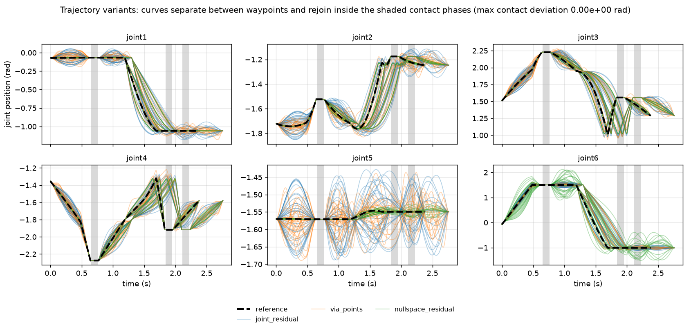
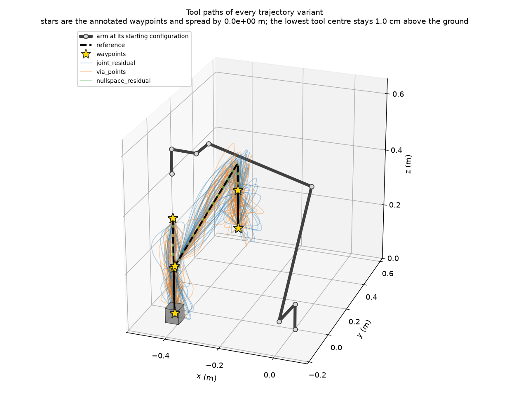

# Trajectory Variants

A collector that replans the same task many times tends to return the same
motion every time. Imitation learning then sees one way of doing the job, and
reinforcement-learning post-training starts from a policy that has never been
shown an alternative. Variant expansion keeps the waypoints a plan has already
committed to and varies only the motion between them.

This is narrower than [Affordance sampling](../atomic_actions/affordance_sampling.md),
which changes *where* the robot makes contact. Here every grasp, placement and
dwell stays exactly where planning put it, and only the free motion in between
differs. The two compose: a sampled affordance produces a new set of waypoints,
and variant expansion then produces several ways of executing that set.

## Where the variation comes from

```{list-table}
:header-rows: 1
:widths: 22 20 58

* - Factor
  - Operator
  - What changes
* - `spatial`
  - {func}`~embodichain.lab.sim.motion.expansion.joint_residual`,
    {func}`~embodichain.lab.sim.motion.expansion.via_points`
  - The shape of the joint path between two waypoints. `joint_residual` adds
    one fixed-shape bump per phase, so only its amplitude and sign vary;
    `via_points` places several interior knots whose signed magnitudes vary
    along one sampled joint direction, so paths differ in shape without the
    joints decorrelating. `spatial.method` names one or both, and each becomes
    its own variant.
* - `ik`
  - {func}`~embodichain.lab.sim.motion.expansion.nullspace_residual`
  - Arm posture, while holding the task rows the caller declares. This is what
    produces different elbow and wrist configurations for one tool path.
* - `timing`
  - {func}`~embodichain.lab.sim.motion.expansion.retime`
  - Free-phase duration, and the velocity profile within a phase. The path is
    untouched; only when the robot is where it is changes.
* - `approach`
  - {func}`~embodichain.lab.sim.motion.expansion.perturb_approach_direction`
  - The standoff pose a contact is reached from. This one produces Cartesian
    poses, so it is consumed *before* IK and planning, by whichever component
    builds the waypoints. Passing a configuration that enables it to the qpos
    helpers raises, rather than quietly producing no approach variation.
```

The `contact`, `contact_timing` and `recovery` factors are declared in the
configuration schema but not implemented; enabling one is rejected.

## What is and is not guaranteed

Every qpos-level operator uses an envelope that is zero, with zero derivative,
at both endpoints of the phase it modifies. Phases annotated `contact` or
`hold` are never touched at all. So:

- **Guaranteed.** Annotated waypoints, contact windows and dwell durations are
  bit-identical to the reference. Uncontrolled joints, such as a gripper, keep
  their schedule. Joint-limit violations among the joints an operator moved are
  rejected, and {func}`~embodichain.lab.sim.motion.expansion.validate_motion_limits`
  can reject sampled speed and acceleration violations.
- **First order only.** `nullspace_residual` holds the declared task rows by
  projecting onto the Jacobian null space at each sample. Interior samples drift
  as the linearization error grows; the phase endpoints stay exact regardless.
  Verify interior tool poses with forward kinematics if your task needs them.
- **Not guaranteed.** Nothing here establishes collision freedom, dynamic
  feasibility or task success. Deduplication compares measured joint geometry
  and elapsed phase time, which is a similarity measure, not a validity proof.
  Each accepted variant must still be executed and validated by the host.

## Running the tutorial

The Place tutorial grows a `--trajectory_variants` flag, in the same shape the
Affordance sampling tutorials use for `--affordance_branches`: one variant per
simulation row, mapped one to one. Row zero always replays the plan unchanged,
so the trajectory you already trust stays in the comparison. Run it in the
environment where EmbodiChain is installed (see
[Installation](../../../quick_start/install.md)):

```bash
python scripts/tutorials/atomic_action/place.py --num_envs 6 --device cuda
```

The tutorial declares only which of the action's own named segments may move:
the gripper-close and release segments are contact phases, and only the lift
and the place motion may be retimed, because the executor clears the cube's
dynamics at one shared step index. Everything else comes from the default
policy.

`--trajectory_variants` is the only variant flag an ordinary run needs; with
none of the advanced flags set the tutorial calls the helpers without a
configuration at all. The rest sit in an `advanced variant options` group in
`--help`, each overriding one part of the default policy. Add `--headless
--auto_play` to record a video without waiting for input.

The script logs the factors behind every accepted variant and the reason and
count of every rejected proposal:

```text
Trajectory variant 0: operator=none,               scale=1.0,  uniform, samples=239
Trajectory variant 1: operator=joint_residual,     scale=1.0,  uniform, samples=239
Trajectory variant 2: operator=via_points,         scale=1.0,  uniform, samples=239
Trajectory variant 3: operator=nullspace_residual, scale=1.0,  uniform, samples=239
Trajectory variant 4: operator=joint_residual,     scale=1.25, uniform, samples=277
Trajectory variant 5: operator=via_points,         scale=1.25, uniform, samples=277
```

### Seeing what changed

Add `--variant_plot_dir <dir>` to write two figures. Variants are generated
from one reference, so their number is independent of how many environments
replay them; ask for a hundred and run a single environment if you only want
the figures:

```bash
python scripts/tutorials/atomic_action/place.py --headless --num_envs 1 --device cuda --trajectory_variants 100 --variant_plot_dir outputs/variants
```

The first figure plots every variant's arm joints against time. Curves separate
between waypoints and rejoin inside the shaded contact phases, and the title
carries the largest contact-phase deviation of any variant from the reference,
which is `0.00e+00 rad`: contact windows are preserved exactly, not
approximately. With a hundred variants the curves are coloured by the operator
that produced them rather than named one by one.

<figure style="text-align: center; margin: 16px 0;">
  
  <figcaption><b>Arm joints of 100 variants.</b> Shaded spans are contact phases.</figcaption>
</figure>

`nullspace_residual` is the wide green band on `joint6`: for a grasp taken from
directly above, wrist roll is the freedom the declared task rows leave open, so
that is where posture variants spend their budget.

The second figure draws every variant's tool-centre path in the arena, beside
the arm at its starting configuration and the object drawn to scale on the
ground. Stars mark the annotated waypoints. Every variant draws its own, so
they would scatter if an operator had moved one; the title reports how far
apart they actually land, which is `0.0e+00 m`, together with the lowest tool
centre so ground clearance is stated rather than implied by a viewing angle.

<figure style="text-align: center; margin: 16px 0;">
  
  <figcaption><b>Tool paths of 100 variants.</b> Stars are the annotated waypoints.</figcaption>
</figure>

The variants form a tube around the reference that pinches shut at every
waypoint. Measured over those hundred: all hundred accepted with no rejected
proposals and a hundred distinct geometry families, a median tool-path length
of 1.09x the reference and 1.38x at worst, and three variants whose lowest tool
centre dips under 2 cm against a median of 2.8 cm. Sampling more variants
reaches further into those tails, which is a reason to keep a host-side
clearance or collision check rather than to trust the generator alone.

### Tuning the residual scale

`joint_offset_scale` is a fraction of each joint's **declared** range, so its
effect depends on how generous the robot's limits are. The tutorial's arm
declares plus/minus 2*pi on every joint, which makes even small fractions large
in absolute terms. Measured on this PickUp task with six variants:

```{list-table}
:header-rows: 1
:widths: 25 25 50

* - `joint_offset_scale`
  - Rows lifting the cube
  - Notes
* - 0.005
  - 6 of 6
  - Distinct only under a tighter deduplication tolerance.
* - 0.01
  - 6 of 6
  - Tutorial default; roughly 0.13 rad on this arm.
* - 0.02
  - 5 of 6
  - One `via_points` row disturbs the grasp.
* - 0.03
  - 5 of 6
  - Roughly 0.38 rad; clearly past the useful range here.
```

Keeping the knots of one `via_points` draw on a single joint-space direction
matters as much as the scale. Sampling every joint of every knot independently
decorrelates them, and the tool path that forward kinematics produces then
wanders: on the Place reference it ran 1.51x the reference arc length, against
1.11x once the knots share a direction. Nothing about that extra length is
useful to a downstream policy.

The window between "too small to register as a different geometry" and "large
enough to drop the object" is narrow on a task this tightly constrained. Keep
`coverage.joint_dedup_normalized_tol` well below `joint_offset_scale`, or
variants that really do differ will be discarded as duplicates: at the shared
default of 0.01 for both, the `via_points` variant collapses into the
reference's geometry family. The tutorial therefore defaults its
`--dedup_tolerance` to 0.004.

## Using it from code

There is one entry point, and one number to choose:

```python
from embodichain.lab.sim.motion.expansion import expand_trajectory_variants

result = expand_trajectory_variants(
    template,
    case=case,
    count=8,
    joint_limits=robot.get_qpos_limits()[0],
    control_dt=0.02,
)
```

That is the whole interface. Every augmentation method this package implements
is enabled by default, because a caller who wants several ways to run a plan
should not have to learn what a via point or a null-space projection is first.
The factors that were actually used come back on `result.cfg`, so an
auto-configured run stays reproducible.

Supplying `task_jacobians` additionally unlocks posture variants. Leave it out
and that one factor is simply not offered, rather than proposing variants that
would be rejected for missing inputs.

## Advanced options

Everything below is optional. Reach for it when the default policy does not
suit the task.

```{list-table}
:header-rows: 1
:widths: 40 60

* - Entry point
  - Use it when
* - {func}`~embodichain.lab.sim.motion.expansion.default_variant_factors`
  - You want to read or adjust the policy the helpers resolve, rather than
    writing a configuration from scratch. Pass the result back as `cfg`.
* - `cfg=` on
    {func}`~embodichain.lab.sim.motion.expansion.expand_trajectory_variants`
  - You need exact control. An explicit configuration is never overridden, and
    enabling a factor whose inputs are missing raises immediately.
* - {func}`~embodichain.lab.sim.motion.expansion.plan_trajectory_variants` with
    {func}`~embodichain.lab.sim.motion.expansion.apply_trajectory_variant`
  - You want the enumeration and the application separately, for example to log
    the intended assignment before planning.
* - `velocity_limits` and `acceleration_limits`
  - You want sampled motion-limit rejection on top of joint-limit rejection.
* - `max_attempts`
  - The default budget of four proposals per requested variant is not enough
    for a heavily constrained task.
```

The knobs inside a configuration are `spatial.method`, `spatial.via_count`,
`spatial.joint_offset_scale`, `ik.task_rows`, `ik.normalized_scale`,
`timing.duration_scales`, `timing.profiles`, `coverage.target_per_cell` and
`coverage.joint_dedup_normalized_tol`. The two that most often need attention
are the offset scale and the deduplication tolerance, measured above.

`coverage.target_per_cell` caps how many timing variants may share one geometry
family. Timing-only expansion therefore cannot exceed that cap, because all of
its variants have the same measured geometry. Raise it when timing is the only
enabled factor.

## Redundancy and the Jacobian frame

`nullspace_residual` takes whatever task rows the caller declares, in the rows
of the Jacobian the caller supplies. A six-row Jacobian on a six-joint arm
generically leaves no redundancy, and the operator raises rather than silently
returning the reference. Dropping the rows the task does not actually constrain
is what creates alternative postures.

The frame convention is the caller's responsibility. `BaseSolver.get_jacobian`
returns a Jacobian in the arm's base frame, so dropping its angular-z row
removes rotation about base z, not about the tool axis. For a top-down grasp
these coincide, which is why the tutorial keeps rows `(0, 1, 2, 3, 4)`. A task
that grasps from the side must choose its rows accordingly, or supply a
Jacobian already expressed in the tool frame.

Column order matters too: solver Jacobian columns follow the solver's own joint
names, which need not match the robot's public joint order. The simplest way to
stay aligned is to declare `controlled_joint_indices` in solver order, as the
tutorial does, so no permutation is needed anywhere.

## What combines with what

```{list-table}
:header-rows: 1
:widths: 45 55

* - Rule
  - Why
* - `joint_residual`, `via_points` and `nullspace_residual` are mutually
    exclusive **within one variant**
  - A null-space projection is computed against the reference Jacobians;
    stacking it on an already displaced path would invalidate its task-row
    claim. All three can still be enabled together and appear as separate
    variants.
* - `retime` combines with any one of them
  - The two are orthogonal: one changes the geometry, the other changes only
    when the robot is where it is. Retiming runs after the joint-path operator.
* - `approach` is never applied by these helpers, and enabling it raises
  - It produces Cartesian standoff poses, which have to be replanned through IK
    before they become a trajectory. The configuration schema still accepts the
    factor, so an upstream planning stage can declare it in a shared job
    configuration; only the qpos entry points refuse it.
* - `contact`, `contact_timing` and `recovery` are rejected
  - They are declared in the schema but not implemented.
* - No operator touches a `contact` or `hold` phase
  - That is how fixed waypoints stay fixed.
* - An operator runs on a free phase only if that phase lists it
  - Hosts use this to keep a specific operator away from a specific phase. The
    tutorial allows `retime` only from the lift onward, so every row clears the
    cube's dynamics on the same simulation step.
```

## Limitations

- At most one joint-path operator runs per variant. A null-space projection
  stacked on an already displaced joint path would no longer correspond to the
  Jacobians it was computed from, so the combination is not offered.
- Retiming requires the reference trajectory's phase boundaries to already sit
  on the host command clock. An unaligned reference is rejected rather than
  silently resampled, which is why the tutorial plans with a deterministic
  interpolation strategy on an explicit `--control_dt`.
- Variants retimed to different lengths are padded by repeating the final valid
  sample. A shorter variant holds its last command instead of running past its
  own end; use `CandidateTrajectoryBatch.valid_mask` before recording.
- Task Program, Gym lifecycle, dataset persistence and the collection
  bookkeeping in
  {class}`~embodichain.lab.sim.motion.expansion.GenerationSession` are
  deliberately out of scope. This is a direct-simulation contract: the host
  owns execution, reset, validation and storage.
