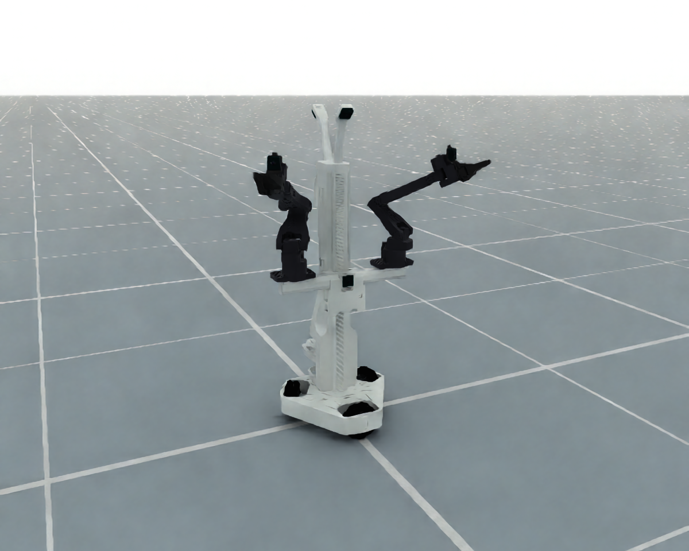

# Aloha Mini 2 Pro

`AlohaMiniCfg` loads the complete `AlohaMini/alohamini2pro.urdf` asset without
renaming its joints or assembling separate arms.

<div style="text-align: center;">
  
  <p><b>Aloha Mini 2 Pro</b></p>
</div>

```python
from embodichain.lab.sim.robots import AlohaMiniCfg

cfg = AlohaMiniCfg.from_dict({"uid": "aloha_mini"})
robot = sim.add_robot(cfg=cfg)
```

| Control part | DOF | Joints / endpoint |
| --- | --- | --- |
| `left_arm` | 6 | Shoulder through wrist; `left_tcp` |
| `right_arm` | 6 | Shoulder through wrist; `right_tcp` |
| `left_hand` | 1 | `left_gripper` |
| `right_hand` | 1 | `right_gripper` |
| `torso` | 1 | `vertical_move` |

The arms use `PytorchSolverCfg` with the TCP frames authored in the asset.
The torso uses a position-only solver; the hands use joint-space commands.
The source's three planar base joints and three wheel joints remain outside
these control parts, with position drives that hold their initial positions.
Drive gains follow the CobotMagic simulation preset and can be overridden
through `joint_drive_props`.

`cfg.build_pk_serial_chain()` returns all five parts. Each chain is local to
its part: arm poses are relative to `left_Base` / `right_Base`, hand poses to
the fixed jaws, and torso poses to `base_cad_link`. Arm chains do not include
torso or planar base motion. Hand chains describe moving-jaw poses, while the
arm chains describe the grasp TCPs.

Run a headless construction smoke check with:

```bash
python -m embodichain.lab.sim.robots.aloha_mini --headless --device cpu
```

Omit `--headless` for the interactive simulation window. Select the physics
backend with `--physics default` or `--physics newton`.

See the [API reference](../../api_reference/aloha_mini.rst).
