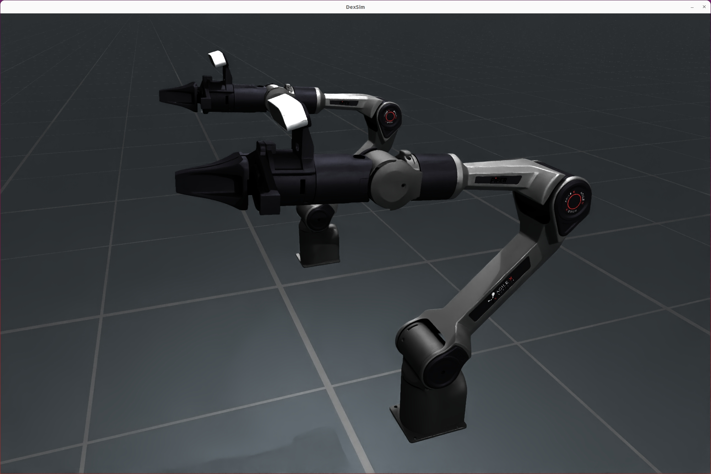

# CobotMagic

CobotMagic is a versatile dual-arm collaborative robot developed by AgileX Robotics. It is widely used in simulation, education, industry, and service scenarios. All examples in this document are based on the latest PourWater task environment.

<div style="text-align: center;">
  
  <p><b>CobotMagic</b></p>
</div>


## Key Features

- **Dual-arm parallel structure** supporting multiple layouts (standard, face-to-face, custom)
- **Configurable gripper models** (V70/V100) and material types (NORMAL/NEW_UV/NO_MATERIAL)
- **Flexible URDF assembly** and simulation parameter configuration
- **Compatible with SimulationManager**, supporting multi-arena parallel simulation
- **High degree of freedom**: 16 axes (dual arms + grippers, each gripper includes 1 mimic joint)
- **Customizable control groups** for flexible task decomposition and extension

---

## Robot Parameters

| Parameter             | Description                                                      |
|-----------------------|------------------------------------------------------------------|
| Number of joints      | 16 (dual arms + grippers, each gripper includes a mimic joint)   |
| Gripper models        | V70 / V100                                                       |
| Layout types          | NORMAL (standard) / FACE_TO_FACE / CUSTOM                        |
| Initial base height   | 0.7775m (adjustable)                                             |
| Mobile base support   | **Not supported** in the current version (fixed base only)        |

> **Note:** The current version of CobotMagic does **not** support a mobile base. All examples and environments assume a fixed base configuration.

---

## Quick Initialization Example

```python
from embodichain.lab.sim import SimulationManager, SimulationManagerCfg
from embodichain.lab.sim.robots import CobotMagicCfg

config = SimulationManagerCfg(headless=False, sim_device="cpu", num_envs=2)
sim = SimulationManager(config)
sim.set_manual_update(False)

robot = sim.add_robot(cfg=CobotMagicCfg().from_dict({}))
```

---

## Configuration Parameters

### 1. Main Configuration Items

- **uid**: Unique identifier for the robot, default is "CobotMagic"
- **urdf_cfg**: URDF configuration, supports multi-component assembly (e.g., dual arms)
- **control_parts**: Control groups for independent control of each arm and gripper
- **solver_cfg**: Inverse kinematics solver configuration, customizable end-effector and base
- **drive_pros**: Joint drive properties (stiffness, damping, max effort, etc.)
- **attrs**: Rigid body physical attributes (mass, friction, damping, etc.)

### 2. Custom Usage Example

```python
from embodichain.lab.sim.robots import CobotMagicCfg

custom_cfg = {
    "init_pos": [0.0, 0.0, 1.0],  # Initial position
    # Add more custom parameters as needed
}
cfg = CobotMagicCfg.from_dict(custom_cfg)
robot = sim.add_robot(cfg=cfg)
```

### 3. Control Group Example

```python
control_parts = {
    "left_arm": ["LEFT_JOINT1", ..., "LEFT_JOINT6"],
    "left_eef": ["LEFT_JOINT7", "LEFT_JOINT8"],
    "right_arm": ["RIGHT_JOINT1", ..., "RIGHT_JOINT6"],
    "right_eef": ["RIGHT_JOINT7", "RIGHT_JOINT8"],
}
```


## References

- [AgileX CobotMagic Product Page](https://global.agilex.ai/products/cobot-magic)
- Related URDF file paths (located in `CobotMagicArm/`):
  - `CobotMagicWithGripperV70.urdf`
  - `CobotMagicWithGripperV100.urdf`
  - `CobotMagicNoGripper.urdf`
