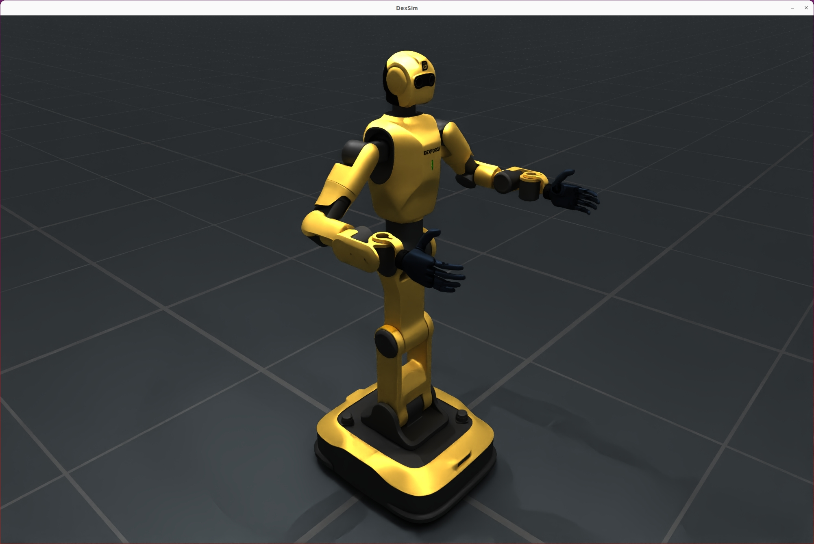
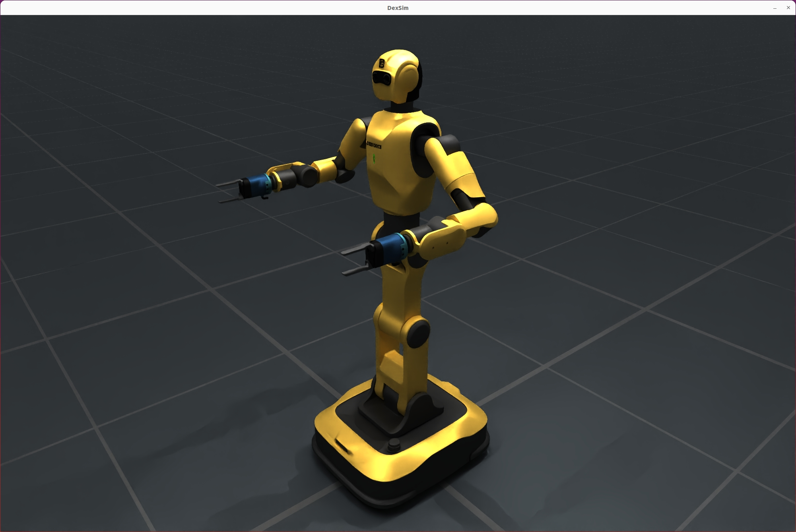

# Dexforce W1

Dexforce W1 is a versatile robot developed by DexForce Technology Co., Ltd., supporting both industrial and anthropomorphic arm types. It is suitable for various simulation and real-world application scenarios.

<div style="display: flex; justify-content: center; align-items: flex-start; gap: 20px; flex-wrap: wrap;">
  <figure style="text-align: center; margin: 10px;">
    
    <figcaption><b>Anthropomorphic Version</b></figcaption>
  </figure>
  <figure style="text-align: center; margin: 10px;">
    
    <figcaption><b>Industrial Version</b></figcaption>
  </figure>
</div>

## Key Features

- Supports multiple arm types (industrial, anthropomorphic)
- Configurable left/right hand brand and version
- Flexible URDF assembly and simulation configuration
- Compatible with SimulationManager simulation environment

## Method 1: Fine-grained configuration with `build_dexforce_w1_cfg`

This method allows you to specify detailed parameters for each arm and hand. Recommended for advanced users who need full control over robot hardware options.

**Parameters:**

- `arm_kind`: Arm type, e.g., `DexforceW1ArmKind.ANTHROPOMORPHIC` or `DexforceW1ArmKind.INDUSTRIAL`.
- `hand_types`: Dict specifying hand brand for each arm side (`LEFT`/`RIGHT`).
- `hand_versions`: Dict specifying hand version for each arm side.

```python
hand_types = {
    DexforceW1ArmSide.LEFT: DexforceW1HandBrand.BRAINCO_HAND,
    DexforceW1ArmSide.RIGHT: DexforceW1HandBrand.BRAINCO_HAND,
}
hand_versions = {
    DexforceW1ArmSide.LEFT: DexforceW1Version.V021,
    DexforceW1ArmSide.RIGHT: DexforceW1Version.V021,
}
cfg = build_dexforce_w1_cfg(
    arm_kind=DexforceW1ArmKind.ANTHROPOMORPHIC,
    hand_types=hand_types,
    hand_versions=hand_versions,
)
robot = sim.add_robot(cfg=cfg)
print("DexforceW1 robot added to the simulation.")
```

## Method 2: Quick configuration with `DexforceW1Cfg.from_dict`

This method allows fast setup using a dictionary, suitable for simple scenarios or when default options are sufficient. Recommended for rapid prototyping or when only basic parameters are needed.

**Parameters:**

- `uid`: Unique robot identifier (string).
- `version`: Robot version, e.g., `v021`.
- `arm_kind`: Arm type, e.g., `anthropomorphic` or `industrial` (string).

```python
from embodichain.lab.sim.robots import DexforceW1Cfg
cfg = DexforceW1Cfg.from_dict(
    {"uid": "dexforce_w1", "version": "v021", "arm_kind": "anthropomorphic"}
)
robot = sim.add_robot(cfg=cfg)
print("DexforceW1 robot added to the simulation.")
```

## Arm Joint Design: Mirrored Configuration

DexforceW1's left and right arms are designed with mirrored joint configurations. This means the joint angles for the left and right arms are symmetric but opposite in sign for certain axes, making it easier to coordinate bimanual tasks and maintain natural robot postures.

### Example: Setting Arm Joint Positions

```python
import numpy as np
# Set left arm joint positions (mirrored)
robot.set_qpos(qpos=[0, -np.pi/4, 0.0, -np.pi/2, -np.pi/4, 0.0, 0.0], joint_ids=robot.get_joint_ids("left_arm"))
# Set right arm joint positions (mirrored)
robot.set_qpos(qpos=[0, np.pi/4, 0.0, np.pi/2, np.pi/4, 0.0, 0.0], joint_ids=robot.get_joint_ids("right_arm"))
```

This mirrored design simplifies motion planning and ensures that both arms can perform coordinated or symmetric actions efficiently.

## Configuration Method Selection

Choose `build_dexforce_w1_cfg` for maximum flexibility and hardware customization. Use `DexforceW1Cfg.from_dict` for quick setup and prototyping. Both methods produce a configuration object (`cfg`) that can be passed to `sim.add_robot(cfg=cfg)` to add the robot to the simulation.

**Note:**

- Ensure parameter types match the expected enums or strings.
- For advanced simulation scenarios, prefer the fine-grained method.
- For most demos or simple tasks, the quick method is sufficient.

## Type Descriptions

| Type                    | Options / Values                                      | Description                        |
|-------------------------|-------------------------------------------------------|------------------------------------|
| `DexforceW1ArmKind`     | `ANTHROPOMORPHIC`, `INDUSTRIAL`                       | Arm type                           |
| `DexforceW1HandBrand`   | `BRAINCO_HAND`, `DH_PGC_GRIPPER`, `DH_PGC_GRIPPER_M`  | Hand brand                         |
| `DexforceW1Version`     | `V021`                                                | Release version                    |
| `DexforceW1ArmSide`     | `LEFT`, `RIGHT`                                       | Left/right hand identifier         |
