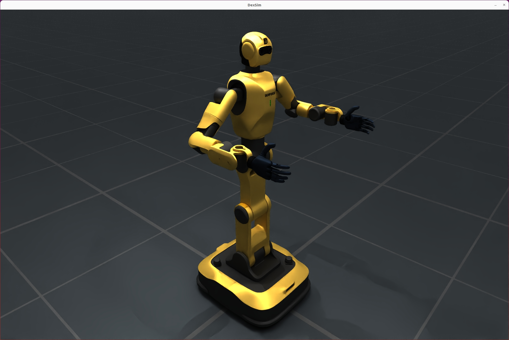

# Dexforce W1

Dexforce W1 is a dual-arm humanoid robot developed by DexForce Technology Co., Ltd.

<div style="display: flex; justify-content: center; align-items: flex-start; gap: 20px; flex-wrap: wrap;">
  <figure style="text-align: center; margin: 10px;">
    
    <figcaption><b>Dexforce W1</b></figcaption>
  </figure>
</div>

## Key Features

- Supports dual 7-DOF arms
- Supports version-owned asset layouts and calibration parameters
- Configurable left/right hand brand and version
- Flexible URDF assembly and simulation configuration
- Compatible with SimulationManager simulation environment

## Method 1: Fine-grained configuration with `build_dexforce_w1_cfg`

This method allows you to specify detailed parameters for each arm and hand.

**Parameters:**

- `hand_types`: Dict specifying hand brand for each arm side (`LEFT`/`RIGHT`).
- `hand_versions`: Dict specifying hand version for each arm side.

```python
hand_types = {
    DexforceW1ArmSide.LEFT: DexforceW1HandBrand.BRAINCO_HAND,
    DexforceW1ArmSide.RIGHT: DexforceW1HandBrand.BRAINCO_HAND,
}
hand_versions = {
    DexforceW1ArmSide.LEFT: DexforceW1Version.V025,
    DexforceW1ArmSide.RIGHT: DexforceW1Version.V025,
}
cfg = build_dexforce_w1_cfg(
    version=DexforceW1Version.V025,
    hand_types=hand_types,
    hand_versions=hand_versions,
)
robot = sim.add_robot(cfg=cfg)
print("DexforceW1 robot added to the simulation.")
```

## Method 2: Quick configuration with `DexforceW1Cfg.from_dict`

This method allows fast setup using a dictionary, suitable for simple scenarios or when default options are sufficient. Recommended for rapid prototyping or when only basic parameters are needed.

**Parameters:**

- `uid`: Unique robot identifier (string).
- `version`: Robot version, e.g., `v021` or `v025`.

```python
from embodichain.lab.sim.robots import DexforceW1Cfg
cfg = DexforceW1Cfg.from_dict({"uid": "dexforce_w1", "version": "v025"})
robot = sim.add_robot(cfg=cfg)
print("DexforceW1 robot added to the simulation.")
```

## Arm Joint Design: Mirrored Configuration

DexforceW1's left and right arms are designed with mirrored joint configurations. This means the joint angles for the left and right arms are symmetric but opposite in sign for certain axes, making it easier to coordinate bimanual tasks and maintain natural robot postures.

### Example: Setting Arm Joint Positions

```python
import numpy as np
# Set left arm joint positions (mirrored)
robot.set_qpos(qpos=[0, -np.pi/4, 0.0, -np.pi/2, -np.pi/4, 0.0, 0.0], joint_ids=robot.get_joint_ids("left_arm"))
# Set right arm joint positions (mirrored)
robot.set_qpos(qpos=[0, np.pi/4, 0.0, np.pi/2, np.pi/4, 0.0, 0.0], joint_ids=robot.get_joint_ids("right_arm"))
```

This mirrored design simplifies motion planning and ensures that both arms can perform coordinated or symmetric actions efficiently.

## Configuration Method Selection

Choose `build_dexforce_w1_cfg` for maximum flexibility and hardware customization. Use `DexforceW1Cfg.from_dict` for quick setup and prototyping. Both methods produce a configuration object (`cfg`) that can be passed to `sim.add_robot(cfg=cfg)` to add the robot to the simulation.

**Note:**

- Ensure parameter types match the expected enums or strings.
- For advanced simulation scenarios, prefer the fine-grained method.
- For most demos or simple tasks, the quick method is sufficient.

## Type Descriptions

| Type                    | Options / Values                                      | Description                        |
|-------------------------|-------------------------------------------------------|------------------------------------|
| `DexforceW1HandBrand`   | `BRAINCO_HAND`, `DH_PGC_GRIPPER`, `DH_PGC_GRIPPER_M`  | Hand brand                         |
| `DexforceW1Version`     | `V021`, `V025`                                        | Release version                    |
| `DexforceW1ArmSide`     | `LEFT`, `RIGHT`                                       | Left/right hand identifier         |

## V025 asset layout and version extension

V025 uses one unified Hugging Face archive:

```text
dexforce_w1/v025/w1.zip
└── w1/
    ├── robot.urdf
    ├── chassis.urdf
    ├── torso.urdf
    ├── head.urdf
    ├── left_arm.urdf
    ├── right_arm.urdf
    ├── visual/
    └── collision/
```

The runtime downloads this archive once. Direct FK/IK uses `robot.urdf` or the
arm URDFs, while configurable robot assembly reads all components from the same
extracted directory. The V025 head already contains the `eyes` link and joint,
so the assembly builder does not inject a duplicate eyes sensor.

### Version-owned end-effector offset

Different arm revisions may place the physical mounting surface at different
positions relative to the arm `ee` frame. This difference belongs to the W1
revision, not to a BrainCo hand, DH gripper, PIKA gripper, or any other
end-effector.

`W1VersionSpec.default_eef_attach_xpos` is the single source of truth for this
revision offset:

| Version | Left arm | Right arm |
|---------|----------|-----------|
| V021 | Identity | Identity |
| V025 | `+0.012 m` along the `ee` frame Z axis | `+0.012 m` along the `ee` frame Z axis |

The final assembly transform and solver TCP are derived as follows:

```python
final_attach_xpos = version_attach_xpos @ eef_attach_xpos
final_tcp = version_attach_xpos @ solver_tcp
```

Therefore, the V025 offset affects both the assembled end-effector position and
FK/IK results. The offset is also applied when callers provide a custom
`hand_attach_xposes` value, a custom `left_hand`/`right_hand` component
transform, or an explicit arm TCP through `DexforceW1Cfg.from_dict`.
Serialization removes the derived offset and restores it on loading, so a
configuration round trip does not apply the offset twice.

Do not manually add the 12 mm correction to an end-effector transform or TCP.
Those values must describe the end-effector relative to the standard mounting
surface; the W1 version layer adds the robot revision correction.

Per-component version overrides are supported for controlled migrations:

```python
cfg = DexforceW1Cfg.from_dict(
    {
        "uid": "dexforce_w1",
        "version": "v021",
        "component_versions": {
            "left_arm": "v025",
            "right_arm": "v025",
        },
    }
)
```

To add another W1 revision:

1. Register the new `DexforceW1Version` value and dataset archive.
2. Add one `W1VersionSpec` entry in
   `embodichain/lab/sim/robots/dexforce_w1/specs.py`.
3. Register component URDF paths and the full-robot URDF path.
4. Set the arm kinematic parameters and
   `default_eef_attach_xpos` for both sides. Use identity only after confirming
   that the arm `ee` frame is already at the physical mounting surface.
5. Verify that the same version offset is present in both the assembled
   end-effector pose and the final FK/IK TCP.
6. Validate hand/gripper mounting, wrist cameras, FK/IK, VR teleoperation, and
   real2sim task regression.

Builders, control parts, assembly, TCP selection, analytical parameters and
FK/IK then use the version specification without revision-specific branches.
