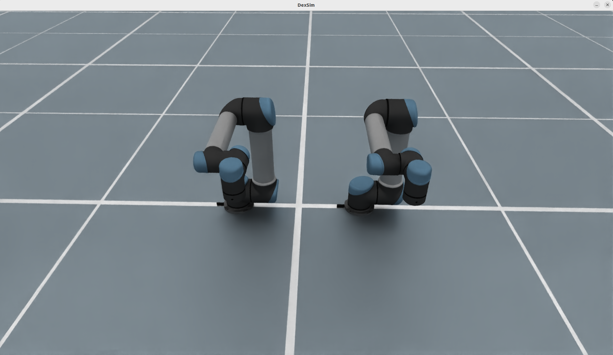
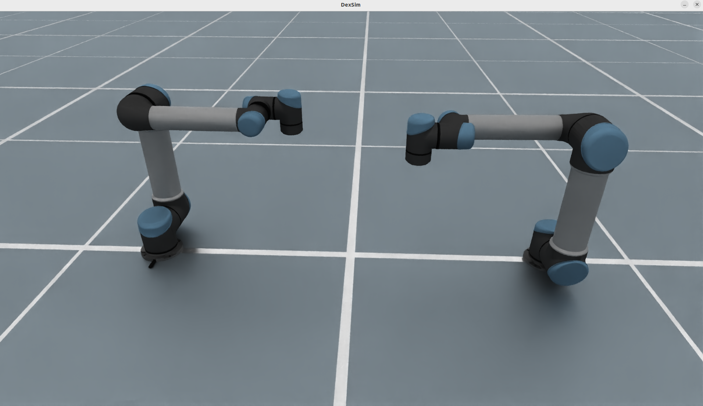
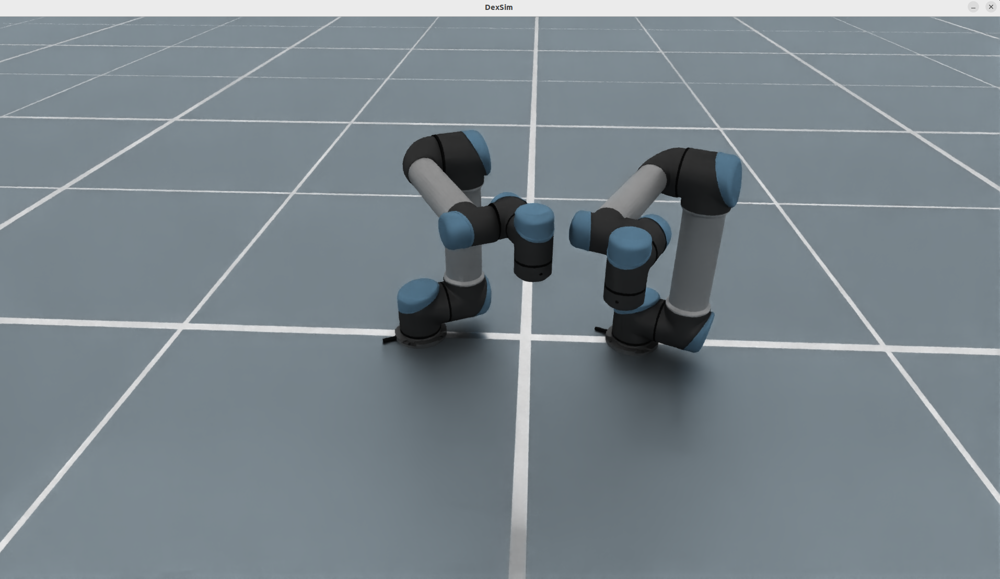

# Dual-Arm Composition

`DualArmRobotCfg` builds a bimanual robot from a single-arm base config that
already follows the standard `"arm"` convention. In the current EmbodiChain
setup, the dual-arm examples are based on the UR family and are assembled onto a
shared synthetic `base_link` through `URDFCfg`.

The images below show the three documented dual-arm layouts currently used for
this robot family: a separated side-by-side arrangement, a wide mirrored
forward-facing arrangement, and a tighter mirrored arrangement for close
workspace overlap.

<div style="display: flex; justify-content: center; align-items: flex-start; gap: 20px; flex-wrap: wrap;">
  <figure style="text-align: center; margin: 10px;">
    
    <figcaption><b>Side-by-Side</b></figcaption>
  </figure>
  <figure style="text-align: center; margin: 10px;">
    
    <figcaption><b>Wide Mirrored Layout</b></figcaption>
  </figure>
  <figure style="text-align: center; margin: 10px;">
    
    <figcaption><b>Close Mirrored Layout</b></figcaption>
  </figure>
</div>

## Key Features

- **Generic dual-arm builder** from any single-arm `RobotCfg` that exposes one `arm` URDF component, one `control_parts["arm"]`, and one `solver_cfg["arm"]`.
- **Image-backed mount presets** covering separated, inward-facing, and mirrored-`rz` layouts.
- **Automatic left/right derivation** for URDF components, control parts, solver configs, and drive properties.
- **Config-driven construction** through `DualArmRobotCfg.from_dict(...)` with registry-based base robot lookup.
- **Optional composite `dual_arm` part** for commanding both manipulators together.
- **Round-trip support** through `to_dict()` / `from_dict()` on the generated config.

## Visual Layouts

- **Side-by-side** keeps both bases offset by `±separation/2` along Y with the same orientation.
- **Wide mirrored layout** spreads the arms apart while rotating them symmetrically so they open away from each other.
- **Close mirrored layout** rotates the arms symmetrically toward a shared center workspace for overlapping reach.

## Usage

```python
from embodichain.lab.sim import SimulationManager, SimulationManagerCfg
from embodichain.lab.sim.robots import DualArmRobotCfg

sim = SimulationManager(SimulationManagerCfg(headless=True, num_envs=4))

cfg = DualArmRobotCfg.from_dict(
    {
        "base_robot": "ur5",
        "mount": {
            "preset": "mirrored_rz",
            "separation": 0.6,
            "rz": 0.7853981633974483,
        },
    }
)
robot = sim.add_robot(cfg=cfg)
```

## Mount Presets

| Preset | Layout |
|--------|--------|
| `side_by_side` | Left arm at `+separation/2` in Y, right arm at `-separation/2` in Y, same orientation on both sides. |
| `facing_inward` | Same `±separation/2` offsets, with yaw `+pi/2` on the left arm and `-pi/2` on the right arm. |
| `mirrored_rz` | Same `±separation/2` offsets, with yaw `+rz` on the left arm and `-rz` on the right arm. |

The `mount` configuration also supports paired per-arm overrides:

```python
cfg = DualArmRobotCfg.from_dict(
    {
        "base_robot": "ur5",
        "mount": {
            "preset": "side_by_side",
            "separation": 0.6,
            "left": {"xyz": [0.0, 0.35, 0.0], "rpy": [0.0, 0.0, 0.0]},
            "right": {"xyz": [0.1, -0.35, 0.0], "rpy": [0.0, 0.0, 0.0]},
        },
    }
)
```

## Configuration Parameters

| Parameter | Description |
|-----------|-------------|
| `base_robot` | Registry key such as `"ur3"` through `"ur10e"`, or `{"type": ..., "init": {...}}` for extra base config overrides. |
| `mount` | Mount dict consumed by `resolve_mounts`, including `preset`, `separation`, optional `rz`, and optional paired `left` / `right` overrides. |
| `arm_part` | Base robot manipulator control part name. Default: `"arm"`. |
| `dual_part` | Whether to emit the concatenated `dual_arm` control part. Default: `True`. |

## Derived Control Parts

For a UR5 base robot with the default preserved joint casing, `DualArmRobotCfg`
produces:

| Part | Joints |
|------|--------|
| `left_arm` | `left_joint1` to `left_joint6` |
| `right_arm` | `right_joint1` to `right_joint6` |
| `dual_arm` | concatenation of the 12 joints above |

For other base robots, the builder preserves the source URDF naming policy and
applies the `left_` / `right_` prefixes consistently with the assembled URDF.

## Programmatic Build Path

```python
from embodichain.lab.sim.robots import URRobotCfg, build_dual_arm_cfg, resolve_mounts

base = URRobotCfg.from_dict({"robot_type": "ur5"})
mounts = resolve_mounts({"preset": "facing_inward", "separation": 0.6})
cfg = build_dual_arm_cfg(base, mounts, dual_part=False)
```

## Adding a New Base Robot

A single-arm robot becomes dual-arm-ready by:

1. following the existing `"arm"` convention in its single-arm cfg,
2. exposing `control_parts["arm"]` and `solver_cfg["arm"]`,
3. adding one registry entry in `embodichain/lab/sim/robots/dual_arm.py`.

That keeps the dual-arm path generic: no extra mixin or robot-specific dual-arm
class is required.
