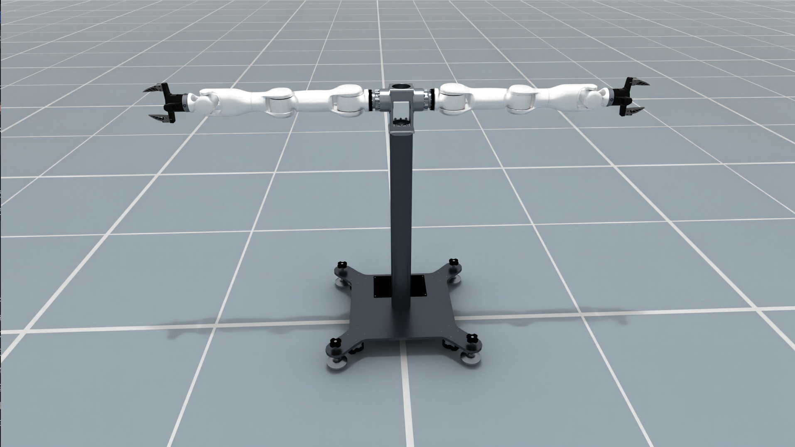

# Tianji Marvin

Tianji Marvin is a dual-arm platform from TianJi Robotics. The EmbodiChain
preset keeps the source ACD joint and link names and provides two seven-joint
arm control parts with optional parallel-jaw grippers.

<div style="text-align: center;">
  
  <p><b>Tianji Marvin</b></p>
</div>

## Key Features

- **Dual seven-DOF arms** with separate `left_arm` and `right_arm` control parts.
- **Optional parallel-jaw grippers** with mimic joints, selected through
  `with_gripper`.
- **Source-compatible asset naming** using the original ACD URDF joint and link
  names.
- **PyTorch FK/IK solvers** with a documented tool-center-point transform for
  each arm.
- **Simulation-ready configuration** for `SimulationManager`, including fixed
  base properties and configurable joint drives.

## Robot Parameters

| Parameter | Description |
| --- | --- |
| Arm DOF | 7 per arm, 14 total |
| Gripper variant | `with_gripper=True` adds `left_hand` and `right_hand`; the default is `True` |
| Gripper joints | Two finger joints per hand; finger 2 mimics finger 1 |
| Arm root links | `left_arm_base` and `right_arm_base` |
| Gripper asset | `TianjiMarvin/robot_with_ee_acd.urdf` |
| Arm-only asset | `TianjiMarvin/robot_acd.urdf` |
| Physics root | Fixed base in the simulation preset |

The two variants expose the following control parts:

| Setting | Control parts |
| --- | --- |
| `True` (default) | `left_arm`, `right_arm`, `left_hand`, `right_hand` |
| `False` | `left_arm`, `right_arm` |

## Quick Initialization Example

```python
from embodichain.lab.sim import SimulationManager, SimulationManagerCfg
from embodichain.lab.sim.robots import TianjiMarvinCfg

config = SimulationManagerCfg(headless=False, device="cpu", num_envs=1)
sim = SimulationManager(config)

robot = sim.add_robot(
    cfg=TianjiMarvinCfg.from_dict({"with_gripper": True})
)

# Explicitly advance physics when the application is ready.
sim.update(step=1)
```

Use the arm-only model when the task supplies its own end effectors:

```python
cfg = TianjiMarvinCfg.from_dict({"with_gripper": False})
robot = sim.add_robot(cfg=cfg)
```

## Configuration Parameters

### Main Configuration Items

- **`with_gripper`**: Selects the complete gripper model or the arm-only ACD
  model. The field must be a boolean.
- **`fpath`**: Optional URDF override. The same selected URDF is used for
  simulation and serial-chain FK/IK construction.
- **`control_parts`**: Joint groups for the two arms and, when enabled, the two
  hands. Joint names retain the source asset naming.
- **`solver_cfg`**: Per-arm `PytorchSolverCfg` entries. The default roots are
  `left_arm_base` and `right_arm_base`.
- **`joint_drive_props`**: Simulation drive gains. The preset uses simulation
  defaults and does not claim to reproduce factory motor specifications.

### TCP and FK/IK

The source end links depend on the selected variant:

| `with_gripper` | Left source end link | Right source end link |
| --- | --- | --- |
| `True` | `left_hand_tool_link` | `right_hand_tool_link` |
| `False` | `left_ee` | `right_ee` |

Both variants apply the same end-link-to-TCP transform. The TCP origin is
translated 0.13 m along the source end link's +X axis and rotated +90 degrees
about that link's Y axis:

```text
T_end_link_tcp = [[ 0, 0, 1, 0.13],
                  [ 0, 1, 0, 0   ],
                  [-1, 0, 0, 0   ],
                  [ 0, 0, 0, 1   ]]
```

Solver FK returns `T_root_tcp = T_root_end_link @ T_end_link_tcp`, and solver
IK expects the TCP pose relative to the arm root. Named `Robot.compute_fk()` and
`Robot.compute_ik()` use the TCP pose in the local arena frame. If an application
starts with a source end-link pose, convert it before calling IK:

```text
T_arena_tcp = T_arena_end_link @ T_end_link_tcp
```

`build_pk_serial_chain()` returns raw seven-joint chains ending at the source
links. Its FK omits the configured TCP transform; right-multiply by
`solver_cfg[part].tcp` to obtain the solver TCP pose. To operate directly on
source end-link poses, override both arm TCP transforms with identity matrices:

```python
import numpy as np
from embodichain.lab.sim.robots import TianjiMarvinCfg

cfg = TianjiMarvinCfg.from_dict(
    {
        "with_gripper": False,
        "solver_cfg": {
            "left_arm": {"tcp": np.eye(4).tolist()},
            "right_arm": {"tcp": np.eye(4).tolist()},
        },
    }
)
```

## Preview

Run the preview and FK/IK smoke check in the project environment:

```bash
conda run -n embodichain python -m embodichain.lab.sim.robots.tianji_marvin --headless
conda run -n embodichain python -m embodichain.lab.sim.robots.tianji_marvin --headless --no-with-gripper
```

Omit `--headless` to open the simulation window and an interactive session.

## References

- [TianJi Marvin Series official product page](https://en.tianjizn.com/products/marvin-series/)
- [TianJi official download center](https://en.tianjizn.com/download/)
