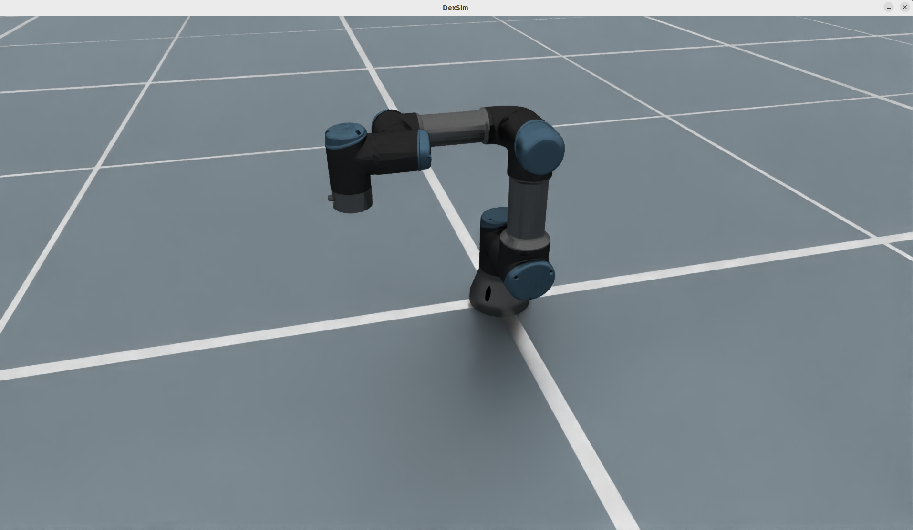
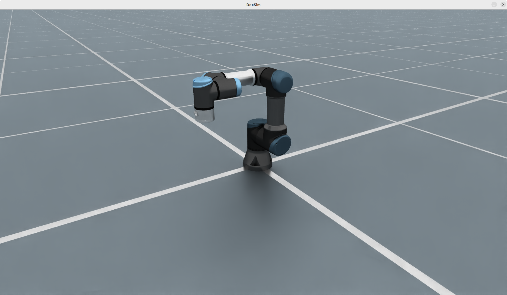
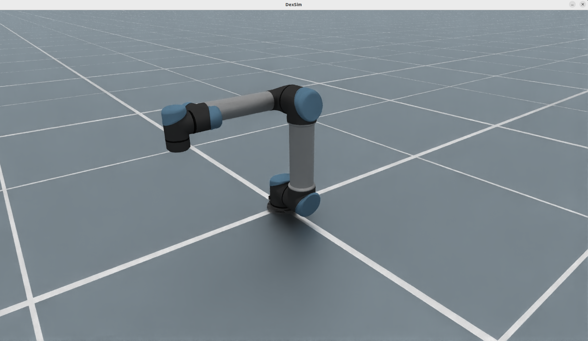
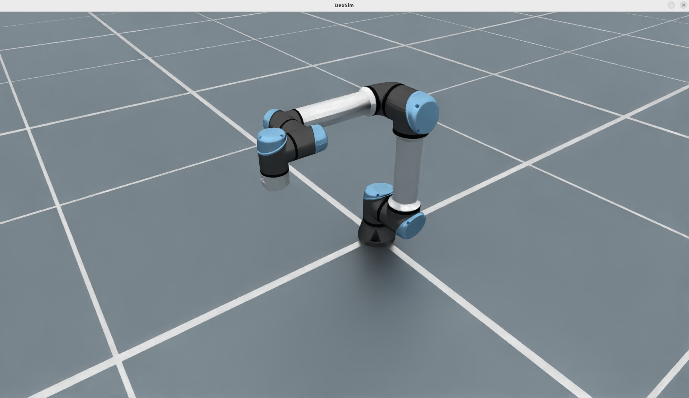
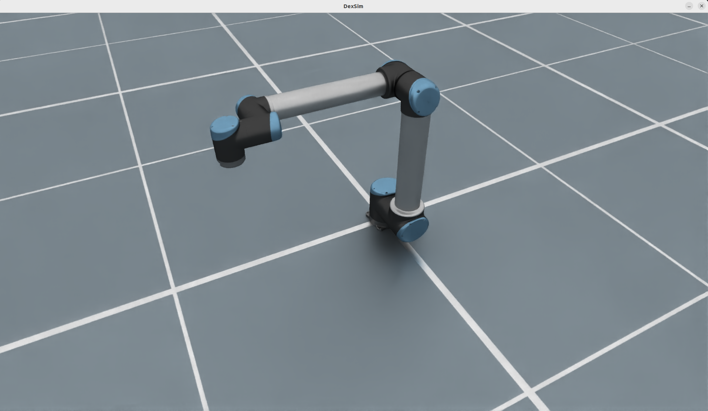
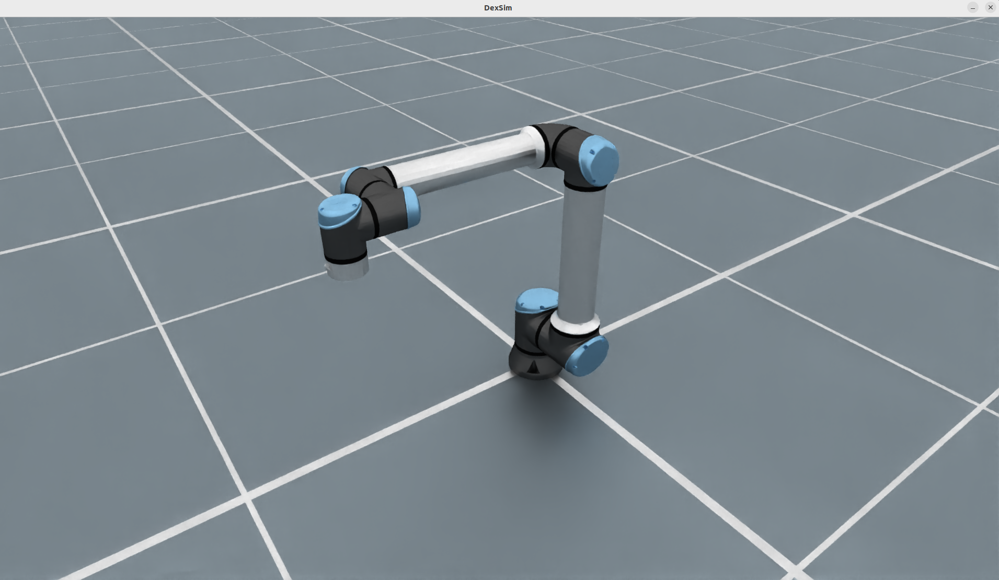

# UR Family (UR3 / UR5 / UR10 + e variants)

`URRobotCfg` covers six Universal Robots manipulators in one configuration class:
`ur3`, `ur3e`, `ur5`, `ur5e`, `ur10`, and `ur10e`. The images below show the exact
variants currently documented in EmbodiChain: the compact UR3 pair, the mid-reach
UR5 pair, and the long-reach UR10 pair, with darker classic models and brighter
silver-arm e-series renders.

<div style="display: flex; justify-content: center; align-items: flex-start; gap: 20px; flex-wrap: wrap;">
  <figure style="text-align: center; margin: 10px;">
    
    <figcaption><b>UR3</b></figcaption>
  </figure>
  <figure style="text-align: center; margin: 10px;">
    
    <figcaption><b>UR3e</b></figcaption>
  </figure>
  <figure style="text-align: center; margin: 10px;">
    
    <figcaption><b>UR5</b></figcaption>
  </figure>
  <figure style="text-align: center; margin: 10px;">
    
    <figcaption><b>UR5e</b></figcaption>
  </figure>
  <figure style="text-align: center; margin: 10px;">
    
    <figcaption><b>UR10</b></figcaption>
  </figure>
  <figure style="text-align: center; margin: 10px;">
    
    <figcaption><b>UR10e</b></figcaption>
  </figure>
</div>

## Key Features

- **One config, six UR variants** selected through `robot_type`.
- **Image-matched family lineup** from the shortest-reach UR3 pair to the longest-reach UR10 pair.
- **Classic and e-series styling** with darker legacy arms and brighter silver-arm e-series renders.
- **Analytic UR inverse kinematics** through `URSolverCfg` and the Warp-based UR solver path.
- **Simulation-ready defaults** for URDF selection, control parts, drive properties, and rigid-body attributes.

## Visual Differences Across Variants

- **UR3 / UR3e** are the most compact renders in the set and keep the wrist close to the base.
- **UR5 / UR5e** extend the shoulder-to-wrist span while keeping the same 6-axis arm layout.
- **UR10 / UR10e** show the longest upper-arm and forearm links, matching the largest reach tier in the family.
- **Classic models (`ur3`, `ur5`, `ur10`)** appear darker overall, especially on the arm links.
- **e-series models (`ur3e`, `ur5e`, `ur10e`)** use brighter silver links and lighter joint accents in these renders.

## Usage

```python
from embodichain.lab.sim import SimulationManager, SimulationManagerCfg
from embodichain.lab.sim.robots import URRobotCfg

sim = SimulationManager(SimulationManagerCfg(headless=True, num_envs=4))
cfg = URRobotCfg.from_dict({"robot_type": "ur5"})
robot = sim.add_robot(cfg=cfg)
```

## Robot Parameters

| Parameter | Description |
|-----------|-------------|
| `robot_type` | UR variant: `ur3`, `ur3e`, `ur5`, `ur5e`, `ur10`, or `ur10e` |
| Number of joints | 6 revolute joints plus the fixed `ee_link` |
| Control parts | `arm` (6 joints) |
| Root / end link | `base_link` / `ee_link` |
| Solver | `URSolverCfg` (analytic UR IK) |
| Drive `max_effort` | UR3/UR3e about 56 N.m, UR5/UR5e about 150 N.m, UR10/UR10e about 330 N.m |

> **Note:** The `ur5` URDF uses lowercase joint names (`joint1` to `joint6`), while
> the other variants use `Joint1` to `Joint6`. `URRobotCfg._build_defaults`
> selects the correct naming scheme automatically.

## Variants at a Glance

| `robot_type` | Preview | URDF | Reach (m) | Payload (kg) |
|--------------|---------|------|-----------|--------------|
| `ur3` | Compact classic render | `UniversalRobots/UR3/UR3.urdf` | ~0.5 | 3 |
| `ur3e` | Compact e-series render | `UniversalRobots/UR3e/UR3e.urdf` | ~0.5 | 3 |
| `ur5` | Mid-size classic render | `UniversalRobots/UR5/UR5.urdf` | ~0.85 | 5 |
| `ur5e` | Mid-size e-series render | `UniversalRobots/UR5e/UR5e.urdf` | ~0.85 | 5 |
| `ur10` | Long-reach classic render | `UniversalRobots/UR10/UR10.urdf` | ~1.3 | 10 |
| `ur10e` | Long-reach e-series render | `UniversalRobots/UR10e/UR10e.urdf` | ~1.3 | 10 |

## See Also

- :doc:`/guides/add_robot` - Adding a new robot (quick reference)
- :doc:`/tutorial/add_robot` - Adding a new robot (full tutorial)
- :doc:`/overview/sim/solvers/index` - IK solver reference
