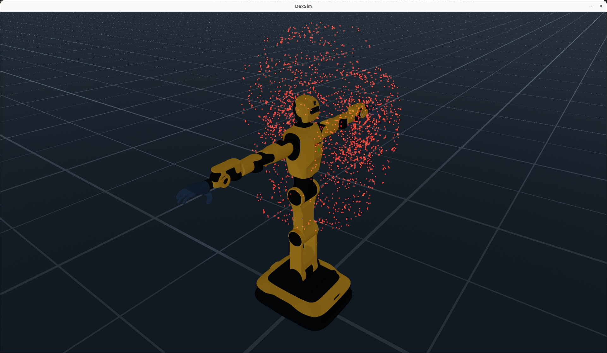
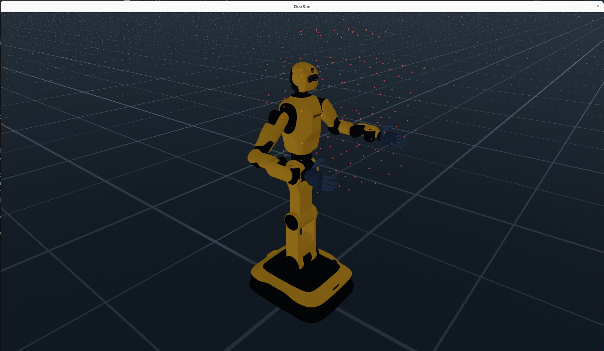

# Workspace Analyzer

The Workspace Analyzer is a powerful tool in EmbodiChain that enables comprehensive analysis of robot workspace characteristics. It provides both joint space and Cartesian space analysis capabilities to help understand robot reachability, workspace volume, and performance metrics.

## Overview

The WorkspaceAnalyzer class provides two main analysis modes:

- **Joint Space Analysis**: Analyzes the robot's workspace based on joint configurations
- **Cartesian Space Analysis**: Analyzes reachable positions in Cartesian coordinates

## Core Components

### WorkspaceAnalyzer

The main class that performs workspace analysis with configurable parameters and visualization capabilities.

### WorkspaceAnalyzerConfig

Configuration class that defines analysis parameters including:

- Analysis mode (Joint Space or Cartesian Space)
- Reference poses and coordinate frames
- Sampling parameters
- Visualization settings

### AnalysisMode

Enumeration defining the available analysis modes:

- `JOINT_SPACE`: Analysis based on joint configurations
- `CARTESIAN_SPACE`: Analysis based on Cartesian positions

## Basic Usage

### Import Required Modules

```python
import torch
import numpy as np
from embodichain.lab.sim import SimulationManager, SimulationManagerCfg
from embodichain.lab.sim.robots import DexforceW1Cfg
from embodichain.lab.sim.utility.workspace_analyzer.workspace_analyzer import (
    WorkspaceAnalyzer,
    WorkspaceAnalyzerConfig,
    AnalysisMode,
)
```

### Setup Simulation Environment

```python
# Configure simulation
config = SimulationManagerCfg(headless=False, sim_device="cpu")
sim_manager = SimulationManager(config)
sim_manager.build_multiple_arenas(1)
sim_manager.set_manual_update(False)

# Add robot to simulation
cfg = DexforceW1Cfg.from_dict({
    "uid": "dexforce_w1", 
    "version": "v021", 
    "arm_kind": "anthropomorphic"
})
robot = sim_manager.add_robot(cfg=cfg)
```

## Analysis Modes

### 1. Joint Space Analysis

Joint space analysis evaluates the robot's workspace based on joint configurations and their validity.

```python
# Create workspace analyzer for joint space
wa_joint = WorkspaceAnalyzer(robot=robot, sim_manager=sim_manager)

# Perform joint space analysis
results_joint = wa_joint.analyze(num_samples=1000, visualize=True)

# Display results
print(f"Valid points: {results_joint['num_valid']} / {results_joint['num_samples']}")
print(f"Analysis time: {results_joint['analysis_time']:.2f}s")
print(f"Metrics: {results_joint['metrics']}")
```

<div style="text-align: center;">
  
  <p><b>joint workspace</b></p>
</div>

### 2. Cartesian Space Analysis

Cartesian space analysis examines reachable positions in 3D Cartesian coordinates.

```python
# Configure robot pose
robot.set_qpos(
    qpos=[0, -np.pi / 4, 0.0, -np.pi / 2, -np.pi / 4, 0.0, 0.0],
    joint_ids=robot.get_joint_ids("left_arm"),
)
robot.set_qpos(
    qpos=[0, np.pi / 4, 0.0, np.pi / 2, np.pi / 4, 0.0, 0.0],
    joint_ids=robot.get_joint_ids("right_arm"),
)

# Create Cartesian space configuration
cartesian_config = WorkspaceAnalyzerConfig(
    mode=AnalysisMode.CARTESIAN_SPACE,
    reference_pose=np.eye(4)
    # Sub-configs will be created with defaults in __post_init__
)

# Create workspace analyzer for Cartesian space
wa_cartesian = WorkspaceAnalyzer(
    robot=robot, 
    config=cartesian_config, 
    sim_manager=sim_manager
)

# Perform Cartesian space analysis
results_cartesian = wa_cartesian.analyze(num_samples=1000, visualize=True)

# Display results
print(f"Reachable points: {results_cartesian['num_reachable']} / {results_cartesian['num_samples']}")
print(f"Analysis time: {results_cartesian['analysis_time']:.2f}s")
print(f"Metrics: {results_cartesian['metrics']}")
```

<div style="text-align: center;">
  
  <p><b>pose workspace</b></p>
</div>

## Configuration Parameters

### WorkspaceAnalyzerConfig Structure

The `WorkspaceAnalyzerConfig` uses modular sub-configurations for different aspects of the analysis:

```python
from embodichain.lab.sim.utility.workspace_analyzer.configs import (
    SamplingConfig,
    CacheConfig,
    DimensionConstraint,
    VisualizationConfig,
    MetricConfig,
)

# Create sub-configurations
sampling_config = SamplingConfig(
    strategy=SamplingStrategy.UNIFORM,
    num_samples=1000,
    batch_size=100
)

visualization_config = VisualizationConfig(
    enabled=True,
    vis_type=VisualizationType.POINT_CLOUD,
    show_unreachable_points=False
)

cache_config = CacheConfig(
    enabled=True,
    cache_dir="./workspace_cache"
)

constraint_config = DimensionConstraint(
    joint_limits_checking=True,
    collision_checking=True
)

metric_config = MetricConfig(
    compute_volume=True,
    compute_manipulability=True
)

# Main configuration
config = WorkspaceAnalyzerConfig(
    mode=AnalysisMode.CARTESIAN_SPACE,
    sampling=sampling_config,
    cache=cache_config,
    constraint=constraint_config,
    visualization=visualization_config,
    metric=metric_config,
    ik_samples_per_point=1,
    reference_pose=np.eye(4)
)
```

### Simplified Configuration

For basic usage, you can rely on default sub-configurations:

```python
# Basic configuration with defaults
config = WorkspaceAnalyzerConfig(
    mode=AnalysisMode.CARTESIAN_SPACE,
    reference_pose=np.eye(4)
)

# The __post_init__ method will create default sub-configs automatically
```

### Main Configuration Parameters

- **mode**: `AnalysisMode` - Analysis mode (JOINT_SPACE or CARTESIAN_SPACE)
- **ik_samples_per_point**: `int` - Number of random joint seeds per Cartesian point (default: 1)
- **reference_pose**: `Optional[Any]` - Reference 4x4 pose matrix for IK targets (default: None)

### Sub-Configuration Details

#### SamplingConfig

- **strategy**: Sampling strategy (UNIFORM, RANDOM, HALTON, etc.)
- **num_samples**: Number of sample points to generate
- **batch_size**: Batch size for processing samples
- **seed**: Random seed for reproducibility

#### CacheConfig

- **enabled**: Enable result caching
- **cache_dir**: Directory for cache files
- **compression**: Enable cache compression
- **max_cache_size_mb**: Maximum cache size in MB

#### DimensionConstraint

- **joint_limits_checking**: Respect joint limits
- **collision_checking**: Enable collision detection
- **workspace_bounds**: Custom workspace boundaries
- **excluded_regions**: Regions to exclude from analysis

#### VisualizationConfig

- **enabled**: Enable visualization
- **vis_type**: Visualization type (POINT_CLOUD, MESH, etc.)
- **show_unreachable_points**: Show failed samples
- **point_size**: Size of visualization points
- **alpha**: Transparency of visualization

#### MetricConfig

- **compute_volume**: Calculate workspace volume
- **compute_manipulability**: Calculate manipulability metrics
- **compute_condition_number**: Calculate Jacobian condition numbers
- **save_results**: Save analysis results to file

## Results Interpretation

### Joint Space Results

- `num_valid`: Number of valid joint configurations
- `num_samples`: Total number of samples tested
- `analysis_time`: Time taken for analysis
- `metrics`: Dictionary containing workspace metrics

### Cartesian Space Results

- `num_reachable`: Number of reachable Cartesian points
- `num_samples`: Total number of samples tested
- `reachable_points`: Array of reachable 3D coordinates
- `boundary_points`: Points on the workspace boundary
- `metrics`: Workspace volume, surface area, and other metrics

### Common Metrics

- `workspace_volume`: Estimated workspace volume in cubic meters
- `workspace_surface_area`: Workspace surface area
- `reachability_ratio`: Percentage of reachable points
- `average_manipulability`: Average manipulability index
- `condition_number`: Average condition number of Jacobian matrices

## Best Practices

1. **Sample Size Selection**: Use appropriate sample sizes based on accuracy requirements
   - Quick analysis: 500-1000 samples
   - Detailed analysis: 2000-5000 samples
   - High precision: 10000+ samples

2. **Visualization**: Disable visualization for batch processing to improve performance

3. **Configuration Management**: Save and reuse configurations for consistent analysis

4. **Memory Management**: For large-scale analyses, process data in batches to avoid memory issues

5. **Validation**: Cross-validate results with different sampling methods and sample sizes

## Troubleshooting

### Common Issues

1. **Slow Performance**:
   - Reduce sample size
   - Disable visualization
   - Use parallel processing

2. **Memory Errors**:
   - Process data in smaller batches
   - Reduce visualization complexity
   - Clear unused variables

3. **Inaccurate Results**:
   - Increase sample size
   - Check joint limits and collision settings
   - Validate robot configuration

## Integration with Other Tools

The Workspace Analyzer integrates seamlessly with other EmbodiChain components:

- **Motion Planning**: Use workspace analysis to inform motion planning algorithms
- **Task Planning**: Leverage reachability maps for task feasibility assessment
- **Robot Optimization**: Analyze different robot configurations for design optimization
- **Simulation Validation**: Validate simulation accuracy against real robot capabilities
