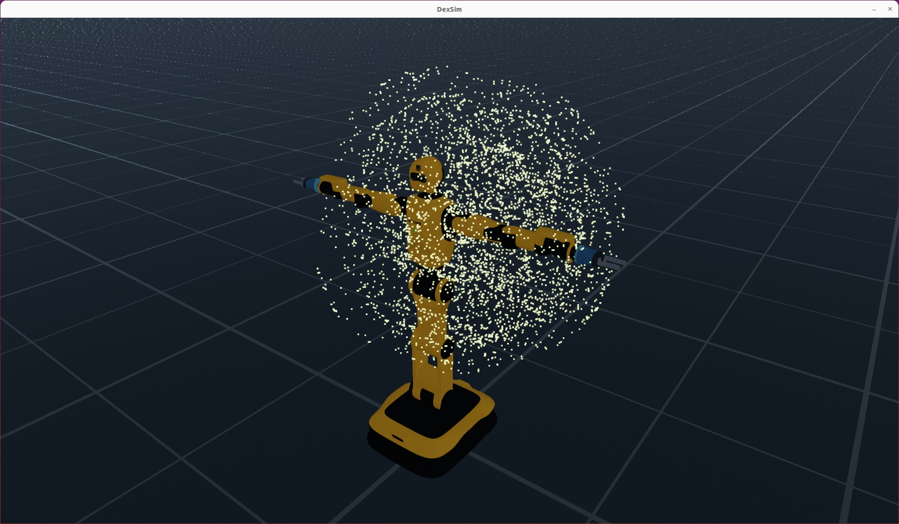
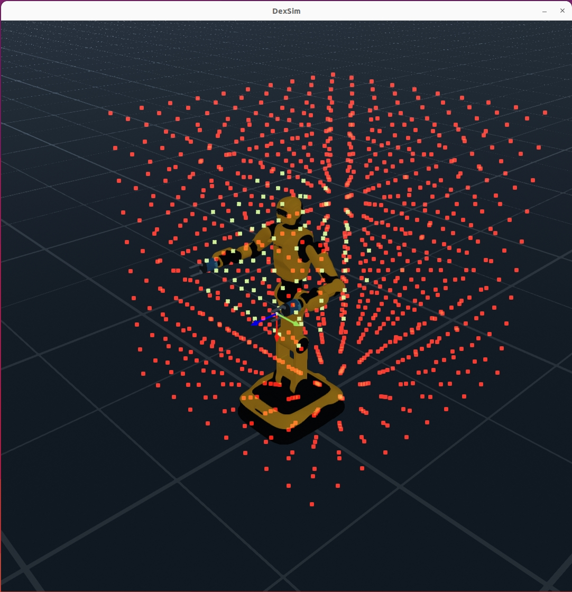
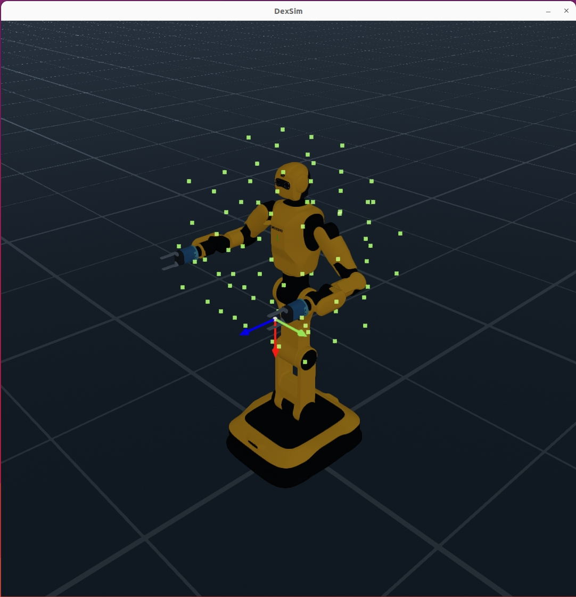
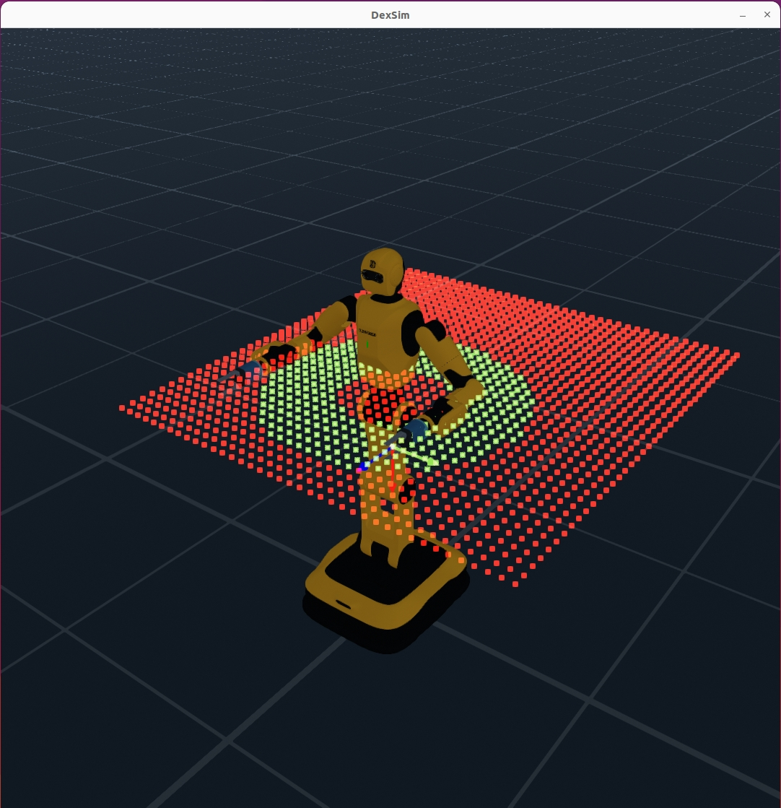
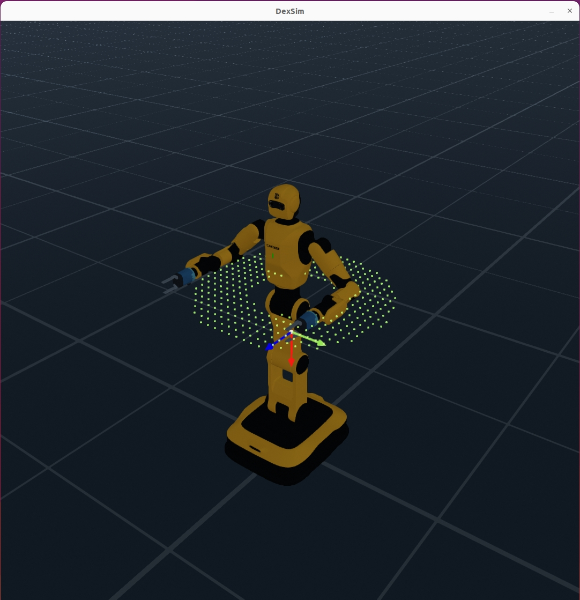

# Workspace Analyzer

The Workspace Analyzer is a comprehensive tool in EmbodiChain for analyzing robot workspace characteristics, reachability, and performance metrics. It provides multiple analysis modes with advanced sampling strategies, caching mechanisms, and visualization capabilities.

## Table of Contents

1. [Quick Start](#quick-start)
2. [Analysis Modes](#analysis-modes)
3. [Configuration](#configuration)
4. [Usage Examples](#usage-examples)
5. [Best Practices](#best-practices)

## Quick Start

```python
import torch
import numpy as np
from embodichain.lab.sim import SimulationManager, SimulationManagerCfg
from embodichain.lab.sim.robots import DexforceW1Cfg
from embodichain.lab.sim.utility.workspace_analyzer import (
    WorkspaceAnalyzer,
    WorkspaceAnalyzerConfig,
    AnalysisMode
)

# Setup simulation
sim = SimulationManager(SimulationManagerCfg(headless=False, sim_device="cpu"))
sim.build_multiple_arenas(1)

# Add robot
robot = sim.add_robot(DexforceW1Cfg.from_dict({
    "uid": "dexforce_w1", 
    "version": "v021", 
    "arm_kind": "industrial"
}))

# Quick analysis with defaults
analyzer = WorkspaceAnalyzer(robot=robot, sim_manager=sim)
results = analyzer.analyze(num_samples=1000, visualize=True)
print(f"Analysis complete: {results['num_reachable']} reachable points")
```

## Analysis Modes

### Joint Space Analysis

Analyzes robot workspace based on joint configurations.

```python
wa_joint = WorkspaceAnalyzer(robot=robot, sim_manager=sim)
results = wa_joint.analyze(num_samples=1000, visualize=True)
print(f"Valid points: {results['num_valid']}/{results['num_samples']}")
```

<div style="display: flex; justify-content: center; align-items: flex-start; gap: 20px; flex-wrap: wrap;">
  <figure style="text-align: center; margin: 10px;">
    
    <figcaption><b>Joint Workspace Analysis</b></figcaption>
  </figure>
</div>

### Cartesian Space Analysis

Analyzes reachable positions in 3D Cartesian space.

```python
cartesian_config = WorkspaceAnalyzerConfig(
    mode=AnalysisMode.CARTESIAN_SPACE,
    visualization=VisualizationConfig(show_unreachable_points=False, point_size=8.0),
    control_part_name="left_arm",
)

wa_cartesian = WorkspaceAnalyzer(robot=robot, config=cartesian_config, sim_manager=sim)
results = wa_cartesian.analyze(num_samples=1000, visualize=True)
print(f"Reachable points: {results['num_reachable']}/{results['num_samples']}")
```

<div style="display: flex; justify-content: center; align-items: flex-start; gap: 20px; flex-wrap: wrap;">
  <figure style="text-align: center; margin: 10px;">
    
    <figcaption><b>(show_unreachable_points=True)</b></figcaption>
  </figure>
  <figure style="text-align: center; margin: 10px;">
    
    <figcaption><b>(show_unreachable_points=False)</b></figcaption>
  </figure>
</div>

### Plane Sampling Analysis

Analyzes reachability within a 2D plane (e.g., table height).

```python
plane_config = WorkspaceAnalyzerConfig(
    mode=AnalysisMode.PLANE_SAMPLING,
    plane_normal=torch.tensor([0.0, 0.0, 1.0]),  # Horizontal plane
    plane_point=torch.tensor([0.0, 0.0, 1.2]),   # Height z=1.2m
    visualization=VisualizationConfig(show_unreachable_points=True, point_size=8.0),
    control_part_name="left_arm",
)

wa_plane = WorkspaceAnalyzer(robot=robot, config=plane_config, sim_manager=sim)
results = wa_plane.analyze(num_samples=1500, visualize=True)
print(f"Reachable points: {results['num_reachable']}/{results['num_samples']}")
```

<div style="display: flex; justify-content: center; align-items: flex-start; gap: 20px; flex-wrap: wrap;">
  <figure style="text-align: center; margin: 10px;">
    
    <figcaption><b>(show_unreachable_points=True)</b></figcaption>
  </figure>
  <figure style="text-align: center; margin: 10px;">
    
    <figcaption><b>(show_unreachable_points=False)</b></figcaption>
  </figure>
</div>

## Configuration

### Basic Configuration

```python
from embodichain.lab.sim.utility.workspace_analyzer.configs import VisualizationConfig

# Basic configuration with defaults
config = WorkspaceAnalyzerConfig(
    mode=AnalysisMode.CARTESIAN_SPACE
)

# Custom visualization
vis_config = VisualizationConfig(
    show_unreachable_points=False,  # Only show reachable points
    point_size=8.0                  # Larger points for visibility
)

config = WorkspaceAnalyzerConfig(
    mode=AnalysisMode.CARTESIAN_SPACE,
    visualization=vis_config,
    control_part_name="left_arm",
)
```

### Configuration Parameters

**Main Parameters:**

- `mode`: Analysis mode (JOINT_SPACE, CARTESIAN_SPACE, PLANE_SAMPLING)
- `plane_normal`: Normal vector for plane sampling (3D vector)
- `plane_point`: Point on plane for plane sampling (3D point)

**Visualization Options:**

- `show_unreachable_points`: Show failed samples (True) or only reachable (False)
- `point_size`: Size of visualization points (typically 6.0-10.0)

## Usage Examples

### Complete Example

```python
import torch
import numpy as np
from embodichain.lab.sim import SimulationManager, SimulationManagerCfg
from embodichain.lab.sim.robots import DexforceW1Cfg
from embodichain.lab.sim.utility.workspace_analyzer import (
    WorkspaceAnalyzer, WorkspaceAnalyzerConfig, AnalysisMode
)
from embodichain.lab.sim.utility.workspace_analyzer.configs import VisualizationConfig

# Setup simulation
sim = SimulationManager(SimulationManagerCfg(headless=False, sim_device="cpu"))
sim.build_multiple_arenas(1)

# Add robot
robot = sim.add_robot(DexforceW1Cfg.from_dict({
    "uid": "dexforce_w1", "version": "v021", "arm_kind": "industrial"
}))

# 1. Joint Space Analysis
wa_joint = WorkspaceAnalyzer(robot=robot, sim_manager=sim)
results = wa_joint.analyze(num_samples=1000, visualize=True)

# 2. Cartesian Space Analysis
cartesian_config = WorkspaceAnalyzerConfig(
    mode=AnalysisMode.CARTESIAN_SPACE,
    visualization=VisualizationConfig(show_unreachable_points=False),
    control_part_name="left_arm",
)
wa_cartesian = WorkspaceAnalyzer(robot=robot, config=cartesian_config, sim_manager=sim)
results = wa_cartesian.analyze(num_samples=1000, visualize=True)

# 3. Plane Sampling
plane_config = WorkspaceAnalyzerConfig(
    mode=AnalysisMode.PLANE_SAMPLING,
    plane_normal=torch.tensor([0.0, 0.0, 1.0]),  # Horizontal plane
    plane_point=torch.tensor([0.0, 0.0, 1.2]),   # Height 1.2m
    control_part_name="left_arm",                # robot control part name
)
wa_plane = WorkspaceAnalyzer(robot=robot, config=plane_config, sim_manager=sim)
results = wa_plane.analyze(num_samples=1500, visualize=True)
```

## Best Practices

**Sample Size Guidelines:**

- Joint space: 1000-3000 samples
- Cartesian space: 1000-2000 samples  
- Plane sampling: 1000-1500 samples

**Visualization Tips:**

- Use `show_unreachable_points=False` for clean workspace boundaries
- Use `show_unreachable_points=True` for debugging and complete coverage
- Set `point_size=8.0` for better visibility
- Use `headless=False` for visualization, `headless=True` for batch processing

**Performance:**

- Start with smaller sample sizes (1000) for testing
- Use CPU device for consistent results
- Disable visualization for large batch analyses

**Results:**

- `num_valid`: Valid joint configurations (Joint Space)
- `num_reachable`: Reachable Cartesian points (Cartesian/Plane)
- `num_samples`: Total samples tested
- `analysis_time`: Time taken for analysis
- `metrics`: Workspace volume and other metrics
