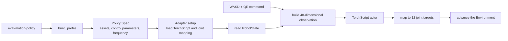

# ANYmal-C Velocity Policy Evaluation

This example connects Newton's public ANYmal-C velocity TorchScript `.pt` to
EmbodiChain and opens it in the DexSim Viewer through Motion Policy Kit. The
model accepts `vx`, `vy`, and `yaw` commands. W/A/S/D and Q/E update these
commands while the Viewer is running.

The model, configuration, and robot resources come from newton-assets commit
`261cd1f429619d8ef4f546bd788ab9dea906b5e1`. The Policy is distributed under
Apache-2.0, and the robot resources use BSD-3-Clause. The Adapter follows
Newton v1.2.1
[`example_robot_policy.py`](https://github.com/newton-physics/newton/blob/v1.2.1/newton/examples/robot/example_robot_policy.py)
to reproduce the 48-dimensional observation, TorchScript inference, and joint
target processing.

## Directory layout

```text
motion_policy_evaluation/
├── README.md
├── prepare_resources.py
├── eval_policy.py              # Register the local Profile and run the example
└── anymal_c/
    ├── __init__.py             # Register newton-anymal-c-velocity
    └── profile.py              # Policy Spec and AnymalCVelocityAdapter
```

Resource preparation creates this local cache:

```text
~/.cache/embodichain/examples/anymal_c_velocity/
└── upstream/
    └── anybotics_anymal_c/
        ├── rl_policies/
        │   ├── mjw_anymal.pt
        │   ├── anymal.yaml
        │   └── LICENSE
        ├── urdf/anymal.urdf
        ├── meshes/...
        └── LICENSE
```

## Run the example

Run these commands from the EmbodiChain repository root. The preparation script
prints the model, asset, checkout, and digest verification progress. Re-running
the command continues an existing Git checkout after an interrupted download.

```bash
python examples/learning/motion_policy_evaluation/prepare_resources.py
python examples/learning/motion_policy_evaluation/eval_policy.py \
  --viewer \
  --renderer hybrid
```

Viewer controls:

| Key | Command |
|---|---|
| W / S | Increase / decrease `vx` |
| A / D | Increase / decrease `vy` |
| Q / E | Increase / decrease `yaw` |
| M | Set all three commands to zero |
| Backspace | Reset the robot, Policy history, and camera framing |
| T | Switch between tracking and free view |

The camera follows the robot root in the ground plane. Hold the left mouse
button to change the orbit angle and use the mouse wheel to change the viewing
distance. Right-button panning is locked while tracking is active. Tracking
continues while the orbit angle is being adjusted. Switching back to tracking
centers the camera on the current robot position.

The terminal prints the path to `evaluation.json` when the Viewer closes. Run a
Headless smoke test with:

```bash
python examples/learning/motion_policy_evaluation/eval_policy.py \
  --device cpu \
  --sim-device cpu \
  --control-steps 20
```

`eval_policy.py` reads the checkpoint and robot assets from the default cache,
imports the adjacent `anymal_c/profile.py`, and registers the Profile in the
current process. Run the script directly from the repository root. To use
another cache directory:

```bash
python examples/learning/motion_policy_evaluation/prepare_resources.py \
  --output /tmp/anymal_c_velocity

ANYMAL_C_EXAMPLE_CACHE=/tmp/anymal_c_velocity \
  python examples/learning/motion_policy_evaluation/eval_policy.py --viewer
```

## Execution pipeline



`AnymalCVelocityAdapter` restores the upstream data path:

| Stage | Processing |
|---|---|
| `setup()` | Build a `JointMap` for the 12 ANYmal-C joints, then load and validate the TorchScript inputs and outputs |
| observation | 3 body linear velocity, 3 body angular velocity, 3 projected gravity, 3 command, 12 joint position, 12 joint velocity, and 12 previous action values |
| command | Read `vx`, `vy`, and `yaw` from `frame.controls["command"]`, with ranges ±1.0, ±0.5, and ±1.0 |
| actor | Pass a `[1, 48]` tensor through the model's normalizer and actor to produce `[1, 12]` |
| action | Apply `default_position + 0.5 * action` |
| control | Run simulation at 200 Hz and infer once every four simulation steps for a 50 Hz Policy rate |

The Adapter clears the previous action during reset. After each inference call,
it stores the current action for the next observation.

## Integrate another external Policy

Copy this directory and replace:

1. the fixed revisions, paths, and digests for the model and robot resources in `prepare_resources.py`;
2. the initial pose, joint control parameters, simulation step, and `sim_steps_per_control` in `build_profile()`;
3. the model format and training joint order in `Adapter.setup()`;
4. observation construction, normalization, network forward pass, action clipping, scale, and offset in `Adapter.infer()`;
5. `PROFILE_ID` and the Profile name used by `eval_policy.py`.

An Adapter can call an existing project data reader from `__init__()` or
`setup()`. To let Policy Spec resolve a data file path, declare it under
`policy.resources` and read the resolved path from `AdapterRequest.resources`.
