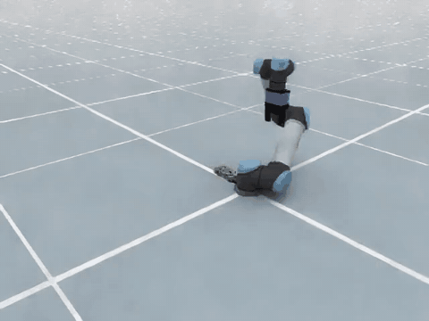
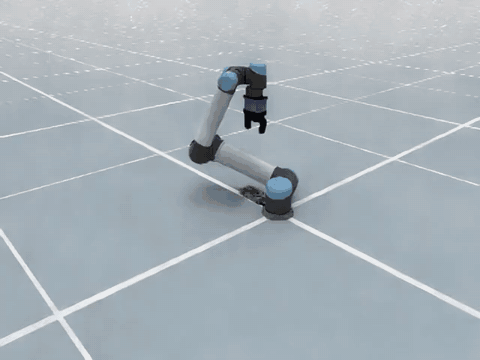
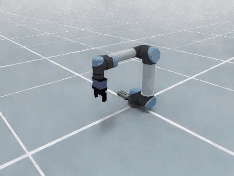
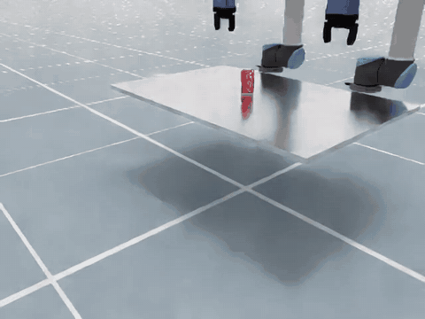

# Atomic-Action Benchmark: Results

Twelve skills measured under
[`BENCHMARK_STANDARD.md`](BENCHMARK_STANDARD.md). Every number below is a
`--profile coverage --device cpu` run on `embodichain311` (Python 3.11), DexSim
default backend, 10 ms physics timestep, one environment, `--repeat 1`. Per-case
tables are in `outputs/benchmarks/`.

`success_rate` is the last link of a chain. Each stage is scored only on the
cases that reached it, so a rate says what fraction of the cases that got there
passed:

```
stage_success_rate[i] = passed(i) / reached(i)      reached(i) = passed(i-1)
success_rate          = passed(last) / measured     measured = total - unsupported
coverage_rate         = measured / total
```

A case this embodiment cannot serve at all is recorded with
`unsupported_capability`, leaves every denominator, and lowers `coverage_rate`
instead. Section 3 shows what that covers and how it was measured. Plan
validity and replay tracking are reported per case and fail nothing.

---

## 1. Results

| Skill | Cases | Coverage | Stage chain | `success_rate` |
|---|---|---|---|---|
| `move_joints` | 3 | 100% | reached 100% | **100%** |
| `move_end_effector` | 4 | 100% | reached 100% | **100%** |
| `slide` | 3 | 100% | grasped 100% → slid 100% → released 100% | **100%** |
| `press` | 3 | 100% | contacted 100% → pressed 100% | **100%** |
| `pour` | 3 | 100% | poured 100% | **100%** |
| `twist` | 3 | 100% | grasped 100% → twisted 100% → released 100% | **100%** |
| `axis_align` | 2 | 100% | grasped 100% → aligned 100% → held 100% | **100%** |
| `open_door` | 3 | 100% | grasped 66.67% → opened 100% → released 100% | **66.67%** |
| `pick_up` | 48 | 64.58% | grasped 100% → lifted 74.19% → held 100% | **74.19%** |
| `place` | 48 | 60.42% | released 100% → placed 48.28% → stable 100% | **48.28%** |
| `move_held_object` | 48 | 56.25% | transported 48.15% | **48.15%** |
| `hand_over` | 2 | 100% | grasped 100% → transferred 100% → handed_over 100% → placed 0% | **0%** |

Measured values behind the passing skills, against the tolerance each is scored
at:

| Skill | Measured | Tolerance |
|---|---|---|
| `move_joints` | 0.002996 rad, all three cases | 0.00524 rad |
| `move_end_effector` | 0.0006 – 0.0015 m | 0.003 m |
| `slide` | travel error 0.0002 – 0.0010 m | 0.01 m |
| `press` | peak 6.00 mm of a 6 mm stroke, all three cases | 80 % of stroke |
| `pour` | peak-rotation error 0.0035 – 0.0059 rad | 0.08727 rad |
| `twist` | end-effector rotation error 0.0024 – 0.0085 rad | 0.08727 rad |
| `axis_align` | residual axis angle 0.0412, 0.0480 rad | 0.08727 rad |
| `open_door` | hinge error 0.0258, 0.0275 rad on the two cases it grasped | 0.08727 rad |

`move_joints` and `move_end_effector` are read off the robot after a physical
replay and a terminal settle. Read from the planner's last waypoint, as the
suite did before, they report 0.000000 rad and 0.00002 m, which describes the
solver.

---

## 2. Where the failing skills lose their cases

Each subsection carries one recorded case, captured with the suite's own
`--record_video --record_failed_video --video_case_limit 1`. A clip's numbers
are from the run that produced it, so they differ from the table above: grasp
sampling is stochastic and every run is `--repeat 1`.

### `pick_up` — 74.19 % of 31 measured cases, losing 8 at `lifted`

Every measured case grasps, and nothing that came up ever fell, so the whole
loss sits at `lifted`: the hand closes, the arm follows its plan, and the
object does not rise 4 cm. Lift over the measured cases has a median of
0.1563 m, so the eight failures are not near misses — they are cases where the
object barely moves.



`sugar_box:q1_near:side`. The hand closes, the arm follows its plan, and the
object never leaves the table: lift −0.000147 m.

### `place` — 48.28 % of 29 measured cases, losing 15 at `placed`

Release always happens and nothing that landed on the target moved afterwards.
XY error over the measured cases has a median of 0.0101 m against the
standard's 1 cm and a maximum of 0.6373 m: half the cases sit right at the
tolerance, and a tail misses by more than half a metre.



`sugar_box:q1_near:top:left_bin`. The hand opens 0.4286 m from the commanded
pose, against 0.01 m.

### `move_held_object` — 48.15 % of 27 measured cases

Median position error is 0.0064 m, inside the 1 cm tolerance, but the tail runs
to 0.6478 m: 14 of the 26 scored cases land inside 1 cm and the rest are not
close. One further case failed its PickUp precondition with a `RuntimeError`
and is reported as an exception rather than as an unsupported case.



`sugar_box:q1_near:top:front_left`: 0.8288 m and 1.5911 rad from the commanded
pose.

### `hand_over` — 0 % of 2 cases, failing only at `placed`

Both cases pass `grasped`, `transferred` and `handed_over`, then miss `placed`:
delivery distance 0.1048 m and 0.0680 m against the derived budget of
3 × `TASK_POSITION_TOLERANCE_M` = 0.03 m. Neither case dropped the object;
the minimum object height was 0.5319 m and 0.5342 m.



`vertical_can`. The transfer itself is clean and only the delivery misses.

### `open_door` — 66.67 % of 3 cases, losing `open_90` at `grasped`

The hinge does not move at all on that case (0.0000 rad,
`object_not_grasped`), while the other two open to within 0.0275 rad.
Section 4 carries the caveat that belongs with this number.

---

## 3. The cases this embodiment cannot serve

`pick_up`, `place` and `move_held_object` each report about 40 % of their cases
as `unsupported_capability`:

| Skill | Unsupported | In `q1`, near the base | With a `side` approach |
|---|---|---|---|
| `pick_up` | 17 of 48 | 9 of 12 | 13 of 24 |
| `place` | 19 of 48 | 11 of 12 | 14 of 24 |
| `move_held_object` | 21 of 48 | 11 of 12 | 16 of 24 |

Both groups were measured, not assumed.

**Objects near the base.** For an object 0.18 m from the base axis, all three
distinct IK branches of the grasp pose exist, and driving the arm to each one
stalls: the shoulder stops 0.44 rad short, with every other joint tracking to
0.01 rad and the limits nowhere near. The pose is inside the arm's inner
workspace.

**Side approaches.** A side approach asks for a horizontal gripper at the
height of an object lying on the ground. Probing one case at increasing
heights, 0 of the sampled grasps are attainable at the object's own height and
3 of 3 become attainable once lifted 0.20 m, while the top approach is
attainable at every height. The gripper is hitting the ground.

Both produce a plan that executes into thin air, and the skill's own screen
cannot see either: it accepts a candidate when IK returns a solution, which
says a configuration exists, not that the arm can get to it.
`has_attainable_grasp_candidate()` drives each sampled grasp in physics and
records the case as unsupported only when none of them arrives.

Two consequences are visible in section 1. `grasped` and `released` are now
100 %, because the cases where the skill reported a held object that the scene
did not show were all unattainable ones. And the rates rose once those cases
left the denominator: `pick_up` from 52.08 % to 74.19 %, `place` from 37.50 %
to 48.28 %, `move_held_object` from 27.08 % to 48.15 %.

The case set itself is unchanged. The positions, approaches and object presets
are the ones #318 shipped.

---

## 4. These are single-sample estimates

Everything is `--repeat 1`, and grasp sampling is stochastic. `open_door` shows
what that means: the same three cases, the same code, run twice, scored 100 %
and then 66.67 %, because `open_90` grasped the handle on one run and not on
the other. Every 100 % in section 1 carries that caveat, and the failing rates
move too — an earlier run of the same two `hand_over` cases measured 0.2372 m
and 0.0764 m against this run's 0.1048 m and 0.0680 m.

Raising `--repeat` is the fix, at the same multiple of runtime.

---

## 5. The replay rate does not decide these results

The physical-validation replay moved from 4 to the 16 physics steps per
waypoint the standard calibrates at. Running `pick_up` coverage at both rates,
before the unsupported rule existed:

| Steps per waypoint | grasped | lifted | held | `success_rate` |
|---|---|---|---|---|
| 4 (previous) | 87.50% | 59.52% | 100.00% | 52.08% |
| 16 (standard) | 87.50% | 59.52% | 100.00% | 52.08% |

Identical in aggregate. Six of the 48 cases swap verdicts, three in each
direction — margin noise. The rate changes measurement fidelity, not the thing
being measured.

---

## 6. Two criteria that do not discriminate

- **`press`** passes at every commanded depth. Commanding 10, 20 or 30 mm all
  drive the button to 6.00 mm of its 6 mm stroke, so the 80 % rule shows that
  the button was pressed and nothing about how far it was asked to go.
- **`twist`'s knob joint** is a diagnostic, not the criterion. It reaches
  2.0593, 2.5270 and 3.1416 rad for 0.5236, 0.7854 and 1.5708 rad commanded:
  the gripper wedges against the 5 cm knob and the joint offers no resistance,
  and the 90° case is at the asset's limit. The executed end-effector rotation
  about the knob axis, which the standard scores, is within 0.0085 rad in all
  three cases. The axis is probed off the asset rather than assumed.

---

## 7. Not covered

`push_object`, `coordinated_pickment` and `coordinated_placement` have stages
defined in the standard but no benchmark module.

`robustness` and `adaptability` are not measured here. This report is section 1
of the standard only.

---

## 8. Reproducing

```
PY=/home/lqin/miniconda3/envs/embodichain311/bin/python

$PY -m scripts.benchmark.atomic_action.move_joints_benchmark       --profile coverage --device cpu
$PY -m scripts.benchmark.atomic_action.move_end_effector_benchmark --profile coverage --device cpu
$PY -m scripts.benchmark.atomic_action.pickup_benchmark            --profile coverage --device cpu --n_sample 2000
$PY -m scripts.benchmark.atomic_action.place_benchmark             --profile coverage --device cpu --n_sample 2000
$PY -m scripts.benchmark.atomic_action.move_held_object_benchmark  --profile coverage --device cpu --n_sample 2000
$PY -m scripts.benchmark.atomic_action.open_door_benchmark         --profile coverage --device cpu --n_sample 2000
$PY -m scripts.benchmark.atomic_action.slide_benchmark             --profile coverage --device cpu --n_sample 2000
$PY -m scripts.benchmark.atomic_action.axis_align_benchmark        --profile coverage --device cpu --n_sample 2000
$PY -m scripts.benchmark.atomic_action.pour_benchmark              --profile coverage --device cpu --n_sample 2000
$PY -m scripts.benchmark.atomic_action.press_benchmark             --profile coverage --device cpu
$PY -m scripts.benchmark.atomic_action.twist_benchmark             --profile coverage --device cpu
$PY -m scripts.benchmark.atomic_action.hand_over_benchmark         --profile coverage --device cpu --n_sample 2000
```

`press` and `twist` sample no grasps and do not accept `--n_sample`. A DexSim
exit code of 139 on teardown is the known-harmless segfault; judge a run by its
printed output and the written report.
