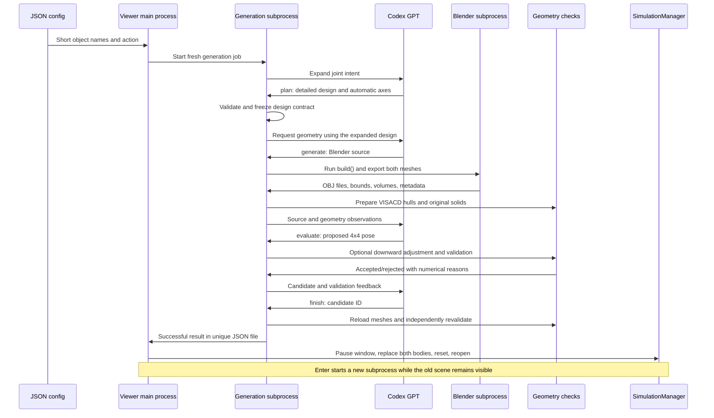

# Codex assembly harness

Generate a pair of household objects from descriptions, assemble them, and inspect
the result in EmbodiChain's native simulation window. This is an independent,
self-contained tool that creates both meshes instead of requiring existing
mesh paths. Its JSON, mesh-loading, and collision helpers live in this directory.

The input is a JSON configuration. The output is JSON containing the generated
asset paths and a verified **4 × 4 `T_base_assemble` matrix**. Blender source, OBJ
meshes, materials, a `.blend` file, Codex prompts/responses, and validation records
are retained beside each result.

## Run the complete pipeline

Run these commands from the repository root:

```bash
conda activate embodichain2
codex login status
python scripts/tools/assemble/visualize.py \
  --config scripts/tools/assemble/configs/tree_mug.json
```

For the second example:

```bash
python scripts/tools/assemble/visualize.py \
  --config scripts/tools/assemble/configs/phone_stand.json \
  --steps 30
```

The script performs the following sequence:

1. Launch a fresh Python subprocess for the **entire** generation job. Codex first
   expands the short descriptions into a detailed design, including automatic axes.
2. In that subprocess, generate both Blender meshes, run VISACD and original-solid
   checks, and have Codex select a verified assembly pose.
3. Return a result through a unique JSON handoff file. On the first run, load two
   `RigidObjectCfg` objects, call `sim.prepare()`, open the native window, and
   execute `--steps` calls to `sim.update(step=1)`.
4. Wait for **Enter in the terminal**. Enter starts another complete generation job
   while the existing objects remain visible. The main process continues periodic
   simulator updates while waiting for input or a subprocess, keeping the viewer
   responsive. These background updates are additional to the initial `--steps`.
5. Only after the new job succeeds and its mesh hashes and matrix are checked,
   close the native render window briefly, call `sim.replace_rigid_objects()` for
   both objects together, reset their state with `sim.reset_objects_state()`, and
   reopen the window. The manager and light are reused. Native scene topology is
   never changed concurrently with the window's render thread.

Use `q` followed by Enter, Ctrl+C, or terminal EOF to exit. Enter is handled by the
launching terminal, not inside the rendering window. Config edits take effect on
the next generation. A failed job or invalid config leaves the displayed scene
intact so it can be retried. The previous result is never returned as a successful
new generation. While a job is running, use Ctrl+C to cancel it and exit.

Generation logs are streamed to the terminal and saved under
`output_dir/preview_jobs/`. The supervisor prints elapsed progress every 15 seconds
while a model call or geometry calculation is quiet. `--generation-timeout 1800` bounds each complete job
(default: 30 minutes), including native collision calculations. On timeout or
Ctrl+C, the supervisor stops the generation process and its descendants, including
Codex and Blender children that have their own process groups. No Blender or
VISACD generation work runs inside the native viewer process.
The job-specific handoff is checkpointed alongside the run JSON. If the supervisor
must terminate a job, it marks those records as failed or interrupted instead of
leaving a stale `running` status. It updates `latest.json` only if it still belongs
to that same run.

Both `generate.py` and `visualize.py` print elapsed seconds after each model turn
and a cumulative summary at the end of each cycle, for example:

```text
[assemble] Object generation: 42.35s this turn; 42.35s cumulative
[assemble] Relative pose generation: 18.20s this turn; 18.20s cumulative
[assemble] Cycle 1 timing (complete): objects=42.35s, relative pose=26.10s, planning=8.40s, total=76.95s
```

Timings include prompt construction, the Codex request, and local processing.
`objects` covers all `generate` turns: both assets are built together, including
Blender export and collision preprocessing. `relative_pose` covers `evaluate` and
`finish` turns, including settling, collision checks and independent final
validation. `planning` covers design expansion. Retries and failed attempts are
included in their corresponding totals. If a request fails before returning an
action, its elapsed time is charged to the stage awaiting a response. Failures
and Ctrl+C handled inside `generate.py` also print the cycle summary.

The `timing_seconds` result field stores these cumulative values, and each trace
entry has a `timing` object containing its `stage` and `seconds`. `total` also
includes harness overhead; it excludes viewer loading, simulation updates, and
waiting for Enter. A forcibly terminated subprocess retains only the timing
information saved at its last checkpoint.

Both bodies are **static rigid objects** with original triangle-mesh collision
geometry. This preserves the accepted pose and cup cavity while the simulator
updates. The preview is for inspection; it does not test settling under gravity
or prove that the assembly is dynamically stable.

For one complete generation and an offscreen video, without a window:

```bash
python scripts/tools/assemble/visualize.py \
  --config scripts/tools/assemble/configs/tree_mug.json \
  --headless --steps 30
```

Each successful headless cycle writes `preview.mp4` in its run directory. The
native renderer still requires a working graphics context. `--renderer auto`
is the default; `hybrid`, `fast-rt`, and `rt` are also supported by the CLI.
`--device cpu` is the default simulation device. There is no browser server.

`--cycles N` limits generation cycles. By default, windowed mode repeats until
quit; headless mode runs one cycle. Multiple headless cycles also require Enter
between cycles, which can be piped for an integration check:

```bash
printf '\n' | python scripts/tools/assemble/visualize.py \
  --config scripts/tools/assemble/configs/phone_stand.json \
  --headless --cycles 2 --steps 12
```

For JSON generation without starting simulation:

```bash
python scripts/tools/assemble/generate.py \
  --config scripts/tools/assemble/configs/tree_mug.json
```

This command exits with status 0 only after an accepted, independently rechecked
result. It exits with status 1 if the model fails or exhausts its turn budget.

## Configuration directory

Keep reusable input files under [`configs/`](configs/):

| Example | Base | Assemble object | Assembly action |
|---|---|---|---|
| [`tree_mug.json`](configs/tree_mug.json) | Tree-shaped rack | Hollow mug with handle | Invert the mug over an upright branch |
| [`phone_stand.json`](configs/phone_stand.json) | Desktop stand with ledge and retaining lip | Smartphone | Place upright on the ledge |

A minimal custom config contains three descriptions and an output location:

```json
{
  "base_description": "Phone stand",
  "assemble_description": "Phone",
  "action_description": "Place",
  "output_dir": "../../../../outputs/assemble/custom"
}
```

Descriptions may be in English or Chinese and can be just object names and a verb.
The example files deliberately use short Chinese descriptions. The planning layer
chooses dimensions, openings, clearances, contact surfaces, and frames jointly
from the three descriptions. Add details only when you want to constrain its choices. It generates one Blender mesh object
per role. Generation does not use the external tree/mug assets as hidden templates.

Paths are resolved **relative to the config file**, independent of the launching
working directory. Keep configs outside the output directory. Unknown fields,
non-finite numbers, invalid limits, and inconsistent tolerances are rejected.

Optional settings and their defaults:

```json
{
  "codex": {
    "model": null,
    "max_turns": 10,
    "timeout_seconds": 300
  },
  "geometry": {
    "timeout_seconds": 180,
    "max_faces": 100000
  },
  "validation": {
    "collision": "visacd",
    "concavity": 0.015,
    "max_parts": 64,
    "contact_gap": 0.0001,
    "contact_tolerance": 0.0003,
    "probe": 0.001,
    "settle_distance": 0.05,
    "settle_step": 0.001,
    "assemble_axis": null,
    "target_axis": null,
    "axis_tolerance_degrees": 5.0
  }
}
```

| Setting | Meaning |
|---|---|
| `codex.model` | Optional exact model ID passed to `codex exec --model`; `null` omits the flag and uses the CLI's default under `--ignore-user-config`. |
| `codex.max_turns` | Total decisions including initial planning, generation repairs, pose proposals, and finish; at least four calls. |
| `codex.timeout_seconds` | Per-call elapsed timeout; a timed-out CLI process group is stopped and the run fails. |
| `geometry.timeout_seconds` | Per-build Blender subprocess timeout; errors are returned to Codex for repair. |
| `geometry.max_faces` | Maximum exported triangle count per object; oversize meshes are decimated and revalidated before export. |
| `validation.collision` | `visacd` for cached convex acceleration; `exact` for original-mesh checks without decomposition. |
| `concavity`, `max_parts` | VISACD approximation settings; its actual hull count may exceed the requested budget. |
| `contact_gap` | Vertical retreat from a detected contact boundary, in meters. |
| `contact_tolerance` | Maximum accepted original-surface separation, in meters. |
| `probe` | Magnitude of the downward support and upward release test translations. |
| `settle_distance` | Maximum downward adjustment of a collision-free model proposal; 0 disables adjustment. |
| `settle_step` | Discrete downward search increment. |
| `assemble_axis`, `target_axis` | Omit both (or use null) to infer them in the planning stage. Explicit paired values remain supported as advanced overrides. |
| `axis_tolerance_degrees` | Permitted angular error for that direction constraint. |

All mesh coordinates and translations are meters. Require
`contact_gap <= contact_tolerance < probe`. Inferred axis vectors are normalized and
saved in `design_plan.json` and `result.json.resolved_validation`. For an inverted
mug, a typical plan uses the mouth direction as local +Z and targets base -Z; for
an upright phone, it may align its height axis with base +Z. These are model choices
based on the expanded design, not values embedded in the example configs. A plan
cannot change its axes after acceptance merely to make a rejected pose pass.
Natural-language semantics still require model judgment and visual inspection.

## How the Codex calls work

The host follows an **action → execution → observation** loop. GPT designs the
objects, authors executable Blender code, chooses the assembly orientation and
initial translation, responds to failures, and selects a verified candidate. The
host owns file export, numeric geometry operations, result persistence, and final
acceptance. It does not substitute a hardcoded mug or phone model for GPT's design.



Each decision is a **fresh ephemeral `codex exec` call**. The host sends the same
instructions plus the complete current config, generation number, source code,
previous actions, build errors, measured mesh statistics, and candidate checks.
There is no dependence on a previous desktop conversation or `codex exec resume`.
GPT receives structured text, including its own geometry metadata; this harness
does not attach rendered images to the model calls.

### Prompt construction and automatic constraints

`_planning.py` constructs a dedicated planning prompt from the user's three short
strings. This is a separate model decision before source generation. It asks Codex
to resolve their combined intent, infer conventional use where details are missing,
and return a structured design with:

- Expanded `base_description`, `assemble_description`, and `action_description`:
  dimensions, geometric features, intended contact and clearance.
- `base_frame` and `assemble_frame`: origins, axis meanings, and local coordinates
  before assembly. Blender generation must follow these conventions.
- `contact_description`: the physical surfaces that will support one another.
- `assemble_axis`, `target_axis`, and `axis_reason`: an automatically chosen semantic
  axis, its required assembled direction, and the reason for that choice.
- `orientation`: `upright`, `inverted`, or `custom`. The semantic axis represents the
  object's natural upright direction. The host requires its target to agree with
  base +Z for upright and base -Z for inverted; custom permits an explicitly
  planned tilt or sideways placement. An upward-facing mouth cannot pass as an
  inverted plan merely because its explanatory text says "inverted".

`generate.py` rejects missing, zero, non-finite, or inconsistent axes. It creates
`resolved_validation` from the numerical settings plus the planned directions,
persists `design_plan.json`, and only then permits a `generate` action. The input
config remains unchanged. Explicit user axis overrides, if present, must be honored.

`_prompt.py` then combines the frozen design, resolved checks, Blender helpers,
and action/observation history into generation prompts. It does not copy a detailed
object specification out of the short config or infer axes after seeing a candidate.
The same fixed constraint is used for every proposal and final revalidation.

The strict response schema exposes five actions:

| Action | Model-owned field | Host operation |
|---|---|---|
| `plan` | `design` | Expand short intent; validate and freeze the design and automatically inferred axes before generation. |
| `generate` | `source` | Save and execute a `build()` program; invalidate earlier meshes and candidates. |
| `evaluate` | `T_base_assemble` | Validate SE(3), optionally settle downward, and return an identified candidate. |
| `finish` | `candidate_id` | Require an accepted current-generation candidate, reload both solids, and recheck. |
| `fail` | `reason` | Save an unsuccessful result and stop. |

Every response must include `action`, `reason`, `design`, `source`, `T_base_assemble`, and
`candidate_id`. Fields not used by the current action must be `null`. For example:

```json
{
  "action": "evaluate",
  "reason": "Invert the mug and align its cavity above the selected branch tip.",
  "design": null,
  "source": null,
  "T_base_assemble": [
    [1, 0, 0, 0.105],
    [0, -1, 0, 0],
    [0, 0, -1, 0.254],
    [0, 0, 0, 1]
  ],
  "candidate_id": null
}
```

This is illustrative, not a pose guaranteed to match a new generation.

### Exact `codex exec` invocation

The harness constructs an argument list without a shell, equivalent to:

```bash
codex exec \
  --ignore-user-config \
  --ephemeral \
  --skip-git-repo-check \
  --sandbox read-only \
  --disable shell_tool \
  --disable apps \
  --disable multi_agent \
  -c project_doc_max_bytes=0 \
  -c 'web_search="disabled"' \
  --json \
  --color never \
  --output-schema /absolute/run/action.schema.json \
  --output-last-message /absolute/run/turn_01.json \
  --cd /absolute/run \
  - < /absolute/run/turn_01.prompt.txt
```

Replace `/absolute/run` with an existing run directory. Add `--model MODEL_ID`
when configured. Each run records the exact argument list as
`turn_NN.command.json`; use its actual paths to reproduce a specific decision.

`-` reads the prompt from stdin. `--output-schema` specifies the action JSON
schema; `--output-last-message` saves the structured final answer. `--json`
controls the separate JSONL event stream on stdout, saved as
`turn_NN.stdout.log`. Diagnostic stderr goes to `turn_NN.stderr.log`.
The host parses the final response file, not the event stream.

`--ignore-user-config` avoids loading the personal configuration while preserving
Codex authentication. `--ephemeral` avoids saved CLI session state, and
`--skip-git-repo-check` permits an output directory outside a Git checkout.
Shell, apps, web search, and multi-agent tools are disabled for these decisions.
The model returns an action; the Python host executes its defined operation.

The existing `codex login` session is used. No OpenAI Python SDK or separate API
key is required for a ChatGPT-authenticated CLI. See the official
[Codex non-interactive mode documentation](https://learn.chatgpt.com/docs/non-interactive-mode)
for stdin, structured output, and automation usage.

**Execution boundary:** the read-only Codex sandbox applies to the Codex process.
The returned Blender source is deliberately executed by the host with the active
Python user's filesystem permissions. A subprocess timeout is not an operating
system sandbox. Use trusted descriptions and run under an externally restricted
account/container if untrusted inputs must be accepted. Source execution is
necessary here because the requested objects are authored by GPT using Blender.

### Blender generation

The saved program defines:

```python
from scripts.tools.assemble.blender_helpers import box


def build():
    base = box([0.20, 0.12, 0.02], [0, 0, 0.01])
    assemble = box([0.05, 0.03, 0.08], [0, 0, 0.04])
    return {
        "base": base,
        "assemble": assemble,
        "metadata": {"base_top_z": 0.02, "assemble_bottom_z": 0.0},
    }
```

The generic helper library offers boxes, cylinders, endpoint-oriented rods,
tori, exact Blender boolean union and subtraction. GPT may also call `bpy`
directly. The code is saved as `generation_NN/build.py` and executed by
`_build_worker.py` using `sys.executable`, so activating `embodichain2` selects
its Blender API. Blender never initializes inside the native viewer process.

The worker starts with an empty Blender scene, calls `build()`, evaluates object
modifiers, triangulates, and explicitly bakes `matrix_world` into the exported
vertices. This avoids OBJ exporter axis conversions. Each returned object remains
in its own local asset frame; the assembly transform is applied later. Meshes are
checked for finite vertices, watertight solid boundaries, valid size, and triangle
budget. Before export, BMesh collapses Boolean seam edges within 0.1 micrometers
and dissolves degenerate edges before retriangulation, preserving closed topology
instead of deleting tiny triangles and leaving cracks. If the evaluated triangle
count exceeds `geometry.max_faces`, the worker applies Blender collapse decimation
with a target of 95% of the budget and rechecks the result. It does not replace
a hollow object with its convex hull. The exported mesh must still be a watertight
solid and stay under the face limit; otherwise the build fails and Codex receives
the error for repair. The same reduced geometry is saved in `assets.blend`.

The terminal reports reductions such as `base mesh simplified: 106160 -> 95000
triangles (limit 100000)`. Each asset's `mesh_processing` records the input and
exported triangle counts and whether decimation ran. Model prompts request a
margin below the limit; remeshing and simplification can shift contact surfaces,
so pose checks always use the actual exported meshes. The worker also saves the
Blender scene and measured bounding boxes,
volumes, vertex counts, and face counts. Generated metadata are model assertions;
the measured statistics and subsequent collision checks are independent evidence.

### Geometry acceptance

The local `_geometry.py` and `_collision.py` modules implement these checks:

- DexSim `convex_decomposition_visacd` creates multiple solid convex parts per
  object, following the API in
  `/home/oem/projects/dexsim/examples/python/kit/meshproc/convex_decomposition.py`.
  Cache keys include mesh geometry, decomposition settings, and DexSim version.
- FCL convex queries with AABB pruning accelerate the discrete downward contact
  search. Hull collisions are refined with original geometry. A hull overlap alone
  does not reject a pose because approximate hulls can intrude into a mug cavity.
- FCL original-triangle queries measure surface intersection and separation.
  Manifold solid intersection also detects one object enclosed by another, which
  a triangle-only intersection test would miss.
- A collision-free proposal may be shifted along base -Z by at most
  `settle_distance`. A detected contact interval is bisected, followed by a
  `contact_gap` retreat. Initial penetrating poses are rejected without adjustment.
- Acceptance requires SE(3), no original surface collision, negligible original
  solid overlap, a positive gap within tolerance, a downward probe that enters
  the support, and a collision-free upward release probe. The fixed planned axis
  alignment is checked. The moving body cannot extend below the base bottom plane.
- `finish` reloads the exported meshes, rebuilds the checker, and repeats these
  tests. The result records mesh SHA-256 values; the viewer rejects changed assets.

Gravity is base -Z. This implementation targets static, gravity-supported
household assemblies. Direction constraints help express inversion/upright
orientation, while semantic requirements such as "inside the retaining lip" are
handled by the model and should be visually inspected. The generic checker does
not automatically infer a mug cavity or prove arbitrary natural-language actions.

The support probe is a local geometric test. It does not establish center-of-mass
balance, frictional stability, a collision-free continuous insertion path, or
robot reachability. Discrete downward samples can miss thin obstacles between
samples; final original-solid validation still applies. Fasteners, adhesive,
interference fits, and arbitrary non-gravity joints are outside this harness's
acceptance contract. A failed or unsupported request produces `success: false`
and a null matrix rather than an invented successful placement.

## Outputs and implementation

Each cycle creates a unique directory under `output_dir`:

```text
output_dir/
  latest.json
  preview_jobs/cycle_001_<unique>/
    command.json
    generation.log
    result.json                 # unique subprocess handoff, including failures
  cache/visacd_<geometry-and-settings-hash>.npz
  cycle_001_<unique>/
    result.json
    action.schema.json
    design_plan.json
    turn_01.command.json
    turn_01.prompt.txt
    turn_01.json
    turn_01.stdout.log
    turn_01.stderr.log
    generation_01/
      build.py
      build.stdout.log
      build.stderr.log
      base.obj
      base.mtl
      assemble.obj
      assemble.mtl
      assets.blend
      geometry.json
    preview.mp4                 # successful headless preview only
```

Later model turns and repaired generations add their numbered files. Each Enter
creates a new cycle directory even when the same config is reused; geometry may
be similar or identical if the model makes the same design choices. `latest.json`
is atomically replaced at startup and after every observation, preventing a failed
new run from looking like a previous successful run. Old run directories remain
available for comparison.

A successful `result.json` contains:

| Field | Meaning |
|---|---|
| `schema` | `codex-assemble/v1` |
| `success`, `status` | Acceptance state; completed results have `true`, `complete`. |
| `config`, `cycle` | Original short descriptions, resolved paths/settings, and sequence number. |
| `design_plan` | Detailed design and normalized axes produced before modeling. |
| `resolved_validation` | Effective numerical settings with automatically inferred axes. |
| `assets.base`, `assets.assemble` | Absolute OBJ paths, measured mesh information, and SHA-256. |
| `T_base_assemble` | Final verified relative 4 × 4 transform. |
| `validation` | Original-solid, support, distance, orientation, and VISACD observations. |
| `candidates` | Proposed/final matrices and validations for the current generation. |
| `selected_candidate_id` | Host-assigned candidate chosen by the model. |
| `trace` | Complete actions, source code, observations, and errors. |
| `timing_seconds` | Cumulative `planning`, `objects`, `relative_pose`, and `total` elapsed seconds. |
| `run_directory`, `geometry_json` | Audit artifact locations. |

The transform uses **column vectors**:

```text
p_base = T_base_assemble @ [x_assemble, y_assemble, z_assemble, 1]
T_world_assemble = T_world_base @ T_base_assemble
```

The native preview uses `T_world_base = identity` and assigns the matrix through
`RigidObjectCfg.init_local_pose`. The original OBJ file is not transformed on disk.

| File | Responsibility |
|---|---|
| `generate.py` | Action loop, generation lifetime, final validation, JSON persistence. |
| `_protocol.py` | Config validation, action schema, Codex CLI transport and timeouts. |
| `_planning.py` | First-stage prompt, expanded design schema, automatic axis validation. |
| `_prompt.py` | Builds generation prompts using the frozen design, helpers and observations. |
| `_generation_process.py` | Whole-pipeline subprocess, progress streaming, viewer pumping, timeout and descendant cleanup. |
| `blender_helpers.py` | Generic Blender primitives and booleans available to model code. |
| `_build_worker.py` | Separate Blender execution process and local-frame mesh export. |
| `_validation.py` | Generic support checks, VISACD acceleration, downward adjustment. |
| `_json_io.py` | UTF-8 JSON object loading, atomic writes, finite-number and SE(3) checks. |
| `_geometry.py` | Solid mesh loading, seam welding, and watertightness checks. |
| `_collision.py` | Cached VISACD hulls, FCL collision/distance, and Manifold solid intersection. |
| `visualize.py` | Full pipeline and native scene reset/regeneration loop. |
| `configs/` | Reusable examples and custom job descriptions. |

## Validation and dependencies

The provided `embodichain2` environment supplies Blender `bpy`, NumPy, trimesh,
Open3D, FCL, manifold3d, DexSim VISACD, psutil (process-tree cleanup), and the simulation renderer. Codex CLI must
be on `PATH` with a working login. Model calls require network access and consume
the account's normal Codex usage. The harness does not install dependencies.

Focused tests use an injected action provider and local geometry, so they do not
call Codex. They cover configuration errors, real Blender export, cavity
preservation, support adjustment, orientation, stale candidates, independent
revalidation, unsuccessful result persistence, planning-before-generation, automatic
axis constraints, retaining the displayed scene after failures, subprocess progress,
and stopping descendants in separate process groups on timeout. Helper tests
also cover strict JSON, atomic checkpoint replacement, rigid transforms, seam
welding, cavity preservation, solid containment, and VISACD cache reuse:

```bash
OPENBLAS_NUM_THREADS=1 OMP_NUM_THREADS=4 \
python -m pytest -q -c /dev/null --noconftest -p no:cacheprovider \
  tests/toolkits/test_assemble_harness.py \
  tests/toolkits/test_assemble_helpers.py
```
